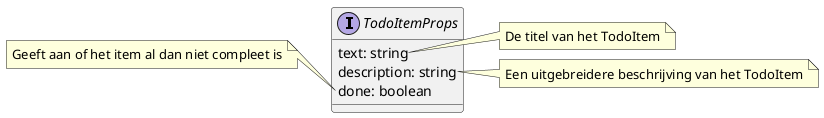

# Webpack your bags, time to React

## Inleiding

Neem volgende HTML-code als voorbeeld:

[example1.html](./examples/example1.html ':include :type=code')

Wanneer een browser een HTML-pagina rendert, zal hij o.a. een [Document Object Model (DOM)](https://developer.mozilla.org/en-US/docs/Web/API/Document_Object_Model) genereren. Hierbij wordt een `div` bijvoorbeeld een `HTMLDivElement` en een `p` een `HTMLParagraphElement`.

Met JavaScript is het mogelijk om de DOM te manipuleren, zoals bijvoorbeeld:

[example2.html](./examples/example2.html ':include :type=code')

Wat als resultaat heeft:

[example2.html](./examples/example2.html ':include height=100px')

Hiermee kan je ook eenvoudig een pagina interactief maken zonder de pagina volledig opnieuw te moeten renderen:

[example3.html](./examples/example3.html ':include :type=code')

Wat als resultaat heeft:

[example3.html](./examples/example3.html ':include height=100px')

## React

[React](https://reactjs.org/) is in principe niet meer dan een library om hetzelfde te bereiken, maar dan handiger in gebruik. Om React te gebruiken, hebben we twee libraries nodig

* `React`: laat toe om "views" aan te maken
* `ReactDOM`: rendert deze "views" in de DOM

Deze libraries importeer je simpelweg in de HTML:

```html
<script src="https://unpkg.com/react@18/umd/react.development.js"></script>
<script src="https://unpkg.com/react-dom@18/umd/react-dom.development.js"></script>
```

Vervolgens maak je één root voor de applicatie met een uniek `id`. Onder deze tak zal één React-applicatie alle DOM-manipulaties en magie uitvoeren. Het is dus perfect mogelijk om meerdere afzonderlijke React-applicaties in eenzelfde HTML-pagina te hebben, elk met een aparte root.

```html
<div id="greeting"></div>
```

Vervolgens kan je met `React.createElement` bepaalde elementen van de pagina aanmaken. `createElement` verwacht als eerste argument de naam van een HTML-tag, als tweede een object met properties om door te geven aan de HTML en als derde optioneel de inhoud van deze tag (m.a.w. eventuele kindtags of simpel tekst).

Aangezien elke React-applicatie start vanaf één bepaalde root, moeten we eerst met `ReactDOM.createRoot` een root aanmaken. Deze functie verwacht het DOM-element waaronder de applicatie draait als enige argument. Vervolgens kan je op deze root de `render` functie aanroepen om een element te renderen onder deze root.

```html
<script>
  const root = ReactDOM.createRoot(document.getElementById('greeting'));
  root.render(
    React.createElement('div', null, 'hello world'),
  );
</script>
```

Dit geeft volgend resultaat:

<!-- tabs:start -->

### **Voorbeeld**

[example4.html](./examples/example4.html ':include height=100px')

### **Code**

[example4.html](./examples/example4.html ':include :type=code')

<!-- tabs:end -->

Wat is nu het nut van het tweede argument? Bekijk onderstaande code, hierbij isoleren we de code van de begroeting in een functie genaamd `GreetingElement`. Vervolgens geven we deze functie door aan `createElement`. Dit geeft opnieuw hetzelfde resultaat als de vorige demo (test zelf maar uit).

```js
function GreetingElement() {
  return React.createElement(
    'div',
    null,
    'hello world'
  );
}

const root = ReactDOM.createRoot(
  document.getElementById('greeting')
);
root.render(
  React.createElement(GreetingElement),
);
```

Inspecteer het resultaat van dit voorbeeld via de DevTools van je browser.

<!-- tabs:start -->

### **Voorbeeld**

[example5.html](./examples/example5.html ':include height=100px')

### **Code**

[example5.html](./examples/example5.html ':include :type=code')

<!-- tabs:end -->

Het was pas echt spannend wanneer we de functie `GreetingElement` een argument meegeven, dit argument is **altijd** object. Het bevat alle properties die van bovenaf doorgegeven worden. In de React-wereld worden dit de **props** van een component genoemd. In onderstaand voorbeeld krijgt de functie `GreetingElement` een prop met als naam `name` mee. Het zal deze `name` tonen in een span met id gelijk aan `name`.

```js
function GreetingElement({ name }) {
  return React.createElement(
    'div',
    null,
    'hello ',
    React.createElement('span', { id: 'name' }, name)
  );
}

const root = ReactDOM.createRoot(document.getElementById('greeting'));
root.render(
  React.createElement(GreetingElement, { name: 'world' }),
);
```

Inspecteer het resultaat van dit voorbeeld via de DevTools van je browser.

<!-- tabs:start -->

### **Voorbeeld**

[example6.html](./examples/example6.html ':include height=100px')

### **Code**

[example6.html](./examples/example6.html ':include :type=code')

<!-- tabs:end -->

Bijgevolg is het ook eenvoudig om twee afzonderlijke React-applicaties te hebben op één pagina. Je maakt hiervoor twee verschillende roots en rendert een (verschillende) component in deze roots.

Inspecteer de werking hiervan a.d.h.v. het volgend voorbeeld.

<!-- tabs:start -->

### **Voorbeeld**

[example7.html](./examples/example7.html ':include height=100px')

### **Code**

[example7.html](./examples/example7.html ':include :type=code')

<!-- tabs:end -->

Je vraagt je nu waarschijnlijk af: "Is dit echt beter dan vanilla JavaScript?". Het antwoord is dat niemand React op deze manier gebruikt. Maar het is wel belangrijk om te beseffen dat deze acties wel degelijk onderliggend gebeuren. In de volgende sectie gaan we een stap verder richting wat React eigenlijk wel is.

## JSX

Als we enkel React zouden kunnen schrijven door immens, nauwelijks leesbare, boomstructuren van `createElement` te creëren hadden we waarschijnlijk nooit van React gehoord. Samen met React heeft Facebook ook JSX geïntroduceerd (een samentrekking van JavaScipt en XML). Hiermee is het mogelijk om veel efficiënter (en leesbaarder) zulke componenten uit te schrijven.


Hier heb je een simpel JavaScript-bestand, maar waar je normaal ingewikkelde `React.createElement` structuren hebt om HTML te manipuleren, schrijf je gewoon iets wat erg op HTML lijkt om dat te doen.

Het 'HTML' stuk van JSX voelt echt vertrouwd als je HTML kent (en dat is natuurlijk de bedoeling), maar er zijn een aantal dingen waar je moet op letten:

* `class` is een reserved keyword in JavaScript, en kan dus niet gebruikt worden om een CSS class mee te geven aan een element, het wordt vervangen door `className`
* `for` is ook een reserved keyword in JavaScript, het wordt vervangen door `htmlFor`
* Als je JavaScript code wilt mixen met een stuk 'HTML', dien je het tussen `{ }` te zetten, bijvoorbeeld `<h1>{title}</h1>`.

Wanneer we het stuk code van het `GreetingElement` omzetten naar JSX, krijgen we het volgende resultaat:

```jsx
function GreetingElement({ name }) {
  return <div>hello <span id="name">{name}</span></div>;
}
```

`{name}` zorgt ervoor dat de waarde van de variable `name` gerenderd wordt. Met `{ }` kan je eender welk soort stuk JavaScript-code uitvoeren in de HTML. De uitvoer van deze code zal gerenderd worden in de HTML.

Browsers kunnen natuurlijk geen JSX renderen, de code moet eerst omgezet worden door een compiler (net zoals Java code niet rechtstreeks door een processor kan uitgevoerd worden). Babel is een compiler die als een stuk JavaScript in de browser kan geladen worden, en vervolgens JSX vertaalt. Babel werd oorspronkelijk gecreëerd om moderne JavaScript te kunnen draaien in oudere browser. Om babel te gebruiken, voeg je onderstaand script toe aan de HTML en voeg je `type="text/babel"` toe aan de `script` tag met de JSX-code.

```html
<script src="https://unpkg.com/@babel/standalone/babel.min.js"></script>
```

Dit geeft het volgende resultaat:

<!-- tabs:start -->

### **Voorbeeld**

[example8.html](./examples/example8.html ':include height=100px')

### **Code**

[example8.html](./examples/example8.html ':include :type=code')

<!-- tabs:end -->

## webpack

Onze React-applicaties gaan natuurlijk liefst niet bestaan uit een paar grote HTML-bestanden doorspekt met `script` blokken met daarin JSX. Aangezien er toch een compilatiestap is, om de JSX om te zetten naar HTML + JavaScript, kunnen we even goed gebruik maken van deze stap om ook 'andere dingen' te doen. Deze 'andere dingen' zijn bijvoorbeeld files samen nemen, afbeeldingen en CSS optimaliseren, dependencies beheren, etc.

Er bestaan tegenwoordig heel wat tools die deze taken op zich nemen, één van de populairdere is [webpack](https://webpack.js.org/). Door `webpack` te gebruiken kunnen we code in verschillende files en folders structureren, dependencies beheren, minification toepassen, verschillende debug en production builds maken, etc. Allemaal op een manier zoals je gewoon bent als je Java code schrijft.

Net zoals we React zelf opgezet hebben kan je voor `webpack` alles downloaden en de juiste configuratiefiles aanmaken en zo alles weer manueel opzetten en werkend krijgen. Maar `webpack` heeft ontzettend véél [configuratie](https://webpack.js.org/configuration/) opties (en wordt trouwens ook voor veel andere libraries en frameworks gebruikt). Het volledig leren gebruiken is waarschijnlijk een cursus op zich.

Gelukkig bestaat er een handige CLI tool die dit allemaal voor ons doet en degelijke defaults configureert voor React: [create-react-app](https://reactjs.org/docs/create-a-new-react-app.html).

## create-react-app

Het is eenvoudig om een nieuwe React-applicatie te maken m.b.v. [create-react-app](https://reactjs.org/docs/create-a-new-react-app.html). Hiervoor maken we gebruik van `npx`, de `npm package runner`. `npx` zorgt ervoor dat je niet langer CLI packages lokaal moet installeren om ze te gebruiken. Dit heeft als voordeel dat we onze global npm scope niet vervuilen met CLI tools die we mogelijks maar één keer gebruiken.

Een nieuwe React-applicatie maken is zo simpel als:

```bash
npx create-react-app budget
```

> Verwijder de npx cache met `npx clear-cpx-cache` indien je volgende warning krijgt: `You are running 'create-react-app' 4.x.x, which is behind the latest release (5.x.x).`

Dit commando maakt een map `budget` met alle bestanden voor deze React-applicatie. We gaan doorheen deze cursus een budgetapplicatie ontwikkelen, we bouwen steeds verder op deze startapplicatie.

Deze map bevat onder andere volgende bestanden/mappen:

- `node_modules`: deze map bevat alle dependencies van de applicatie, m.a.w. de React libraries en alle libraries waar die dan weer op steunen. Dit is typisch een folder met immens veel heel kleine bestanden (bij het maken van deze cursus: 40.020 (!) bestanden die 148 MB innemen)
- `package.json`: bestand dat beschrijft welke dependencies we nodig hebben, hoe de applicatie moet gestart / getest / etc worden, etc.
- `public`: map die alles bevat wat publiek beschikbaar zal zijn voor onze webapplicaties (bv. afbeeldingen, ...)
- `src`: map die alle broncode bevat waarmee onze applicaties gebouwd gaat worden, dus allemaal JSX- en CSS-bestanden, etc.
- er werd ook automatisch een git repository toegevoegd, met een relevante `.gitignore`

### yarn

[yarn](https://yarnpkg.com/) is het programma dat alle dependencies zal installeren, een andere misschien iets gekendere is [npm](https://www.npmjs.com/package/npm). Ze doen beide hetzelfde en zijn inwisselbaar maar de ene keer `yarn` gebruiken en de andere keer `npm` is dan weer geen goed idee. Ze kunnen andere versies cachen van packages e.d. en dan kan je rare fouten tegenkomen.

### package.json

De [package.json](https://docs.npmjs.com/cli/v8/configuring-npm/package-json) bevat alle metadata van ons project, meer in het bijzonder alle dependencies en commando's om onze app te starten. Een voorbeeld van een `package.json` is:

[example8.html](./examples/package.json ':include :type=code')

De `package.json` bevat enkele properties:
- `dependencies`: de packages waarvan deze applicatie gebruik maakt
- `devDependencies`: packages enkel nodig in development (en dus niet in productie)
- `scripts`: laten toe om een soort van shortcuts te maken voor scripts (bv. de applicatie starten, testen, builden voor productie, etc.)

Met een simpele `yarn install` installeren we meteen een identieke omgeving (met zowel `dependencies` als `devDependencies`) en dat maakt het handiger om in een team te werken (`yarn install --prod` installeert enkel de `dependencies`).

Het verschil tussen `dependencies` en `devDependencies` is het moment wanneer ze gebruikt worden. De `dependencies` zijn nodig in productie, m.a.w. de applicatie kan niet werken zonder deze packages. De `devDependencies` zijn enkel nodig om bv. het leven van de developer makkelijker te maken (types in TypeScript, linting, etc.) of bevbatten packages die enkel gebruikt worden *at build time*, of dus wanneer de applicatie (door webpack) omgevormd wordt tot iets wat browser begrijpen.

Dependencies maken gebruik van [semantic versioning](https://semver.org/) (lees gerust eens door de specificatie). Kort gezegd houdt dit in dat elk versienummer bestaat uit drie delen: `MAJOR.MINOR.PATCH`, elke deel wordt met één verhoogd als:

* `MAJOR`: wijzigingen die niet compatibele zijn met oudere versies werden gemaakt
* `MINOR`: met oudere versies compatibele wijzigingen werden gemaakt
* `PATCH`: kleine bugfixes werden gemaakt (compatibel met oudere versies)

In een `package.json` zie je ook vaak versies zonder prexif of met een tilde (~) of hoedje (^) als prefix, dit heeft volgende betekenis:

* geen prefix: exact deze versie
* tilde (~): ongeveer deze versie (zie https://docs.npmjs.com/cli/v6/using-npm/semver#tilde-ranges-123-12-1)
* hoedje (^): compatibel met deze versie (https://docs.npmjs.com/cli/v6/using-npm/semver#caret-ranges-123-025-004)

Kortom, een tilde is strenger dan een hoedje.

Het lijkt misschien een beetje raar, maar zo'n `package.json` wordt voor vele toepassingen en frameworks gebruikt. JavaScript programmeurs zijn gewoon van een `git pull`, `yarn install` en `yarn start` te doen, zonder per se te moeten weten hoe een specifiek framework opgestart wordt.

Bij een `create-react-app` wordt er steeds automatisch een `yarn install` uitgevoerd, dus die hoeven we niet meer te doen. Met een `yarn start` zien we dan onze (default, lege) React-applicatie. Standaard wordt deze op poort 3000 gestart: http://localhost:3000.

### src

De src map bevat een aantal JSX-bestanden (`index.js`, `App.js`...) en wat CSS, e.d. `webpack` zet dit om naar HTML en (door de browser begrijpbare) JavaScript. Dit gebeurt automatisch als een van de bronbestanden wijzigt.

Probeer maar iets aan te passen in de `App.js`. Je zal zien dat de brower automatisch herlaadt met de nieuwe inhoud (uiteraard als je geen compilatiefouten veroorzaakt).

> **Best practice**: het is beter om bestanden met JSX de extensie `.jsx` te geven, dit brengt o.a. betere IntelliSense met zich mee (in bv. VS Code).

## Oefening

Creëer zelf een simpele to do app zoals in onderstaande screenshot. Gebruik een `TodoItem` component en render deze meerdere malen op basis van de data uit een lijst.


Een `TodoItem` heeft volgende props:



## Oplossing

Een voorbeeldoplossing is te vinden op https://github.com/HOGENT-Web/frontendweb-ch1-solution.

> Uiteraard zijn heel veel oplossingen mogelijk.

## Must read

- [Statements vs expressions](https://www.joshwcomeau.com/javascript/statements-vs-expressions/)

