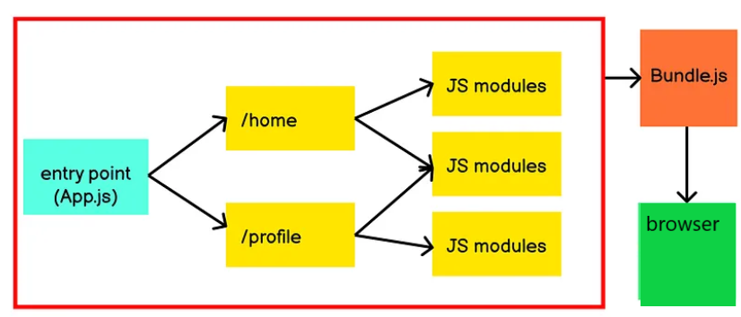
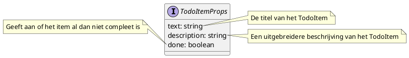

# React basics

Neem volgende HTML-code als voorbeeld:

[example1.html](./examples/example1.html ':include :type=code')

Wanneer een browser een HTML-pagina rendert, zal hij o.a. een [Document Object Model (DOM)](https://developer.mozilla.org/en-US/docs/Web/API/Document_Object_Model) genereren. Hierbij wordt een `div` bijvoorbeeld een `HTMLDivElement` en een `p` een `HTMLParagraphElement`.

Met JavaScript is het mogelijk om de DOM te manipuleren, zoals bijvoorbeeld:

[example2.html](./examples/example2.html ':include :type=code')

Wat als resultaat heeft:

[example2.html](./examples/example2.html ':include height=100px')

Hiermee kan je ook eenvoudig een pagina interactief maken zonder de pagina volledig opnieuw te moeten renderen:

[example3.html](./examples/example3.html ':include :type=code')

Wat als resultaat heeft:

[example3.html](./examples/example3.html ':include height=100px')

## React

[React](https://reactjs.org/) is in principe niet meer dan een library om hetzelfde te bereiken, maar dan handiger in gebruik. Om React te gebruiken, hebben we twee libraries nodig

- `React`: laat toe om "views" aan te maken.
- `ReactDOM`: rendert deze "views" in de DOM, m.a.w. dit is React voor de browser. Er is bijvoorbeeld ook nog [React Native](https://reactnative.dev/) voor mobile applicaties.

Een React applicatie bestaat uit een heleboel componenten die samen een webpagina vormen. Een component is een stukje code dat een bepaald deel van de webpagina voorstelt. Een component kan andere componenten bevatten. Dit is een van de redenen waarom React zo populair is: je kan je code opdelen in kleine, herbruikbare stukken. Deze componenten samen vormen één boomstructuur, de component tree.

Binnen de context van React zal je vaak het begrip **renderen** horen. Renderen betekent letterlijk "het omzetten van een datastructuur naar een visuele voorstelling". Binnen React betekent dit dus het omzetten van React-componenten naar HTML. Tijdens het renderen zal React de component tree doorlopen en voor elk component de bijbehorende functie uitvoeren. Deze functie zal JSX teruggeven, wat React dan omzet naar HTML.

### JSX

Samen met React heeft Meta ook JSX geïntroduceerd (een samentrekking van JavaScript en XML). Hiermee is het mogelijk om een soort van HTML te schrijven in JavaScript. Let wel op: JSX is geen standaard JavaScript en wordt niet begrepen door de browser. JSX wordt door de compiler omgezet naar JavaScript.

Het 'HTML' stuk van JSX voelt echt vertrouwd als je HTML kent (en dat is natuurlijk de bedoeling), maar er zijn een aantal dingen waarop je moet letten:

- `class` is een reserved keyword in JavaScript, en kan dus niet gebruikt worden om een CSS klasse mee te geven aan een element, het wordt vervangen door `className`
- `for` is ook een reserved keyword in JavaScript, het wordt vervangen door `htmlFor`
- Als je JavaScript code wilt mixen met een stuk 'HTML', dien je het tussen `{ }` te zetten, bijvoorbeeld `<h1>{title}</h1>`.

## Vite

Bij een React applicatie is er steeds een compilatiestap nodig die de JSX omzet naar JavaScript. Deze compilatiestap zorgt ervoor dat de browser de code kan begrijpen, maar is niet beperkt tot enkel het omzetten van JSX naar JavaScript. Tijdens deze stap worden ook afbeeldingen goed gezet, CSS geoptimaliseerd, dependencies gebundeld, etc. Een tool die dergelijke taken uitvoert noemen we een buildtool of **bundler**.

Vroeger werd [`create-react-app`](https://create-react-app.dev/) gebruikt om een nieuwe React-applicatie te maken. Dit is een command line tool die een nieuwe React-applicatie opzet met een aantal standaardinstellingen. Het gebruikt achter de schermen [Webpack](https://webpack.js.org/) als bundler.

De laatste jaren is [Vite](https://vitejs.dev/) echter populairder geworden. [**Vite**](https://vitejs.dev/) (afgeleid van het Franse woord voor "snel") is een **buildtool** en **ontwikkelingsserver** die voornamelijk wordt gebruikt voor het bouwen van moderne webtoepassingen, zoals Single Page applications (SPA's) en Progressive Web Apps (PWAs). Het is ontwikkeld door Evan You, de maker van het populaire JavaScript-framework Vue.js, maar Vite kan ook worden gebruikt voor het bouwen van toepassingen met andere JavaScript-frameworks, zoals React en Svelte.

Hier zijn enkele belangrijke kenmerken en concepten met betrekking tot Vite:

- **Native ES modules**: Vite maakt gebruik van native ES modules (ESM) voor het laden van modules in moderne browsers. Dit betekent dat bestanden afzonderlijk kunnen worden geladen zonder de noodzaak van een bundel-stap tijdens de ontwikkeling.

  

- Wanneer de development build wordt gestart, verdeelt Vite de JavaScript-modules in twee categorieën: dependency modules en applicatie modules.service

  - De **dependency modules** zijn JavaScript-modules die je hebt geïmporteerd uit de map `node_modules`. Deze modules worden verwerkt en gebundeld met behulp van [esbuild](https://esbuild.github.io/), een JavaScript-bundler geschreven in Go die 10-100x sneller presteert dan [Webpack](https://webpack.js.org/).
  - De **applicatie modules** zijn modules die je voor je applicatie schrijft, zoals .jsx-bestanden.

- Vite verwerkt de dependency modules alleen vóór een enkel browserverzoek. De applicatie modules worden door Vite getransformeerd en aangereikt wanneer ze nodig zijn voor je applicatie.

- **HMR (Hot Module Replacement)**: In Vite worden enkel de gewijzigde modules vervangen. Dit zorgt voor snelle code-updates in de browser tijdens ontwikkeling.

- **Ontwikkelingsserver**: Vite bevat een ingebouwde ontwikkelingsserver die je gebruikt tijdens development. Deze server ondersteunt functies zoals snel laden (fast refresh), waardoor codeveranderingen direct worden weergegeven in de browser zonder de hele toepassing opnieuw te moeten compileren.

- **Builds**: Vite kan ook worden gebruikt om productiebuilds te maken. Tijdens de productiebuild past Vite verschillende optimalisaties toe, zoals minificatie, tree-shaking (waarbij ongebruikte code wordt verwijderd), en bundling (het samenvoegen van bestanden) om de laadtijden te minimaliseren en de prestaties van je applicatie te verbeteren. Vite bevat een vooraf geconfigureerde `build`-opdracht die de applicatie bundelt met behulp van [Rollup](https://rollupjs.org/). Vite biedt ook een standaard Rollup-configuratie die je kan aanpassen wanneer dat nodig is. De output bevindt zich in de `dist` folder en bevat statische assets die je plaatst op je productie server.

  

Lees hierover meer in de [Vite documentatie](https://vitejs.dev/guide/why.html).

?> Merk op: ondertussen werkt React zelf aan [een (experimentele!) compiler](https://react.dev/learn/react-compiler) die slimmer zou moeten zijn. Deze compiler zou de code optimaliseren en sneller maken. Echter is de compiler nog niet zo mooi als het lijkt, zie [dit artikel](https://www.developerway.com/posts/i-tried-react-compiler). De inhoud van het artikel zal je wel beter begrijpen na het hoofdstuk over React Hooks.

## create-vite

Het is eenvoudig om een nieuwe React-applicatie te maken m.b.v. [create-vite](https://vitejs.dev/guide/). Een nieuwe React-applicatie maken is zo simpel als:

```bash
yarn create vite budget --template react-swc
```

Dit commando maakt een map `budget` met alle bestanden voor deze React-applicatie. We gaan doorheen deze cursus een budgetapplicatie ontwikkelen. In deze applicatie kan je transacties op bepaalde plaatsen bijhouden om zo je budget te beheren. We bouwen steeds verder op deze startapplicatie.

Deze map bevat onder andere volgende bestanden/mappen:

- `package.json`: dit bestand beschrijft welke dependencies we nodig hebben, hoe de applicatie moet gestart, getest... worden, etc.
  - Hieronder configureren we Yarn zodat alle dependencies in de `node_modules` map geïnstalleerd worden. Dit is typisch een map met immens veel heel kleine bestanden (bij het maken van deze cursus: 40.020 (!) bestanden die 148 MB innemen).
- `yarn.lock`: dit bestand bevat de exacte versies van de dependencies die effectief geïnstalleerd zijn.
- `public`: map die alles bevat wat publiek beschikbaar zal zijn voor onze webapplicaties (bv. afbeeldingen...).
- `src`: map die alle broncode bevat waarmee onze applicaties gebouwd gaat worden, dus allemaal JSX- en CSS-bestanden, etc.
- er werd ook automatisch een `.gitignore` voorzien.
- `eslint.config.js`: configuratiebestand voor [eslint](https://eslint.org/), een tool die je code analyseert en je waarschuwt voor mogelijke fouten, slechte praktijken, etc.
- `vite.config.js`: configuratiebestand voor Vite.
- `index.html`: de enige HTML-pagina van de applicatie. De inhoud van deze pagina zal steeds aangepast worden door React.

### yarn

[yarn](https://yarnpkg.com/) is het programma dat alle dependencies zal installeren, een andere misschien iets bekendere is [npm](https://www.npmjs.com/package/npm). Ze doen beide hetzelfde en zijn inwisselbaar maar de ene keer `yarn` gebruiken en de andere keer `npm` is dan weer geen goed idee. Ze kunnen andere versies van packages cachen e.d. en dan kan je rare fouten tegenkomen.

Het project gebruikt standaard Yarn v1. Dit passen we aan naar Yarn v2, naar analogie bij Web Services. Alvorens je Yarn v2 kan gebruiken, moet je eerst [Corepack](https://nodejs.org/api/corepack.html) inschakelen. Op Windows moet je hiervoor een terminal openen als administrator.

```bash
corepack enable
```

Vervolgens kiezen we de laatste versie van Yarn:

```bash
yarn set version berry
```

Maak vervolgens een `.yarnrc.yml` bestand aan in de root van je project met volgende inhoud:

```yml
nodeLinker: node-modules
```

Dit zorgt ervoor dat Yarn v2 de dependencies installeert in de `node_modules` map. Voer hierna een `yarn install` uit om de dependencies te installeren.

### package.json

De [package.json](https://docs.npmjs.com/cli/v10/configuring-npm/package-json) bevat alle metadata van ons project, meer in het bijzonder alle dependencies en commando's om onze app te starten. Het `yarn init` commando zou een `package.json` gemaakt moeten hebben in de root van je project. Open deze, en je zou iets als volgt moeten zien:

[package.json](examples/package.json ':include :type=code')

De `package.json` kan enkele properties bevatten:

- `name`: de naam van het project
- `version`: de versie van het project
- `description`: een korte beschrijving van het project
- `main`: het entry point van de applicatie
- `repository`: de URL van de git repository
- `author`: de auteur van de applicatie
- `license`: de licentie van de applicatie
- `private`: of de applicatie publiek is of niet, npm zal bv. niet toelaten om een private package te publiceren
- `dependencies`: de packages waarvan deze applicatie gebruik maakt
- `devDependencies`: packages enkel nodig in development (en dus niet in productie)
- `scripts`: laten toe om een soort van shortcuts te maken voor scripts (bv. de applicatie starten, testen, builden voor productie, etc.)
- `packageManager`: de package manager die gebruikt wordt (in dit geval Yarn)

Met een simpele `yarn install` installeren we meteen een identieke omgeving (met zowel `dependencies` als `devDependencies`) en dat maakt het handiger om in een team te werken (`yarn install --prod` installeert enkel de `dependencies`).

Het verschil tussen `dependencies` en `devDependencies` is het moment wanneer ze gebruikt worden. De `dependencies` zijn nodig in productie, m.a.w. de applicatie kan niet werken zonder deze packages. De `devDependencies` zijn enkel nodig om bv. het leven van de developer makkelijker te maken (types in TypeScript, linting, etc.) of bevatten packages die enkel gebruikt worden _at build time_, of dus wanneer de applicatie (bv. door webpack) omgevormd wordt tot iets wat browsers begrijpen.

Dependencies maken gebruik van [semantic versioning](https://semver.org/) (lees gerust eens door de specificatie). Kort gezegd houdt dit in dat elk versienummer bestaat uit drie delen: `MAJOR.MINOR.PATCH`, elke deel wordt met één verhoogd in volgende gevallen:

- `MAJOR`: wijzigingen die **_niet_** compatibel zijn met oudere versies
- `MINOR`: wijzigen die **_wel_** compatibel zijn met oudere versies
- `PATCH`: kleine bugfixes (compatibel met oudere versies)

In een `package.json` zie je ook vaak versies zonder prefix of met een tilde (~) of hoedje (^) als prefix, dit heeft volgende betekenis:

- geen prefix: exact deze versie
- tilde (~): ongeveer deze versie (zie <https://docs.npmjs.com/cli/v6/using-npm/semver#tilde-ranges-123-12-1>)
- hoedje (^): compatibel met deze versie (<https://docs.npmjs.com/cli/v6/using-npm/semver#caret-ranges-123-025-004>)

Kortom, een tilde is strenger dan een hoedje.

Het lijkt misschien een beetje raar, maar zo'n `package.json` wordt voor vele toepassingen en frameworks gebruikt. JavaScript programmeurs zijn gewoon van een `git pull`, `yarn install` en `yarn start` te doen, zonder per se te moeten weten hoe een specifiek framework opgestart wordt.

Er zijn nog heel wat andere opties voor de `package.json`. Je vindt alles op <https://docs.npmjs.com/cli/v10/configuring-npm/package-json>.

### yarn.lock en .yarn map

Wanneer je een package installeert, zal yarn een `yarn.lock` bestand aanmaken. Dit bestand bevat de exacte versies van de packages die geïnstalleerd zijn. Dit bestand moet je zeker mee opnemen in je git repository. Dit zorgt ervoor dat iedereen exact dezelfde versies van de packages gebruikt.

Dit bestand vermijdt versieconflicten aangezien in de `package.json` niet altijd de exacte versie staat maar een bepaalde syntax die aangeeft welke versies toegelaten zijn (zie vorige sectie).

Yarn zal ook een `.yarn` map aanmaken. Deze map bevat de geïnstalleerde versie van Yarn en wordt door [Corepack](https://nodejs.org/api/corepack.html) gebruikt om de packages te installeren. Deze map moet je niet opnemen in je git repository.

### .gitignore

Voor we verder gaan, maken we nog een `.gitignore` bestand aan. Dit bestand zorgt ervoor dat bepaalde bestanden/mappen niet naar GitHub gepusht worden. Dit is bv. handig voor de `node_modules` map, die we niet willen pushen omdat deze heel groot is en we deze niet nodig hebben om de applicatie te laten werken. Je kan nl. de dependencies eenvoudig opnieuw installeren d.m.v. `yarn install`.

Download de `.gitignore` van <https://github.com/github/gitignore/blob/main/Node.gitignore> en plaats deze in de root van je project. Het is belangrijk dat je het bestand exact de naam `.gitignore` heeft.

Kijk gerust eens welke bestanden er allemaal genegeerd worden. Je kan dit bestand ook aanpassen naar eigen wens, maar dit is een vrij complete voor een Node.js project.

### src

Start de applicatie met het commando `yarn dev`.

De `src` map bevat een aantal JSX-bestanden (`main.jsx`, `App.jsx`...) en wat CSS, e.d. `vite` zet dit om naar (door de browser begrijpbare) JavaScript. Dit gebeurt automatisch als een van de bronbestanden wijzigt.

Probeer maar iets aan te passen in de `App.jsx`. Je zal zien dat de browser automatisch herlaadt met de nieuwe inhoud (uiteraard als je geen compilatiefouten veroorzaakt).

?> **Best practice**: het is beter om bestanden met JSX de extensie `.jsx` te geven, dit brengt o.a. betere IntelliSense met zich mee (in bv. VS Code).

### eslint.config.js

Het bestand `eslint.config.js` bevat de configuratie voor [ESLint](https://eslint.org/), een linting tool. Linting is statische analyse van code om problemen zoals verkeerde syntax en twijfelachtig gebruik van code te detecteren. Waarom zou je gebruiken maken van linting en formatting? Het kan vroegtijdig fouten, typo's en syntax errors vinden. Het verplicht developers dezelfde codeerstijl te gebruiken, best practices te volgen en vermijdt het committen van slechte code.

De configuratie is gebaseerd op de aanbevolen regels van volgende plugins:

- [eslint-plugin-react](https://npmjs.com/package/eslint-plugin-react): regels voor React
- [eslint-plugin-react-hooks](https://npmjs.com/package/eslint-plugin-react-hooks): regels voor React hooks (bv. checken of ze correct gebruikt worden)
- [eslint-plugin-react-refresh](https://npmjs.com/package/eslint-plugin-react-refresh): regels om te controleren of componenten kunnen ververst worden met fast refresh

ESLint gebruikt sinds v9 [flat configuration files](https://eslint.org/blog/2022/08/new-config-system-part-2/). Deze syntax zorgt ervoor dat je geen `extends` meer moet gebruiken, dat je plugins simpelweg kan importeren via `import` i.p.v. een vaste string te gebruiken en dat je de regels rechtstreeks en eenvoudiger kan instellen.

Als je meer wil weten over de configuratie, gebruik dan de [ESLint documentatie](https://eslint.org/docs/user-guide/configuring).

Je kan de linting starten met het commando `yarn lint`. Deze print vervolgens alle fouten en waarschuwingen in de console. Als je aan dit commando `--fix` toevoegt, zal ESLint proberen om de fouten automatisch op te lossen.

Installeer de ESLint plugin waarmee je codeerstijl kan evalueren:

```bash
yarn add -D @stylistic/eslint-plugin
```

We overlopen dit bestand en breiden het alvast uit met een paar stijlregels:

```js
import js from '@eslint/js';
import stylistic from '@stylistic/eslint-plugin'; // 👈 5
import globals from 'globals';
import react from 'eslint-plugin-react';
import reactHooks from 'eslint-plugin-react-hooks';
import reactRefresh from 'eslint-plugin-react-refresh';

export default [
  { ignores: ['dist'] }, // 👈 1
  {
    files: ['**/*.{js,jsx}'], // 👈 2
    languageOptions: {
      // 👇 3
      ecmaVersion: 2020,
      globals: globals.browser,
      parserOptions: {
        ecmaVersion: 'latest',
        ecmaFeatures: { jsx: true },
        sourceType: 'module',
      },
    },
    settings: { react: { version: '18.3' } }, // 👈 3
    plugins: {
      // 👇 4
      react,
      'react-hooks': reactHooks,
      'react-refresh': reactRefresh,
      '@stylistic': stylistic, // 👈 6
    },
    rules: {
      ...js.configs.recommended.rules, // 👈 7
      ...react.configs.recommended.rules, // 👈 7
      ...react.configs['jsx-runtime'].rules, // 👈 7
      ...reactHooks.configs.recommended.rules, // 👈 7
      'react/jsx-no-target-blank': 'off',
      'react-refresh/only-export-components': [
        'warn',
        { allowConstantExport: true },
      ],
      // 👇 8
      '@stylistic/no-multiple-empty-lines': [
        'error',
        {
          max: 1,
          maxEOF: 1,
          maxBOF: 0,
        },
      ],
      '@stylistic/indent': ['error', 2, { SwitchCase: 1 }],
      '@stylistic/quotes': ['error', 'single'],
      '@stylistic/semi': ['error', 'always'],
      '@stylistic/comma-dangle': ['error', 'always-multiline'],
      '@stylistic/no-tabs': ['error'],
      '@stylistic/max-len': [
        'error',
        {
          code: 120,
          tabWidth: 2,
        },
      ],
      '@stylistic/arrow-parens': ['error', 'always'],
      '@stylistic/brace-style': ['error', '1tbs', { allowSingleLine: false }],
      '@stylistic/no-inner-declarations': 'off',
      'react/react-in-jsx-scope': 'off',
      'react/jsx-props-no-spreading': 'off',
      'react/prop-types': 'off',
    },
  },
];
```

1. We negeren de `dist` map. Deze map zal later onze gebouwde React applicatie bevatten.
2. We linten enkel bestanden met een `.js` of `.jsx` extensie.
3. We definiëren de versie van ECMAScript (ES) die we gebruiken, de globale variabelen die we gebruiken, de parser opties en de versie van React die we gebruiken.
   - ECMAScript is de standaard waarop JavaScript gebaseerd is. De versie van ECMAScript die we gebruiken is 2020.
4. We importeren een aantal plugins die we gebruiken in onze linting configuratie. Plugins bevatten regels die specifiek zijn voor een bepaalde technologie, een bepaalde bibliotheek, etc.
5. Importeer de `@stylistic/eslint-plugin-js` plugin.
6. Voeg de plugin toe aan de `plugins` property.
7. We vertrekken van een aantal aanbevolen regels van ESLint en React.
8. We voegen ook enkele stijlregels en React-specifieke regels toe. Voor regels gebruik je altijd dezelfde prefix als het property in de plugins, in dit geval `@stylistic`. De naam van de regels vind je in de [documentatie van de plugin](https://eslint.style/packages/js#rules).

Je kan VS Code zo instellen dat automatisch herstel van fouten wordt uitgevoerd telkens je CTRL+S (of COMMAND+S) drukt. Open de JSON settings via F1 > Zoek naar "Preferences: Open Settings (JSON)" en voeg onderstaand toe (zonder de { }):

```json
{
  "editor.codeActionsOnSave": {
    "source.fixAll": "always"
  },
  "eslint.validate": [
    "javascript",
    "javascriptreact",
    "typescript",
    "typescriptreact"
  ]
}
```

Run voor elke commit `yarn lint`. Dit zal je code linten, sommige problemen zelf oplossen en fouten geven omtrent manueel op te lossen problemen.

## Transaction

In onze budget applicatie willen we uitgaven en inkomsten beheren via transacties. We maken een eerste component aan voor de weergave van één transactie.

Maak in de map `src` een map `components` aan met daarin een map `transactions`. In deze map maken we een nieuw bestand `Transaction.jsx` met volgende inhoud:

```jsx
// src/components/transactions/Transaction.jsx
export default function Transaction() {
  return <div>Benjamin gaf €200 uit bij Dranken Geers.</div>;
}
```

Components zijn niets meer dan functies die de HTML, die getoond moet worden door deze component, teruggeeft.
Hier voegen we hard gecodeerde tekst toe want weten of een lege component correct gerenderd wordt is nogal lastig.

Om deze component te kunnen zien moet hij ergens in de `ReactDOM` gerenderd worden. De (enige) call naar `ReactDOM.render` gebeurt in de `main.jsx`:

```jsx
// src/main.jsx
createRoot(document.getElementById('root')).render(
  <StrictMode>
    <App />
  </StrictMode>,
);
```

Standaard rendert deze de `App` component. Het `main.jsx` bestand ga je zelden zelf aanpassen, dit zal enkel globale componenten bevatten.

[StrictMode](https://reactjs.org/docs/strict-mode.html) doet een aantal checks op alle (onderliggende) componenten. Het is altijd een goed idee om `StrictMode` aan te zetten.

### App.jsx

```jsx
// src/App.jsx
import { useState } from 'react';
import reactLogo from './assets/react.svg';
import viteLogo from '/vite.svg';
import './App.css';

function App() {
  const [count, setCount] = useState(0);

  return (
    <>
      <div>
        <a href='https://vitejs.dev' target='_blank'>
          
        </a>
        <a href='https://react.dev' target='_blank'>
          
        </a>
      </div>
      <h1>Vite + React</h1>
      <div className='card'>
        <button onClick={() => setCount((count) => count + 1)}>
          count is {count}
        </button>
        <p>
          Edit <code>src/App.jsx</code> and save to test HMR
        </p>
      </div>
      <p className='read-the-docs'>
        Click on the Vite and React logos to learn more
      </p>
    </>
  );
}

export default App;
```

In `App.jsx` staat de code voor de standaard startpagina: het Vite en React-logo, een link naar de documentatie, enz. Zoals eerder gezegd kan je ook CSS-klassen toevoegen aan HTML-elementen, maar hiervoor moet je het attribuut `className` gebruiken i.p.v. `class`. De `App` component heeft zijn eigen stijl in het bestand `App.css`, deze is enkel voor deze component. Globale stijlen definieer je in het bestand `index.css`.

JSX is strenger dan HTML. Je moet tags zoals `` sluiten. Een component kan ook niet meerdere JSX-tags retourneren. Je moet ze in een gedeelde bovenliggende parent plaatsen, zoals een `<div>...</div>` of een lege `<>...</>` wrapper.

Verwijder alle code uit deze component en vervang dit door de `Transaction` component. We maken ook geen gebruik meer van het CSS bestand. Verder in dit hoofdstuk voegen we voor de opmaak `Bootstrap` toe.

```jsx
// src/App.jsx
import Transaction from './components/transactions/Transaction';

function App() {
  return (
    <div className='App'>
      <Transaction />
    </div>
  );
}

export default App;
```

Als we nu naar [onze site](http://localhost:5173/) gaan, zouden we de hard gecodeerde string moeten zien.

### JSON

Een hardgecodeerde string als component tonen is niet erg nuttig, daar is React complete overkill voor. In dat geval schrijf je beter een HTML pagina met wat CSS zoals je het in Web Development I geleerd hebt.

Dit soort frameworks worden pas de moeite als we componenten gaan schrijven die data op een bepaalde manier tonen en manipuleerbaar maken. Met andere woorden: als componenten hergebruikt kunnen worden.

Het is ooit anders geweest, maar tegenwoordig is die data zo goed als altijd in JSON-formaat (JavaScript Object Notation). Heel kort gezegd is dit de voorstelling van een JavaScript-object (of alleszins, lijkt het er heel sterk op).

```js
{
  "key": "some string",
  "otherKey": 15,
  "key3": true,
  "listOfData": ["a", 15],
  "otherObject": {
    "innerkey" : 42
  }
}
```

We zien dat JSON een comma-separated key-value lijst is. De keys zijn hierbij altijd strings. De values zijn strings, numbers, booleans, arrays of opnieuw objecten.

> Dit zou allemaal herhaling moeten zijn, als het wat ver zit: [Working with JSON](https://developer.mozilla.org/en-US/docs/Learn/JavaScript/Objects/JSON)

De data zal meestal ergens in een databank leven. Via één of andere API kunnen we deze data aanspreken en eventueel wijzigen. Dit leer je allemaal uitgebreid in het olod Web Services.

Uiteraard kunnen we niet alles tegelijk maken. Daarom gaan we eerst met _mock object_ werken. We steken wat JSON data hard gecodeerd in een bestand. Vervolgens importeren en gebruiken we die data om onze componenten op te bouwen.

Later, als we een back-end hebben, kunnen we dan makkelijk 'echte' data ophalen en tonen. Daarbij dienen we enkel die import te vervangen door een echte API call en hoeven we niet onze volledige component te herschrijven.

### Mock data

Maak een map `api` met een bestand `mock_data.js` aan in de `src` map. Later vervangen we deze mock data door API calls.

```js
// src/api/mock_data.js
const TRANSACTION_DATA = [
  {
    id: 1,
    amount: 3500,
    date: '2021-05-25T17:40:00.000Z',
    place: {
      id: 1,
      name: 'Loon',
      rating: 5,
    },
    user: {
      id: 1,
      name: 'Karine Samyn',
    },
  },
  {
    id: 2,
    amount: -220,
    date: '2021-05-08T18:00:00.000Z',
    place: {
      id: 2,
      name: 'Dranken Geers',
      rating: 3,
    },
    user: {
      id: 2,
      name: 'Thomas Aelbrecht',
    },
  },
];

export default TRANSACTION_DATA;
```

`TRANSACTION_DATA` is een array met twee objecten die een transactie voorstellen. We exporteren deze array zodat we deze in andere bestanden kunnen importeren en gebruiken.

### React props

We gaan de `Transaction` component aanpassen zodat hij data van verschillende transacties kan weergeven:

```jsx
// src/components/transaction/Transaction.jsx
export default function Transaction() {
  const user = 'Benjamin'; // 👈 1
  const amount = 200; // 👈 1
  const place = 'Dranken Geers'; // 👈 1
  // 👇 2
  return (
    <div>
      {user} gaf €{amount} uit bij {place}
    </div>
  );
}
```

1. Definieer een variabele voor `user`, `amount` en `place`.
2. Vervang de hard gecodeerde info door de variabelen.

`{user}` zorgt ervoor dat de waarde van de variable `user` gerenderd wordt. Met `{ }` kan je eender welke expressie in JavaScript uitvoeren in de HTML, je kan hier geen statements gebruiken. De uitvoer van deze code zal gerenderd worden in de HTML.

> Geen idee wat het verschil is tussen een statement of expression? Check dan eens de [Must read/watch](#must-readwatch) onderaan deze pagina.

De data zal natuurlijk van een andere component moeten komen, nu hebben we nog steeds hard gecodeerde informatie. We passen dus aan:

```jsx
// src/components/transaction/Transaction.jsx
export default function Transaction(props) {
  // 👇 1
  const { user, amount, place } = props; // 👈 2
  return (
    <div>
      {user} gaf €{amount} uit bij {place}
    </div>
  );
}
```

1. We geven de data door via de `props` parameter, de React properties. Op die manier kunnen we informatie doorgeven van de ene component aan de andere. Elke React component ontvangt als eerste parameter een object `props` met daarin alle properties die aan de component zijn doorgegeven.
2. Verwijder de constanten met de hard gecodeerde data. Om niet telkens `props.user`, `props.amount`... te moeten schrijven, maken we gebruik van **object destructuring**.
   - Je kan natuurlijk ook meteen de properties destructuren in de parameters van de functie.

Hoe krijg je nu de juiste data in de `props` van een component? In `App.js` willen we:

```jsx
// src/App.jsx
import Transaction from './components/transactions/Transaction';

function App() {
  const user = 'Benjamin'; // 👈 1
  const amount = 200; // 👈 1
  const place = 'Dranken Geers'; // 👈 1
  return (
    <div className='App'>
      <Transaction user={user} place={place} amount={amount} /> {/* 👈 2 */}
    </div>
  );
}

export default App;
```

1. Maak drie variabelen `user`, `amount`, `place`.
2. Geef deze door aan de `Transaction` component. Dit doet je op dezelfde manier als bij HTML: je voegt simpelweg attributen toe op een bepaalde tag.

We willen natuurlijk dat hier de data van ons mock object komt:

```jsx
// src/App.jsx
import Transaction from './components/transactions/Transaction';
import TRANSACTION_DATA from './api/mock_data'; // 👈 1

function App() {
  const trans = TRANSACTION_DATA[0]; // 👈 2
  return (
    <div className='App'>
      {/* 👇 2 */}
      <Transaction
        user={trans.user}
        place={trans.place}
        amount={trans.amount}
      />
    </div>
  );
}

export default App;
```

1. Importeer de constante `TRANSACTION_DATA`.
2. Laat ons beginnen met gewoon het eerste element van de array eens te tonen.

Pas ook de `Transaction` component aan zodat je de naam van de gebruiker en de plaats ziet. Je kan altijd eens kijken welke foutmeldingen je krijgt in de console indien je `user` of `place` rechtstreeks probeert te gebruiken.

```jsx
// src/components/transaction/Transaction.jsx
export default function Transaction(props) {
  const { user, amount, place } = props;
  return (
    <div>
      {user.name} gaf €{amount} uit bij {place.name} {/* 👈 */}
    </div>
  );
}
```

Eigenlijk willen we voor elk van de elementen in de array `TRANSACTION_DATA` een `Transaction` component tonen.

```jsx
// src/App.jsx
import Transaction from './components/transactions/Transaction';
import TRANSACTION_DATA from './api/mock_data';

function App() {
  // const trans = TRANSACTION_DATA[0]; 👈 1
  return (
    <div className='App'>
      {/* 👇 2 */}
      {TRANSACTION_DATA.map((trans) => (
        <Transaction
          user={trans.user}
          place={trans.place}
          amount={trans.amount}
        />
      ))}
    </div>
  );
}

export default App;
```

1. Verwijder de lijn die de eerste transactie ophaalt.
2. We hier kunnen in de JSX-code ook onze array **mappen** waarbij we elk element omzetten naar een `Transaction` component.

Je kan ook gebruik maken van object destructuring om attributen te genereren. Elke key wordt dan een attribuut met de bijbehorende waarde. Het is **niet altijd een goed idee** maar het bespaart soms wel wat typwerk. Het zorgt vaak voor onleesbare code, je weet bv. niet welke props effectief gebruikt worden en het is moeilijker om later te debuggen.

```jsx
import Transaction from './components/transactions/Transaction';
import TRANSACTION_DATA from './api/mock_data';

function App() {
  return (
    <div className='App'>
      {TRANSACTION_DATA.map((trans) => (
        <Transaction {...trans} />
      ))}
      {/* 👆 */}
    </div>
  );
}

export default App;
```

### Property 'key'

Alles lijkt te werken, maar als je de console opent zal je een error zien staan: `Each child in a list should have a unique "key" prop.`. Als je de ESLint plugin in VS Code hebt, zou je deze foutmelding moeten zien in je editor.

!> Als front-end developer moet je namelijk **altijd** de console van de browser open hebben. Hierin krijg je foutmeldingen en waarschuwingen te zien die je helpen bij het debuggen van je code. Soms crasht React door een fout en zie je gewoonweg niets meer in de browser. De console is dan je enige hulpmiddel, dit moet altijd de eerste reflex zijn bij een fout.

Als je een lijst van elementen maakt, moet je altijd een `key` property voorzien (van het type `string`). Op basis van deze keys kan React weten welke elementen gewijzigd, toegevoegd of verwijderd zijn. Keys moeten uniek zijn binnen de array waarin de componenten gecreëerd worden, dus enkel t.o.v. de broer en zus elementen, niet over de hele applicatie.

Hoewel je altijd de **index van een array** kan gebruiken is dat **zelden een goed idee**. De key is het enige dat React gebruikt om DOM-elementen te identificeren. Dus stel dat je een element toevoegt op het einde van de lijst en halfweg een element verwijdert, dan zou bij een index-key React denken dat alle tussenliggende elementen dezelfde zijn!

Als je met 'echte' data werkt, die via een backend komt, heeft elk element heel vaak een **unieke id (uit de databank)**. Dit id gebruik je dan ook om het element te identificeren in API calls. Dit vormt meteen een uitstekende key voor React-lijsten. Als je niets meegeeft, gebruikt React onderliggend sowieso een index als key. Functioneel maakt het geen verschil of we het expliciet maken of niet. In ons eenvoudig voorbeeld hebben we ook unieke id's, dus we kunnen deze meteen gebruiken:

```jsx
<Transaction
  key={trans.id} // 👈 2
  {...trans}
/>
```

Als je nu de browser ververst, zou de foutmelding verdwenen moeten zijn.

## CSS in React

In dit project maken we gebruik van [Bootstrap](https://getbootstrap.com/), een populair JavaScript- en CSS-framework. Bootstrap kan op verschillende manieren worden toegevoegd aan React. Laten we gebruik maken van Bootstrap CDN, de eenvoudigste manier om Bootstrap toe te voegen aan de React. Geen extra installatie of download is vereist. Een alternatief is om gebruik te maken van [react-bootstrap](https://www.npmjs.com/package/react-bootstrap).

Om Bootstrap op deze manier toe te voegen, voeg je een paar links toe aan de entry file van je applicatie. In een typische React applicatie gecreëerd met `create-vite` is dit het `index.html` bestand.

```html
<!-- public/index.html -->
<!DOCTYPE html>
<html lang="en">
  <head>
    <meta charset="UTF-8" />
    <link rel="icon" type="image/svg+xml" href="/vite.svg" />
    <meta name="viewport" content="width=device-width, initial-scale=1.0" />
    <link
      href="https://cdn.jsdelivr.net/npm/bootstrap@5.3.3/dist/css/bootstrap.min.css"
      rel="stylesheet"
      integrity="sha384-QWTKZyjpPEjISv5WaRU9OFeRpok6YctnYmDr5pNlyT2bRjXh0JMhjY6hW+ALEwIH"
      crossorigin="anonymous"
    />
    <!-- 👆 1 -->
    <title>BudgetApp</title>
    <!-- 👆 2 -->
  </head>
  <body>
    <div id="root"></div>
    <script type="module" src="/src/main.jsx"></script>
  </body>
</html>
```

1. We linken naar de [huidige stabiele versie](https://getbootstrap.com/docs/versions/) van Bootstrap CSS.
   - Als je gebruik wil maken van geavanceerde features van Bootstrap (zoals een modal, dropdown menu's...), dan installeer je best [react-bootstrap](https://www.npmjs.com/package/react-bootstrap).
2. Pas ook de `title` van de app aan.

Gooi het bestand `App.css` weg en maak `index.css` leeg. We gaan de styling van Bootstrap gebruiken. Als je zelf toch iets wil aanpassen, kan je dit in het bestand `index.css` doen of voeg je een CSS-bestand toe aan de component zelf.

Pas nu de `Transaction` component aan en maak gebruik van de Bootstrap class `text_bg_dark` voor de `div` tag. Ook het `style` attribuut kan je binnen een JSX-bestand gebruiken. Hiervoor gebruik je een inline Javascript object. Vandaar de `{{}}` in onderstaand voorbeeld. Je kan ook de props meteen destructuren in de parameters van de functie.

```jsx
// src/components/transaction/Transaction.jsx
// 👇
export default function Transaction({ user, amount, place }) {
  // 👇
  return (
    <div className='text-bg-dark' style={{ textAlign: 'center' }}>
      {user.name} gaf €{amount} uit bij {place.name}
    </div>
  );
}
```

## Debugging

Een applicatie ontwikkelen zonder eens te moeten debuggen is een utopie, ook in React.

Net zoals in vanilla JavaScript kan je hier gebruik maken van o.a. `console.log`, maar op die manier debuggen is tijdrovend en lastig.

Uiteraard heb je ook het [`debugger`](https://developer.mozilla.org/en-US/docs/Web/JavaScript/Reference/Statements/debugger?retiredLocale=nl ':ignore') statement, maar daarvoor moet je in de browser de inspector tools open staan hebben.

Het zou handig zijn als we in VS Code konden debuggen... Uiteraard kan dit ook. [Lees in deze tutorial hoe je dit opzet](https://profy.dev/article/debug-react-vscode ':ignore'). Tip: onze webapplicatie draait op `http://localhost:5173`.

Start de applicatie en de debugger. Plaats een willekeurig breakpoint, bv. op de `return` in de `App` component. Als je nu naar de browser gaat, zou de debugger moeten stoppen op het breakpoint. Hoera, we kunnen degelijk debuggen!

> **Oplossing voorbeeldapplicatie**
>
> ```bash
> git clone https://github.com/HOGENT-frontendweb/frontendweb-budget.git
> cd frontendweb-budget
> git checkout -b les1-opl c122351
> yarn install
> yarn dev
> ```

## Oefening 1 - Je eigen project

Maak een nieuwe GitHub repository aan via de GitHub classroom link in de introductie van de Chamilo-cursus. Clone jouw Git repository uit de GitHub classroom:

```bash
git clone <JOUW_GIT_REPOSITORY_URL>
```

Maak een nieuwe Vite React-applicatie aan met de naam van je project in de map van je Git repository. Gebruik een zinnige naam zodat duidelijk is in welke map jouw front-end zich bevindt (bv. suffix `-frontend`).

```bash
yarn create vite <PROJECTNAAM> --template react-swc
```

Vul alvast de `README.md` en `dossier.md` aan voor zover mogelijk:

- `README.md`:
  - Vul de titel en je naam, studentennummer en e-mailadres in.
- `dossier.md`:
  - Vul de titel en de link naar de GitHub repository in
  - Duid aan welk(e) olod(s) je volgt
  - Je laat de links voor de online versie staan, je kan deze wel weggooien voor olods die je niet volgt

?> Zet ook meteen de ESLint en debugger configuratie op punt!

Commit vervolgens de lege React-applicatie:

```bash
git add .
git commit -m "✨ Add empty React app ✨"
git push
```

Experimenteer al een beetje met componenten, props, etc. en commit je wijzigingen. Je kan al een paar basiscomponent maken voor je eigen project.

> 💡 Tip: begin **_niet_** met het maken van een login- of registratiecomponent. Dat is niet belangrijk en kopieert iedereen toch van onze voorbeeldoplossing, steek er in het begin dus je tijd niet in. Het is niet zoveel werk om deze componenten in een latere fase toe te voegen.

## Oefening 2 - To do app

Creëer zelf een simpele to do app zoals in onderstaande screenshot. Gebruik een `TodoItem` component en render deze meerdere malen op basis van de data uit een lijst.


Een `TodoItem` heeft volgende props:



<!-- markdownlint-disable-next-line -->

- Oplossing +

  Een voorbeeldoplossing (maar er zijn er uiteraard heel veel mogelijk) is te vinden op <https://github.com/HOGENT-frontendweb/frontendweb-ch1-solution>.

## Mogelijke extra's voor de examenopdracht

- UI Component library gebruiken, bv.
  - [Material-UI](https://mui.com/)
  - [Chakra UI](https://chakra-ui.com/)
  - [antd](https://ant.design/)
  - ...
- CSS-in-JS library gebruiken, bv.
  - [styled-components](https://styled-components.com/)
  - [Emotion](https://emotion.sh/)
  - [JSS](https://cssinjs.org/)
  - ...

## Must read/watch

- [Don't Use JS for That: Moving Features to CSS and HTML by Kilian Valkhof](https://www.youtube.com/watch?v=IP_rtWEMR0o)
- [Practice React by fixing tests - Check your JSX knowledge!](https://reactpractice.dev/exercise/practice-react-by-fixing-tests-check-your-jsx-knowledge/)
- [Statements vs expressions](https://www.joshwcomeau.com/javascript/statements-vs-expressions/)
- [React.js: The Documentary](https://www.youtube.com/watch?v=8pDqJVdNa44)
- [JavaScript Visualized: Promise Execution](https://lydiahallie.framer.website/blog/promise-execution)
- [Re-implementing JavaScript's == in JavaScript](https://evanhahn.com/re-implementing-javascript-double-equals-in-javascript/)
  - Laat duidelijk zien waarom je `===` moet gebruiken i.p.v. `==`.
