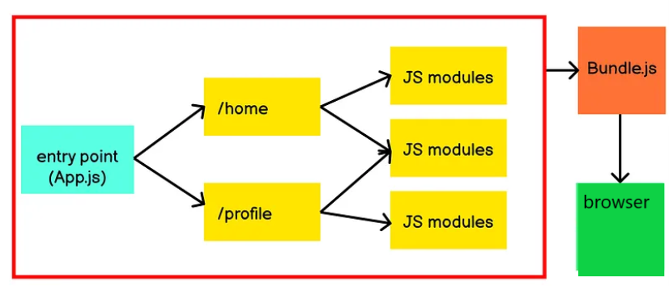
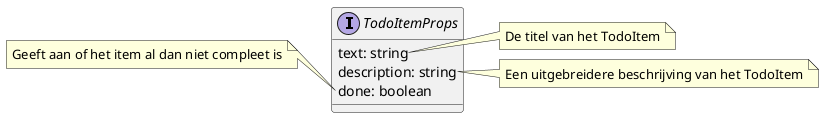

# React basics

Neem volgende HTML-code als voorbeeld:

[example1.html](./examples/example1.html ':include :type=code')

Wanneer een browser een HTML-pagina rendert, zal hij o.a. een [Document Object Model (DOM)](https://developer.mozilla.org/en-US/docs/Web/API/Document_Object_Model) genereren. Hierbij wordt een `div` bijvoorbeeld een `HTMLDivElement` en een `p` een `HTMLParagraphElement`.

Met JavaScript is het mogelijk om de DOM te manipuleren, zoals bijvoorbeeld:

[example2.html](./examples/example2.html ':include :type=code')

Wat als resultaat heeft:

[example2.html](./examples/example2.html ':include height=100px')

Hiermee kan je ook eenvoudig een pagina interactief maken zonder de pagina volledig opnieuw te moeten renderen:

[example3.html](./examples/example3.html ':include :type=code')

Wat als resultaat heeft:

[example3.html](./examples/example3.html ':include height=100px')

## React

[React](https://react.dev/) is in principe niet meer dan een library om hetzelfde te bereiken, maar dan handiger in gebruik. Om React te gebruiken, hebben we twee libraries nodig:

- `React`: laat toe om "views" aan te maken.
- `ReactDOM`: rendert deze "views" in de DOM, m.a.w. dit is React voor de browser. Er is bijvoorbeeld ook nog [React Native](https://reactnative.dev/) voor mobile applicaties.

Een React-applicatie bestaat uit een heleboel componenten die samen een webpagina vormen. Een component is een stukje code dat een bepaald deel van de webpagina voorstelt. Een component kan andere componenten bevatten. Dit is een van de redenen waarom React zo populair is: je kan je code opdelen in kleine, herbruikbare stukken. Deze componenten samen vormen één boomstructuur, de component tree.

Binnen de context van React zal je vaak het begrip **renderen** horen. Renderen betekent letterlijk "het omzetten van een datastructuur naar een visuele voorstelling". Binnen React betekent dit dus het omzetten van React-componenten naar HTML. Tijdens het renderen zal React de component tree doorlopen en voor elk component de bijbehorende functie uitvoeren. Deze functie zal TSX teruggeven, wat React dan omzet naar HTML.

### TSX

Samen met React heeft Meta ook JSX geïntroduceerd (een samentrekking van JavaScript en XML) of TSX (voor TypeScript + XML). Hiermee is het mogelijk om een soort van HTML te schrijven in JavaScript/TypeScript. Let wel op: TSX is geen standaard JavaScript en wordt niet begrepen door de browser. TSX wordt door de compiler omgezet (gecompileerd) naar JavaScript. Wanneer we gebruik maken van TSX, worden de TypeScript- en TSX-syntax in één stap door de compiler omgezet naar gewone JavaScript.

Het 'HTML' stuk van JSX voelt echt vertrouwd als je HTML kent (en dat is natuurlijk de bedoeling), maar er zijn een aantal dingen waarop je moet letten:

- `class` is een reserved keyword in JavaScript, en kan dus niet gebruikt worden om een CSS-klasse mee te geven aan een element, het wordt vervangen door `className`
- `for` is ook een reserved keyword in JavaScript, het wordt vervangen door `htmlFor`
- Als je JavaScript code wilt mixen met een stuk 'HTML', dien je het tussen `{ }` te zetten, bijvoorbeeld `<h1>{title}</h1>`.

## Vite

Bij een React-applicatie in TypeScript moet de code eerst omgezet worden naar JavaScript, aangezien browsers geen TypeScript of TSX begrijpen. Dit proces heet **transpileren** en omvat zowel het omzetten van TypeScript naar JavaScript als het transformeren van JSX/TSX naar gewone JavaScript code.
Daarnaast is er een buildproces waarbij de applicatie geoptimaliseerd wordt voor productie. Tijdens deze stap worden onder andere bestanden gebundeld, CSS geoptimaliseerd, afbeeldingen verwerkt en afhankelijkheden samengevoegd.
Tools die deze taken uitvoeren noemen we buildtools of **bundlers**, zoals bijvoorbeeld Vite. Vite gebruikt tijdens development een snelle transpiler (zoals esbuild) en voert bij het builden een bundlingstap uit (via Rollup).

Tegenwoordig wordt [Vite](https://vitejs.dev/) gebruikt om een nieuwe React-applicatie te maken. [**Vite**](https://vitejs.dev/) (afgeleid van het Franse woord voor "snel") is een **buildtool** en **ontwikkelingsserver** die voornamelijk wordt gebruikt voor het bouwen van moderne webtoepassingen, zoals Single Page Applications (SPA's) en Progressive Web Apps (PWAs). Het is ontwikkeld door Evan You, de maker van het populaire JavaScript-framework Vue.js, maar Vite kan ook worden gebruikt voor het bouwen van toepassingen met andere JavaScript-frameworks, zoals React en Svelte.

!> [create-react-app](https://create-react-app.dev/) was vroeger de standaard manier om een nieuwe React-applicatie te maken, maar deze tool is inmiddels verouderd en wordt niet meer actief onderhouden.

Hier zijn enkele belangrijke kenmerken en concepten met betrekking tot Vite:

- **Native ES modules**: Vite maakt gebruik van native ES modules (ESM) in moderne browsers. Hierdoor kunnen modules afzonderlijk geladen worden, zonder dat er tijdens development een volledige bundling-stap nodig is.

  

- Bij het starten van de development server verdeelt Vite de modules in twee categorieën: dependency en applicatie modules.
  - De **dependency modules**: Dit zijn modules afkomstig uit de map `node_modules`. Vite voert hiervoor een pre-bundling (dependency optimization) uit met behulp van [esbuild](https://esbuild.github.io/), een zeer snelle tool geschreven in Go (presteert 10-100x sneller dan [Webpack](https://webpack.js.org/)).
  - De **applicatie modules**: Dit zijn de bestanden die je zelf schrijft (bijvoorbeeld .ts en .tsx). Deze modules worden door Vite on-demand getransformeerd en aangeleverd wanneer de browser ze nodig heeft.

- **HMR (Hot Module Replacement)**: In Vite worden enkel de gewijzigde modules opnieuw geladen. Dit zorgt voor snelle updates in de browser tijdens ontwikkeling.

- **Ontwikkelingsserver**: Vite heeft een ingebouwde development server die gebruikmaakt van native ES modules en snelle transpiling. In combinatie met frameworks zoals React ondersteunt Vite ook Fast Refresh, waardoor UI-updates onmiddellijk zichtbaar zijn zonder verlies van component state.

- **Builds (productie)**: Voor productiebuilds gebruikt Vite [Rollup](https://rollupjs.org/) als bundler. Tijdens deze fase worden verschillende optimalisaties toegepast om de laadtijden te minimaliseren en de prestaties van je applicatie te verbeteren, zoals:
  - bundling van modules (samenvoegen van bestanden)
  - minificatie
  - tree-shaking (verwijderen van ongebruikte code)
  - optimalisatie van assets (CSS, afbeeldingen, enz.)

  De output van de build wordt standaard geplaatst in de dist-map en bestaat uit statische bestanden die je kan deployen op een webserver.
  Vite bevat een vooraf geconfigureerde `build`-opdracht die de applicatie bundelt met behulp van [Rollup](https://rollupjs.org/). Vite biedt ook een standaard Rollup-configuratie die je kan aanpassen wanneer dat nodig is.



Lees hierover meer in de [Vite documentatie](https://vitejs.dev/guide/why.html).

## create-vite

Het is eenvoudig om een nieuwe React-applicatie te maken m.b.v. [create-vite](https://vitejs.dev/guide/). Een nieuwe React-applicatie maken is zo simpel als:

```bash
pnpm create vite budget
```

Volgende opties dien je te selecteren:

- select a framework: react
- select a variant: TypeScript + React Compiler
- install with pnpm and start now: No

Dit commando maakt een map `budget` met alle bestanden voor deze React-applicatie. We gaan doorheen deze cursus een budgetapplicatie ontwikkelen. In deze applicatie kan je transacties op bepaalde plaatsen bijhouden om zo je budget te beheren. We bouwen steeds verder op deze startapplicatie.

Deze map bevat onder andere volgende bestanden/mappen:

- `package.json`: dit bestand beschrijft welke dependencies we nodig hebben, hoe de applicatie moet gestart, getest, ... worden, etc.
  - Hieronder installeren we met pnpm alle dependencies in de `node_modules` map. Dit is typisch een map met immens veel heel kleine bestanden (bij het maken van deze cursus: 1664 (!) bestanden die 85 MB innemen).
- `public`: map die alles bevat wat publiek beschikbaar zal zijn voor onze webapplicaties (bv. afbeeldingen, ...).
- `src`: map die alle broncode bevat waarmee onze applicaties gebouwd gaat worden, dus allemaal TSX- en CSS-bestanden, etc.
- er werd ook automatisch een `.gitignore` voorzien.
- `eslint.config.js`: configuratiebestand voor [eslint](https://eslint.org/), een tool die je code analyseert en je waarschuwt voor mogelijke fouten, slechte praktijken, etc.
- `vite.config.ts`: configuratiebestand voor Vite.
- `tsconfig.json`: het root configuratiebestand dat verwijzingen bevat naar de andere configs. Het bestaat bijna altijd alleen uit references naar specifiekere configs. Dit zorgt ervoor dat TypeScript weet welke projecten er zijn.
- `tsconfig.node.json`: zijn de compilerinstellingen voor files die in Node.js draaien, zoals vite.config.ts (tijdens development/build) en eslint.config.js. Deze files maken gebruik van Node.js API's, zoals `fs` en `path`, die niet beschikbaar zijn in de browser. Door een aparte tsconfig te hebben, kunnen we de compilerinstellingen apart configureren en zorgen we dat ze correct getranspileerd worden. Het bevat o.a.
  - `"lib": ["ES2023"]` — alleen ES2023,
  - `"types": ["node"]` — Node.js types (fs, path, etc.)
  - `"include": ["vite.config.ts"]` — checkt alleen buildconfiguratie
- `tsconfig.app.json`: is voor je browser applicatie (de React code in de src-folder). Deze files maken gebruik van DOM, Window, Browser API's. Het bevat o.a.
  - `"lib": ["ES2023", "DOM"]` — ondersteunt DOM API's (voor browser)
  - `"jsx": "react-jsx"` — kan React JSX compileren
  - `"include": ["src"]` — checkt alleen je source code
- `index.html`: de enige HTML-pagina van de applicatie. De inhoud van deze pagina zal steeds aangepast worden door React.

### React Compiler

Meta ontwikkelde [React Compiler](https://react.dev/learn/react-compiler), een gespecialiseerde compiler die automatisch je React-applicatie optimaliseert. Deze compiler is inmiddels niet langer experimenteel en wordt steeds meer gebruikt in productieomgevingen. React Compiler analyseert automatisch je React-code om memoization (het hergebruiken van berekeningsresultaten) op slimmere wijze toe te passen. Normaal gezien moet je dit handmatig doen met hooks als `useMemo` en `useCallback` (zie verder in de cursus), wat foutgevoelig kan zijn.

De compiler doet onder andere het volgende:

- **Automatische optimalisaties**: De compiler bepaalt automatisch welke waarden en functies memoized moeten worden, zodat je dit niet handmatig hoeft te doen.
- **Renders voorkomen**: Door slimmer memoization toe te passen, voorkomt de compiler onnodige re-renders van componenten.
- **State management**: De compiler begrijpt beter hoe je state en effecten gebruikt, en kan hier optimalisaties toepassen.
- **Code transformatie**: Net als de TypeScript compiler transformeert de React Compiler je code automatisch zodat deze efficiënter wordt uitgevoerd.

De compiler werkt net als andere compilers (Vite, TypeScript-compiler, etc.) en voert transformaties uit op je code vóór deze naar de browser wordt verzonden. Het analyseert je JavaScript/TypeScript code (inclusief JSX/TSX) en past automatisch optimalisaties toe.

Voor meer informatie, zie de [officiële React Compiler documentatie](https://react.dev/learn/react-compiler).

### pnpm

[pnpm](https://pnpm.io/) is het programma dat alle dependencies van onze applicatie zal installeren. [npm](https://www.npmjs.com/package/npm) is waarschijnlijk de bekendste package manager voor Node.js. pnpm is een alternatieve package manager die sneller is en minder schijfruimte gebruikt, dankzij een centrale cache voor alle packages. Het is compatibel met npm en kan eenvoudig geïnstalleerd worden. Als je de software reeds hebt geïnstalleerd, heb je pnpm al op je systeem staan.

### package.json

De [package.json](https://docs.npmjs.com/cli/v10/configuring-npm/package-json) bevat alle metadata van ons project, meer in het bijzonder alle dependencies en commando's om onze app te starten. Het `pnpm create vite` commando zou een `package.json` gemaakt moeten hebben in de root van je project. Open deze, en je zou iets als volgt moeten zien:

[package.json](examples/package.json ':include :type=code')

De `package.json` kan enkele properties bevatten:

- `name`: de naam van het project
- `version`: de versie van het project
- `description`: een korte beschrijving van het project
- `main`: het entry point van de applicatie
- `repository`: de URL van de git repository
- `author`: de auteur van de applicatie
- `license`: de licentie van de applicatie
- `private`: of de applicatie publiek is of niet, npm zal bv. niet toelaten om een private package te publiceren
- `dependencies`: de packages waarvan deze applicatie gebruik maakt
- `devDependencies`: packages enkel nodig in development (en dus niet in productie)
- `scripts`: laten toe om een soort van shortcuts te maken voor scripts (bv. de applicatie starten, testen, builden voor productie, etc.)
- `packageManager`: dit bevat de geïnstalleerde versie van pnpm, inclusief een specifieke integriteitscontrole (sha512-hash). Dit zorgt ervoor dat iedereen die met dit project werkt, dezelfde versie van pnpm gebruikt, wat consistentie en betrouwbaarheid bevordert bij het installeren van dependencies.

Met een simpele `pnpm install` installeren we meteen een identieke omgeving (met zowel `dependencies` als `devDependencies`) en dat maakt het handiger om in een team te werken. `pnpm install --prod` installeert enkel de `dependencies`.

Het verschil tussen `dependencies` en `devDependencies` is het moment wanneer ze gebruikt worden. De `dependencies` zijn nodig in productie, m.a.w. de applicatie kan niet werken zonder deze packages. De `devDependencies` zijn enkel nodig om bv. het leven van de developer makkelijker te maken (types in TypeScript, linting, etc.) of bevatten packages die enkel gebruikt worden _at build time_, of dus wanneer de applicatie (bv. door Webpack) omgevormd wordt tot iets wat browsers begrijpen.

Dependencies maken gebruik van [semantic versioning](https://semver.org/) (lees gerust eens door de specificatie). Kort gezegd houdt dit in dat elk versienummer bestaat uit drie delen: `MAJOR.MINOR.PATCH`, elk deel wordt met één verhoogd in volgende gevallen:

- `MAJOR`: wijzigingen die **_niet_** compatibel zijn met oudere versies
- `MINOR`: wijzigingen die **_wel_** compatibel zijn met oudere versies
- `PATCH`: kleine bugfixes (compatibel met oudere versies)

In een `package.json` zie je ook vaak versies zonder prefix of met een tilde (~) of hoedje (^) als prefix, dit heeft volgende betekenis:

- geen prefix: exact deze versie
- tilde (~): ongeveer deze versie (zie <https://docs.npmjs.com/cli/v6/using-npm/semver#tilde-ranges-123-12-1>)
- hoedje (^): compatibel met deze versie (<https://docs.npmjs.com/cli/v6/using-npm/semver#caret-ranges-123-025-004>)

Kortom, een tilde is strenger dan een hoedje.

Het lijkt misschien een beetje raar, maar zo'n `package.json` wordt voor vele toepassingen en frameworks gebruikt. JavaScript-programmeurs zijn gewend om een `git pull`, `pnpm install` en `pnpm start` te doen, zonder per se te moeten weten hoe een specifiek framework opgestart wordt.

Er zijn nog heel wat andere opties voor de `package.json`. Je vindt alles op <https://docs.npmjs.com/cli/v10/configuring-npm/package-json>.

### pnpm-lock.yaml

Wanneer je een package installeert, zal pnpm een `pnpm-lock.yaml` bestand aanmaken. Dit bestand bevat de exacte versies van de packages die geïnstalleerd zijn. Dit bestand moet je zeker mee opnemen in je git repository. Dit zorgt ervoor dat iedereen exact dezelfde versies van de packages gebruikt.

Dit bestand vermijdt versieconflicten aangezien in de `package.json` niet altijd de exacte versie staat maar een bepaalde syntax die aangeeft welke versies toegelaten zijn (zie vorige sectie).

### Installeer de dependencies

Ga naar de root van je project en installeer de dependencies:

```bash
cd budget
pnpm install
```

Wanneer je `pnpm install` uitvoert, gebeurt dit stap voor stap:

- Leest `package.json` (bekijkt de dependencies en versies)
- Controleert de lockfile (`pnpm-lock.yaml`).
  - Als die er is, gebruikt pnpm exact de versies die daar vastgelegd zijn → dit maakt builds reproduceerbaar.
  - Als die er niet is, maakt pnpm er een aan.
- Downloadt packages (indien nodig). Packages worden maar één keer fysiek gedownload op je computer (in de pnpm store). Als een project dezelfde dependency nodig heeft als een ander project, dan maakt pnpm gewoon een snelkoppeling in plaats van alles opnieuw te kopiëren.
  - De pnpm store vind je meestal in je home-directory. Gebruik `pnpm store path` om het pad te vinden.
- Maakt een strikte `node_modules`-structuur. Elke dependency krijgt enkel toegang tot de packages die ze expliciet in de `package.json` heeft staan.

### src

Start de applicatie met het commando

```bash
pnpm dev
```

De `src` map bevat een aantal tsx-bestanden (`main.tsx`, `App.tsx`, ...) en wat CSS, e.d. `vite` zet dit om naar (door de browser begrijpbare) JavaScript. Dit gebeurt automatisch als een van de bronbestanden wijzigt.

Probeer maar iets aan te passen in de `App.tsx`. Je zal zien dat de browser automatisch herlaadt met de nieuwe inhoud (uiteraard als je geen compilatiefouten veroorzaakt).

?> **Best practice**: het is beter om bestanden met TSX de extensie `.tsx` te geven, dit brengt o.a. betere IntelliSense met zich mee (in bv. VS Code).

### eslint.config.js

Het bestand `eslint.config.js` bevat de configuratie voor [ESLint](https://eslint.org/), een linting tool. Linting is statische analyse van code om problemen zoals verkeerde syntax en twijfelachtig gebruik van code te detecteren. Waarom zou je gebruik maken van linting en formatting? Het kan vroegtijdig fouten, typo's en syntax errors vinden. Het verplicht developers dezelfde codeerstijl te gebruiken, best practices te volgen en vermijdt het committen van slechte code.

De configuratie is gebaseerd op de aanbevolen regels van volgende plugins:

- [eslint/js](https://npmjs.com/package/eslint): regels voor JavaScript
- [typescript-eslint](https://npmjs.com/package/@typescript-eslint/eslint-plugin): regels voor TypeScript
- [eslint-plugin-react-hooks](https://npmjs.com/package/eslint-plugin-react-hooks): regels voor React hooks (bv. checken of ze correct gebruikt worden)
- [eslint-plugin-react-refresh](https://npmjs.com/package/eslint-plugin-react-refresh): regels om te controleren of componenten kunnen ververst worden met fast refresh

ESLint gebruikt sinds v9 [flat configuration files](https://eslint.org/blog/2022/08/new-config-system-part-2/). Deze syntax zorgt ervoor dat je geen `extends` meer moet gebruiken, dat je plugins simpelweg kan importeren via `import` i.p.v. een vaste string te gebruiken en dat je de regels rechtstreeks en eenvoudiger kan instellen.

Als je meer wil weten over de configuratie, gebruik dan de [ESLint documentatie](https://eslint.org/docs/user-guide/configuring).

Je kan de linting starten met het commando `pnpm lint`. Deze print vervolgens alle fouten en waarschuwingen in de console. Als je aan dit commando `--fix` toevoegt, zal ESLint proberen om de fouten automatisch op te lossen.

We overlopen dit bestand en breiden het alvast uit met een paar stijlregels:

```js
import js from '@eslint/js';
import globals from 'globals';
import reactHooks from 'eslint-plugin-react-hooks';
import reactRefresh from 'eslint-plugin-react-refresh';
import tseslint from 'typescript-eslint';
import prettierConfig from 'eslint-config-prettier'; // 👈 1
import { defineConfig, globalIgnores } from 'eslint/config';

export default defineConfig([
  globalIgnores(['dist']),
  {
    files: ['**/*.{ts,tsx}'],
    extends: [
      js.configs.recommended,
      tseslint.configs.recommended,
      reactHooks.configs.flat.recommended,
      reactRefresh.configs.vite,
      prettierConfig, // 👈 1
    ],
    languageOptions: {
      ecmaVersion: 2020, // 👈 2
      globals: globals.browser,
    },
  },
]);
```

1. [eslint-config-prettier](https://npmjs.com/package/eslint-config-prettier): schakelt alle regels uit die in conflict kunnen komen met Prettier (focus op formatting). ESLint en Prettier kunnen soms in conflict komen, omdat ze beide regels kunnen hebben die betrekking hebben op code formatting. Bijvoorbeeld: ESLint kan een regel hebben die vereist dat er geen puntkomma aan het einde van elke regel staat, terwijl Prettier automatisch puntkomma's toevoegt. Door `eslint-config-prettier` toe te voegen, worden alle ESLint-regels uitgeschakeld die in conflict kunnen komen met Prettier, waardoor je beide tools zonder problemen kunt gebruiken. De naam van de regels vind je in de [documentatie van de plugin](https://github.com/prettier/eslint-config-prettier).
2. `ecmaVersion: 2020`: hiermee kunnen we gebruik maken van de nieuwste JavaScript features, zoals optionele chaining, nullish coalescing, etc.

Je kan VS Code zo instellen dat automatisch herstel van fouten wordt uitgevoerd telkens je CTRL+S (of COMMAND+S) drukt. Open de JSON settings via F1 > Zoek naar "Preferences: Open Settings (JSON)" en voeg onderstaand toe (zonder de { }):

```json
{
  "editor.codeActionsOnSave": {
    "source.fixAll": "always"
  },
  "eslint.validate": [
    "javascript",
    "javascriptreact",
    "typescript",
    "typescriptreact"
  ]
}
```

Run voor elke commit `pnpm lint`. Dit zal je code linten, sommige problemen zelf oplossen en fouten geven omtrent manueel op te lossen problemen.

### vite.config.js

Dit is het configuratiebestand van Vite. Hier worden twee plugins geconfigureerd:

- **`@vitejs/plugin-react`**: voegt React-ondersteuning toe aan Vite, zoals de transformatie van JSX naar JavaScript en Hot Module Replacement (HMR) tijdens development.
- **`@rolldown/plugin-babel` met `reactCompilerPreset`**: activeert de [React Compiler](https://react.dev/learn/react-compiler). De React Compiler is een build-time tool die automatisch je componenten en hooks optimaliseert, zodat je zelf geen `useMemo`, `useCallback` of `React.memo` meer hoeft te schrijven voor performantie-optimalisaties. De compiler analyseert je code en voegt deze memoization automatisch toe waar nodig.

```js
import { defineConfig } from 'vite';
import react, { reactCompilerPreset } from '@vitejs/plugin-react';
import babel from '@rolldown/plugin-babel';

// https://vite.dev/config/
export default defineConfig({
  plugins: [react(), babel({ presets: [reactCompilerPreset()] })],
});
```

## Transaction

In onze budget applicatie willen we uitgaven en inkomsten beheren via transacties. We maken een eerste component aan voor de weergave van één transactie.

Maak in de map `src` een map `components` aan met daarin een map `transactions`. In deze map maken we een nieuw bestand `Transaction.tsx` met volgende inhoud:

```jsx
// src/components/transactions/Transaction.tsx
export default function Transaction() {
  return <div>Benjamin gaf €200 uit bij Dranken Geers.</div>;
}
```

Components zijn niets meer dan functies die de HTML, die getoond moet worden door deze component, teruggeven.
Hier voegen we hard gecodeerde tekst toe, want het is best lastig om te weten of een lege component correct gerenderd wordt.

Om deze component te kunnen zien moet hij ergens in de React DOM gerenderd worden. De (enige) call naar `createRoot` gebeurt in de `main.tsx`:

```jsx
// src/main.tsx
createRoot(document.getElementById('root')!).render(
  <StrictMode>
    <App />
  </StrictMode>,
);
```

Standaard rendert deze de `App` component. Het `main.tsx` bestand ga je zelden zelf aanpassen, dit zal enkel globale componenten bevatten.

[StrictMode](https://react.dev/reference/react/StrictMode) doet een aantal checks op alle (onderliggende) componenten. Het is altijd een goed idee om `StrictMode` aan te zetten.

### App.tsx

In `App.tsx` staat de code voor de standaard startpagina: het Vite- en React-logo, een link naar de documentatie, enz. Zoals eerder gezegd kan je ook CSS-klassen toevoegen aan HTML-elementen, maar hiervoor moet je het attribuut `className` gebruiken i.p.v. `class`. De `App` component heeft zijn eigen stijl in het bestand `App.css`. In tegenstelling tot wat je verwacht, is deze stijl toch globaal. De compiler voegt alle CSS-bestanden samen tot één bestand, dus alle stijlen zijn globaal. Per conventie definieer je globale stijl in het bestand `index.css`.

TSX is strenger dan HTML. Je moet tags zoals `` sluiten. Een component kan ook niet meerdere tsx-tags retourneren. Je moet ze in een gedeelde bovenliggende parent plaatsen, zoals een `<div>...</div>` of een lege `<>...</>` wrapper.

Verwijder alle code uit deze component en vervang dit door de `Transaction` component. We maken ook geen gebruik meer van het CSS bestand. Verder in dit hoofdstuk voegen we voor de opmaak [shadcn](https://ui.shadcn.com/) toe.

```jsx
// src/App.tsx
import Transaction from './components/transactions/Transaction';

function App() {
  return (
    <div>
      <Transaction />
    </div>
  );
}

export default App;
```

Als we nu naar [onze site](http://localhost:5173/) gaan, zouden we de hard gecodeerde string moeten zien.

### JSON

Een hardgecodeerde string als component tonen is niet erg nuttig, daar is React complete overkill voor. In dat geval schrijf je beter een HTML-pagina met wat CSS zoals je het in Web Development I geleerd hebt.

Dit soort frameworks worden pas de moeite als we componenten gaan schrijven die data op een bepaalde manier tonen en manipuleerbaar maken. Met andere woorden: als componenten hergebruikt kunnen worden.

Het is ooit anders geweest, maar tegenwoordig is die data zo goed als altijd in JSON-formaat (JavaScript Object Notation). Heel kort gezegd is dit de voorstelling van een JavaScript-object (of alleszins, lijkt het er heel sterk op).

```js
{
  "key": "some string",
  "otherKey": 15,
  "key3": true,
  "listOfData": ["a", 15],
  "otherObject": {
    "innerkey" : 42
  }
}
```

We zien dat JSON een comma-separated key-value lijst is. De keys zijn hierbij altijd strings. De values zijn strings, numbers, booleans, arrays of opnieuw objecten.

> Dit zou allemaal herhaling moeten zijn, als het wat ver zit: [Working with JSON](https://developer.mozilla.org/en-US/docs/Learn/JavaScript/Objects/JSON)

De data zal meestal ergens in een databank leven. Via één of andere API kunnen we deze data aanspreken en eventueel wijzigen. Dit leer je allemaal uitgebreid in het olod Web Services.

Uiteraard kunnen we niet alles tegelijk maken. Daarom gaan we eerst met _mock object_ werken. We steken wat JSON data hard gecodeerd in een bestand. Vervolgens importeren en gebruiken we die data om onze componenten op te bouwen.

Later, als we een back-end hebben, kunnen we dan makkelijk 'echte' data ophalen en tonen. Daarbij dienen we enkel die import te vervangen door een echte API call en hoeven we niet onze volledige component te herschrijven.

### Mock data

Maak een map `api` met een bestand `mock_data.ts` aan in de `src` map. Later vervangen we deze mock data door API calls.

#### Types definiëren

Aangezien we met TypeScript werken, definiëren we eerst de types van onze data in een apart bestand. Zo kunnen we deze hergebruiken in verschillende delen van onze applicatie.

```ts
// src/types.ts
export interface User {
  id: number;
  name: string;
}

export interface Place {
  id: number;
  name: string;
  rating: number;
}

export interface Transaction {
  id: number;
  date: string;
  amount: number;
  user: User;
  place: Place;
}
```

Interfaces bestaan enkel tijdens development. Ze worden niet mee omgezet naar JavaScript, maar helpen de TypeScript compiler om fouten te detecteren.

#### Mock data met types

We importeren de types in onze mock data en gebruiken ze om de structuur van de data te typeren. Een transactie bevat een id, bedrag, datum, een gebruiker en een plaats van uitgave.

```ts
// src/api/mock_data.ts
import type { Transaction } from '../types';

const TRANSACTION_DATA: Transaction[] = [
  {
    id: 1,
    amount: 3500,
    date: '2026-05-25T17:40:00.000Z',
    place: {
      id: 1,
      name: 'Loon',
      rating: 5,
    },
    user: {
      id: 1,
      name: 'Karine Samyn',
    },
  },
  {
    id: 2,
    amount: 220,
    date: '2026-05-08T18:00:00.000Z',
    place: {
      id: 2,
      name: 'Dranken Geers',
      rating: 3,
    },
    user: {
      id: 2,
      name: 'Thomas Aelbrecht',
    },
  },
];

export default TRANSACTION_DATA;
```

### React props

We passen de `Transaction` component aan zodat de component herbruikbaar is en hij data van verschillende transacties kan weergeven:

#### Stap 1: variabelen gebruiken

```jsx
// src/components/transactions/Transaction.tsx
export default function Transaction() {
  const user: string = 'Benjamin'; // 👈 1
  const amount: number = 200; // 👈 1
  const place: string = 'Dranken Geers'; // 👈 1
  // 👇 2
  return (
    <div>
      {user} gaf €{amount} uit bij {place}
    </div>
  );
}
```

1. Definieer een variabele voor `user`, `amount` en `place`.
2. Vervang de hard gecodeerde info door de variabelen.

`{user}` zorgt ervoor dat de waarde van de variable `user` gerenderd wordt. Met `{ }` kan je eender welke expressie in JavaScript uitvoeren in de HTML, je kan hier geen statements gebruiken (zoals `if`, `for`). De uitvoer van deze code zal gerenderd worden in de HTML.

> Geen idee wat het verschil is tussen een statement of expression? Check dan eens de [Must read/watch](#must-readwatch) onderaan deze pagina.

Deze component is nog steeds niet herbruikbaar. De data zal natuurlijk van een andere component moeten komen, nu hebben we nog steeds hard gecodeerde informatie. We passen dus aan:

#### Stap 2: Props

Een functionele component kan parameters hebben, deze worden `props` genoemd. Props zijn de manier waarop we data van de ene component naar de andere kunnen doorgeven.

```jsx
// 👇 1
interface TransactionProps {
  user: string;
  amount: number;
  place: string;
}
// 👇 2
export default function Transaction({ user, amount, place }: TransactionProps) {
  return (
    <div>
      {user} gaf €{amount} uit bij {place}
    </div>
  );
}
```

1. In TypeScript definiëren we een interface `TransactionProps` die de structuur van de props beschrijft.
2. Vervolgens voegen we de `props` parameter toe aan de functie en destructuren deze om de individuele properties te verkrijgen. Zo werken we type-safe met de props en kunnen we deze gebruiken in onze component.
3. Verwijder de constanten met de hard gecodeerde data. Deze data zal nu via props binnenkomen.

#### Stap 3: Waar komen props vandaan?

Hoe krijg je nu de juiste data in de `props` van een component? Props worden doorgegeven door de **oudercomponent**. Dus in `App.tsx` ( = de oudercomponent) maken we deze data aan en geven deze door aan de `Transaction` component:

```jsx
// src/App.tsx
import Transaction from './components/transactions/Transaction';

function App() {
  const user = 'Benjamin'; // 👈 1
  const amount = 200; // 👈 1
  const place = 'Dranken Geers'; // 👈 1
  return (
    <div>
      <Transaction user={user} place={place} amount={amount} /> {/* 👈 2 */}
    </div>
  );
}

export default App;
```

1. Maak drie variabelen `user`, `amount`, `place`.
2. Geef deze door aan de `Transaction` component. Dit doet je op dezelfde manier als bij HTML: je voegt simpelweg attributen toe op een bepaalde tag. De waarde rechts (`user={user}`) is JavaScript.
   De naam links (`user`) is de propnaam.

#### Stap 4: mock data gebruiken

We willen natuurlijk dat hier de data van ons mock object komt:

```jsx
// src/App.tsx
import Transaction from './components/transactions/Transaction';
import TRANSACTION_DATA from './api/mock_data'; // 👈 1

function App() {
  const trans = TRANSACTION_DATA[0]; // 👈 2
  return (
    <div>
      {/* 👇 2 */}
      <Transaction
        user={trans.user}
        place={trans.place}
        amount={trans.amount}
      />
    </div>
  );
}

export default App;
```

1. Importeer de constante `TRANSACTION_DATA`.
2. Laat ons beginnen met gewoon het eerste element van de array eens te tonen. Geef de juiste data door aan de `Transaction` component. We moeten de `Transaction` component nog aanpassen zodat deze de juiste types van props verwacht.

#### Stap 5: transaction component aanpassen

```jsx
// src/components/transactions/Transaction.tsx
import type { Transaction as TransactionType } from '../../types'; // 👈 1

interface TransactionProps extends Omit<TransactionType, 'id' | 'date'> {} // 👈 2

export default function Transaction({ user, place, amount }: TransactionProps) {
  // 👇 3
  return (
    <div>
      {user.name} gaf €{amount} uit bij {place.name}
    </div>
  );
}
```

1. Importeer de `Transaction` interface. We geven een alias aan deze interface omdat we al een component `Transaction` hebben, zo vermijden we naamconflicten.
2. De `TransactionProps` lijkt op `TransactionType` interface maar zonder de properties `id` en `date`.
3. Pas de weergave aan zodat we de naam van de gebruiker en de plaats zien.

#### Stap 6: meerdere transacties weergeven

Eigenlijk willen we voor elk van de elementen in de array `TRANSACTION_DATA` een `Transaction` component tonen.

```jsx
// src/App.tsx
import Transaction from './components/transactions/Transaction';
import TRANSACTION_DATA from './api/mock_data';
import type { Transaction as TransactionType } from './types'; // 👈 2

function App() {
  // const trans = TRANSACTION_DATA[0]; 👈 1
  return (
    <div>
      {/* 👇 2 */}
      {TRANSACTION_DATA.map((trans: TransactionType) => (
        <Transaction
          user={trans.user}
          place={trans.place}
          amount={trans.amount}
        />
      ))}
    </div>
  );
}

export default App;
```

1. Verwijder de lijn die de eerste transactie ophaalt.
2. We kunnen hier in de tsx-code ook onze array **mappen** waarbij we elk element omzetten naar een `Transaction` component. Merk op de syntaxis: we gebruiken ronde haakjes `()` in plaats van accolades `{}` omdat we een multi-line expressie hebben. We kunnen ook gewoon accolades gebruiken, maar dan moeten we expliciet `return` gebruiken.

Je kan ook gebruik maken van object destructuring om attributen te genereren. Elke key wordt dan een attribuut met de bijbehorende waarde. Het is **niet altijd een goed idee** maar het bespaart soms wel wat typwerk. Het zorgt vaak voor onleesbare code, je weet bv. niet welke props effectief gebruikt worden en het is moeilijker om later te debuggen.

```jsx
import Transaction from './components/transactions/Transaction';
import TRANSACTION_DATA from './api/mock_data';
import type { Transaction as TransactionType } from './types';

function App() {
  return (
    <div>
      {TRANSACTION_DATA.map((trans: TransactionType) => (
        <Transaction {...trans} />
      ))}
      {/* 👆 */}
    </div>
  );
}

export default App;
```

### Property 'key'

Alles lijkt te werken, maar als je de console opent zal je een error zien staan: `Each child in a list should have a unique "key" prop.`. Als je de ESLint plugin in VS Code hebt, zou je deze foutmelding moeten zien in je editor.

!> Als front-end developer moet je namelijk **altijd** de console van de browser open hebben. Hierin krijg je foutmeldingen en waarschuwingen te zien die je helpen bij het debuggen van je code. Soms crasht React door een fout en zie je gewoonweg niets meer in de browser. De console is dan je enige hulpmiddel, dit moet altijd de eerste reflex zijn bij een fout.

Als je een lijst van elementen maakt, moet je altijd een `key` property voorzien (van het type `string` of `number`). Op basis van deze keys kan React weten welke elementen gewijzigd, toegevoegd of verwijderd zijn. Keys moeten uniek zijn binnen de array waarin de componenten gecreëerd worden, dus enkel t.o.v. de broer en zus elementen, niet over de hele applicatie.

Hoewel je altijd de **index van een array** kan gebruiken is dat **zelden een goed idee**. De key is het enige dat React gebruikt om DOM-elementen te identificeren. Dus stel dat je een element toevoegt op het einde van de lijst en halfweg een element verwijdert, dan zou bij een index-key React denken dat alle tussenliggende elementen dezelfde zijn!

Als je met 'echte' data werkt, die via een backend komt, heeft elk element heel vaak een **unieke id (uit de databank)**. Dit id gebruik je dan ook om het element te identificeren in API calls. Dit vormt meteen een uitstekende key voor React-lijsten. Als je niets meegeeft, gebruikt React onderliggend sowieso een index als key. Functioneel maakt het geen verschil of we het expliciet maken of niet. In ons eenvoudig voorbeeld hebben we ook unieke id's, dus we kunnen deze meteen gebruiken:

```jsx
<Transaction key={trans.id} {...trans} />
```

Als je nu de browser ververst, zou de foutmelding verdwenen moeten zijn.

## CSS in React

In dit project maken we gebruik van [shadcn](https://ui.shadcn.com). shadcn is geen klassieke component library zoals bijvoorbeeld [Material UI](https://mui.com/material-ui/) of [Bootstrap](https://react-bootstrap.netlify.app/). Bij klassieke libraries installeer je een package en gebruik je kant-en-klare componenten. Hierdoor heb je minder controle over de code.

shadcn daarentegen kopieert de componenten rechtstreeks in je eigen project. Dat gebeurt via een CLI-tool. Dit betekent concreet dat als je bv. een Button component wenst te gebruiken, de component rechtstreeks aan je eigen project wordt toegevoegd, waardoor je ze volledig zelf kan aanpassen en beheren. De componenten zijn opgebouwd op basis van [Base UI](https://base-ui.com/react/overview/quick-start) of [Radix UI](https://www.radix-ui.com/primitives/docs/overview/introduction) voor toegankelijkheid en [Tailwind CSS](https://tailwindcss.com/) voor styling, wat ervoor zorgt dat ze zowel flexibel als consistent zijn.

Tailwind CSS is een utility-first CSS framework. In plaats van zelf telkens nieuwe CSS-klassen te schrijven, kunnen we met Tailwind gebruikmaken van kant-en-klare klassen.
TODO: Andreas: meer motiveren waarom we shadcn gebruiken. De voordelen
TODO: Andreas : bekijkt om eerst tailwind te gebruiken en dan de overstap naar shadcn

```jsx
<button className='flex p-4 bg-blue-500'>Klik mij</button>
```

Tailwind CSS lijkt op een framework als Bootstrap, omdat ook hier gewerkt wordt met voorgedefinieerde klassen die je direct in je HTML of tsx kan gebruiken. Het grote verschil is dat Tailwind bij de build enkel de klassen overhoudt die je effectief in je project gebruikt. Dat maakt de uiteindelijke CSS veel kleiner en efficiënter dan bij Bootstrap, waar standaard alle stijlen worden meegeleverd, ook al gebruik je ze niet allemaal.

### shadcn toevoegen

Om shadcn toe te voegen aan je React project, zie
[documentatie](https://ui.shadcn.com/docs/installation/vite#existing-project).
Dit zijn de stappen:

#### Stap 1 - Installeer Tailwind CSS

Installeer eerst Tailwind CSS en de Vite plugin:

```bash
pnpm install tailwindcss @tailwindcss/vite
```

#### Stap 2 - Gebruik Tailwind CSS in je project

Vervang de inhoud van `index.css` door:

```css
/* src/index.css */
@import 'tailwindcss';
```

#### Stap 3 - Pas `tsconfig.json` aan

Voeg de volgende paths toe aan `compilerOptions` in `tsconfig.json`:

```json
{
  // ...
  "compilerOptions": {
    // ...
    "paths": {
      "@/*": ["./src/*"]
    }
  }
}
```

`paths` zorgt ervoor dat we vanaf nu kunnen importeren met `@/` als prefix in plaats van relatief te moeten importeren met `../../`. Dit maakt imports veel leesbaarder en onderhoudsvriendelijker. Je kan hierdoor:

```jsx
import { Button } from '../../../components/ui/button';
```

vervangen door

```jsx
import { Button } from '@/components/ui/button';
```

#### Stap 4 - Pas `tsconfig.app.json` aan

Dit erft de instellingen van `tsconfig.json` maar overerving werkt niet altijd perfect. Voor alle zekerheid voeg je dezelfde paths regel ook hier toe aan de `compilerOptions` property.

#### Stap 5 - Pas `vite.config.ts`aan

Installeer `@types/node`. Dit bevat TypeScript type-definities voor Node.js. Deze types zijn enkel nodig bij het compileren/ontwikkelen (aangegeven met de `-D` optie) en niet in de productie runtime.

```bash
pnpm add -D @types/node
```

Pas `vite.config.ts` aan: voeg `tailwindcss` toe aan de plugins en zorg ervoor dat de alias `@` geresolved kan worden

```javascript
// vite.config.ts
import { defineConfig } from 'vite';
import react, { reactCompilerPreset } from '@vitejs/plugin-react';
import babel from '@rolldown/plugin-babel';
import path from 'path'; // 👈
import tailwindcss from '@tailwindcss/vite'; // 👈

// <https://vite.dev/config/>
export default defineConfig({
  plugins: [
    react(),
    tailwindcss(),
    babel({ presets: [reactCompilerPreset()] }),
  ],
  // 👇
  resolve: {
    alias: {
      '@': path.resolve(__dirname, './src'),
    },
  },
});
```

#### Stap 6 - Installeer shadcn

Je kan eerst visueel samenstellen hoe je project eruit moet zien. shadcn heeft benoemde visuele stijlen geïntroduceerd die het uiterlijk van componenten veranderen, zoals de borderradius, opvulling, afstand, ... In plaats van CSS-variabelen één voor één aan te passen, kies je een stijl en elke component neemt die stijl over. Meer op <https://www.shadcnblocks.com/blog/shadcn-component-styles-vega-nova-maia-lyra-mira>.

De stijlvariant kies je op [shadcn/create](https://ui.shadcn.com/create) in volgende stappen:

- In het menu kies je de stijl. Pas eventueel wat kleuren aan. Klik vervolgens op 'Get code'.
- Kies het tabblad 'New Project'.
- Kies 'Vite' en de component library 'Base UI' (Meer op <https://shadcnstudio.com/blog/radix-ui-vs-shadcn-ui>) en klik op 'Copy Command'.
- Voeg shadcn/ui nu toe aan je project. Je kan de preset achteraf nog veranderen, dan kies je voor het tabblad 'Existing Project'. We kozen de defaults.

```bash
pnpm dlx shadcn@latest init --preset b0  --base base --template vite
```

Onderstaande wordt aangepast in je project:

- De instellingen worden opgeslagen in `components.json`.
- In de `package.json` worden een aantal dependencies toegevoegd, zoals `@base-ui/react` en `lucide-react` packages.
- Ook wordt `src/index.css` aangepast zodat dit het design-systeem voor je hele app bevat. Alle kleuren van je app worden gedefinieerd in [OKLCH formaat](https://evilmartians.com/chronicles/oklch-in-css-why-quit-rgb-hsl), wat een modern kleurformaat is dat zorgt voor consistente kleuren op verschillende schermen en apparaten. Je kan deze kleuren gebruiken in je eigen CSS of Tailwind klassen.

#### Stap 7 - Componenten toevoegen

Je kan nu componenten toevoegen aan je project met de CLI tool van shadcn. Om een `Button` component toe te voegen:

```bash
pnpm dlx shadcn@latest add button
```

De broncode van de component wordt nu toegevoegd aan je project in de folder `./src/components/ui`. Je kan deze component vervolgens importeren en gebruiken in je eigen componenten. Je kan de code van de component volledig aanpassen, maar het is beter om de broncode te kopiëren en je eigen custom component te maken zodat updates geen probleem vormen later.

#### Stap 8 - Linting uitschakelen voor shadcn code

Pas de linting aan zodat de code van shadcn niet gelint wordt. Voeg hiervoor de volgende regel toe aan de array in `eslint.config.js`:

```js
globalIgnores(['dist', 'src/components/ui/**']),
```

### Tailwind CSS-klassen gebruiken voor styling

- Pas de `title` van de app aan in `index.html`

- Pas de `App` component aan.

  Voeg een `h1` tag toe en maak gebruik van Tailwind CSS-klassen om de tekst groter en vetter te maken, te centreren en er een marge onder toe te voegen.

  De bijhorende `App.css` kan je dan ook verwijderen. We gebruiken de styling van Tailwind CSS. Als je zelf toch iets wil aanpassen, kan je dit in het bestand `index.css` doen of voeg je een CSS-bestand toe aan de component zelf.

  ```jsx
  // src/App.tsx
  import Transaction from './components/transactions/Transaction';
  import TRANSACTION_DATA from './api/mock_data';
  import type { Transaction as TransactionType } from './types';

  function App() {
    return (
      <div>
        {/* 👇 */}
        <h1 className='text-2xl font-bold text-center mb-4'>
          Mijn Budget App
        </h1>
        {TRANSACTION_DATA.map((trans: TransactionType) => (
          <Transaction key={trans.id} {...trans} />
        ))}
      </div>
    );
  }

  export default App;
  ```

- Pas de `Transaction` component aan.

  ```jsx
  // src/components/transactions/Transaction.tsx
  import type { Transaction as TransactionType } from '../../types';

  interface TransactionProps extends Omit<TransactionType, 'id' | 'date'> {}

  export default function Transaction({
    user,
    place,
    amount,
  }: TransactionProps) {
    return (
      <div className='bg-blue-800 text-blue-100 border-blue-900 border rounded-lg text-center m-2'>
        {/* 👆 1*/}
        {user.name} gaf €{amount} uit bij {place.name}
      </div>
    );
  }
  ```

- Definieer de background en tekstkleur, centreer de tekst, voorzie de tekst van een border.

### `style` attribuut

Ook het `style` attribuut kan je binnen een tsx-bestand gebruiken. Hiervoor gebruik je een inline JavaScript object. Vandaar de `{{}}` in onderstaand voorbeeld:

```jsx
<div style={{ width: '80%' }}>...</div>
```

### Alternatieven voor styling

shadcn is uiteraard niet de enige mogelijkheid om styling toe te voegen aan je React-applicatie. We kunnen wel stellen dat heel wat nieuwe projecten tegenwoordig standaard shadcn gebruiken.

Alternatieven voor styling in React zijn:

- Simpele CSS bestanden die je importeert in een component.
  - **Let op:** deze stijlen zijn globaal!
- CSS-in-JS libraries zoals [styled-components](https://styled-components.com/) of [Emotion](https://emotion.sh/). Hierbij schrijf je CSS in JavaScript bestanden. Deze worden vervolgens omgezet naar echte CSS-bestanden die aan de DOM worden toegevoegd.
  - **Let op:** alles wat in JavaScript gebeurt is runtime, dus dit kan een performance impact hebben.
- Andere component libraries zoals [Material UI](https://mui.com/material-ui/), [Chakra UI](https://chakra-ui.com/) of [antd](https://ant.design/). Deze bieden kant-en-klare componenten aan die je kan gebruiken in je project. Deze componenten zijn vaak ook (beperkt) aanpasbaar, maar je hebt minder controle over de code dan bij shadcn.

## Debugging

Een applicatie ontwikkelen zonder eens te moeten debuggen is een utopie, ook in React.

Net zoals in vanilla JavaScript kan je hier gebruik maken van o.a. `console.log`, maar op die manier debuggen is tijdrovend en lastig.

Uiteraard heb je ook het [`debugger`](https://developer.mozilla.org/en-US/docs/Web/JavaScript/Reference/Statements/debugger?retiredLocale=nl ':ignore') statement, maar daarvoor moet je in de browser de inspector tools open staan hebben.

Het zou handig zijn als we in VS Code konden debuggen... Uiteraard kan dit ook. [Lees in deze tutorial hoe je dit opzet](https://profy.dev/article/debug-react-vscode ':ignore'). Tip: onze webapplicatie draait op `http://localhost:5173`.

Start de applicatie en de debugger. Plaats een willekeurig breakpoint, bv. op de `return` in de `App` component. Als je nu naar de browser gaat, zou de debugger moeten stoppen op het breakpoint. Hoera, we kunnen degelijk debuggen!

> **Oplossing voorbeeldapplicatie**
>
> ```bash
> git clone https://github.com/HOGENT-frontendweb/frontendweb-budget.git
> cd frontendweb-budget
> git checkout -b les1-opl TODO:
> pnpm install
> pnpm dev
> ```

## Oefening 1 - Je eigen project

Maak een nieuwe GitHub repository aan via de GitHub classroom link in de introductie van de Chamilo-cursus. Bij de aanmaak van de repo dien je een teamnaam op te geven. Werk je alleen, gebruik dan je volledige naam als teamnaam (FamilienaamVoornaam). Werk je met twee, dan neem je beide familienamen samen (Familienaam1Familienaam2).

Clone jouw Git repository uit de GitHub classroom:

```bash
git clone <JOUW_GIT_REPOSITORY_URL>
```

Maak een nieuwe Vite React-applicatie aan met de naam van je project in de map van je Git repository. Gebruik een zinnige naam zodat duidelijk is in welke map jouw front-end zich bevindt (bv. suffix `-frontend`).

```bash
pnpm create vite <PROJECTNAAM>
```

Vul alvast de `README.md` en `dossier.md` aan voor zover mogelijk:

- `README.md`:
  - Vul de titel en je naam, studentennummer en e-mailadres in.
- `dossier.md`:
  - Vul de titel en de link naar de GitHub repository in
  - Duid aan welk(e) olod(s) je volgt
  - Je laat de links voor de online versie staan, je kan deze wel weggooien voor olods die je niet volgt

?> Zet ook meteen de ESLint en debugger configuratie en `.gitignore` op punt!

Commit vervolgens de lege React-applicatie:

```bash
git add .
git commit -m "✨ Add empty React app ✨"
git push
```

Experimenteer al een beetje met componenten, props, etc. en commit je wijzigingen. Je kan al een paar basiscomponenten maken voor je eigen project.

> 💡 Tip: begin **_niet_** met het maken van een login- of registratiecomponent. Dat is niet belangrijk en kopieert iedereen toch van onze voorbeeldoplossing, steek er in het begin dus je tijd niet in. Het is niet zoveel werk om deze componenten in een latere fase toe te voegen.

## Oefening 2 - To do app

Creëer zelf een simpele to do app zoals in onderstaande screenshot. Gebruik een `TodoItem` component en render deze meerdere malen op basis van de data uit een lijst.

Styling is niet het doel van deze oefening, de code van de componenten is belangrijker. Het is daarom voldoende om Tailwind CSS te installeren, shadcn is niet nodig. Je kan de styling van de componenten volledig zelf doen.


Een `TodoItem` heeft volgende props:


```plantuml
@startuml
interface TodoItemProps {
  text: string
  description: string
  done: boolean
}
note right of TodoItemProps::text
  De titel van het TodoItem
end note
note right of TodoItemProps::description
  Een uitgebreidere beschrijving van het TodoItem
end note
note left of TodoItemProps::done
  Geeft aan of het item al dan niet compleet is
end note
@enduml
```

<!-- markdownlint-disable-next-line -->

- Oplossing +

  Een voorbeeldoplossing (maar er zijn er uiteraard heel veel mogelijk) is te vinden op <https://github.com/HOGENT-frontendweb/frontendweb-ch1-solution>.

## Mogelijke extra's voor de examenopdracht

- UI Component library gebruiken, bv.
  - [React Bootstrap](https://react-bootstrap.github.io/)
  - [Material-UI](https://mui.com/)
  - [Chakra UI](https://chakra-ui.com/)
  - [antd](https://ant.design/)
  - ...
- CSS-in-JS library gebruiken, bv.
  - [styled-components](https://styled-components.com/)
  - [Emotion](https://emotion.sh/)
  - [JSS](https://cssinjs.org/)
  - ...

## Must read/watch

- [Don't Use JS for That: Moving Features to CSS and HTML by Kilian Valkhof](https://www.youtube.com/watch?v=IP_rtWEMR0o)
- [Practice React by fixing tests - Check your tsx knowledge!](https://reactpractice.dev/exercise/practice-react-by-fixing-tests-check-your-tsx-knowledge/)
- [Statements vs expressions](https://www.joshwcomeau.com/javascript/statements-vs-expressions/)
- [React.js: The Documentary](https://www.youtube.com/watch?v=8pDqJVdNa44)
- [JavaScript Visualized: Promises & Async/Await](https://medium.com/@lydiahallie/javascript-visualized-promises-async-await-a3f1aad8a943)
- [Re-implementing JavaScript's == in JavaScript](https://evanhahn.com/re-implementing-javascript-double-equals-in-javascript/)
  - Laat duidelijk zien waarom je `===` moet gebruiken i.p.v. `==`.
- [The Intl API: The best browser API you're not using](https://polypane.app/blog/the-intl-api-the-best-browser-api-youre-not-using/)
- [The Great CSS Expansion](https://blog.gitbutler.com/the-great-css-expansion)
