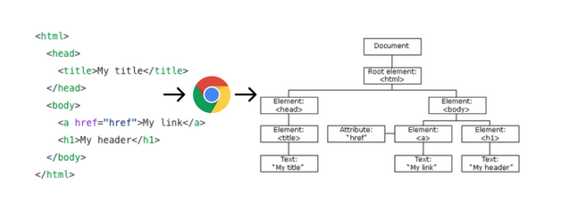
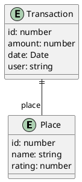
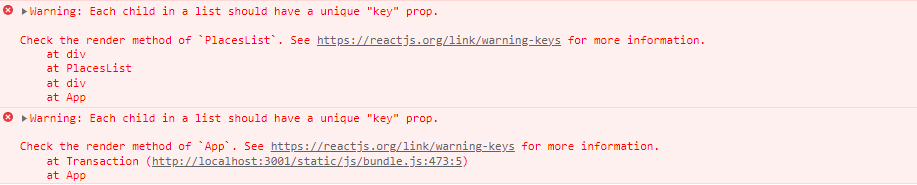

# React state management

> **Startpunt voorbeeldapplicatie**
>
> ```bash
> git clone https://github.com/HOGENT-Web/frontendweb-budget.git
> cd frontendweb-budget
> git checkout -b les2 44682fe
> yarn install
> yarn dev
> ```

[**Props**](https://react.dev/learn/passing-props-to-a-component) worden gebruikt om data door te geven binnen de component tree in één richting (top - down). React props zijn [immutable (= onveranderlijk)](https://en.wikipedia.org/wiki/Immutable_object). Wanneer de props van een component moeten wijzigen (bijvoorbeeld als reactie op een gebruikersinteractie), zal het zijn parent-component moeten "vragen" om de nieuwe waarden van de props door te geven! Met andere woorden, we zullen een nieuw object binnen krijgen in de kind-component.

[**State**](https://react.dev/learn/state-a-components-memory) is het dynamische deel van een React-component. Een component kan zo bepaalde informatie bijhouden en wijzigen als reactie op interacties. Wanneer de state wijzigt (door een gebruikersinteractie, API call die data retourneert...), past de UI zich aan (dit is waarom React 'so cool' is). Je kan dit vergelijken met een spreadsheet. Als één cel wijzigt, worden andere cellen aangepast.

Stel je voor dat we een component renderen waarbij een stuk state initieel een lege array is (bv. een lege lijst van transacties). Later wordt deze array gevuld met gegevens (we voegen bv. een transactie toe). Dit wordt een **state change** genoemd. Telkens wanneer we een React-component vertellen om zijn state te wijzigen (via een `setState` methode), zal de component zichzelf automatisch opnieuw renderen. De state kan ingesteld worden door de component zelf of een ander stukje code buiten de component. Het proces wordt hier gevisualiseerd:


State en props zijn verschillend, maar ze werken samen. Een parent-component houdt vaak data in state die op zijn beurt doorgegeven kan worden als props naar de child componenten. Bij elke wijziging van de state in de parent, zal elk kind nieuwe props krijgen en opnieuw renderen.

## Virtual DOM

Het **Document Object Model (DOM)** is de in het geheugen opgeslagen boomstructuur van een HTML-document. De browser DOM biedt een interface (API) om de nodes te bekijken en te wijzigen. De DOM's zijn tegenwoordig enorm groot en worden (zeker in geval van SPA's) voortdurend aangepast. DOM-bewerkingen zijn vaak traag.



React gebruikt een **Virtual DOM (VDOM)** als een extra abstractielaag bovenop het DOM. Het is een lokale en vereenvoudigde kopie van de browser DOM en staat los van de browser-specifieke implementatie. React houdt deze virtuele DOM gesynchroniseerd met de browser DOM, waardoor echte DOM-updates worden verminderd.


Wanneer de state van onze applicatie wijzigt, worden deze wijzigingen eerst toegepast op de VDOM. De React DOM-library wordt gebruikt om efficiënt te controleren welke delen van de UI echt visueel moeten worden bijgewerkt in de echte DOM. Het is nl. niet altijd zo dat een state-wijziging ervoor zorgt dat elk kind gewijzigd is. Dit proces wordt [**reconciliation**](https://reactjs.org/docs/reconciliation.html) genoemd en is gebaseerd op deze stappen:

1. VDOM wordt bijgewerkt door een state-wijziging in de applicatie. In React is elk UI-stuk een component en elke component heeft een state. React volgt het **observable** patroon en luistert naar state-wijzigingen. Wanneer de state van een component verandert, werkt React de virtuele DOM-structuur bij.
2. De nieuwe VDOM wordt vergeleken met een eerdere VDOM-snapshot (= **diffing**)
3. Enkel de gewijzigde delen van de echte DOM worden bijgewerkt. Er is geen DOM-update als er niets is veranderd.


React volgt een batch-updatemechanisme om de browser DOM bij te werken. Dit betekent dat updates voor de browser DOM in batches worden verzonden, in plaats van updates te verzenden voor elke afzonderlijke state-wijziging. Dit leidt tot logischerwijs betere prestaties.

De kosten van virtuele DOM zijn veel minder "duur", omdat het niet nodig is om _alle_ elementen opnieuw te renderen. Net dit maakt React (en andere JS front-endframeworks) super gaaf.

> **You must unlearn what you just learned in Web development II: geen DOM manipulaties meer in de code!**

## Voorbeeld - Overzicht van de places

Elke transactie wordt uitgevoerd voor een bepaalde plaats (bv. een café, een winkel, jouw loon...). Dit geeft volgend domeinmodel:



We gaan een component ontwerpen die een lijst van plaatsen zal tonen. Elke plaats bevat een naam en een rating. De rating kan worden aangepast door te klikken op een ster. De UI ziet er als volgt uit:


De JSON API retourneert onderstaande data. Pas hiervoor `mock_data.js` in de `api` folder aan:

```javascript
// src/api/mock_data.js
const TRANSACTION_DATA = [...];

const PLACE_DATA = [
  { id: 1, name: 'home', rating: 5 },
  { id: 4, name: 'hogent', rating: 1 },
  { id: 7, name: 'bar', rating: 3 },
]; // 👈 1

export { TRANSACTION_DATA, PLACE_DATA} ; // 👈 2
```

1. Voeg de mock data voor places toe
2. Pas de export instructie aan. Merk op dat we nu een foutmelding krijgen als we de app runnen.

Wat moet er nu nog aangepast worden?

<!-- markdownlint-disable-next-line -->
+ Antwoord +

  In `App.jsx` vervangen we het import statement van `TRANSACTION_DATA` door:

  ```jsx
  // src/App.jsx
  import { TRANSACTION_DATA } from './api/mock_data';
  ```

Voor de verdere ontwikkeling van deze UI dienen we onderstaande vragen te beantwoorden. Neem hiervoor eerst [Thinking in React: start with the mockup, step 1, 3 en 4](https://react.dev/learn/thinking-in-react) door.

- In welke componenten kunnen we de UI opdelen?
- Welke props, state hebben we nodig?
- In welke component houden we de state bij?

<!-- markdownlint-disable-next-line -->
+ Antwoorden +

  - **In welke componenten kunnen we de UI opdelen?**
    - `PlacesList`: de lijst van places
    - `Place`: de weergave van één place
    - `StarRating`: de weergave van de rating van een place
    - `Star`: de weergave van één ster
  - **Welke props, state hebben we nodig? In welke component houden we de state bij?**
    - `PlacesList`:
      - State: de lijst van places
      - Props: geen
    - `Place`:
      - State: geen
      - Props: de attributen van een place, handler voor het aanpassen van de rating
    - `StarRating`:
      - State: de huidige rating (kan wijzigen door het klikken op een ster)
      - Props: het aantal sterren, de huidige rating, handler voor het aanpassen van de rating
    - `Star`:
      - State: geen
      - Props: de index van de ster, de huidige rating, handler voor het klikken op een ster

### Place component

We implementeren de `Place` component, voorlopig nog zonder rating. Deze component geeft de "card" van één plaats weer. Maak het bestand `Place.jsx` aan in de map `src/components/places`. We zien dat deze component alle attributen van een plaats meekrijgt als props.

```jsx
// src/components/places/Place.jsx
const Place = ({ id, name, rating }) => {
  return (
    <div className='card bg-light border-dark mb-4'>
      <div className='card-body'>
        <h5 className='card-title'>{name}</h5>
      </div>
    </div>
  );
};

export default Place;
```

### PlacesList component

Maak een bestand `PlacesList.jsx` aan in de map `src\components\places`. Deze component zorgt voor de weergave van alle plaatsen. We maken reeds gebruik van de `Place` component voor weergave van één plaats.

```jsx
// src/components/places/PlacesList.jsx
import { PLACE_DATA } from '../../api/mock_data';
import Place from './Place';

const PlacesList = () => {
  const places = PLACE_DATA;
  return (
    <div className='grid mt-3'>
      <div className='row row-cols-1 row-cols-md-2 row-cols-lg-3 row-cols-xxl-4 g-3'>
        {places
          .sort((a, b) =>
            a.name.toUpperCase().localeCompare(b.name.toUpperCase())
          )
          .map((p) => (
            <div className='col'>
              <Place {...p} />
            </div>
          ))}
      </div>
    </div>
  );
};

export default PlacesList;
```

Voeg de `PlacesList` component toe aan `App.jsx` en bekijk het resultaat.

```jsx
// src/App.jsx
import Transaction from './components/transactions/Transaction';
import { TRANSACTION_DATA } from './api/mock_data';
import PlacesList from './components/places/PlacesList'; // 👈

function App() {
  return (
    <div>
      {TRANSACTION_DATA.map((trans) => (
        <Transaction {...trans} />
      ))}
      <PlacesList />
      {/* 👈 */}
    </div>
  );
}
export default App;
```

### keys

Open je de console van de browser, dan zie je onderstaande errors:



Laten we de "React-bril" opzetten. We nemen het voorbeeld van de lijst van transacties. `TRANSACTION_DATA` bevat twee transacties, dit is de initiele state van de app. Na het renderen bevat de browser DOM volgende twee `div`s met transacties:

```html
<div class="text-bg-dark">Benjamin gaf €-200 uit bij Dranken Geers</div>
<div class="text-bg-dark">Benjamin gaf €1500 uit bij Loon</div>
```

Stel dat we de array `TRANSACTION_DATA` aanpassen en achteraan een nieuw item toevoegen. React zal reageren op deze state change door het maken van een VDOM. Na het vergelijken met de vorige VDOM kan React makkelijk zien dat achteraan een item is toegevoegd.

```html
<div class="text-bg-dark">Benjamin gaf €-200 uit bij Dranken Geers</div>
<div class="text-bg-dark">Benjamin gaf €1500 uit bij Loon</div>
<div class="text-bg-dark">Benjamin gaf €100 uit bij HoGent</div>
```

Maar wat als we het item vooraan in de array toevoegen? De weergave wordt dan

```html
<div class="text-bg-dark">Benjamin gaf €100 uit bij HoGent</div>
<div class="text-bg-dark">Benjamin gaf €-200 uit bij Dranken Geers</div>
<div class="text-bg-dark">Benjamin gaf €1500 uit bij Loon</div>
```

Is de lijst nu niet volledig gewijzigd? Dit is waarom de `key` property belangrijk is. De `key` property helpt React om snel de kinderen in de oorspronkelijke boom te identificeren en te vergelijken met kinderen in de volgende boom. Het voorbeeld met de `key` property ziet er als volgt uit

```html
<div class="text-bg-dark" key="1">Benjamin gaf €-200 uit bij Dranken Geers</div>
<div class="text-bg-dark" key="2">Benjamin gaf €1500 uit bij Loon</div>
```

Met het toegevoegde item ziet de daaropvolgende boom er als volgt uit:

```html
<div class="text-bg-dark" key="3">Benjamin gaf €100 uit bij HoGent</div>
<div class="text-bg-dark" key="1">Benjamin gaf €-200 uit bij Dranken Geers</div>
<div class="text-bg-dark" key="2">Benjamin gaf €1500 uit bij Loon</div>
```

Keys helpen React bepalen welke items gewijzigd, toegevoegd of verwijderd zijn. Het is noodzakelijk om sleutels te geven aan de elementen om deze een "stabiele identiteit" te geven.

`App.jsx` passen we dus als volgt aan

```jsx
import Transaction from './components/transactions/Transaction';
import { TRANSACTION_DATA } from './api/mock_data';
import PlacesList from './components/places/PlacesList';

function App() {
  return (
    <div>
      {TRANSACTION_DATA.map((trans, index) => (
        <Transaction {...trans} key={index} /> {/* 👈 */}
      ))}{' '}
      <PlacesList />
    </div>
  );
}
export default App;
```

Gebruik voorlopig de index als key. Vervang dit, éénmaal de data wordt opgevraagd uit de REST API, door het id van de transactie. In de React-documentatie staat dat de index key niet wordt aanbevolen wanneer de volgorde van items kan veranderen. Het heeft een negatieve invloed op de prestaties en kan problemen veroorzaken met de component state. [Index als een key is een anti-pattern](https://medium.com/geekculture/reactjs-why-index-as-a-key-is-an-anti-pattern-4b9dc6ef0067).

> Merk op: je plaatst de key altijd bij de parent-tag die herhaald wordt.

### Oefening 1 - Key prop in PlacesList

Pas ook `PlacesList.jsx` aan. Maak hier gebruik van het id.

## Star Rating component

Maak het bestand `StarRating.jsx` aan in de map `src/components/places`:

```jsx
// src/components/places/StarRating.jsx
export default function StarRating() {
  return ();
}
```

Voor de weergave van de sterren maken we gebruik van [react-icons](https://react-icons.github.io/react-icons/). Dit is een npm package met honderden svg's onder de vorm van componenten. We maken gebruik van de Ionicons 5.

```bash
yarn add react-icons
```

Implementeer de `StarRating` component als volgt:

```jsx
// src/components/places/StarRating.jsx
import { IoStarSharp } from 'react-icons/io5'; // 👈 1

const Star = () => <IoStarSharp color="yellow"/> // 👈 2

export default function StarRating() {
  return (
    <> {/* 👈4 */}
      {[...new Array(5)].map((_, i )=><Star key={i}/>)}{/* 👈 3 */}
    </> {/* 👈4 */}
  );
}
```

1. We maken gebruik van het `IoStarSharp` icon uit de Ionicons-collectie
2. De `Star` component retourneert één gele ster.
3. De `StarRating` component retourneert vijf sterren. We creëren een array met vijf elementen en mappen elk element naar een `Star` component. We voegen ook een key attribuut toe, hier gebruiken we de index.
4. React-components mogen maar één element retourneren. We wrappen de elementen in een lege tag. Dit genereert geen extra DOM element, enkel een virtuele knoop in de virtual DOM.

### Oefening 2 - StarRating in Place component

Voeg de StarRating component toe aan de Place component en bekijk het resultaat.

### Een variabel aantal sterren

Vervolgens willen het aantal sterren in de rating variabel maken, dit doen we d.m.v. een prop.

```jsx
// src/components/places/StarRating.jsx&
import { IoStarSharp } from 'react-icons/io5';

const Star = () => <IoStarSharp color='yellow' />;

export default function StarRating({ totalStars = 5 }) { // 👈 1
  return (
    <>
      {/* 👇 2 */}
      {[...new Array(totalStars)].map((_, i) => (
        <Star key={i} />
      ))}
    </>
  );
}
```

1. We voegen een prop `totalStars` toe met een default waarde van 5.
2. En maken het aantal sterren variabel.

### De kleur van de sterren kan verschillen

Ook de kleur van de ster kan verschillen. Hiervoor voegen we een `selected` prop toe.

```jsx
// src/components/places/StarRating.jsx
import { IoStarSharp } from 'react-icons/io5';

// 👇
const Star = ({ selected = false }) => (
  <IoStarSharp color={selected ? 'yellow' : 'grey'} />
);
// 👆

export default function StarRating({ totalStars = 5 }) {
  return (
    <>
      {[...new Array(totalStars)].map((_, i) => (
        <Star key={i} />
      ))}
    </>
  );
}
```

### Rating functionaliteit afwerken

De `Place` component krijgt via een prop de `rating` door van de parent en zal die informatie moeten doorgeven aan de `StarRating` component.

```jsx
// src/components/places/Place.jsx
import StarRating from './StarRating'; // 👈 1

const Place = ({ id, name, rating }) => {
  return (
    <div className='card bg-light border-dark mb-4'>
      <div className='card-body'>
        <h5 className='card-title'>{name}</h5>
        <StarRating selectedStars={rating} /> {/* 👈 2*/}
      </div>
    </div>
  );
};

export default Place;
```

1. Importeer de StarRating component
2. Via de prop `selectedStars` wordt de informatie doorgegeven aan de `StarRating` component.

De `StarRating` component zal die informatie via de prop `selected` doorgeven aan de `Star` component:

```jsx
// src/components/places/StarRating.jsx
import { IoStarSharp } from 'react-icons/io5';

const Star = ({ selected = false }) => (
  <IoStarSharp color={selected ? 'yellow' : 'grey'} />
);

export default function StarRating({ totalStars = 5, selectedStars = 0 }) { // 👈 1
  return (
    <>
      {[...new Array(totalStars)].map((_, i) => (
        <Star key={i} selected={selectedStars > i} /> {/* 👈 2 */}
      ))}
      {/* 👇 3 */}
      <p>
        {selectedStars} of {totalStars} stars
      </p>
    </>
  );
}
```

1. Het aantal geselecteerde sterren wordt via de prop `selectedStars` meegegeven.
2. Een ster is geselecteerd als de rating groter is dan de index.
3. We geven ook informatie weer over het aantal geselecteerde sterren.

Bekijk het resultaat!

## Interactiviteit toevoegen

In React kunnen we gebruik maken van event handlers in onze JSX-code. Neem het artikel [Responding to Events](https://react.dev/learn/responding-to-events) door.

### Samenvatting

- `DOM events` worden gegenereerd door de browser (zoals klikken op knop, wijzigen van tekst input,...). Alle browsers voorzien in een **event based programming model**.
- Built-in componenten zoals een knop ondersteunen enkel browser events zoals `onClick`. Maar ook aan je eigen componenten kan je **event handler props** toevoegen die je benoemt zoals je wil.
- Het afhandelen van events met React-elementen lijkt op het afhandelen van events van DOM-elementen. Er zijn enkele verschillen:
  - React-gebeurtenissen worden benoemd in camelCase in plaats van kleine letters.
  - Met JSX geef je een functie door als event handler en niet een string. Je mag de functie ook niet aanroepen, we geven de referentie door.
  - In de browser retourneer je `false` om het standaard klikgedrag te voorkomen. In React moet je `preventDefault` expliciet aanroepen.

#### Een voorbeeld

In pure HTML zou je dit schrijven:

```html
<button onclick="handleClick()" />
```

In JSX schrijven we dit licht anders, maar je ziet wel de gelijkenis:

```jsx
<button onClick={handleClick} />
```

- Per conventie starten event handler props met de prefix `on` gevolgd door een hoofdletter.
- Per conventie starten event handlers met de prefix `handle` gevolgd door de naam van het event.
- Een event handler in React heeft als argument een cross-browser native event wrapper, nl. het [**synthetic event**](https://react.dev/reference/react-dom/components/common#react-event-object).
- Event handlers definieer je meestal binnen een component zodat ze toegang hebben tot de props en de state.
- Je kan een event handler definiëren in een parent en doorgeven als een prop aan een child component

### Oefening 3 - Event handler toevoegen

Voeg een event handler toe aan de `StarRating` component. Wanneer je klikt op een ster, geef je `you clicked a star` in de console weer.

<!-- markdownlint-disable-next-line -->
  + Oplossing +

  ```jsx
  // src/components/places/StarRating.jsx
  import { IoStarSharp } from 'react-icons/io5';

  const Star = ({ selected = false }) => {
    // 👇 1
    const handleClick = (e) => {
      console.log('you clicked a star');
    };

    return (
      <IoStarSharp color={selected ? 'yellow' : 'grey'} onClick={handleClick} /> {/* 👈 2 */}
    );
  };

  export default function StarRating({ totalStars = 5, selectedStars = 0 }) {
    return (
      <>
        {[...new Array(totalStars)].map((_, i) => (
          <Star key={i} selected={selectedStars > i} />
        ))}
        <p>
          {selectedStars} of {totalStars} stars
        </p>
      </>
    );
  }
  ```

  1. Definieer een functie `handleClick`, die het `onClick` event zal afhandelen, toe aan de component. Per conventie starten event handlers met `handle` gevolgd door het event. React voorziet in een cross-browser native event wrapper, nl het synthetic event. Print dit object gerust eens in de console om de inhoud ervan te bekijken.
  2. Voorzie de prop `onClick` en geef de event handler functie mee.

## State toevoegen

Wanneer we klikken op een ster moet de kleur aangepast worden. Hierdoor dient het aantal geselecteerde sterren in `state` bijgehouden te worden bijgehouden. Dit doen we aan de hand van de `useState` hook.

Neem de tutorial [Updating the screen](https://react.dev/learn#updating-the-screen) door.

Vroeger was React klassegebaseerd, tegenwoordig is letterlijk alles een functie in React. Toch bestaan function components al heel lang. Echter konden deze enkel gebruikt worden indien de component stateless was, m.a.w. geen state bevatte, of geen gebruik maakte van de lifecycle features van een component (bv. iets doen als de component uit de VDOM verdwijnt).

**Hooks** hebben dit probleem opgelost. Het zijn functies die function components toelaten om state bij te houden alsook om in te haken ("hook into") op de lifecycle features van een component.

De naam van een hooks begint altijd met `use`. React bevat een aantal **builtin hooks** maar je kan ook je eigen **custom hooks** bouwen. Ze zijn dus de ideal manier om code herbruikbaar te maken.

De [useState](https://reactjs.org/docs/hooks-reference.html#usestate) hook wordt gebruikt om een component stateful te maken. Hij geeft een component met andere woorden state.

### Toevoegen van state aan de StarRating component

We starten met het bijhouden van de state in de `StarRating` component. Later verplaatsen we de state naar de parent, de reden hiervoor zal nog wel duidelijk worden.

```jsx
// src/components/places/StarRating.jsx
import { useState } from 'react'; // 👈 1
import { IoStarSharp } from 'react-icons/io5';

const Star = ({ index, selected = false, onSelect = (f) => f }) => { // 👈 5 en 6
  const handleClick = () => {
    onSelect(index + 1); // 👈 6
  };

  return (
    <IoStarSharp color={selected ? 'yellow' : 'grey'} onClick={handleClick} />
  );
};

export default function StarRating({ totalStars = 5, selectedStars = 0 }) {
  const [rating, setRating] = useState(selectedStars); // 👈 2

  return (
    <>
      {[...new Array(totalStars)].map((_, i) => (
        <Star key={i} index={i} selected={rating > i} onSelect={setRating} /> {/* 👈 3, 4 en 6 */}
      ))}{' '}
      <p>
        {rating} of {totalStars} stars {/* 👈 3 */}
      </p>
    </>
  );
}
```

1. Importeer de `useState` hook uit het `react` package.
2. Met de `useState` hook kan je slechts één state variabele (van welk type ook) declareren. Hier noemen we deze variabele `rating`. De `useState` functie neemt de initiële state (het aantal geselecteerde sterren) als parameter en geeft een array terug. Deze array bevat:

   - als eerste element de **state-variabele**, deze bevat de huidige waarde.
   - als tweede element de functie om de waarde van de state-variabele bij te werken, een zogezegde **setter**. Hierdoor zal de component opnieuw gerenderd worden.

  Door gebruik te maken van **array destructuring** kunnen we zelf de naam van de variabele en de set-functie instellen.

<!-- markdownlint-disable ol-prefix -->
3. Via de `selected` prop geven we door of de ster al dan niet geselecteerd is. We passen ook de tekst aan die het aantal geselecteerde sterren weergeeft.
4. Als de gebruiker een ster selecteert, dient de methode `setRating` te worden aangeroepen om de state aan te passen. Dus interacties van de gebruiker in een child component dienen de state in een parent aan te passen. We moeten de functie `setRating` uit de parent doorgeven aan de child component. Hiervoor voegen we een prop `onSelect` toe.
5. Props worden doorgegeven van de parent aan de child component. We voegen een `onSelect` prop toe aan de `Star` component. Dit is een functie met standaardwaarde `f => f`. Dit is een nepfunctie die niets doet, het retourneert gewoon het argument dat het ontvangen heeft.
6. Nu moet deze functie opgeroepen worden als de gebruiker op de ster klikt. De index van de geselecteerde ster + 1 wordt doorgegeven. We moeten de index dus ook doorgeven als prop.

Bekijk het resultaat en klik op de sterren.

### Render en commit

Alvorens de componenten getoond worden op het scherm moeten ze gerenderd worden door React. Elke update van het scherm gebeurt in 3 stappen in React:

1. Trigger
2. Render
3. Commit

Lees [Render and commit](https://react.dev/learn/render-and-commit) en bekijk een visuele weergave: [A Visual Guide to React Rendering - It Always Re-renders](https://alexsidorenko.com/blog/react-render-always-rerenders/)

### State snapshot

Lees [State as a snapshot](https://react.dev/learn/state-as-a-snapshot) en [Queueing a Series of State Updates](https://react.dev/learn/queueing-a-series-of-state-updates)

### Liften van de state

De `PlacesList` component houdt de places bij in zijn state. Indien de rating van een plaats wordt aangepast, dan moet de state in de `PlacesList` component worden aangepast. We moeten de rating van de bijhorende plaats aanpassen. Dit betekent dat we de state niet langer bijhouden in de `StarRating` component, maar wel in de `PlacesList` component. Deze component zal dan ook een methode bevatten om de state aan te passen. Deze geven we samen met de state door aan de child components.

```jsx
// src/components/places/PlacesList.jsx
import { useState } from 'react';
import { PLACE_DATA } from '../../api/mock_data';
import Place from './Place';

const PlacesList = () => {
  const [places, setPlaces] = useState(PLACE_DATA);

  // 👇 1
  const handleRatePlace = (id, rating) => {
    const newPlaces = places.map((p) => (p.id === id ? { ...p, rating } : p));
    setPlaces(newPlaces);
  };

  return (
    <>
      <h1>Places</h1>
      <div className='grid mt-3'>
        <div className='row row-cols-1 row-cols-md-2 row-cols-lg-3 row-cols-xxl-4 g-3'>
          {places
            .sort((a, b) =>
              a.name.toUpperCase().localeCompare(b.name.toUpperCase())
            )
            .map((p) => (
              <div className='col' key={p.id}>
                <Place {...p} onRate={handleRatePlace} /> {/* 👈 2 */}
              </div>
            ))}
        </div>
      </div>
    </>
  );
};

export default PlacesList;
```

1. Deze methode past de rating van een plaats aan. We gaan door de bestaande plaatsen en passen de rating van de plaats met het opgegeven id aan. Je vindt hierover meer op [Updating Objects in state](https://react.dev/learn/updating-objects-in-state). Als we `setPlaces` aanroepen, wordt de state variabele `places` aangepast en zal de UI tree gerenderd worden met de nieuwe data.
2. We geven deze methode door aan de kinderen via de prop `onRate`. Zo kunnen de kinderen de rating van de plaats aanpassen wanneer op een ster geklikt wordt.

De `Place` component moet ook worden aangepast:

```jsx
// src/components/places/Place.jsx
import StarRating from './StarRating';

const Place = ({ id, name, rating, onRate }) => { // 👈 1
  // 👇 2
  const handleRate = (newRating) => {
    onRate(id, newRating);
  };

  return (
    <div className='card bg-light border-dark mb-4'>
      <div className='card-body'>
        <h5 className='card-title'>{name}</h5>
        <StarRating selectedStars={rating} onRate={handleRate} /> {/* 👈 3 */}
      </div>
    </div>
  );
};

export default Place;
```

1. Place krijgt nu ook een prop `onRate`.
2. `handleRate` zal het instellen van een nieuwe rating afhandelen. De nieuwe rating is hier al gekend. We geven ook het id van de plaats mee.
3. Het klikken op een ster worden lager in de boom afgehandeld. Dus moeten we deze methode doorgeven aan de `StarRating` component via een event handler prop `onSelect`.

De `StarRating`component wordt:

```jsx
// src/components/places/StarRating.jsx
import { IoStarSharp } from 'react-icons/io5';

const Star = ({ index, selected = false, onSelect = (f) => f }) => {
  const handleSelect = () => {
    onSelect(index + 1);
  };

  return (
    <IoStarSharp color={selected ? 'yellow' : 'grey'} onClick={handleSelect} />
  );
};

export default function StarRating({
  totalStars = 5,
  selectedStars = 0,
  onRate, // 👈 3
}) {
  //const [rating, setRating] = useState(selectedStars); // 👈 1

  return (
    <>
      {[...new Array(totalStars)].map((_, i) => (
        <Star
          key={i}
          index={i}
          selected={selectedStars > i}
          onSelect={onRate}
        />
      ))}
      {/* 👆 2 en 4 */}
      <p>
        {selectedStars} of {totalStars} stars {/* 👈 2 */}
      </p>
    </>
  );
}
```

1. Verwijder de state.
2. Vervang de variabele `rating` door de prop `selectedStars`. Doe hetzelfde voor de tekst die het aantal geselecteerde sterren weergeeft.
3. `onRate` wordt via de props doorgegeven, samen met de andere props.
4. Roep de methode aan in de event handler prop `onSelect`.

### Oefening 4 - Verwijderen van een plaats

Voeg een verwijderknop toe om een plaats te verwijderen.

<!-- markdownlint-disable-next-line -->
  + Oplossing +

  Voeg eerst een knop met bijbehorende event handler toe aan de `Place` component. In deze event handler roepen we de event handler prop `onDelete` aan want enkel onze parent kan de plaats verwijderen.

  ```jsx
  // src/components/places/Place.jsx
  // imports

  const Place = ({ id, name, rating, onRate, onDelete }) => {
    // handleRate

    // 👇 1
    const handleDelete = () => {
      onDelete(id);
    };

    return (
      <div className='card bg-light border-dark mb-4'>
        <div className='card-body'>
          <h5 className='card-title'>{name}</h5>
          <StarRating selectedStars={rating} onRate={handleRate} />
          {/* 👇 2 */}
          <button className='btn btn-primary' onClick={handleDelete}>
            Verwijder
          </button>
        </div>
      </div>
    );
  });

  export default Place;
  ```

  Voeg dan de implementatie van het verwijderen toe aan de parent en geef deze functie door aan elke `Place`.

  ```jsx
  // src/components/places/PlacesList.jsx
  // imports

  const PlacesList = () => {
    // state en handleRatePlace

    // 👇 1
    const handleDeletePlace = (id) => {
      setPlaces((places) => places.filter((p) => p.id !== id));
    };

    return (
      <>
        <h1>Places</h1>
        <div className='grid mt-3'>
          <div className='row row-cols-1 row-cols-md-2 row-cols-lg-3 row-cols-xxl-4 g-3'>
            {places
              .sort((a, b) =>
                a.name.toUpperCase().localeCompare(b.name.toUpperCase())
              )
              .map((p) => (
                <div className='col' key={p.id}>
                  <Place
                    {...p}
                    onRate={handleRatePlace}
                    onDelete={handleDeletePlace}
                  /> {/* 👆 2 */}
                </div>
              ))}
          </div>
        </div>
      </>
    );
  };

  export default PlacesList;
  ```

## React DevTools

Een rerender wordt veroorzaakt door

- aanpassen van de state
- doorgeven van props
- de Context API (zie later)

[React DevTools](https://chrome.google.com/webstore/detail/react-developer-tools/fmkadmapgofadopljbjfkapdkoienihi) is een browserextensie die ons helpt bij het debuggen, profileren en monitoren van de uitvoering van onze React-app.

Installeer de extensie en open de console. Ga naar het tabblad `components`. Daar kan je de componenten en bijhorende props inspecteren.

Klik op settings (naast de zoekbalk) en vink `highlight updates when components render` aan. Voeg een nieuwe transactie toe. ReactDev duidt de opnieuw gerenderde componenten met een kleur aan. De kleur is afhankelijk van de frequentie van de update van de componenten:

- rood: heel regelmatig
- geel: vaak
- groen: af en toe
- blauw: zelden

## Een formulier toevoegen a.d.h.v. controlled components

In HTML houden formulierelementen zoals `input`, `textarea` en `select` doorgaans hun eigen state bij. Ze werken deze bij op basis van gebruikersinvoer.

In React wordt de veranderlijke state bewaard in de **state variabele** van componenten en alleen bijgewerkt met bijhorende **set-functie**. We moeten dus de state van het formulier bijhouden en bijwerken wanneer een veld in het formulier wordt gewijzigd. Dit noemt men [**controlled components**](https://reactjs.org/docs/forms.html#controlled-components).

We maken een component voor het toevoegen van transacties. Maak een bestand `TransactionForm.jsx` aan in de map `src\components\transactions`. Dit bevat een formulier met drie input velden en één select lijst

```jsx
// src/components/transactions/TransactionForm.jsx
import { PLACE_DATA } from '../../api/mock_data';

export default function TransactionForm() {
  return (
    <>
      <h2>Add transaction</h2>
      <form className='w-50 mb-3'>
        <div className='mb-3'>
          <label htmlFor='user' className='form-label'>
            Who
          </label>
          <input
            id='user'
            type='text'
            className='form-control'
            placeholder='user'
            required
          />
        </div>
        <div className='mb-3'>
          <label htmlFor='date' className='form-label'>
            Date
          </label>
          <input
            id='date'
            type='date'
            className='form-control'
            placeholder='date'
          />
        </div>

        <div className='mb-3'>
          <label htmlFor='places' className='form-label'>
            Place
          </label>
          <select id='places' className='form-select' required>
            <option defaultChecked>-- Select a place --</option>
            {PLACE_DATA.map(({ id, name }) => (
              <option key={id} value={name}>
                {name}
              </option>
            ))}
          </select>
        </div>

        <div className='mb-3'>
          <label htmlFor='amount' className='form-label'>
            Amount
          </label>
          <input id='amount' type='number' className='form-control' required />
        </div>

        <div className='clearfix'>
          <div className='btn-group float-end'>
            <button type='submit' className='btn btn-primary'>
              Add transaction
            </button>
          </div>
        </div>
      </form>
    </>
  );
}
```

Formulierelementen in React zijn read-only. Door state toe te voegen, kan de component zich aanpassen.

```jsx
import { useState } from 'react';
import { PLACE_DATA } from '../../api/mock_data';

// 👇 3
const toDateInputString = (date) => {
  // ISO String without the trailing 'Z' is fine 🙄
  // (toISOString returns something like 2020-12-05T14:15:74Z,
  // datetime-local HTML5 input elements expect 2020-12-05T14:15:74, without the (timezone) Z)
  //
  // the best thing about standards is that we have so many to chose from!
  if (!date) return null;
  if (typeof date !== Object) {
    date = new Date(date);
  }
  let asString = date.toISOString();
  return asString.substring(0, asString.indexOf('T'));
};

export default function TransactionForm({ onSaveTransaction }) { // 👈 5
  const [user, setUser] = useState(''); // 👈 1
  const [date, setDate] = useState(new Date()); // 👈 1
  const [place, setPlace] = useState('home'); // 👈 1
  const [amount, setAmount] = useState(0); // 👈 1

  // 👇 5
  const handleSubmit = (e) => {
    e.preventDefault();
    onSaveTransaction(user, place, amount, date);
    setUser('');
    setDate(new Date());
    setPlace('home');
    setAmount(0);
  };

  return (
    <>
      <h2>Add transaction</h2>
      <form onSubmit={handleSubmit} className='w-50 mb-3'>{/* 👈 5 */}
        <div className='mb-3'>
          <label htmlFor='date' className='form-label'>
            Who
          </label>
          <input
            value={user}
            onChange={(e) => setUser(e.target.value)}
            id='user'
            type='text'
            className='form-control'
            placeholder='user'
            required
          />
          {/* 👆 2 en 4 */}
        </div>
        <div className='mb-3'>
          <label htmlFor='date' className='form-label'>
            Date
          </label>
          <input
            value={toDateInputString(date)}
            onChange={(e) => setDate(new Date(e.target.value))}
            id='date'
            type='date'
            className='form-control'
            placeholder='date'
          />
          {/* 👆 2, 3 en 4 */}
        </div>
        <div className='mb-3'>
          <label htmlFor='places' className='form-label'>
            Place
          </label>
          <select
            value={place}
            onChange={(e) => setPlace(e.target.value)}
            id='places'
            className='form-select'
            required
          >
            {/* 👆 2 en 4 */}
            <option defaultChecked value=''>
              -- Select a place --
            </option>
            {PLACE_DATA.map(({ id, name }) => (
              <option key={id} value={name}>
                {name}
              </option>
            ))}
          </select>
        </div>
        <div className='mb-3'>
          <label htmlFor='amount' className='form-label'>
            Amount
          </label>
          <input
            value={amount}
            onChange={(e) => setAmount(e.target.value)}
            id='amount'
            type='number'
            className='form-control'
            required
          />
          {/* 👆 2 en 4 */}
        </div>
        <div className='clearfix'>
          <div className='btn-group float-end'>
            <button type='submit' className='btn btn-primary'>
              Add transaction
            </button>
          </div>
        </div>
      </form>
    </>
  );
}
```

1. Voeg state toe voor elk inputveld.
2. Verbind de inputelementen met de component state via de `value` prop.
3. De datum moeten we converteren naar het formaat YYYY-MM-DD. Plaats de functie `toDateInputString` buiten de component om performantie-redenen. Anders wordt bij elke rerender de functie opnieuw aangemaakt.
4. Gebruik de `onChange` event handler om de user input op te vangen en de state aan te passen
5. Nu kunnen we het formulier submitten door een handler toe te voegen. De transactie zal moeten toegevoegd worden aan de lijst van transacties die bijgehouden wordt in de parent. We voorzien dus een prop `onSaveTransaction` die de functie zal doorgeven uit de parent die dit realiseert.

Later zien we hoe we validatie kunnen toevoegen en hoe we gebruik kunnen maken van form libraries.

We refactoren eerst de code voor de transacties. Momenteel wordt de lijst van transacties gegenereerd in de `App` component. Het is beter om hier een aparte component `TransactionList` voor aan te maken.

Maak een bestand `TransactionList.jsx` aan in de map `src/components/transactions` en kopieer hier de code omtrent de lijst van transacties uit `App.jsx` naartoe.

```jsx
// src/components/transactions/TransactionList.jsx
import Transaction from './Transaction';
import { TRANSACTION_DATA } from '../../api/mock_data';

export default function TransactionList() {
  return (
    <>
      <h1>Transactions</h1>
      {TRANSACTION_DATA.map((trans, index) => (
        <Transaction {...trans} key={index} />
      ))}
    </>
  );
}
```

Gebruik vervolgens deze component in `App.jsx`.

```jsx
// src/App.jsx
import TransactionList from './components/transactions/TransactionList'; // 👈 1
import PlacesList from './components/places/PlacesList';

function App() {
  return (
    <div>
      <TransactionList /> {/* 👈 2 */}
      <PlacesList />
    </div>
  );
}
export default App;
```

1. Importeer `TransactionList` en verwijder de andere niet gebruikte imports
2. Het aanmaken van de lijst gebeurt nu door de `TransactionList` component

Nu voegen we state toe opdat de lijst van transacties kan wijzigen.

```jsx
// src/components/transactions/TransactionList.jsx
import { useState } from 'react'; // 👈 1
import Transaction from './Transaction';
import TransactionForm from './TransactionForm'; // 👈 3
import { TRANSACTION_DATA } from '../../api/mock_data';

export default function TransactionList() {
  const [transactions, setTransactions] = useState(TRANSACTION_DATA); // 👈 1

  // 👇 2
  const createTransaction = (user, place, amount, date) => {
    const newTransactions = [
      {
        user,
        place,
        amount,
        date: new Date(date),
      },
      ...transactions,
    ]; // newest first
    setTransactions(newTransactions);
    console.log('transactions', JSON.stringify(transactions));
    console.log('newTransactions', JSON.stringify(newTransactions));
  };

  return (
    <>
      <h1>Transactions</h1>
      <TransactionForm onSaveTransaction={createTransaction} /> {/* 👈 1 */}
      {transactions.map(
        (
          trans,
          index // 👈 1
        ) => (
          <Transaction {...trans} key={index} />
        )
      )}
    </>
  );
}
```

1. We voegen state toe om de transacties te beheren. We overlopen nu de `transactions` i.p.v. `TRANSACTION_DATA`.
2. Deze functie voegt een nieuwe transactie toe vooraan de lijst.
3. Voeg de component `TransactionForm` toe. De methode om een transactie toe te voegen wordt als prop doorgegeven. Zo zal bij wijziging van de state de component opnieuw gerenderd worden.
4. Start de app en bekijk de console: `transactions` toont de nieuwe transactie niet (`newTransactions` toont de nieuwe transactie wel). Meer uitleg hierover vind je op [State as a snapshot](https://react.dev/learn/state-as-a-snapshot). `setState` is een asynchrone functie. We moeten dus gebruik maken van een variabele `newTransaction` indien we iets met de nieuwe transacties willen doen! Willen we gebruik maken van de gewijzigde state, maken we soms beter gebruik maken van de hook `useEffect`. Die zien we in een later hoofdstuk.

## useReducer hook

Mocht je nood hebben aan een meer complexe state in een component, dan kan je gebruik maken van de `useReducer` hook. Dit is in feite een alternatief voor `useState`. Met een reducer kan je een complexe state aanpassen o.b.v. een **reducer-functie** die een bepaalde actie ontvangt. Wat die actie is, kies je zelf. Typisch is dit een object van de vorm `{ action: string; payload: any; }`.

Lees hierover meer in de [documentatie van de hook](https://react.dev/reference/react/useReducer).

## Oefening 5 - SnakeEyes

SnakeEyes is het resultaat van het gooien van twee dobbelstenen. Als op beide dobbelstenen één oog staat heb je 'SnakeEyes'. Bij de aanvang van het spel worden twee dobbelstenen getoond met de waarde 6. Het aantal dobbelstenen is standaard 2 maar kan ook meer zijn. Telkens wanneer de gebruiker op een dobbelsteen klikt, wordt een willekeurig getal gegenereerd.

Het `totaal` wordt met de waarde op de dobbelsteen verhoogd.

Als de dobbelsteen één oog bevat, kan er niet meer op geklikt worden.

Als alle dobbelstenen één oog bevatten, dan heb je 'Snake Eyes'. Er verschijnt een boodschap `Oeps you did it again!`. Het totaal wordt terug op 0 geplaatst. Nu kan je kiezen om opnieuw te spelen.

`Max total` bevat het maximaal aantal behaalde punten over alle spelletjes heen.

Dit zijn alle mogelijke uitkomsten van het spel:


Implementeer Snake Eyes in een React applicatie. Kies zelf welke componenten je ontwerpt en hoe je deze implementeert.

<!-- markdownlint-disable-next-line -->
+ Oplossing +

  Een voorbeeldoplossing (maar er zijn er uiteraard heel veel mogelijk) is te vinden op <https://github.com/HOGENT-Web/SnakeEyes>.

## Mogelijke extra's voor de examenopdracht

- [Redux Toolkit](https://redux-toolkit.js.org/)
- [Elf](https://github.com/ngneat/elf)
- Een alternatief state management framework...

## Must reads

- [Reacting to Input with State](https://react.dev/learn/reacting-to-input-with-state)
- [Choosing the State Structure](https://react.dev/learn/choosing-the-state-structure)
- [Preserving and Resetting State](https://react.dev/learn/preserving-and-resetting-state)
- [Extracting State Logic into a Reducer](https://react.dev/learn/extracting-state-logic-into-a-reducer)
- [The Interactive Guide to Rendering in React](https://ui.dev/why-react-renders)
- [React re-renders guide: everything, all at once](https://www.developerway.com/posts/react-re-renders-guide)
- [The new wave of React state management](https://frontendmastery.com/posts/the-new-wave-of-react-state-management/)
