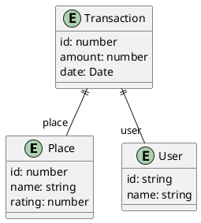

# React state management

> **Startpunt voorbeeldapplicatie**
>
> ```bash
> git clone https://github.com/HOGENT-frontendweb/frontendweb-budget.git
> cd frontendweb-budget
> git checkout -b les2 2355815
> pnpm install
> pnpm dev
> ```

## Props en state

[**Props**](https://react.dev/learn/passing-props-to-a-component) zijn een mechanisme waarmee gegevens van een oudercomponent (of parent component) naar een kindcomponent (of child component) kunnen worden doorgegeven. Ze worden gebruikt om componenten dynamischer en herbruikbaar te maken door informatie van buitenaf in een component te injecteren. React props zijn [immutable (= onveranderlijk)](https://en.wikipedia.org/wiki/Immutable_object). Een component kan de props die het ontvangt niet wijzigen, ze zijn bedoeld voor gegevensoverdracht, niet voor manipulatie. Een oudercomponent kan gegevens doorgeven aan een kindcomponent door attributen te gebruiken wanneer de kindcomponent wordt gerenderd. Binnen de kindcomponent kunnen de props worden gebruikt via het argument _props_ van de functie die de component definieert.

[**State**](https://react.dev/learn/state-a-components-memory) is het dynamische deel van een React-component. Een component kan zo zijn eigen gegevens opslaan en beheren, die in de loop van de tijd kunnen veranderen door bv. interacties van de gebruiker. Wanneer de state tijdens de levenscyclus van een component wijzigt (door een gebruikersinteractie, API call die data retourneert...), wordt de component opnieuw gerenderd om de nieuwe state weer te geven (dit is waarom React 'so cool' is). Je kan dit vergelijken met een spreadsheet. Als één cel wijzigt, worden andere cellen aangepast.

Stel je voor dat we een component renderen waarbij een stuk state initieel een lege array is (bv. een lege lijst van transacties). Later wordt deze array gevuld met gegevens (we voegen bv. een transactie toe). Dit wordt een **state change** genoemd. Telkens wanneer we een React-component vertellen om zijn state te wijzigen (via een `setState` functie), zal de component zichzelf automatisch opnieuw renderen. De state kan ingesteld worden door de component zelf of een ander stukje code buiten de component. Het proces wordt hier gevisualiseerd:


State en props zijn verschillend, maar ze werken samen om de UI dynamisch en interactief te maken. Een oudercomponent houdt vaak data in state bij die op zijn beurt doorgegeven kan worden als props naar de kindcomponenten. Bij elke wijziging van de state in de ouder, zal elk kind nieuwe props krijgen en opnieuw renderen.

## Virtual DOM

Het **Document Object Model (DOM)** is de in het geheugen opgeslagen boomstructuur van een HTML-document. De browser DOM biedt een interface (API) om de nodes te bekijken en te wijzigen. De DOM's zijn tegenwoordig enorm groot en worden (zeker in het geval van SPA's) voortdurend aangepast. DOM-bewerkingen zijn vaak traag.


React gebruikt een **Virtual DOM (VDOM)** als een extra abstractielaag bovenop het DOM. Het is een lokale en vereenvoudigde kopie van de browser DOM en staat los van de browser-specifieke implementatie. React houdt deze virtuele DOM gesynchroniseerd met de browser DOM, waardoor echte DOM-updates worden verminderd.


Wanneer de state van onze applicatie wijzigt, worden deze wijzigingen eerst toegepast op de VDOM. De React DOM-library wordt gebruikt om efficiënt te controleren welke delen van de UI echt visueel moeten worden bijgewerkt in de echte DOM. Het is nl. niet altijd zo dat een state-wijziging ervoor zorgt dat elk kind gewijzigd is. Dit proces wordt [**reconciliation**](https://reactjs.org/docs/reconciliation.html) genoemd en is gebaseerd op deze stappen:

1. VDOM wordt bijgewerkt door een state-wijziging in de applicatie. In React is elk UI-stuk een component en elke component heeft een state. React volgt het **observable** patroon en luistert naar state-wijzigingen. Wanneer de state of props van een component verandert, werkt React de virtuele DOM-structuur bij.
2. De nieuwe VDOM wordt vergeleken met een eerdere VDOM-snapshot (= **diffing**).
3. Enkel de gewijzigde delen van de echte DOM worden bijgewerkt. Er is geen DOM-update als er niets is veranderd.


React volgt een batch-updatemechanisme om de browser DOM bij te werken. Dit betekent dat React state-wijzigingen bundelt en ze dan samen doorvoert in één enkele rendering cyclus, in plaats van updates te verzenden voor elke afzonderlijke state-wijziging. Dit leidt tot logischerwijs betere prestaties.

De kosten van virtuele DOM zijn veel minder "duur", omdat het niet nodig is om _alle_ elementen opnieuw te renderen. Net dit maakt React (en andere JS front-end frameworks) super gaaf.

> **You must unlearn what you just learned in Web development II: geen DOM manipulaties meer in de code!**

## Voorbeeld - Overzicht van de places

Elke transactie wordt uitgevoerd voor een bepaalde plaats (bv. een café, een winkel, jouw loon...). Dit geeft volgend domeinmodel:



We gaan een component ontwerpen die een lijst van plaatsen zal tonen. Elke plaats bevat een naam en een rating. De rating kan worden aangepast door te klikken op een ster. Een plaats kan verwijderd worden. De UI ziet er als volgt uit:


We voegen een beetje mock data voor de plaatsen toe aan `mock_data.js` in de `api` folder:

```javascript
// src/api/mock_data.js
const TRANSACTION_DATA = [...];

// 👇 1
const PLACE_DATA = [
  { id: 1, name: 'home', rating: 5 },
  { id: 4, name: 'hogent', rating: 1 },
  { id: 7, name: 'bar', rating: 3 },
];

export { TRANSACTION_DATA, PLACE_DATA } ; // 👈 2
```

1. Voeg de mock data voor places toe
2. Pas de export instructie aan. Merk op dat we nu een foutmelding krijgen als we de app runnen.

Wat moet er nu nog aangepast worden?

<!-- markdownlint-disable-next-line -->

- Antwoord +

  In `App.jsx` vervangen we het import statement van `TRANSACTION_DATA` door:

  ```jsx
  // src/App.jsx
  import { TRANSACTION_DATA } from './api/mock_data';
  ```

Het opdelen van een React-applicatie in componenten is een essentieel onderdeel van het maken van herbruikbare, leesbare en onderhoudbare code. Neem hiervoor eerst [Thinking in React: start with the mockup (step 1, 3, 4 en 5)](https://react.dev/learn/thinking-in-react) door.

Neem een stap door en beantwoord daarna de vraag behorende bij de stap voor de ontwikkeling van bovenstaande UI. Hou componenten klein, herbruikbaar en geef de verantwoordelijkheid voor statebeheer aan de juiste componenten.

- Step 1: In welke componenten kunnen we de UI opdelen?
- Step 3: Welke data heeft je app nodig? Wat is hiervan state?
- Step 4: In welke component houden we de state bij? Welke componenten ontvangen hun informatie via props?
- Step 5: Welke inverse data flow is er nodig om de state in de parent bij te werken?

<!-- markdownlint-disable-next-line -->

- Antwoorden +

  - **In welke componenten kunnen we de UI opdelen?**
    - `PlacesList`: de lijst van places
    - `Place`: de weergave van één place
    - `StarRating`: de weergave van de rating van een place
    - `Star`: de weergave van één ster
  - **Welke data hebben we nodig? In welke component houden we de state/props bij? Inverse data flow?**
    - `PlacesList`:
      - State: de lijst van places
      - Props: geen
    - `Place`:
      - State: geen
      - Props: de attributen van een place, handler voor het aanpassen van de rating, handler voor het verwijderen van de place
    - `StarRating`:
      - State: geen
      - Props: het aantal sterren, de huidige rating, handler voor het aanpassen van de rating
    - `Star`:
      - State: geen
      - Props: de index van de ster, al dan niet geselecteerd, handler voor het klikken op de ster

Je kan componenten opsplitsen in 2 hoofdtypes

- **Presentational components of domme componenten**: Deze componenten zijn verantwoordelijk voor het weergeven van de UI. Ze ontvangen alleen props en hebben geen interne logica of state. Ze richten zich voornamelijk op hoe de UI eruitziet.
- **Container components of slimme componenten**: Deze componenten zijn verantwoordelijk voor het beheren van de logica, zoals het ophalen van gegevens of het beheren van de state. Ze kunnen presentational components gebruiken om gegevens weer te geven.

### Place component

We implementeren de `Place` component, voorlopig nog zonder rating. Deze component geeft de "card" van één plaats weer. Maak het bestand `Place.jsx` aan in de map `src/components/places`. We zien dat deze component alle attributen van een plaats meekrijgt als props. De verwijder button implementeren we in de volgende sectie.

```jsx
// src/components/places/Place.jsx
const Place = ({ id, name, rating }) => {
  return (
    <div className="p-3 outline outline-black/5 rounded-md shadow-lg mb-4">
      <h5 className="text-xl font-medium mb-2">{name}</h5>
      <button className='mt-6 py-2 px-2.5 rounded-md bg-blue-600 text-white'>Verwijder</button>
    </div>
  );
};

export default Place;
```

### PlacesList component

Maak een bestand `PlacesList.jsx` aan in de map `src/components/places`. Deze component zorgt voor de weergave van alle plaatsen. We maken reeds gebruik van de `Place` component voor weergave van één plaats.

```jsx
// src/components/places/PlacesList.jsx
import { PLACE_DATA } from '../../api/mock_data';
import Place from './Place';

const PlacesList = () => {
  const places = PLACE_DATA;
  return (
    <div className="grid grid-cols-1 md:grid-cols-2 lg:grid-cols-3 2xl:grid-cols-4 gap-3">
      {places
        .sort((a, b) =>
          a.name.toUpperCase().localeCompare(b.name.toUpperCase()),
        )
        .map((p) => (
          <div key={p.id}>
            <Place {...p} />
          </div>
        ))}
    </div>
  );
};

export default PlacesList;
```

Merk op: je plaatst de `key` altijd bij de parent-tag die herhaald wordt.

Voeg de `PlacesList` component toe aan `App.jsx` en bekijk het resultaat.

```jsx
// src/App.jsx
import Transaction from './components/transactions/Transaction';
import { TRANSACTION_DATA } from './api/mock_data';
import PlacesList from './components/places/PlacesList'; // 👈

function App() {
  return (
    <div className="bg-white text-gray-900">
      <h1 className="text-2xl font-bold text-center mb-4">
        Mijn Budget App
      </h1>
      {TRANSACTION_DATA.map((t) => (<Transaction {...t} key={t.id} />))}
      <PlacesList />
      {/* 👆 */}
    </div>);
}

export default App;
```

## Verwijderen van een place

In React kunnen we gebruik maken van event handlers in onze JSX-code. Neem het artikel [Responding to Events](https://react.dev/learn/responding-to-events) door.

### Samenvatting van het artikel

- `DOM events` worden gegenereerd door de browser (zoals klikken op knop, wijzigen van tekst input...). Alle browsers voorzien een **event based programming model**.
- Built-in componenten zoals een knop ondersteunen enkel browser events zoals `onClick`. Maar ook aan je eigen componenten kan je **event handler props** toevoegen die je benoemt zoals je wil.
  - De naam van deze props start ook altijd met de prefix `on` gevolgd door de naam van het event.
- Het afhandelen van events met React-elementen lijkt op het afhandelen van events van DOM-elementen. Er zijn enkele verschillen:
  - React-gebeurtenissen worden benoemd in camelCase in plaats van kleine letters.
  - Met JSX geef je een functie door als event handler en geen string. Je mag de functie ook niet aanroepen, we geven de referentie door.
  - In de browser retourneer je `false` om het standaard klikgedrag te voorkomen. In React moet je `preventDefault` expliciet aanroepen.

#### Een voorbeeld

In pure HTML zou je dit schrijven:

```html
<button onclick="handleClick()" />
```

In JSX schrijven we dit licht anders, maar je ziet wel de gelijkenis:

```jsx
<button onClick={handleClick} />
```

- Per conventie starten _event handler props_ met de prefix `on` gevolgd door een hoofdletter.
- Per conventie starten _event handlers_ met de prefix `handle` gevolgd door de naam van het event.
- Een event handler in React heeft als argument een cross-browser native event wrapper, nl. het [**synthetic event**](https://react.dev/reference/react-dom/components/common#react-event-object). Dit zorgt voor consistent gedrag van events in verschillende browsers.
- Event handlers definieer je meestal binnen een component zodat ze toegang hebben tot de props en de state.
- Je kan een event handler definiëren in een parent en doorgeven als een prop aan een child component

### Oefening 3 - Event handler toevoegen

Voeg een event handler toe aan de `Place` component. Wanneer je klikt op de verwijder knop, geef je `you clicked the remove button` in de console weer.

<!-- markdownlint-disable-next-line -->

- Oplossing +

  ```jsx
  // src/components/places/Place.jsx
  const Place = ({ id, name, rating }) => {
    // 👇 1
    const handleClick = () => {
      console.log('you clicked the remove button');
    };
    return (
      <div className="p-3 outline outline-black/5 rounded-md shadow-lg mb-4">
        <h5 className="text-xl font-medium mb-2">{name}</h5>
           <button className='mt-6 py-2 px-2.5 rounded-md bg-blue-600 text-white' onClick={handleClick}>
            {/* 👆 2 */}
            Verwijder
          </button>
        </div>
      </div>
    );
  };

  export default Place;
  ```

  1. Definieer binnen de component een functie `handleClick`, die het `onClick` event zal afhandelen. Per conventie starten event handlers met `handle` gevolgd door het event. Wanneer een event handler wordt aangeroepen, kan het synthetische event-object als argument aan de handler worden doorgegeven. Dit object werkt net als het normale DOM-event-object en biedt toegang tot informatie zoals de target (element dat het event heeft getriggerd) en de event-type (bijvoorbeeld 'click'). Print dit object gerust eens in de console om de inhoud ervan te bekijken.
  2. Voorzie de prop `onClick` en geef de event handler functie mee.

## State toevoegen

Wanneer we klikken op de verwijderknop dient de place te worden verwijderd uit de lijst van plaatsen. Dus de lijst van plaatsen kan veranderen en dient dus in `state` te worden bijgehouden. Dit doen we aan de hand van de `useState` hook.

Neem de tutorial [Updating the screen](https://react.dev/learn#updating-the-screen) door.

Vroeger was React klassegebaseerd, tegenwoordig is letterlijk alles een functie in React. Toch bestaan function components al heel lang. Echter konden deze enkel gebruikt worden indien de component stateless was, m.a.w. geen state bevatte, of geen gebruik maakte van de lifecycle features van een component (bv. iets doen als de component uit de VDOM verdwijnt).

**Hooks** hebben dit probleem opgelost. Het zijn functies die function components toelaten om state bij te houden alsook om in te haken ("hook into") op de lifecycle features van een component.

De naam van een hooks begint altijd met `use`. React bevat een aantal **builtin hooks** maar je kan ook je eigen **custom hooks** bouwen. Ze zijn dus de ideal manier om code herbruikbaar te maken.

De [useState](https://reactjs.org/docs/hooks-reference.html#usestate) hook wordt gebruikt om een component stateful te maken. Hij geeft een component met andere woorden state.

### Toevoegen van state aan de PlacesList component

We starten met het bijhouden van de state in de `PlacesList` component. Indien een plaats verwijderd wordt, dan moet de state in de `PlacesList` component worden aangepast. Deze component zal dan ook een functie bevatten om de plaats uit de state te verwijderen. Deze geven we samen met de overige props door aan de child components. De component waar de interactiviteit plaatsvindt, kan dan deze functie aanroepen, die vervolgens de state zal wijzigen in de parent component.

```jsx
// src/components/places/PlacesList.jsx
import { useState } from 'react'; // 👈 1
import { PLACE_DATA } from '../../api/mock_data';
import Place from './Place';

const PlacesList = () => {
  const [places, setPlaces] = useState(PLACE_DATA); // 👈 2

  // 👇 3
  const handleDeletePlace = (id) => {
    setPlaces((places) => places.filter((p) => p.id !== id));
  };

  return (
    <>
      <h1 className="text-4xl mb-4">Places</h1>
      <div className="grid grid-cols-1 md:grid-cols-2 lg:grid-cols-3 2xl:grid-cols-4 gap-3">
        {places
          .sort((a, b) =>
            a.name.toUpperCase().localeCompare(b.name.toUpperCase()),
          )
          .map((p) => (
            <div key={p.id}>
              <Place {...p} onDelete={handleDeletePlace} /> {/* 👈 3 */}
            </div>
          ))}
      </div>
    </>
  );
};

export default PlacesList;
```

1. Importeer de `useState` hook uit het `react` package.
2. Met de `useState` hook kan je slechts één state variabele (van welk type ook) declareren. Hier noemen we deze variabele `places`. De `useState` functie neemt de initiële state (`PLACES_DATA`) als parameter en geeft een array terug. Deze array bevat:

   - als eerste element de **state-variabele**, deze bevat de huidige waarde.
   - als tweede element de functie om de waarde van de state-variabele bij te werken, een zogezegde **setter**. Hierdoor zal de component opnieuw gerenderd worden.

Door gebruik te maken van **array destructuring** kunnen we zelf de naam van de variabele en de set-functie instellen.

<!-- markdownlint-disable ol-prefix -->

3. Als de gebruiker op verwijder klikt, dient de functie `handleDeletePlace` te worden aangeroepen om de state aan te passen. Dus interacties van de gebruiker in een child component dienen de state in een parent aan te passen. We moeten de functie `handleDeletePlace` uit de parent doorgeven aan de child component. Hiervoor voegen we een prop `onDelete` toe.

Om gegevens vanuit een kindcomponent naar de oudercomponent te sturen, kan de oudercomponent een functie (callback) via props aan de kindcomponent doorgeven. Wanneer de kindcomponent een actie uitvoert (zoals klikken op een knop), kan het die callback-functie aanroepen, die vervolgens een state-wijziging in de oudercomponent kan initiëren.

De `Place` component moet ook worden aangepast:

```jsx
// src/components/places/Place.jsx
const Place = ({ id, name, rating, onDelete = (f) => f }) => {
  // 👆 1  👇 2
  const handleDelete = () => {
    onDelete(id);
  };

  return (
    <div className="p-3 outline outline-black/5 rounded-md shadow-lg mb-4">
      <h5 className="text-xl font-medium mb-2">{name}</h5>
      <button className='mt-6 py-2 px-2.5 rounded-md bg-blue-600 text-white' onClick={handleDelete}>
        Verwijder
      </button>
      {/* 👈 3 */}
    </div>
  );
};

export default Place;
```

1. Props worden doorgegeven van de parent aan de child component. We voegen een `onDelete` prop toe aan de `Place` component. Dit is een functie met standaardwaarde `f => f`. Dit is een nepfunctie die niets doet. Deze retourneert gewoon het argument die het ontvangen heeft.
2. `handleDelete` zal het verwijderen van de plaats afhandelen. We geven het id van de plaats mee.
3. Nu moet deze functie opgeroepen worden als de gebruiker op de verwijder knop klikt. Hierdoor zal de parent zijn state aanpassen. De parent zal opnieuw gerenderd worden!

Bekijk het resultaat en klik op de verwijder knop.

### Render en commit

Alvorens de componenten getoond worden op het scherm moeten ze gerenderd worden door React. Elke update van het scherm gebeurt in 3 stappen in React:

1. Trigger
2. Render
3. Commit

Er zijn 2 redenen voor een component om te renderen

1. De initiële render (veroorzaakt in main.jsx door de `render` functie)
2. De state van de component of één van zijn parents is aangepast (veroorzaakt door een `setState` functie)

In het geval van een initiële render, zal React de root component aanroepen. Bij een state wijziging roept React de function component aan wiens state werd aangepast. Dit proces is recursief. De render-fase is enkel en alleen verantwoordelijk voor het berekenen van de nieuwe Virtual DOM. Tijdens de render fase worden kort gezegd alle function components aangeroepen en wordt de nieuwe Virtual DOM berekend.

In de commit fase werkt React de echte DOM bij. Bij een initiële render gebruikt React de `appendChild() DOM API` om alle DOM-knooppunten die het heeft gemaakt op het scherm te zetten. Voor re-renders zal React de minimaal noodzakelijke bewerkingen toepassen (berekend tijdens het renderen!) om de DOM te laten overeenkomen met de nieuwste rendering-uitvoer.

Dit kan je nalezen in [Render and commit](https://react.dev/learn/render-and-commit). Bekijk een visuele weergave: [A Visual Guide to React Rendering - It Always Re-renders](https://alexsidorenko.com/blog/react-render-always-rerenders/)

### State snapshot

Lees [State as a snapshot](https://react.dev/learn/state-as-a-snapshot)

#### Samengevat

Een state snapshot verwijst naar de huidige "momentopname" van de state in een React-component op een specifiek moment tijdens de render-cyclus.

1. Initial State: Bij het initiëren van een component met _useState_, wordt een eerste snapshot van de state opgeslagen. Dit is de oorspronkelijke waarde van de state.
   `const [number, setNumber] = useState(0); // de initiële state snapshot van number is 0`
2. State Update: Het bijwerken van de state vraagt om een nieuwe render en een nieuwe state snapshot wordt gemaakt die pas gebruikt wordt tijdens de volgende render.
   `setNumber(number + 1); // nieuwe state snapshot met waarde 1 voor number`.
   De waarde van een statusvariabele verandert nooit binnen een render. Dus de waarde van de variabele _number_ verandert in de bestaande render niet. De component blijft renderen met de vorige waarde van number totdat de volgende render plaatsvindt. In een event handler 3 maal `setNumber(number + 1)` aanroepen zal het _number_ slechts met 1 verhogen!
3. Render-fase: "Rendering" betekent dat React de component, die een functie is, aanroept. Wanneer React de component opnieuw rendert, wordt de component opnieuw opgebouwd met de laatst bekende snapshot van de state.

React slaat de state op buiten de component, het 'leeft' in React! Variabelen en event handlers `overleven` geen re-render. Dat is ook zo bij "gewone" functies: variabelen in een functie zijn verdwenen nadat ze is uitgevoerd. Elke render heeft zijn eigen event handlers.


Lees [Queueing a Series of State Updates](https://react.dev/learn/queueing-a-series-of-state-updates)

#### Samengevat

- Het instellen van de state verandert de variabele in de bestaande render niet, maar vraagt ​​om een ​​nieuwe render.
- React verwerkt state updates NADAT alle event handlers zijn uitgevoerd. Dit wordt `batching` genoemd.
- Om een ​​bepaalde state meerdere keren in één gebeurtenis bij te werken, kan je de updater functie `setNumber(n => n + 1)` gebruiken.

## StarRating component

Maak het bestand `StarRating.jsx` aan in de map `src/components/places`:

```jsx
// src/components/places/StarRating.jsx
export default function StarRating() {
  return ();
}
```

Voor de weergave van de sterren maken we gebruik van [react-icons](https://react-icons.github.io/react-icons/). Dit is een npm package met honderden svg's onder de vorm van componenten. We maken gebruik van de library [Ionicons 5](https://react-icons.github.io/react-icons/icons/io5/).

```bash
pnpm add react-icons
```

Implementeer de `StarRating` component als volgt:

```jsx
// src/components/places/StarRating.jsx
import { IoStarSharp } from 'react-icons/io5'; // 👈 1

const Star = () => <IoStarSharp color='gold' />; // 👈 2

export default function StarRating() {
  const stars = [...new Array(5)];
  return (
    <div className="flex">
      {stars.map((_, i) => (
        <Star key={i} />
      ))}
    </div>
    // 👆 3
  );
}
```

1. We maken gebruik van het `IoStarSharp` icon uit de Ionicons-collectie.
2. De `Star` component retourneert één gele ster.
3. De `StarRating` component retourneert vijf sterren. We creëren een array met vijf elementen en mappen elk element naar een `Star` component. We voegen ook een `key` attribuut toe, hier gebruiken we de index.

### Oefening 2 - StarRating in Place component

Voeg de StarRating component toe aan de Place component en bekijk het resultaat. Maak ook in de Place component gebruik van IoTrashOutline voor de verwijder knop.

- Oplossing +

  ```jsx
  // src/components/places/Place.jsx
  import { IoTrashOutline } from 'react-icons/io5';
  import StarRating from './StarRating';

  const Place = ({ id, name, rating }) => {

    const handleClick = () => {
      console.log('you clicked the remove button');
    };

    return (
      <div className="p-3 outline outline-black/5 rounded-md shadow-lg mb-4">
        <h5 className="text-xl font-medium mb-2">{name}</h5>
        <StarRating />
        <button className='mt-6 py-2 px-2.5 rounded-md bg-blue-600 text-white' onClick={handleClick}><IoTrashOutline /></button>
      </div>
    );
  };

  export default Place;
  ```

### Een variabel aantal sterren

Vervolgens willen we het aantal sterren in de rating variabel maken. Dit doen we d.m.v. een prop, zodat de Rating component herbruikbaar is.

```jsx
// src/components/places/StarRating.jsx
import { IoStarSharp } from 'react-icons/io5';

const Star = () => <IoStarSharp color='gold' />;

export default function StarRating({ totalStars = 5 }) {
  // 👆 1

  const stars = [...new Array(totalStars)]; // 👈 2
  return (
    <div className="flex">
      {stars.map((_, i) => (
        <Star key={i} />
      ))}
    </div>
  );
}
```

1. We voegen een prop `totalStars` toe met een default waarde van 5.
2. En maken het aantal sterren variabel.

### De kleur van de sterren kan verschillen

Ook de kleur van de ster kan verschillen. Hiervoor voegen we een `selected` prop toe en passen we de kleur aan op basis van deze prop.

```jsx
// src/components/places/StarRating.jsx
import { IoStarSharp } from 'react-icons/io5';

// 👇
const Star = ({ selected = false }) => (
  <IoStarSharp color={selected ? 'gold' : 'grey'} />
);

export default function StarRating({ totalStars = 5 }) {
  const stars = [...new Array(totalStars)];
  return (
    <div className="flex">
      {stars.map((_, i) => (
        <Star key={i} />
      ))}
    </div>
  );
}
```

### Rating functionaliteit afwerken

De `Place` component krijgt via een prop de `rating` door van de parent en zal die informatie moeten doorgeven aan de `StarRating` component.

```jsx
// src/components/places/Place.jsx
import StarRating from './StarRating'; // 👈 1
import { IoTrashOutline } from 'react-icons/io5';

const Place = ({ id, name, rating, onDelete = (f) => f }) => {
  const handleDelete = () => {
    onDelete(id);
  };

  return (
    <div className="p-3 border rounded-md mb-4">
      <h5 className="text-xl mb-1">{name}</h5>
      <StarRating selectedStars={rating} /> {/* 👈 2*/}
      <button className='mt-6 py-2 px-2.5 rounded-md bg-blue-600 text-white' onClick={handleDelete}>
        <IoTrashOutline />
      </button>
    </div>
  );
};

export default Place;
```

1. Importeer de StarRating component, indien dit nog niet is gebeurd.
2. Via de prop `selectedStars` wordt de informatie doorgegeven aan de `StarRating` component.

De `StarRating` component zal die informatie via de prop `selected` doorgeven aan de `Star` component:

```jsx
// src/components/places/StarRating.jsx
import { IoStarSharp } from 'react-icons/io5';

const Star = ({ selected = false }) => (
  <IoStarSharp color={selected ? 'gold' : 'grey'} />
);

export default function StarRating({ totalStars = 5, selectedStars = 0 }) {
  // 👆 1
  const stars = [...new Array(totalStars)];
  return (
    <>
      <div className="flex">
        {stars.map((_, i) => (
          <Star key={i} selected={selectedStars > i} /> // 👈 2
        ))}
      </div>
      {/* 👇 3 */}
      <p className="text-gray-700 mt-2">
        {selectedStars} of {totalStars} stars
      </p>
    </>
    // 👆 4
  );
}
```

1. Het aantal geselecteerde sterren wordt via de prop `selectedStars` meegegeven.
2. Een ster is geselecteerd als de rating groter is dan de index.
3. We geven ook informatie weer over het aantal geselecteerde sterren.
4. React-components mogen maar één element retourneren. We wrappen de elementen in een lege tag. Dit genereert geen extra DOM element, enkel een virtuele knoop in de virtual DOM.

Bekijk het resultaat!

## Aanpassen van de rating

### Oefening 3 - Event handler toevoegen

Voeg een event handler toe aan de `Star` component. Wanneer je klikt op een ster, geef je `you clicked star x` in de console weer, met x de index van de ster.

<!-- markdownlint-disable-next-line -->

- Oplossing +

  ```jsx
  // src/components/places/StarRating.jsx
  import { IoStarSharp } from 'react-icons/io5';

  const Star = ({ selected = false, index }) => {     // 👈 1
    // 👇 2
    const handleClick = () => {
      console.log(`you clicked star ${index}`);
    };

    return (
      < IoStarSharp color={selected ? 'gold' : 'grey'} onClick={handleClick} />
    );// 👈 3
  };

  export default function StarRating({ totalStars = 5, selectedStars = 0 }) {
    const stars = [...new Array(totalStars)];
    return (
      <>
        <div className="flex">
          {stars.map((_, i) => (
            <Star key={i} selected={selectedStars > i} index={i} />
          ))}{/* 👈 1 */}
        </div>
        <p className="text-gray-700 mt-2">
          {selectedStars} of {totalStars} stars
        </p>
      </>
    );
  }
  ```

  1. Voeg de `index` van de ster toe
  2. Definieer een functie `handleClick`, die het `onClick` event zal afhandelen, toe aan de component. Per conventie starten event handlers met `handle` gevolgd door het event.
  3. Voorzie de prop `onClick` en geef de event handler functie mee.

### De rating aanpassen

Wanneer we klikken op een ster moet de rating van de plaats worden aangepast. De rating van een plaats wordt bijgehouden in de state `places` in de `PlacesList` component. We voorzien hiervoor de functie `handleRatePlace`. Deze functie geven we via props door aan de child componenten tot aan de Star component waar de interactiviteit plaats vindt.

```jsx
import { useState } from 'react';
import { PLACE_DATA } from '../../api/mock_data';
import Place from './Place';

const PlacesList = () => {
  const [places, setPlaces] = useState(PLACE_DATA);

  // 👇 1
  const handleRatePlace = (id, rating) => {
    const newPlaces = places.map((p) => (p.id === id ? { ...p, rating } : p));
    setPlaces(newPlaces);
  };

  const handleDeletePlace = (id) => {
    setPlaces((places) => places.filter((p) => p.id !== id));
  };

  return (
    <>
      <h1 className="text-4xl mb-4">Places</h1>
      <div className="grid grid-cols-1 md:grid-cols-2 lg:grid-cols-3 2xl:grid-cols-4 gap-3">
        {places
          .sort((a, b) =>
            a.name.toUpperCase().localeCompare(b.name.toUpperCase()),
          )
          .map((p) => (
            <div className='col' key={p.id}>
              <Place
                {...p}
                onDelete={handleDeletePlace}
                onRate={handleRatePlace}
              />
              {/* 👆 2 */}
            </div>
          ))}
      </div>
    </>
  );
};

export default PlacesList;
```

1. Deze functie past de rating van een plaats aan. We gaan door de bestaande plaatsen en passen de rating van de plaats met het opgegeven id aan. Je vindt hierover meer op [Updating Objects in state](https://react.dev/learn/updating-objects-in-state). Als we `setPlaces` aanroepen, wordt de state variabele `places` aangepast en zal de UI tree gerenderd worden met de nieuwe data.
2. We geven deze functie door aan de kinderen via de prop `onRate`. Zo kunnen de kinderen de rating van de plaats aanpassen wanneer op een ster geklikt wordt.

De `Place` component moet ook worden aangepast:

```jsx
// src/components/places/Place.jsx
import StarRating from './StarRating'; // 👈 1
import { IoTrashOutline } from 'react-icons/io5';

const Place = ({ id, name, rating, onDelete, onRate }) => {
  // 👆 1 👇 2
  const handleRate = (newRating) => {
    onRate(id, newRating);
  };
  const handleDelete = () => {
    onDelete(id);
  };

  return (
    <div className="p-3 outline outline-black/5 rounded-md shadow-lg mb-4">
      <h5 className="text-xl font-medium mb-2">{name}</h5>
      <StarRating selectedStars={rating} onRate={handleRate} /> {/* 👈 3*/}
      <button className='mt-6 py-2 px-2.5 rounded-md bg-blue-600 text-white' onClick={handleDelete}>
        <IoTrashOutline />
      </button>
    </div>
  );
};

export default Place;
```

1. Place krijgt nu ook een prop `onRate`.
2. `handleRate` zal het instellen van een nieuwe rating afhandelen. De nieuwe rating is hier al gekend. De StarRating component zal de waarde doorgeven bij aanroep van de functie. We geven ook het id van de plaats mee.
3. Het klikken op een ster wordt lager in de boom afgehandeld. Dus moeten we deze functie doorgeven aan de `StarRating` component via een event handler prop `onRate`.

De `StarRating`component en `Star` component worden:

```jsx
// src/components/places/StarRating.jsx
import { IoStarSharp } from 'react-icons/io5';

const Star = ({ index, selected = false, onSelect = (f) => f }) => {
  // 👆 3 👇 4
  const handleSelect = () => {
    onSelect(index + 1);
  };

  return (
    <IoStarSharp color={selected ? 'gold' : 'grey'} onClick={handleSelect} />
  );
};

export default function StarRating({
  totalStars = 5,
  selectedStars = 0,
  onRate, // 👈 1
}) {
  const stars = [...new Array(totalStars)];
  return (
    <>
      <div className="flex">
        {stars.map((_, i) => (
          <Star
            key={i}
            index={i}
            selected={selectedStars > i}
            onSelect={onRate}
          />
        ))}
        {/* 👆 2 en 4 */}
      </div>
      <p className="text-gray-700 mt-2">
        {selectedStars} of {totalStars} stars
      </p>
    </>
  );
}
```

1. `onRate` wordt via de props doorgegeven, samen met de andere props.
2. Geef de functie door in de event handler prop `onSelect` van de `Star` component.
3. Props worden doorgegeven van de parent aan de child component. We voegen een `onSelect` prop toe aan de `Star` component. Dit is een functie met standaardwaarde `f => f`. Dit is een nepfunctie die niets doet, het retourneert gewoon het argument dat het ontvangen heeft.
4. Nu moet deze functie opgeroepen worden als de gebruiker op de ster klikt. De index van de geselecteerde ster + 1 wordt doorgegeven. We moeten de index dus ook doorgeven als prop.

## Refactoring Transactions

Momenteel wordt de lijst van transacties gegenereerd in de `App` component. Het is beter om hier een aparte component `TransactionList` voor aan te maken.

Maak een bestand `TransactionList.jsx` aan in de map `src/components/transactions` en kopieer hier de code omtrent de lijst van transacties uit `App.jsx` naartoe. Voeg een h1 tag toe bovenaan de lijst.

```jsx
// src/components/transactions/TransactionList.jsx
import Transaction from './Transaction';
import { TRANSACTION_DATA } from '../../api/mock_data';

export default function TransactionList() {
  return (
    <>
      <h1 className="text-4xl mb-4">Transactions</h1>
      {TRANSACTION_DATA.map((trans, index) => (
        <Transaction {...trans} key={index} />
      ))}
    </>
  );
}
```

Gebruik vervolgens deze component in `App.jsx`.

```jsx
import PlacesList from './components/places/PlacesList';
import TransactionList from './components/transactions/TransactionsList'; // 👈 1

function App() {
  return (
    <div className="bg-white text-gray-900">
      <TransactionList />{/* 👈 2 */}
      <PlacesList />
    </div>);
}

export default App;
```

1. Importeer `TransactionList` en verwijder de andere niet gebruikte imports
2. Het aanmaken van de lijst gebeurt nu door de `TransactionList` component. Verwijder ook de h1 tag.

## Input velden toevoegen a.d.h.v. controlled components

In HTML houden formulierelementen zoals `input`, `textarea` en `select` doorgaans hun eigen state bij. Ze werken deze bij op basis van gebruikersinvoer.

In React wordt de veranderlijke state bewaard in de **state variabele** van componenten en alleen bijgewerkt met bijhorende **set-functie**. We moeten dus de state van het formulier bijhouden en bijwerken wanneer een veld in het formulier wordt gewijzigd. Dit noemt men [**controlled components**](https://reactjs.org/docs/forms.html#controlled-components).

In onderstaand voorbeeld voegen we een zoekfunctie toe om de transacties te filteren o.b.v. de plaats. We voegen een formulier met zoekveld en -knop toe. Voeg deze code toe aan de `TransactionList` component:

```jsx
// src/components/transactions/TransactionList.jsx
import Transaction from './Transaction';
import { TRANSACTION_DATA } from '../../api/mock_data';

export default function TransactionList() {
  return (
    <>
      <h1 className="text-4xl mb-4">Transactions</h1>
      {/* 👇 */}
      <div className='flex mb-3 w-1/2 gap-2 mx-4'>
        <input
          type='search'
          id='search'
          className='rounded grow-1 bg-white p-1 text-gray-900 placeholder:text-gray-400 outline-1 outline-gray-300
          focus:outline-gray-600'
          placeholder='Search'
        />
        <button type='button' className='py-2 px-2.5 rounded-md text-blue-600 border border-blue-600'>
          Search
        </button>
      </div>

      {TRANSACTION_DATA.map((trans, index) => (
        <Transaction {...trans} key={index} />
      ))}
    </>
  );
}
```

Formulierelementen in React zijn read-only. Door state toe te voegen, kan de component zich aanpassen.

```jsx
// src/components/transactions/TransactionList.jsx
import Transaction from './Transaction';
import { TRANSACTION_DATA } from '../../api/mock_data';
import { useState } from 'react'; // 👈 1

export default function TransactionList() {
  const [text, setText] = useState(''); // 👈 1
  const [search, setSearch] = useState(''); // 👈

  // 👇 5
  const filteredTransactions = TRANSACTION_DATA.filter((t) => {
    console.log('filtering...');
    return t.place.name.toLowerCase().includes(search.toLowerCase());
  });

  return (
    <>
      <h1 className="text-4xl mb-4">Transactions</h1>
      <div className='flex mb-3 w-1/2 gap-2 mx-4'>
        <input
          type='search'
          id='search'
          className='rounded grow-1 bg-white p-1 text-gray-900 placeholder:text-gray-400 outline-1 outline-gray-300
          focus:outline-gray-600'
          placeholder='Search'
          value={text}
          onChange={(e) => setText(e.target.value)}
        />
        {/* 👆 2 en 3 */}
        <button type='button' className='py-2 px-2.5 rounded-md
        text-blue-600 border border-blue-600' onClick={() => setSearch(text)}
        >
          Search
        </button>
        {/* 👆 4 */}
      </div>
      {/* 👇 6*/}
      {filteredTransactions.map((trans, index) => (
        <Transaction {...trans} key={index} />
      ))}
    </>
  );
}
```

1. Voeg state toe voor het inputveld. De filtering mag enkel gebeuren als de gebruiker op search klikt, niet bij ingave van een letter in het zoekveld (vandaar de twee state variabelen).
2. Verbind het inputelement met de component state via de `value` prop.
3. Gebruik de `onChange` event handler om de user input op te vangen en de state aan te passen.
4. Nu kunnen we bij het klikken op de zoekknop de `search` tekst instellen, waardoor de component gererenderd wordt en de gefilterde transacties getoond moeten worden.
5. We maken een functie voor het filteren van de transacties.
6. We tonen enkel de gefilterde transacties.

## Verbeteren van de performantie

Bij elk ingegeven karakter in het zoekveld wordt de state aangepast, wordt de component opnieuw gerenderd, en wordt de filterfunctie uitgevoerd (bekijk de console in de developer tools, zie de logging 'filtering...'), hoewel de output ongewijzigd blijft tot we op de knop klikken en effectief zoeken.

In een React applicatie worden componenten heel vaak gerenderd. De performantie kan je verbeteren door het voorkomen van onnodige renders en het verminderen van de tijd die een render in beslag neemt.

Een oplossing voor dit probleem is **memoization**. [Wikipedia](https://en.wikipedia.org/wiki/Memoization) geeft hiervoor volgende definitie:

> In computing, memoization or memoisation is an optimization technique used primarily to speed up computer programs by storing the results of expensive function calls and returning the cached result when the same inputs occur again.

React biedt een paar vormen van memoization:

- `useMemo`: retourneert een memoized **waarde**
- `useCallback`: retourneert een memoized **functie**
- `memo`: creatie van pure componenten (let op: dit is **geen** hook)

Het is wel belangrijk om in je achterhoofd te houden dat je niet zomaar overal memoization kan toepassen. Het is een vorm van optimalisatie en je weet wat Donald Knuth hierover zei:

> Premature optimization is the root of all evil - Donald Knuth

### useMemo hook

`useMemo` is een React Hook waarmee je het resultaat van een berekening tussen renders kan cachen.
Hiermee kan React de returnwaarde van de zoekfunctie onthouden en zal het deze functie enkel en alleen uitvoeren als de dependencies gewijzigd zijn. In onderstaand voorbeeld wordt de filter pas uitgevoerd bij het laden van de component en bij het klikken op `Search`.

```jsx
// src/components/transactions/TransactionList.jsx
import { useState, useMemo } from 'react'; // 👈

//...

// 👇
const filteredTransactions = useMemo(
  () =>
    TRANSACTION_DATA.filter((t) => {
      console.log('filtering...');
      return t.place.name.toLowerCase().includes(search.toLowerCase());
    }),
  [search],
);

//...
```

De `useMemo` hook verwacht twee parameters:

1. Een **calculation function** die het resultaat van de berekening retourneert. Het resultaat van die functie wordt bijgehouden in de cache, **niet** de functie zelf.
2. Een **dependency array** die elke waarde bevat waarnaar verwezen wordt in de calculation function.

Bij elke volgende render vergelijkt React de dependencies met de dependencies die je tijdens de laatste render hebt doorgegeven. Als geen van de dependencies is gewijzigd, retourneert `useMemo` de waarde die al eerder werd berekend. Anders zal React de berekening opnieuw uitvoeren en de nieuwe waarde retourneren.

Belangrijk:

- Je moet useMemo niet overal gebruiken.
- Kleine berekeningen of eenvoudige objecten hoef je niet te memoizen: de overhead van useMemo kan dan zelfs trager zijn dan de berekening zelf.
- Gebruik het vooral als je echte performanceproblemen merkt.

### Weergave tabel met transacties

We refactoren de `TransactionList` component zodat die nu een tabel met transacties weergeeft. Maak een nieuwe component `TransactionsTable`in de `src/components/transactions` folder.

```jsx
// src/components/transactions/TransactionsTable.jsx
import Transaction from './Transaction';

function TransactionsTable({ transactions }) {
  if (transactions.length === 0) {
    return (
      <div className='alert alert-info'>There are no transactions yet.</div>
    );
  }

  return (
    <table className='table-auto w-full border-collapse'>
      <thead>
        <tr className="border-b-2 border-gray-300">
          <th className="text-start py-2">Date</th>
          <th className="text-start py-2">User</th>
          <th className="text-start py-2">Place</th>
          <th className='text-end py-2'>Amount</th>
        </tr>
      </thead>
      <tbody>
        {transactions.map((transaction) => (
          <Transaction key={transaction.id} {...transaction} />
        ))}
      </tbody>
    </table>
  );
}

export default TransactionsTable;
```

Pas de `TransactionsList` component aan:

```jsx
// src/components/transactions/TransactionList.jsx
import { useState, useMemo } from 'react';
import TransactionsTable from './TransactionsTable'; // 👈
import { TRANSACTION_DATA } from '../../api/mock_data';

export default function TransactionList() {
  const [text, setText] = useState('');
  const [search, setSearch] = useState('');

  const filteredTransactions = useMemo(
    () =>
      TRANSACTION_DATA.filter((t) => {
        console.log('filtering...');
        return t.place.name.toLowerCase().includes(search.toLowerCase());
      }),
    [search],
  );

  return (
    <>
      <h1 className="text-4xl mb-4">Transactions</h1>
      <div className='input-group mb-3 w-50'>
        <input
          type='search'
          id='search'
          className='form-control rounded'
          placeholder='Search'
          value={text}
          onChange={(e) => setText(e.target.value)}
        />
        <button
          type='button'
          className='btn btn-outline-primary'
          onClick={() => setSearch(text)}
        >
          Search
        </button>
      </div>

      {/* 👇 */}
      <div className='m-4'>
        <TransactionsTable transactions={filteredTransactions} />
      </div>
    </>
  );
}
```

Pas zelf de `Transaction` component aan zodat de transacties als een rij in de tabel worden weergegeven. Maak gebruik van onderstaande functies voor de weergave van de datum en het bedrag. Deze functies plaatsen we boven de definitie van de component zodat ze niet bij elke render opnieuw aangemaakt worden.

```js
// kan ook met react-intl (https://formatjs.io/docs/getting-started/installation/)
const dateFormat = new Intl.DateTimeFormat('nl-BE', {
  day: '2-digit',
  month: '2-digit',
  year: 'numeric',
});

const amountFormat = new Intl.NumberFormat('nl-BE', {
  currency: 'EUR',
  style: 'currency',
  maximumFractionDigits: 2,
  minimumFractionDigits: 2,
});
```

<br />

- Oplossing +

  ```jsx
  // src/components/transactions/Transaction.jsx
  // kan ook met react-intl (https://formatjs.io/docs/getting-started/installation/)
  const dateFormat = new Intl.DateTimeFormat('nl-BE', {
    day: '2-digit',
    month: '2-digit',
    year: 'numeric',
  });

  const amountFormat = new Intl.NumberFormat('nl-BE', {
    currency: 'EUR',
    style: 'currency',
    maximumFractionDigits: 2,
    minimumFractionDigits: 2,
  });

  export default function Transaction({ id, date, amount, user, place }) {
    return (
      <tr className="border-b border-gray-200">
        <td className="py-2">{dateFormat.format(new Date(date))}</td>
        <td className="py-2">{user.name}</td>
        <td className="py-2">{place.name}</td>
        <td className='text-end py-2'>{amountFormat.format(amount)}</td>
      </tr>
    );
  }
  ```

## useReducer hook

Mocht je nood hebben aan een meer complexe state in een component, dan kan je gebruik maken van de `useReducer` hook. Dit is in feite een alternatief voor `useState`. Met een reducer kan je een complexe state aanpassen o.b.v. een **reducer-functie** die een bepaalde actie ontvangt. Wat die actie is, kies je zelf. Typisch is dit een object van de vorm `{ action: string; payload: any; }`.

Lees hierover meer in de [documentatie van de hook](https://react.dev/reference/react/useReducer).

## React DevTools

Na de initiële render wordt een nieuwe render wordt enkel veroorzaakt door een state wijziging. [React DevTools](https://chrome.google.com/webstore/detail/react-developer-tools/fmkadmapgofadopljbjfkapdkoienihi) is een browserextensie die ons helpt bij het debuggen, profileren en monitoren van de uitvoering van onze React applicatie.

Installeer de extensie en open de console. Ga naar het tabblad `components`. Daar kan je de componenten en bijhorende props inspecteren.

Klik op settings (naast de zoekbalk) en vink `highlight updates when components render` aan. Tik een letter in in het zoekveld. ReactDev duidt de opnieuw gerenderde componenten met een kleur aan. De kleur is afhankelijk van de frequentie van de update van de componenten:

- rood: heel regelmatig
- geel: vaak
- groen: af en toe
- blauw: zelden

> **Oplossing voorbeeldapplicatie**
>
> ```bash
> git clone https://github.com/HOGENT-frontendweb/frontendweb-budget.git
> cd frontendweb-budget
> git checkout -b les2-opl f239e01
> pnpm install
> pnpm dev
> ```

## Oefening 4 - README

Pas `README.md` aan zodat de gebruiker weet hoe de dependencies geïnstalleerd moeten worden, en hoe de applicatie gestart moet worden (in development).

## Oefening 5 - Challenges

Probeer de challenges op [https://react.dev/learn/keeping-components-pure](https://react.dev/learn/keeping-components-pure).

## Oefening 6 - To do app

Zorg ervoor dat de checkbox in de To do app (zie oefening 2 van vorige les) aan en uit gevinkt kan worden.

<!-- markdownlint-disable-next-line -->

- Oplossing +

  Een voorbeeldoplossing (maar er zijn er uiteraard heel veel mogelijk) is te vinden op <https://github.com/HOGENT-frontendweb/frontendweb-ch1-solution>. Ga naar de branch `oplossingLes2`

## Oefening 7 - SnakeEyes

SnakeEyes is het resultaat van het gooien van twee dobbelstenen. Als op beide dobbelstenen één oog staat heb je "snake eyes". Bij de aanvang van het spel worden twee dobbelstenen getoond met de waarde 6. Het aantal dobbelstenen is standaard 2, maar kan ook meer zijn. Telkens wanneer de gebruiker op een dobbelsteen klikt, wordt een willekeurig getal gegenereerd.

Het `totaal` wordt met de waarde op de dobbelsteen verhoogd.

Als de dobbelsteen één oog bevat, kan er niet meer op geklikt worden.

Als alle dobbelstenen één oog bevatten, dan heb je "snake eyes". Er verschijnt een boodschap `Oeps you did it again!`. Het totaal wordt terug op 0 geplaatst. Nu kan je kiezen om opnieuw te spelen.

`Max total` bevat het maximaal aantal behaalde punten over alle spelletjes heen.

Dit zijn alle mogelijke uitkomsten van het spel:


Implementeer Snake Eyes in een React applicatie. Kies zelf welke componenten je ontwerpt en hoe je deze implementeert.

<!-- markdownlint-disable-next-line -->

- Oplossing +

  Een voorbeeldoplossing (maar er zijn er uiteraard heel veel mogelijk) is te vinden op <https://github.com/HOGENT-frontendweb/SnakeEyes>.

## Mogelijke extra's voor de examenopdracht

- [Redux Toolkit](https://redux-toolkit.js.org/)
  - Zie hierbij ook <https://gitnation.com/contents/why-you-should-use-redux-in-2024>
- [Elf](https://github.com/ngneat/elf)
- Een alternatief state management framework...

?> Houd rekening met de extra complexiteit die deze frameworks met zich meebrengen. Voor sommige toepassingen zijn ze overkill.

## Must reads

- [Reacting to Input with State](https://react.dev/learn/reacting-to-input-with-state)
- [Choosing the State Structure](https://react.dev/learn/choosing-the-state-structure)
- [Preserving and Resetting State](https://react.dev/learn/preserving-and-resetting-state)
- [Extracting State Logic into a Reducer](https://react.dev/learn/extracting-state-logic-into-a-reducer)
- [The Interactive Guide to Rendering in React](https://ui.dev/why-react-renders)
- [React re-renders guide: everything, all at once](https://www.developerway.com/posts/react-re-renders-guide)
- [The new wave of React state management](https://frontendmastery.com/posts/the-new-wave-of-react-state-management/)
- [Why You Should Use Redux in 2024](https://gitnation.com/contents/why-you-should-use-redux-in-2024)
