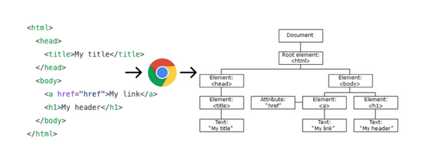

# React State

## Inleiding

`React props` worden gebruikt om data door te geven binnen de component tree in 1 richting (top - down). React properties zijn read-only. Properties worden enkel doorgegeven als een component gerendered wordt. Na de initiële render van een component kunnen de properties niet wijzigen.

`State` is het dynamische deel van een React component. Je geeft de initiële state van een component op maar deze kan wijzigen. Zo wordt het mogelijk om bvb een transactie te wijzigen, verwijderen,...  
Wanneer de state wijzigt (gebruikersinteractie, API call die data retourneert,...), past de UI zich aan (dit is waarom React 'so cool' is). Je kan dit vergelijken met een spreadsheet. Als 1 cel wijzigt, worden andere cellen aangepast. 

Stel je voor dat we een component renderen waarbij een stuk state initieel een lege array is (bvb een lege lijst van transacties). Later wordt deze array gevuld met gegevens (we voegen bvb. een transactie toe). Dit wordt een `state change` genoemd. Telkens wanneer we een React-component vertellen om zijn state te wijzigen (via een setState methode), zal de component zichzelf automatisch opnieuw rerenderen door aanroep van de render methode. De state kan ingesteld worden door de component zelf of een ander stukje code buiten de component. Het proces wordt hier gevisualiseerd:


`State` en `props` hebben een relatie. Als de state van een component tree wijzigt, wijzigen ook de props, die dienen om data door te geven aan een component. De nieuwe gegevens stromen door de boom, waardoor specifieke takken/bladen opnieuw gerendered worden om de nieuwe inhoud weer te geven.


## Virtual DOM
**DOM** is een in het geheugen van de browser opgeslagen boom van het HTML document. De browser DOM biedt een interface (API) om de nodes te bekijken en te wijzigen. De DOM trees zijn tegenwoordig enorm groot, en worden (zeker in geval van SPA's) constant aangepast. DOM bewerkingen zijn vaak traag.



React gebruikt een **Virtual DOM (VDOM)** als een extra abstractielaag bovenop de DOM. Het is een lokale en vereenvoudigde kopie van de browser DOM en staat los van de browser-specifieke implementatie. Deze wordt dan gesynchroniseerd met de browser DOM, waardoor echte DOM-updates worden verminderd. 


Als we de state in onze applicatie wijzigen, worden deze wijzigingen eerst toegepast op de VDOM. De React DOM-library wordt gebruikt om efficiënt te controleren welke delen van de UI echt visueel moeten worden bijgewerkt in de echte DOM. Dit proces wordt [`Reconciliation`](https://reactjs.org/docs/reconciliation.html) genoemd en is gebaseerd op deze stappen:
1. VDOM wordt bijgewerkt door een statuswijziging in de applicatie. In React is elk UI-stuk een component en elke component heeft een state. React volgt het `observable pattern` en luistert naar state changes. Wanneer de status van een component verandert, werkt React de virtuele DOM-structuur bij.
2. Nieuwe VDOM wordt vergeleken met een eerdere VDOM-snapshot(**diffing**)
3. Alleen de delen van de echte DOM worden bijgewerkt die zijn gewijzigd. Er is geen DOM-update als er niets is veranderd.


React volgt een batch-updatemechanisme om de browser DOM bij te werken. Dit leidt dus tot betere prestaties. Dit betekent dat updates voor de browser DOM in batches worden verzonden, in plaats van updates te verzenden voor elke afzonderlijke statuswijziging.

De kosten van virtuele DOM zijn veel minder duur, omdat het niet nodig is om ALLE elementen opnieuw te renderen. En dat maakt React super gaaf.

## Star Rating component
We implementeren de state in een Star Rating component.


Maak de file `StarRating.jsx` aan in de `src/components/places` folder.

```jsx
export default function StarRating() {
    return ();
}
```
Voor de weergave van de sterren maken we gebruik van [`react-icons`](https://react-icons.github.io/react-icons/). D.i. een npm library met 100den svg's onder de vorm van componenten. We maken gebruik van de Ionicons 5.

```bash
yarn add react-icons
```

[`yarn add`](https://yarnpkg.com/cli/add) voegt de package toe aan het project. De package wordt toegevoegd aan de `dependencies` in de `package.json` file en geïnstalleerd in de `node-modules` folder.

```jsx
import { IoStarSharp } from 'react-icons/io5'; //👈1

const Star = ()=> <IoStarSharp color="yellow"/> //👈2

export default function StarRating() {
    return (
      <> {/*👈4*/}
        {[...new Array(5)].map((_ )=><Star  />)}{/*👈3*/}
      </> 
      );
}
```

1. we maken gebruik van het IoStarSharp icon uit de Ionicons collectie
2. De `Star` component retourneert 1 gele ster. 
3. De `StarRating` component retourneert 5 sterren. We creëren een array met 5 entries en mappen elke entry naar een `Star` component.
4. React components mogen maar 1 element retourneren. We wrappen de elementen in een lege tag. Dit genereert geen extra DOM element.

Voeg de `StarRating` component toe aan `App.js`. [Run de app](http://localhost:3000/)
```jsx
import Transaction from './components/transactions/Transaction';
import TRANSACTION_DATA from './api/mock-data'; 
import StarRating from './components/places/StarRating';//👈

function App() {
    return (
        <div>
        {TRANSACTION_DATA.map(trans => 
            <Transaction {...trans}/> )}
            <StarRating/>//👈
        </div>
    );
}
export default App;
```

### keys
Als je de console opent in de browser, dan zie je onderstaande


Laten we de React "bril" opzetten. We nemen het voorbeeld van de lijst van transacties. TRANSACTION_DATA bevat 2 transacties. Dit is de initiele state van de app. Zo worden de transacties gerendered.

```html
<div class="text-bg-dark">Benjamin gaf €-200 uit bij Dranken Geers</div>
<div class="text-bg-dark">Benjamin gaf €1500 uit bij Loon</div>
```

Stel dat we de array TRANSACTION_DATA aanpassen en een nieuw item achteraan toevoegen. React reageert op een state change door het maken van een VDOM. Na de diff kan React makkelijk zien dat er achteraan een item is toegevoegd. 

```html
<div class="text-bg-dark">Benjamin gaf €-200 uit bij Dranken Geers</div>
<div class="text-bg-dark">Benjamin gaf €1500 uit bij Loon</div>
<div class="text-bg-dark">Benjamin gaf €100 uit bij HoGent</div>
```

Maar wat als we het item vooraan in de array toevoegen? De weergave wordt

```html
<div class="text-bg-dark">Benjamin gaf €100 uit bij HoGent</div>
<div class="text-bg-dark">Benjamin gaf €-200 uit bij Dranken Geers</div>
<div class="text-bg-dark">Benjamin gaf €1500 uit bij Loon</div>
```

Is de lijst nu niet volledig gewijzigd???? Dit is waarom de `key` property belangrijk is. Het `key` property helpt React om snel de kinderen in de oorspronkelijke boom te identificeren en te vergelijken met kinderen in de volgende boom. Het voorbeeld met het `key` property ziet er als volgt uit
```html
<div class="text-bg-dark" key="1">Benjamin gaf €-200 uit bij Dranken Geers</div>
<div class="text-bg-dark" key="2">Benjamin gaf €1500 uit bij Loon</div>
```

Met het toegevoegde item ziet de daaropvolgende boom er als volgt uit:
```html
<div class="text-bg-dark" key="3">Benjamin gaf €100 uit bij HoGent</div>
<div class="text-bg-dark" key="1">Benjamin gaf €-200 uit bij Dranken Geers</div>
<div class="text-bg-dark" key="2">Benjamin gaf €1500 uit bij Loon</div>
```

Keys helpen React bepalen welke items zijn gewijzigd, toegevoegd of verwijderd. Er moeten sleutels worden gegeven aan de elementen om de elementen een "stabiele identiteit" te geven.

`App.js` passen we als volgt aan

```jsx
import Transaction from './components/transactions/Transaction';
import TRANSACTION_DATA from './api/mock-data'; 
import StarRating from './components/places/StarRating';

function App() {
    return (
        <div>
            {TRANSACTION_DATA.map((trans, index) => 
              <Transaction  {...trans} key={index}/>)} {/*👈*/}
            <StarRating/>
        </div>
    );
}
export default App;
```

Gebruik voorlopig de index als key. Vervang dit, éénmaal de data wordt opgevraagd uit de REST API, door de id van de transactie. In de React-documentatie staat dat de index key niet wordt aanbevolen wanneer de volgorde van items kan veranderen. Het heeft een negatieve invloed op de prestaties en kan problemen veroorzaken met de component state.[Index als een key is een anti-pattern](https://medium.com/geekculture/reactjs-why-index-as-a-key-is-an-anti-pattern-4b9dc6ef0067)

Oefening: Pas ook `StarRating.jsx` aan.

### een variabel aantal sterren

```jsx
import { IoStarSharp } from 'react-icons/io5'; 

const Star = ()=> <IoStarSharp color="yellow"/> 

export default function StarRating({totalStars=5}) { //👈2
    return (
      <> 
        {[...new Array(totalStars)].map((_, i )=><Star key={i} />)}{/*👈1*/}
      </> 
      );
}
```

1. We maken het aantal sterren variabel
2. en voegen een prop totalStars toe met een default waarde.
Als we de    Dit is hoe onze originele boom eruit zal zien wanneer we dit voor het eerst implementeren

### de kleur van de sterren kan verschillen
Ook de kleur van de ster kan verschillen. 

```jsx
import { IoStarSharp } from 'react-icons/io5'; 

const Star = ({selected=false})=> <IoStarSharp color={selected?'yellow':'grey'}/> //👈

export default function StarRating({totalStars=5}) { 
    return (
      <> 
        {[...new Array(totalStars)].map((_, i )=><Star key={i} />)}
      </> 
      );
}
```

[Voer de code uit](http://localhost:3000/)

### useState hook


Zeker toevoegen: https://mokkapps.de/blog/debug-why-react-re-renders-a-component/  - React DevTools uitleggen!!!
https://meganslo.medium.com/why-is-reacts-key-prop-important-b6bd51124270#ab2d

https://programmingwithmosh.com/javascript/react-lifecycle-methods/

A rendering in React is caused by
changing the state,
passing props,
using Context API