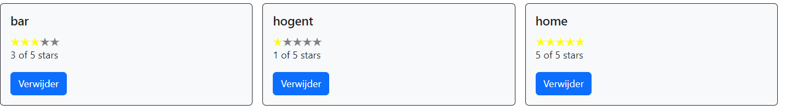

# React State

## Inleiding

[`React props`](https://beta.reactjs.org/learn/passing-props-to-a-component) worden gebruikt om data door te geven binnen de component tree in 1 richting (top - down). React props zijn [immutable](https://en.wikipedia.org/wiki/Immutable_object). Wanneer een component zijn props moet wijzigen (bijvoorbeeld als reactie op een gebruikersinteractie), zal het zijn parent component moeten "vragen" om de nieuwe waarden van de props door te geven - een nieuw object!

[`State`](https://beta.reactjs.org/learn/state-a-components-memory) is het dynamische deel van een React component. Een component kan zo bepaalde informatie bijhouden en wijzigen in reactie op interacties. Wanneer de state wijzigt (gebruikersinteractie, API call die data retourneert,...), past de UI zich aan (dit is waarom React 'so cool' is). Je kan dit vergelijken met een spreadsheet. Als 1 cel wijzigt, worden andere cellen aangepast. 

Stel je voor dat we een component renderen waarbij een stuk state initieel een lege array is (bvb een lege lijst van transacties). Later wordt deze array gevuld met gegevens (we voegen bvb. een transactie toe). Dit wordt een `state change` genoemd. Telkens wanneer we een React-component vertellen om zijn state te wijzigen (via een `setState` methode), zal de component zichzelf automatisch opnieuw rerenderen door aanroep van de `render` methode. De state kan ingesteld worden door de component zelf of een ander stukje code buiten de component. Het proces wordt hier gevisualiseerd:


`State` en `props` zijn verschillend, maar ze werken samen. Een parent component houdt vaak data in `state` bij zodat wanneer dit wijzigt dit doorgegeven kan worden als `props` naar de child componenten.


## Virtual DOM
**DOM** is een in het geheugen van de browser opgeslagen boom van het HTML document. De browser DOM biedt een interface (API) om de nodes te bekijken en te wijzigen. De DOM trees zijn tegenwoordig enorm groot, en worden (zeker in geval van SPA's) constant aangepast. DOM bewerkingen zijn vaak traag.


React gebruikt een **Virtual DOM (VDOM)** als een extra abstractielaag bovenop de DOM. Het is een lokale en vereenvoudigde kopie van de browser DOM en staat los van de browser-specifieke implementatie. Deze wordt dan gesynchroniseerd met de browser DOM, waardoor echte DOM-updates worden verminderd. 


Als we de state in onze applicatie wijzigen, worden deze wijzigingen eerst toegepast op de VDOM. De React DOM-library wordt gebruikt om efficiënt te controleren welke delen van de UI echt visueel moeten worden bijgewerkt in de echte DOM. Dit proces wordt [`Reconciliation`](https://reactjs.org/docs/reconciliation.html) genoemd en is gebaseerd op deze stappen:
1. VDOM wordt bijgewerkt door een statuswijziging in de applicatie. In React is elk UI-stuk een component en elke component heeft een state. React volgt het `observable pattern` en luistert naar state changes. Wanneer de status van een component verandert, werkt React de virtuele DOM-structuur bij.
2. Nieuwe VDOM wordt vergeleken met een eerdere VDOM-snapshot(**diffing**)
3. Alleen de delen van de echte DOM worden bijgewerkt die zijn gewijzigd. Er is geen DOM-update als er niets is veranderd.


React volgt een batch-updatemechanisme om de browser DOM bij te werken. Dit leidt dus tot betere prestaties. Dit betekent dat updates voor de browser DOM in batches worden verzonden, in plaats van updates te verzenden voor elke afzonderlijke statuswijziging.

De kosten van virtuele DOM zijn veel minder duur, omdat het niet nodig is om ALLE elementen opnieuw te renderen. En dat maakt React super gaaf.

## De applicatie - Overview of the places
Deze component zal een lijst van plaatsen tonen. Elke plaats bevat een naam en een rating. De rating kan worden aangepast door het klikken op een ster.
De UI ziet er als volgt uit



De JSON API retourneert onderstaande data. Pas hiervoor `mock-data.js` in de `api` folder aan.

```javascript
const TRANSACTION_DATA = [...];

const PLACE_DATA = [
    { id: 1, name: 'home', rating: 5 },
    { id: 4, name: 'hogent', rating: 1 },
    { id: 7, name: 'bar', rating: 3 },
    ];//👈1

export {TRANSACTION_DATA, PLACE_DATA};//👈2
```

1. Voeg de mock data voor places toe
2. Pas de export instructie aan. Merk op dat we nu een foutmelding krijgen als we de app runnen. Wat dient er te worden aangepast?

Inderdaad. In `App.js` vervangen we het import statement van TRANSACTION_DATA door
```jsx
import {TRANSACTION_DATA} from './api/mock-data'; 
```
Voor de verdere ontwikkeling van deze UI dienen we onderstaande vragen te beantwoorden. Neem hiervoor eerst [Thinking in React: start with the mockup, step 1, 3 en 4](https://beta.reactjs.org/learn/thinking-in-react) door.

- In welke componenten kunnen we de UI opdelen?
- Welke props, state hebben we nodig?
- In welke component houden we de state bij?

## PlacesList component
Maak een file `PlacesList.jsx` aan in de folder `src\components\places`. Deze component zorgt voor de weergave van alle plaatsen. We maken reeds gebruik van de Place component voor weergave van 1 plaats. Deze component maken we verder aan.

```jsx
import {PLACE_DATA} from '../../api/mock-data';
import Place from './Place';

const PlacesList = () => {
  const places = PLACE_DATA;
  return (
    <div className="grid mt-3">
      <div className="row row-cols-1 row-cols-md-2 row-cols-lg-3 row-cols-xxl-4 g-3">
        {places
          .sort((a, b) =>
            a.name.toUpperCase().localeCompare(b.name.toUpperCase())
          )
          .map((p) => (
            <div className="col">
              <Place {...p} />
            </div>
          ))}
      </div>
    </div>
  );
}

export default PlacesList;
```
## Place component
We implementeren de Place component, voorlopig nog zonder rating. Deze component geeft de 'card' van 1 plaats weer. Maak de file `Place.jsx` aan in de `src/components/places` folder.

```jsx
const Place = ({ id, name, rating }) => {
  	return (
      <div className="card bg-light border-dark mb-4">
        <div className="card-body">
          <h5 className="card-title">{name}</h5>
        </div>
      </div>
	  );
}

export default Place;
```

Voeg de `PlacesList` component toe aan `App.js`. [Run de app](http://localhost:3000/)

```jsx
import Transaction from './components/transactions/Transaction';
import {TRANSACTION_DATA} from './api/mock-data'; //👈
import PlacesList from './components/places/PlacesList';//👈

function App() {
    return (
        <div>
        {TRANSACTION_DATA.map(trans => 
            <Transaction {...trans}/> )}
            <PlacesList/>{/*👈*/}
        </div>
    );
}
export default App;
```

### keys
Als je de console opent in de browser, dan zie je onderstaande


Laten we de React "bril" opzetten. We nemen het voorbeeld van de lijst van transacties. TRANSACTION_DATA bevat 2 transacties. Dit is de initiele state van de app. Zo worden de transacties gerenderd.

```html
<div class="text-bg-dark">Benjamin gaf €-200 uit bij Dranken Geers</div>
<div class="text-bg-dark">Benjamin gaf €1500 uit bij Loon</div>
```

Stel dat we de array TRANSACTION_DATA aanpassen en een nieuw item achteraan toevoegen. React reageert op een state change door het maken van een VDOM. Na de diff kan React makkelijk zien dat er achteraan een item is toegevoegd. 

```html
<div class="text-bg-dark">Benjamin gaf €-200 uit bij Dranken Geers</div>
<div class="text-bg-dark">Benjamin gaf €1500 uit bij Loon</div>
<div class="text-bg-dark">Benjamin gaf €100 uit bij HoGent</div>
```

Maar wat als we het item vooraan in de array toevoegen? De weergave wordt

```html
<div class="text-bg-dark">Benjamin gaf €100 uit bij HoGent</div>
<div class="text-bg-dark">Benjamin gaf €-200 uit bij Dranken Geers</div>
<div class="text-bg-dark">Benjamin gaf €1500 uit bij Loon</div>
```

Is de lijst nu niet volledig gewijzigd???? Dit is waarom de `key` property belangrijk is. De `key` property helpt React om snel de kinderen in de oorspronkelijke boom te identificeren en te vergelijken met kinderen in de volgende boom. Het voorbeeld met de `key` property ziet er als volgt uit
```html
<div class="text-bg-dark" key="1">Benjamin gaf €-200 uit bij Dranken Geers</div>
<div class="text-bg-dark" key="2">Benjamin gaf €1500 uit bij Loon</div>
```

Met het toegevoegde item ziet de daaropvolgende boom er als volgt uit:
```html
<div class="text-bg-dark" key="3">Benjamin gaf €100 uit bij HoGent</div>
<div class="text-bg-dark" key="1">Benjamin gaf €-200 uit bij Dranken Geers</div>
<div class="text-bg-dark" key="2">Benjamin gaf €1500 uit bij Loon</div>
```

Keys helpen React bepalen welke items zijn gewijzigd, toegevoegd of verwijderd. Er moeten sleutels worden gegeven aan de elementen om de elementen een "stabiele identiteit" te geven.

`App.js` passen we als volgt aan

```jsx
import Transaction from './components/transactions/Transaction';
import {TRANSACTION_DATA} from './api/mock-data'; 
import PlacesList from './components/places/PlacesList';

function App() {
    return (
        <div>
            {TRANSACTION_DATA.map((trans, index) => 
              <Transaction  {...trans} key={index}/>)} {/*👈*/}
            <PlacesList />
        </div>
    );
}
export default App;
```

Gebruik voorlopig de index als key. Vervang dit, éénmaal de data wordt opgevraagd uit de REST API, door de id van de transactie. In de React-documentatie staat dat de index key niet wordt aanbevolen wanneer de volgorde van items kan veranderen. Het heeft een negatieve invloed op de prestaties en kan problemen veroorzaken met de component state. [Index als een key is een anti-pattern](https://medium.com/geekculture/reactjs-why-index-as-a-key-is-an-anti-pattern-4b9dc6ef0067)

Oefening: Pas ook `PlacesList.jsx` aan. Maak gebruik van de id. 
Merk op: plaats de key bij de parent tag die herhaald wordt.

## Star Rating component
Maak de file `StarRating.jsx` aan in de `src/components/places` folder.

```jsx
export default function StarRating() {
    return ();
}
```
Voor de weergave van de sterren maken we gebruik van [`react-icons`](https://react-icons.github.io/react-icons/). D.i. een npm library met 100den svg's onder de vorm van componenten. We maken gebruik van de Ionicons 5.

```bash
yarn add react-icons
```

[`yarn add`](https://yarnpkg.com/cli/add) voegt de package toe aan het project. De package wordt toegevoegd aan de `dependencies` in de `package.json` file en geïnstalleerd in de `node-modules` folder.  
De implementatie van de StarRating component: 

```jsx
import { IoStarSharp } from 'react-icons/io5'; //👈1

const Star = ()=> <IoStarSharp color="yellow"/> //👈2

export default function StarRating() {
    return (
      <> {/*👈4*/}
        {[...new Array(5)].map((_, i )=><Star key={i}/>)}{/*👈3*/}
      </> //👈4
      );
}
```

1. we maken gebruik van het IoStarSharp icon uit de Ionicons collectie
2. De `Star` component retourneert 1 gele ster. 
3. De `StarRating` component retourneert 5 sterren. We creëren een array met 5 entries en mappen elke entry naar een `Star` component. We voegen ook een key attribuut toe. Hier gebruiken we de index.
4. React components mogen maar 1 element retourneren. We wrappen de elementen in een lege tag. Dit genereert geen extra DOM element.

Oefening: Voeg de StarRating component toe aan de Place component en [Run de app](http://localhost:3000/)
.
### Een variabel aantal sterren

```jsx
import { IoStarSharp } from 'react-icons/io5'; 

const Star = ()=> <IoStarSharp color="yellow"/> 

export default function StarRating({totalStars=5}) { //👈2
    return (
      <> 
        {[...new Array(totalStars)].map((_, i )=><Star key={i} />)}{/*👈1*/}
      </> 
      );
}
```

1. We maken het aantal sterren variabel
2. en voegen een prop `totalStars` toe met een default waarde.

### De kleur van de sterren kan verschillen
Ook de kleur van de ster kan verschillen. Hiervoor voegen we een `selected prop` toe.

```jsx
import { IoStarSharp } from 'react-icons/io5'; 

const Star = ({selected=false})=> <IoStarSharp color={selected?'yellow':'grey'}/> //👈

export default function StarRating({totalStars=5}) { 
    return (
      <> 
        {[...new Array(totalStars)].map((_, i )=><Star key={i} />)}
      </> 
      );
}
```

### De rating van een 'place' bepaalt het aantal geselecteerde sterren

De `Place` component krijgt via een prop de `rating` door van de parent en zal die informatie moeten doorgeven aan de `StarRating` component. 

```jsx
import StarRating from './StarRating';//👈1

const Place = ({ id, name, rating }) => {
  	return (
    <div className="card bg-light border-dark mb-4">
      <div className="card-body">
        <h5 className="card-title">{name}</h5>
        <StarRating
          selectedStars={rating}
        />{/*👈2*/}
      </div>
    </div>
	);
}

export default Place;
```

1. Importeer de StarRating component
2. Via de prop `selectedStars` wordt de informatie doorgegeven aan de `StarRating`component.

De `StarRating` component zal die informatie via de prop `selected` doorgeven aan de `Star` component

```jsx
import { IoStarSharp } from 'react-icons/io5'; 

const Star = ({selected=false})=> <IoStarSharp color={selected?'yellow':'grey'}/>

export default function StarRating({ totalStars=5, selectedStars=0}) { //👈1
    return (
      <> 
        {[...new Array(totalStars)].map((_, i )=><Star key={i} selected={selectedStars > i} />)}{/*👈2*/}
        <p>{selectedStars} of {totalStars} stars</p>{/*👈3*/}
      </> 
    );
}
```

1. `selectedStars` wordt als prop meegegeven
2. een ster is geselecteerd als de rating groter is dan de index
3. we geven ook informatie weer over het aantal geselecteerde sterren.
[Voer de code uit](http://localhost:3000/)

## Interactiviteit toevoegen
In React kunnen we gebruik maken van event handlers in JSX.   
Neem het artikel Responding to Events](https://beta.reactjs.org/learn/responding-to-events) door.

Samenvatting
- `DOM events` worden gegenereerd door de browser(zoals klikken op knop, wijzigen van tekst input,...). Alle browsers voorzien in een 'event based programming model'.
- Built-in componenten zoals een Button supporteren enkel browser events zoals onClick. Maar ook aan je eigen componenten kan je `event handler props` toevoegen die je benoemt zoals je wil. 
- Het afhandelen van events met React-elementen lijkt op het afhandelen van events van DOM-elementen. Er zijn enkele verschillen:
  - React-gebeurtenissen worden benoemd met camelCase in plaats van kleine letters.
  - Met JSX geef je een functie door als event handler en niet een string. Je mag de functie ook niet aanroepen.
  - In de browser retourneer je false om het standaard click gedrag te voorkomen. In React moet je preventDefault expliciet aanroepen. 
  - Een voorbeeld
    ```html
    <button onclick="handleClick()"/>
    ```
    ```jsx
    <button onClick={handleClick}/>
    ```
- 'By convention' starten `event handler props` met `on` gevolgd door een hoofdletter
- 'By convention', starten `event handlers` met 'handle' gevolgd door de naam van het event.
 - Een eventhandler in `React` heeft als argument een cross-browser native event wrapper, nl het [`SyntheticEvent`](https://reactjs.org/docs/events.html).
- Event handlers definieer je meestal binnen een component zodat ze toegang hebben tot de props en state
- Je kan een event handler definiëren in een parent en doorgeven als een prop aan een child component

Oefening: Voeg een event handler toe aan de StarRating Component. Als je klikt op een ster, geef in de console 'you clicked a star' weer.

```jsx
import { IoStarSharp } from 'react-icons/io5'; 

const Star = ({selected=false})=> {
  //👇1
  const handleClick = (e)=> {
    console.log("you clicked a star");
  }

  return (
    <IoStarSharp color={selected?'yellow':'grey'} onClick={handleClick}/> //👈2
  );
}


export default function StarRating({ totalStars=5, selectedStars=0}) { 
    return (
      <> 
        {[...new Array(totalStars)].map((_, i )=><Star key={i} selected={selectedStars > i} />)}
        <p>
          {selectedStars} of {totalStars} stars
        </p>
      </> 
    );
}
```

1. Definieer een functie `handleClick`, die het `onClick` event zal afhandelen toe aan de component. 'By convention' starten event handlers met `handle` gevolgd door het event. `React` voorziet in een cross-browser native event wrapper, nl het `SyntheticEvent`.
2. Voorzie de prop `onClick` en geef de event handler functie mee.
[Voer de code uit](http://localhost:3000/)

## State toevoegen


Als we klikken op een ster, moet de kleur worden aangepast. Het aantal geselecteerde sterren dient in `state`te worden bijgehouden. Dit doen we aan de hand van de `useState` hook.

Neem [Updating the screen](https://beta.reactjs.org/learn#updating-the-screen) door.

`Hooks` zijn functies waarmee je React-state en lifecycle features kan inhaken("hook into") aan functional components.  

Pure functional components zijn eenvoudig. Ze veroorzaken geen neveneffecten, ze renderen JSX gegeven een aantal properties. Via hooks kunnen state en effecten worden toegevoegd aan functional components.

`Hooks` zijn functies die beginnen met 'use' en die zo ook herbruikbare code mogelijk maken. React bevat een aantal `built-in hooks`. Je kan ook je eigen `custom hooks` bouwen.

De [`useState`](https://reactjs.org/docs/hooks-reference.html#usestate) hook wordt gebruikt om een component stateful te maken. 


### Toevoegen van state aan de StarRating component
We starten met het bijhouden van de state in de `StarRating` component. Later verplaatsen we de state naar de parent.

```jsx
import { useState } from 'react';//👈1
import { IoStarSharp } from 'react-icons/io5'; 

const Star = ({selected=false,  onRate = f=>f})=> {//👈5

  const handleClick = (e)=> {
    onRate(); //👈6
  }

  return (
    <IoStarSharp color={selected?'yellow':'grey'} onClick={handleClick}/> 
  );
}

export default function StarRating({ totalStars=5, selectedStars=0}) { 
    const [rating, setRating] = useState(selectedStars);//👈2

    return (
      <> 
        {[...new Array(totalStars)].map((_, i )=><Star key={i} selected={rating > i} 
         onRate={()=> setRating(i+1)}/>)} {/*👈3 en 4*/}
        <p>
          {selectedStars} of {totalStars} stars
        </p>
      </> 
    );
}

```

1. Importeer de `useState` hook beschikbaar in de `react` package
2. Met de useState hook kan je slechts 1 state variabele (van welk type ook) declareren, hier de state variabele `rating`. De useState functie neemt de initiële state ('selectedStars' sterren geselecteerd) als parameter en geeft een array terug. De array bevat 
  - als `eerste element` de `state-variabele`, 
  - het `tweede element` is de `functie om de waarde van de state-variabele bij te werken`, waardoor de component opnieuw gerenderd zal worden.   
  Door gebruik te maken van 'array destructuring' kunnen we zelf de naam van de variabele en de set functie instellen.
3. Via de selected prop geven we door of de ster al dan niet geselecteerd is.
4. Als de gebruiker een ster selecteert dient de methode `setRating` te worden aangeroepen om de state aan te passen. Dus interacties van de gebruiker in een kind component dienen de state in een parent aan te passen. We moeten de functie uit de parent `setRating` doorgeven aan de child component. Hiervoor voegen we een prop `onRate` toe
5. Props worden doorgegeven van de parent aan de child component. We voegen een `onRate` prop toe aan de `Star` component. Di een functie met default value 'f=>f'. Di een fake functie die niets doet, het retourneert gewoon het argument dat het ontvangen heeft.
6. Nu moet deze functie opgeroepen worden als de gebruiker op de ster klikt.
[Bekijk het resultaat](http://localhost:3000) en klik op de sterren.

De code van de Star kunnen we refactoren
```jsx

const Star = ({selected=false,  onRate = f=>f})=> 
    <IoStarSharp color={selected?'yellow':'grey'} onClick={onRate}/> //👈
```

### Render en commit
Alvorens de componenten getoond worden op het scherm, moeten ze gerenderd worden door React. Elke screen update in React gebeurt in 3 stappen
1. Trigger
2. Render
3. Commit

Lees [Render and commit](https://beta.reactjs.org/learn/render-and-commit).  
Een visuele weergave: [A Visual Guide to React Rendering - It Always Re-renders](https://alexsidorenko.com/blog/react-render-always-rerenders/)

### State snapshot
Lees [State as a snapshot](https://beta.reactjs.org/learn/state-as-a-snapshot) en [Queueing a Series of State Updates](https://beta.reactjs.org/learn/queueing-a-series-of-state-updates)

### Liften van de state
De `PlacesList` component houdt de places bij in state. Indien de rating van een plaats wordt aangepast, dan moet de state in de `PlacesList` component worden aangepast, de rating van de bijhorende plaats dient te worden aangepast. Dit betekent dat we de state niet langer bijhouden in de `StarRating` component, maar wel in de `PlacesList` component. Deze component zal dan ook een methode bevatten om de state aan te passen. Deze geven we samen met de state door aan de kind componenten.

```jsx
import {useState}  from 'react';
import {PLACE_DATA} from '../../api/mock-data';
import Place from './Place';

const PlacesList = () => {
  const [places, setPlaces] = useState(PLACE_DATA);

  //👇1
  const ratePlace = (id, rating) => {
    const newPlaces = places.map((p) => (p.id === id ? { ...p, rating } : p));
    setPlaces(newPlaces);
  };

  return (
    <>
    <h1>Places</h1>
    <div className="grid mt-3">
      <div className="row row-cols-1 row-cols-md-2 row-cols-lg-3 row-cols-xxl-4 g-3">
        {places
          .sort((a, b) =>
            a.name.toUpperCase().localeCompare(b.name.toUpperCase())
          )
          .map((p) => (
            <div className="col" key={p.id}>
              <Place {...p} onRate={ratePlace} /> {/*👈2/*}
            </div>
          ))}
      </div>
    </div>
    </>
  );
}

export default PlacesList;
```

1. Deze methode past de rating van een plaats aan. We mappen over de bestaande plaatsen en passen de rating van de plaats met opgegeven id aan. Meer op [Updating Objects in state](https://beta.reactjs.org/learn/updating-objects-in-state). Als we setPlaces aanroepen, wordt de state variabele `places` aangepast en zal de UI tree gerenderd worden met de nieuwe data.
2. We geven deze methode door aan de kinderen via de prop `onRate`. Zo kunnen de kinderen de rating van de plaats aanpassen als er op een ster geklikt wordt.

De `Place` component moet ook worden aangepast
```jsx
import StarRating from './StarRating';

const Place = ({ id, name, rating, onRate }) => { //👈1

  //👇2
   const handleRate = (newRate) => {
    onRate(id, newRate);
   }

  	return (
    <div className="card bg-light border-dark mb-4">
      <div className="card-body">
        <h5 className="card-title">{name}</h5>
        <StarRating
          selectedStars={rating}
          onRate={handleRate} 
        /> {/*👈3*/}
      </div>
    </div>
	);
  }

export default Place;
```
1. Place bevat nu ook een prop `onRate` 
2. `handleRate` zal het instellen van een nieuwe rate afhandelen. De nieuwe rating is hier al gekend. We geven ook de id van de plaats mee.
3. Het klikken op een ster worden lager in de boom afgehandeld. Dus moeten we deze methode doorgeven via een event handler prop `onRate`

De `StarRating`component wordt
```jsx
import { IoStarSharp } from 'react-icons/io5'; 

const Star = ({selected=false, onRate = (f)=>f})=> 
    <IoStarSharp color={selected?'yellow':'grey'} onClick={onRate}/> 

export default function StarRating({ totalStars=5, selectedStars=0, onRate}) { //👈3
    //const [rating, setRating] = useState(selectedStars);//👈1

    return (
      <> 
        {[...new Array(totalStars)].map((_, i )=><Star key={i} selected={ selectedStars > i} 
         onRate={()=> onRate(i+1)}/>)} {/*👈2 en 4*/}
        <p>
          {selectedStars} of {totalStars} stars
        </p>
      </> 
    );
}
```

1. verwijder de state 
2. vervang de variabele `rating` door `selectedStars`
3. `onRate` wordt via de props doorgegeven, samen met de andere props
4. Roep de methode aan in de event handler prop `onRate`.

### Oefening
Voeg een remove knop toe om een plaats te verwijderen. 

## React DevTools
Een rerendering wordt veroorzaakt door
- aanpassen van de state
- doorgeven van props
- de Context API (zie later)

[React DevTools](https://chrome.google.com/webstore/detail/react-developer-tools/fmkadmapgofadopljbjfkapdkoienihi) is een browser extensie die ons helpt bij het debuggen, profileren en monitoren van de uitvoering van onze React-app).

Open de Console en ga naar de tab `components`. Nu kan je de componenten en bijhorende props bekijken.

Klik op settings (naast de search bar) en vink 'highlight updates when components render' aan. Voeg een nieuwe transactie toe. ReactDev duidt de gererenderde componenten met een kleur aan. Het kleur is afhankelijk van de frequentie van de update van de componenten. Als een onderdeel heel regelmatig wordt bijgewerkt, wordt een rode kleurmarkering weergegeven, blauw zelden, groen af en toe, geel vaak.

## Een formulier toevoegen adhv controlled components
In HTML behouden formulier elementen zoals `input`, `textarea` en `select` doorgaans hun eigen status en werken deze bij op basis van gebruikersinvoer.  

In React wordt de veranderlijke status bewaard in de `state variabele` van componenten en alleen bijgewerkt met bijhorende `set`-functie. We moeten dus de state van het formulier bijhouden en bijwerken wanneer een veld in het formulier wordt gewijzigd. Dit noemt men [`controlled components`](https://reactjs.org/docs/forms.html#controlled-components).

We maken een component voor het toevoegen van transacties. Maak een file `TransactionForm.jsx` aan in de folder `src\components\transactions`. Dit bevat een formulier met 3 input velden en 1 select lijst

```jsx
import {PLACE_DATA} from '../../api/mock-data';

export default function TransactionForm(){
  return (
		<>
			<h2>
				Add transaction
			</h2>
			<form onSubmit={handleSubmit} className="w-50 mb-3">
				<div className="mb-3">
					<label htmlFor="date" className="form-label">Who</label>
					<input		
						id="user"
						type="text"
						className="form-control"
						placeholder="user" required
					/>
				</div>
				<div className="mb-3">
					<label htmlFor="date" className="form-label">Date</label>
					<input		
						id="date"
						type="date"
						className="form-control"
						placeholder="date"
					/>
				</div>

				<div className="mb-3">
					<label htmlFor="places" className="form-label">
						Place
					</label>
					<select
						id="places" 
						className="form-select"
						required
					>
						<option defaultChecked>-- Select a place --</option>
						{PLACE_DATA.map(({ id, name }) => (
							<option key={id} value={id}>{name}</option>
						))}
					</select>
				</div>

				<div className="mb-3">
					<label htmlFor="amount" className="form-label">
						Amount
					</label>
					<input				
						id="amount"
						type="number"
						className="form-control"
						required
					/>
				</div>

				<div className="clearfix">
					<div className="btn-group float-end">
						<button
							type="submit"
							className="btn btn-primary"
						>Add transaction</button>
					</div>
				</div>
			</form>
		</>
	);
}
```

Form elementen in React zijn read-only. Door `state` toe te voegen, kan de component zich aanpassen.

```jsx
import { useState } from 'react';
import {PLACE_DATA} from '../../api/mock-data';

//👇3
const toDateInputString = (date) => { 
	// ISO String without the trailing 'Z' is fine 🙄
	// (toISOString returns something like 2020-12-05T14:15:74Z,
	// datetime-local HTML5 input elements expect 2020-12-05T14:15:74, without the (timezone) Z)
	//
	// the best thing about standards is that we have so many to chose from!
	if (!date) return null;
	if (typeof date !== Object) {
		date = new Date(date);
	}
	let asString = date.toISOString();
	return asString.substring(0, asString.indexOf('T'));
};

export default function TransactionForm({onSaveTransaction}){//👈5
  const [user, setUser] = useState('');//👈1
  const [date, setDate] = useState(new Date());//👈1
  const [place, setPlace] = useState('home');//👈1
  const [amount, setAmount] = useState(0);//👈1

  //👇5
  const handleSubmit = (e) => {
    e.preventDefault();
    onSaveTransaction(user, place, amount, date);
    setUser('');
    setDate(new Date());
    setPlace('home');
    setAmount(0);
  };

  return (
		<>
			<h2>
				Add transaction
			</h2>
			<form onSubmit={handleSubmit} className="w-50 mb-3"> {/*👈5*/}
				<div className="mb-3">
					<label htmlFor="date" className="form-label">Who</label>
					<input		
						value={user}	
						onChange={(e) => setUser(e.target.value)} 
						id="user"
						type="text"
						className="form-control"
						placeholder="user" required
					/>{/*👈2 en 4*/}
				</div>
				<div className="mb-3">
					<label htmlFor="date" className="form-label">Date</label>
					<input		
						value={toDateInputString(date)}		
						onChange={(e) => setDate(e.target.value)} 
						id="date"
						type="date"
						className="form-control"
						placeholder="date"
					/>{/*👈2, 3 en 4*/}
				</div>

				<div className="mb-3">
					<label htmlFor="places" className="form-label">
						Place
					</label>
					<select
						value={place} 	
						onChange={(e) => setPlace(e.target.value)} 
						id="places" 
						className="form-select"
						required
					>{/*👈2 en 4*/}
						<option defaultChecked>-- Select a place --</option>
						{PLACE_DATA.map(({ id, name }) => (
							<option key={id} value={id}>{name}</option>
						))}
					</select>
				</div>

				<div className="mb-3">
					<label htmlFor="amount" className="form-label">
						Amount
					</label>
					<input				
						value={amount} 
						onChange={(e) => setAmount(e.target.value)}
						id="amount"
						type="number"
						className="form-control"
						required
					/>{/*👈2 en 4*/}
				</div>

				<div className="clearfix">
					<div className="btn-group float-end">
						<button
							type="submit"
							className="btn btn-primary"
						>Add transaction</button>
					</div>
				</div>
			</form>
		</>
	);
}
```

1. Voeg state toe voor elk input veld
2. Verbindt de input elementen met de component state via de `value` prop. 
3. De datum moeten we converteren naar het formaat YYYY-MM-DD. Plaats de functie `toDateInputString` buiten de component om performantieredenen. Anders wordt bij elke re-render de functie opnieuw aangemaakt.
4. Gebruik de `onChange` eventhandler om de user input op te vangen en de state aan te passen
5. Nu kunnen we het formulier submitten, door een handler toe te voegen. De transactie zal moeten toegevoegd worden aan de lijst van transacties die bijgehouden wordt in de parent. We voorzien dus een prop `onSaveTransaction` die de functie zal doorgeven uit de parent die dit realiseert.  
Later zien we hoe we validatie kunnen toevoegen en gebruik maken van form libraries. 


We refactoren eerst de code voor de transacties. Momenteel wordt de lijst van transacties gegenereerd in de `App` component. Het is beter om hier een aparte component `TransactionList` voor aan te maken.

```jsx
import TransactionList from './components/transactions/TransactionList';//*👈
import PlacesList from './components/places/PlacesList';

function App() {
    return (
        <div>
            <TransactionList />//*👈
            <PlacesList />
        </div>
    );
}
export default App;
```
1. importeer `TransactionList`en verwijder de andere niet gebruikte imports
2. het aanmaken van de lijst gebeurt nu door de `TransactionList`component

Maak een file `TransactionList.jsx`aan in de `src/components/transactions` folder waarin we de verwijderde code plaatsen.

```jsx
import Transaction from './Transaction';
import {TRANSACTION_DATA} from '../../api/mock-data'; 

export default function TransactionList() {
return (
  <>
    <h1>Transactions</h1>
    {TRANSACTION_DATA.map((trans, index) => 
      <Transaction {...trans} key={index} /> )}
  </>);
}
```

Nu voegen we state toe opdat de lijst van transacties kan wijzigen.

```jsx
import {useState} from 'react';//👈1
import Transaction from './Transaction';
import TransactionForm from './TransactionForm';//👈3
import {TRANSACTION_DATA} from '../../api/mock-data'; 

export default function TransactionList() {

const [transactions, setTransactions] = useState(TRANSACTION_DATA);//👈1

//👇2
const createTransaction = (user, place, amount, date) => {
  const newTransactions = [
    {
      user, place, amount, date: new Date(date),
    },
    ...transactions,
  ]; // newest first
  setTransactions(newTransactions);
  console.log("transactions", JSON.stringify(transactions));
  console.log("newtransactions", JSON.stringify(newTransactions));
};


return (
  <>
    <h1>Transactions</h1>
    <TransactionForm onSaveTransaction={createTransaction} />//👈'1'
    {transactions.map((trans, index) => //👈1
      <Transaction {...trans} key={index} /> )}
  </>);
}
```

1. we voegen state toe om de transacties te beheren. We overlopen `transactions` ipv `TRANSACTION_DATA`
2. De functie om een nieuwe transactie vooraan toe te voegen aan de lijst. 
3. Voeg de component `TransactionForm` toe.De methode om een transactie toe te voegen wordt als `prop` doorgegeven. Zo zal bij wijziging van de `state` de component opnieuw gerenderd worden.
4. Run de app en bekijk de console: `transactions` toont de nieuwe transactie niet:(. `newTransactions` toont de nieuwe transactie wel:). Meer uitleg op [State as a snapshot](https://beta.reactjs.org/learn/state-as-a-snapshot). `setState` is een asynchrone functie. We moeten dus gebruik maken van een constante `newTransaction`!!
 Willen we gebruik maken van de gewijzigde state dan moeten we gebruik maken van `useEffect`. Dit zien we in een later hoofdstuk.

## Oefening: SnakeEyes
SnakeEyes is het resultaat van het gooien van 2 dobbelstenen. Als op beide dobbelstenen 1 oog staat heb je 'SnakeEyes'. Bij de aanvang van het spel worden 2 dobbelstenen getoond met de waarde 6. Het aantal dobbelstenen is default 2, maar kan ook meer zijn. Telkens als de gebruiker op een dobbelsteen klikt wordt een random getal gegenereerd.  
Het `totaal` wordt met de waarde op de dobbelsteen verhoogd.  
Als de dobbelsteen één oog bevat, kan er niet meer op geklikt worden.
Als alle dobbelstenen één oog bevatten, dan heb je 'snakeeyes'. Er verschijnt een boodschap 'Oeps you did it again'. Het totaal wordt terug op 0 geplaatst. Nu kan je kiezen om opnieuw te spelen.   
`max total` bevat het maximaal aantal behaalde punten over alle spelen heen


  
### Oplossing
een voorbeeldoplossing (maar er zijn er uiteraard heel veel mogelijk) https://github.com/HOGENT-Web/SnakeEyes

## Mogelijke extra's voor de examenopdracht
[Redux Toolkit](https://redux-toolkit.js.org/)   
[Elf](https://github.com/ngneat/elf)    
[The new wave of React state management](https://frontendmastery.com/posts/the-new-wave-of-react-state-management/)    
Een alternatief state management framework...   

