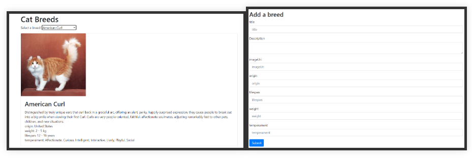

# Get your hooks into React

## Inleiding

**Componenten** zijn functies die de UI renderen. Het renderen gebeurt wanneer de app voor het eerst geladen wordt en wanneer state waarden wijzigen. Renderen van code moet "[puur](https://beta.reactjs.org/learn/keeping-components-pure)" zijn. Componenten mogen enkel 'hun' JSX retourneren en mogen objecten of variabelen die bestaan voor de rendering niet wijzigen (bv. geen nieuwe waarde toekennen aan props). Gegeven dezelfde input, dient het dezelfde output te retourneren. Net als een wiskundige formule zou het alleen het resultaat moeten berekenen, maar niets anders doen.

**Events** zijn functies binnen de component die worden uitgevoerd als reactie op een actie van een gebruiker. Een event handler kan state aanpassen, een HTTP post request uitvoeren om een transactie toe te voegen... Event handlers bevatten **side-effects** veroorzaakt door een interactie.

Soms is dit niet voldoende. Het ophalen van de transacties vanuit een REST API, dient sowieso te gebeuren en is niet gekoppeld aan een interactie van een gebruiker en mag ook niet gebeuren tijdens de rendering (anders is de component niet puur). Hiervoor kunnen we gebruik maken van de `useEffect` hook.

Effecten worden meestal gebruikt om uit je React-code te stappen en te synchroniseren met een extern systeem. Dit omvat browser API's, widgets van derden, netwerken... Ze voeren een **side-effect** uit.

## useEffect hook

`useEffect` is een functie die asynchroon wordt uitgevoerd na de render en die zichzelf optioneel kan opruimen (= **cleanup**) Het opruimen gebeurt voordat het effect opnieuw wordt uitgevoerd en voor de **unmounting** (= het vernietigen van de component). React onthoudt de functie die je hebt doorgegeven ​​(we noemen dit ons "effect") en roept het later op na het uitvoeren van de DOM-updates.

In onderstaand voorbeeld wordt er een boodschap naar de console gelogd als de `TransactionList` gerenderd is. Deze instructie zouden we na de return kunnen plaatsen, maar die code wordt niet uitgevoerd. `useEffect` is hier de oplossing.

```jsx
import {useEffect, useState} from 'react'; // 👈 1
import Transaction from './Transaction';
import TransactionForm from './TransactionForm';
import {TRANSACTION_DATA} from '../../api/mock-data'; 

export default function TransactionList() {
  const [transactions, setTransactions] = useState(TRANSACTION_DATA);

  // 👇 2
  useEffect(() => {
    console.log("transactions are rendered");
  });

  const createTransaction = (user, place, amount, date) => {
    const newTransactions = [
      {
        user, place, amount, date: new Date(date),
      },
      ...transactions,
    ]; // newest first
    setTransactions(newTransactions);
    console.log("transactions", JSON.stringify(transactions));
    console.log("newtransactions", JSON.stringify(newTransactions));
  };

  return (
    <>
      <h1>Transactions</h1>
      <TransactionForm onSaveTransaction={createTransaction} />
      {transactions.map((trans, index) => 
        <Transaction {...trans} key={index} /> )}
    </>);
  };
```

1. We maken hiervoor gebruik van `useEffect`.
2. Binnen de component roepen we de `useEffect` functie aan. We geven een **callback functie** mee als parameter. De functie die we meegeven wordt het `effect` genoemd. Wanneer React onze component rendert, onthoudt React het effect dat we hebben gedefinieerd en voert het het effect uit na het updaten van de DOM. Dit gebeurt default na elke render, ook na de eerste.

Start de app en bekijk de console. Voeg een transactie toe. We zien in de console dat `useEffect` na de initiële render en bij elke rerender wordt uitgevoerd.

> **Merk op:** React StrictMode (zie `index.js`) controleert of een component pure is door de component functie tweemaal aan te roepen. Dit gebeurt enkel in development mode, niet in productie. Dit is ook de reden waarom het loggen naar de console tweemaal gebeurt. Zie [Detecting impure calculations with StrictMode](https://beta.reactjs.org/learn/keeping-components-pure) en [Why does my calculation runs twice](https://beta.reactjs.org/apis/react/useMemo#my-calculation-runs-twice-on-every-re-render).

### Oefening

Voeg dezelfde code toe aan de TransactionForm component. Wat wordt er eerst gerenderd?

<!-- markdownlint-disable-next-line -->
+ Oplossing +

  De `TransactionForm` component wordt als eerste gerenderd en dan pas de `TransactionList`. Dit is logisch aangezien React eerst de kinderen rendert en zo omhoog beweegt tot aan de component die de render veroorzaakte.

### Effect dependencies

Stel dat we de boodschap enkel bij de initïele render wensen te loggen.

Aan de hand van een **dependency array** kan je het uitvoeren van een `useEffect` koppelen aan specifieke datawijzigingen. Zo voorkom je dat `useEffect` bij elke rerender opnieuw wordt uitgevoerd. Enkele voorbeelden:

- **[]**: een lege dependency array. `useEffect` wordt enkel bij de initiële render uitgevoerd

```jsx
useEffect(() => {
  console.log("transactions after the initial render");
}, [])
```

- **[transactions]**: `useEffect` wordt bij de initiele render en telkens de waarde van de variabele `transactions` wijzigt uitgevoerd. React zal het effect overslaan als `transactions` dezelfde waarde heeft als tijdens de laatste render.

```jsx
useEffect(() => {
  console.log("transactions after initial render or transaction added");
}, [transactions])
```

- **meerdere dependencies**: React zal het opnieuw uitvoeren van het effect alleen overslaan als alle dependencies die je opgeeft exact dezelfde waarden hebben als tijdens de vorige render.

Stel dat de user via een prop wordt doorgegeven aan de `TransactionList` en ook naar de console gelogd dient te worden.

```jsx
export default function TransactionList({ user = 'Louis' }){ // 👈 de prop user
  const [transactions, setTransactions] = useState(TRANSACTION_DATA);

  useEffect(() => {
      console.log(`Hi  ${user}, transactions after initial render or transaction added`); // 👈 maakt gebruik van user
  }, [transactions])// Warning: React Hook useEffect has a missing dependency

  //...
}
```

Merk op: je krijgt een waarschuwing van de linter (`React Hook useEffect has a missing dependency`) als de dependencies die je hebt opgegeven niet overeenkomen met wat ESLint (= een linter, zie een later hoofdstuk) verwacht op basis van de code in je effect. Dit helpt veel bugs in de code op te sporen. Als je effect een bepaalde waarde gebruikt, maar je het effect niet opnieuw wilt uitvoeren wanneer deze verandert moet je ervoor zorgen dat je effect geen gebruik maakt van deze dependency.

Oplossing:

```jsx
export default function TransactionList({ user = 'Louis' }) {
  const [transactions, setTransactions] = useState(TRANSACTION_DATA);

  useEffect(() => {
    console.log(`Hi ${user}, transactions after initial render or transaction added`);
  }, [transactions, user]) // 👈 meerdere dependencies

  // ..
```

React vergelijkt de dependency waarden met behulp van [Object.is](https://developer.mozilla.org/en-US/docs/Web/JavaScript/Reference/Global_Objects/Object/is). Voor arrays en objecten wordt hier bijgevolg gekeken naar de referentie!

### Clean up, indien nodig

Een side-effect kan een **clean-up functie** retourneren. React roept de clean-up functie elke keer aan voordat het effect opnieuw wordt uitgevoerd en een laatste keer wanneer de component wordt verwijderd (= on unmount).

Verwijder eerst de code m.b.t. de prop user en voeg dan een clean-up functie met een simpele `console.log` toe.

```jsx
export default function TransactionList() {
  const [transactions, setTransactions] = useState(TRANSACTION_DATA);

  useEffect(() => {
    console.log("transactions after initial render or transaction added");
    return () => console.log("unmounted..."); // 👈 de clean-up functie
  }, [transactions]);
```

Start de app en bekijk de console.

### Simulatie ophalen data uit REST API

We simuleren nu het ophalen van de transacties via de REST API. We maken hiervoor gebruik van de `setTimeout` functie.

```jsx
const [transactions, setTransactions] = useState([]); // 👈 1

useEffect(() => { // 👈 2
  setTimeout(() => {
    setTransactions(TRANSACTION_DATA);
    console.log("transactions fetched");
  }, 2000);
}, [])
```

1. Initieel is de lijst van transacties leeg
2. We halen de data op, eens ontvangen wordt de state aangepast waardoor de pagina opnieuw wordt gerenderd. Het ophalen van de data mag enkel gebeuren bij de initiële render. Waarom?

<!-- markdownlint-disable-next-line -->
+ Antwoord +
  
  We hoeven de data niet telkens opnieuw op te halen als de component rendert, de data is dan niet noodzakelijk gewijzigd. Zonder de lege dependency array worden alle transacties opnieuw opgehaald bij elke render.

In het volgende hoofdstuk zien we hoe we een request kunnen sturen naar een REST API, een loading indicator kunnen tonen en eventuele fouten kunnen weergeven.

### Regels voor hooks

Hooks zijn niet meer dan JavaScript functies. Echter moet je twee regels volgen wanneer je er gebruik van maakt. Je kan hiervoor een linter plugin installeren, dit gebeurt automatisch bij het gebruik van `create-react-app`.

- Gebruik hooks enkel op het top niveau. Gebruik hooks niet binnen een if, andere condities, loops of geneste functies.
  - Reden: React valt terug op de volgorde waarin hooks worden aangeroepen om een waarde terug te geven. React houdt dit bij in een array. De volgorde moet dezelfde zijn bij elke render. Benieuwd naar meer info? Lees verder in [The First Rule of React Hooks, In Plain English](https://itnext.io/the-first-rule-of-react-hooks-in-plain-english-1e0d5ae32009)
- Roep hooks enkel aan vanuit React functies. Dit wil zeggen: enkel vanuit function components of vanuit custom hooks.

Daarnaast zijn er nog enkele opmerkingen waarmee je rekening moet houden:

- Gebruik `useEffect` niet voor het aanbrengen van DOM-wijzigingen die zichtbaar zijn voor de gebruiker. Een `useEffect` wordt pas geactiveerd nadat de browser klaar is met de lay-out en het tekenen. Dit is dus te laat als je een visuele wijziging wilde aanbrengen. Voor die gevallen biedt React de hooks `useMutationEffect` en `useLayoutEffect` die op dezelfde manier werken als `useEffect`. Ze verschillen enkel in het moment van 'afvuren'.
- Hooks maken gebruik van closures. Let dus op voor stale closures. [Zie hier voor enkele voorbeelden](https://dmitripavlutin.com/react-hooks-stale-closures/)
- `useEffect` laat NIET toe om het keyword `async` toe te voegen in de callback function, zie een volgend hoofdstuk voor een oplossing

Voor extra uitleg en voorbeelden: [Synchronizing with Effects](https://beta.reactjs.org/learn/synchronizing-with-effects)

## Verbeteren van de performantie

In een React-toepassing worden componenten heel vaak gerenderd. De performantie kan je verbeteren door het voorkomen van onnodige renders en het verminderen van de tijd die een render in beslag neemt.

Een oplossing voor dit probleem is **memoization**. Wikipedia geeft hiervoor volgende definitie:

> In computing, memoization or memoisation is an optimization technique used primarily to speed up computer programs by storing the results of expensive function calls and returning the cached result when the same inputs occur again.

React biedt een paar vormen van memoization:

- `memo`: creatie van pure componenten (let op: dit is **geen** hook)
- `useMemo`: retourneert een memoized **waarde**
- `useCallback`: retourneert een memoized **functie**

### useMemo hook

`useMemo` is een React Hook waarmee je het resultaat van een berekening tussen re-renders kan cachen.

In onderstaand voorbeeld voegen we een zoekfunctie toe om de transacties te filteren o.b.v. de plaats. Voeg deze code toe aan de `TransactionList` component:

```jsx
import {useState} from 'react';
import Transaction from './Transaction';
import TransactionForm from './TransactionForm';
import {TRANSACTION_DATA} from '../../api/mock-data'; 

export default function TransactionList() {
  const [transactions, setTransactions] = useState(TRANSACTION_DATA);
  const [text, setText] = useState(''); // 👈 1
  const [search, setSearch] = useState(''); // 👈 1

  // 👇 2
  const filteredTransactions = transactions.filter((t) => {
    console.log("filtering...");
    return t.place.toLowerCase().includes(search.toLowerCase());
  });

  const createTransaction = (user, place, amount, date) => {
    const newTransactions = [
      {
        user, place, amount, date: new Date(date),
      },
      ...transactions,
    ]; // newest first
    setTransactions(newTransactions);
  };

  return (
    <>
      <h1>Transactions</h1>
      <TransactionForm onSaveTransaction={createTransaction} />

      <div className="input-group mb-3 w-50"> {/* 👈 3 */}
        <input
          type="search"
          id="search"
          className="form-control rounded"
          placeholder="Search"
          value={text}
          onChange={(e) => setText(e.target.value)} />
        <button
          type="button"
          className="btn btn-outline-primary"
          onClick={() => setSearch(text)}
        >
          Search
        </button>
      </div>

      {filteredTransactions.map((trans, index) => // 👈 4
        <Transaction {...trans} key={index} /> )}
    </>);
  };
```

1. De filtering mag enkel gebeuren als de gebruiker op search klikt, niet bij ingave van een letter in het zoekveld (vandaar de twee state variabelen).
2. We maken een functie voor het filteren van de transacties.
3. We voegen een formulier met zoekveld en -knop toe.
4. We tonen enkel de gefilterde transacties.

Bij elk karakter dat de gebruiker ingeeft in het zoekveld wordt de state aangepast, de component opnieuw gerenderd, de filter-functie uitgevoerd. Hoewel de output ongewijzigd blijft tot we op de knop klikken en effectief zoeken. Dit kan je oplossen door gebruik te maken van `useMemo`. Hiermee kan React de returnwaarde van de zoekfunctie onthouden en zal het deze functie enkel en alleen uitvoeren als de dependencies gewijzigd zijn. In onderstaand voorbeeld wordt de filter pas uitgevoerd bij het laden van de component en bij het klikken op `Search`.

```jsx
import {useState, useMemo} from 'react'; // 👈

//...

const filteredTransactions = useMemo(() => transactions.filter((t) =>{ // 👈
  console.log("filtering...");
  return t.place.toLowerCase().includes(search.toLowerCase());
}),[search, transactions]);

//...
```

Je moet twee parameters doorgeven aan de `useMemo` functie:

1. een **calculation function** die het resultaat van de berekening retourneert. Het resultaat van die functie wordt bijgehouden in de cache, **niet** de functie zelf.
2. een **dependency array** die elke waarde bevat waarnaar verwezen wordt in de calculation function.

Bij elke volgende render vergelijkt React de dependencies met de dependencies die je tijdens de laatste render hebt doorgegeven. Als geen van de dependencies is gewijzigd, retourneert `useMemo` de waarde die al eerder werd berekend. Anders zal React de berekening opnieuw uitvoeren en de nieuwe waarde retourneren.

#### Oefening

Probeer de challenges op [https://beta.reactjs.org/learn/keeping-components-pure](https://beta.reactjs.org/learn/keeping-components-pure).

### React.memo en pure functions

Voeg een `console.log` instructie toe voor elke `return` in onderstaande componenten:

```jsx
export default function TransactionList() {
  ...
  console.log('Rendering transactionlist...');
  return (...);
}

export default function Transaction(props) {
  ...
  console.log('Rendering transaction...');
  return (...);
}

export default function TransactionForm({places, onRate}) {
  ...
  console.log('Rendering TransactionForm ...');
  return (...);
} 
```

Telkens als we een letter ingeven in het zoekveld worden alle componenten gererenderd, hoewel er niets wijzigt aan de output van de component. De `Transaction` component heeft als prop een transaction en deze blijft ongewijzigd als de gebruiker een letter ingeeft in het zoekveld. Toch wordt de component gererenderd.

Een **pure component** is een component die gegeven dezelfde props dezelfde output genereert. `Transaction` is een pure component. Gegeven dezelfde props, wordt dezelfde output gegenereerd. We willen een pure component niet opnieuw renderen als de properties niet gewijzigd zijn. De `memo` functie wordt gebruikt om een component te creëren die enkel zal rerenderen als de props wijzigen.

```jsx
import {memo} from 'react'; // 👈
export default memo(function Transaction(props) { // 👈
  const { user, amount, place} = props; 
  console.log('Rendering transaction...');
  return <div className="text-bg-dark" style={{ width: '50%' }}>{user} gaf €{amount} uit bij {place}</div>;
});
```

Start de app en bekijk de console. Ook `TransactionForm` is een pure component en dient enkel gererenderd te worden als zijn state wordt aangepast.

#### Oefening

Cache de `TransactionForm` component en bekijk de app opnieuw. Als we een letter ingeven wordt de component nog steeds opnieuw gerenderd. Hoe komt dit?

## useCallback hook

`TransactionForm` bevat één prop, nl. de `onSaveTransaction` functie. Deze wordt doorgegeven door de parent component `TransactionList`. `createTransaction` is de event handler functie. Javascript gaat er vanuit dat de functie `createTransaction` bij elke render verschillend is. Echter is dit niet altijd het geval. `useCallback` cacht een functie tussen twee renders en dit totdat de dependency array wijzigt.

Pas de code van de functie in de `TransactionList` component aan:

```jsx
import {useState, useMemo, useCallback} from 'react'; // 👈

const createTransaction = useCallback((user, place, amount, date) => { // 👈
  const newTransactions = [
    {
      user, place, amount, date: new Date(date),
    },
    ...transactions,
  ]; // newest first
  setTransactions(newTransactions);
}, [transactions]); // 👈
```

Start de app opnieuw. De `TransactionForm` component wordt niet opnieuw gererenderd bij ingave van een karakter.

### Oefening

Pas memoization toe op de `Place` component.

## useContext hook

De `useContext` hook voorziet een manier om data door te geven in de component tree zonder te moeten werken met props. Het wordt gebruikt voor data die gebruikt worden binnen niet gerelateerde takken van de component tree (zie verder in dit hoofdstuk).

## useReducer hook

Dit is een alternatief voor `useState` maar met complexe state logica. Lees hierover meer in de [documentatie van de hook](https://reactjs.org/docs/hooks-reference.html#usereducer).

## Formulieren

In het vorige hoofdstuk hebben we een eenvoudig formulier gezien. Validatie, foutafhandeling, formArrays... ontbreken nog. Je kan dit allemaal zelf implementeren of je kan gebruik maken van een package, bv. [react-hook-form](https://react-hook-form.com/).

Voeg dit package toe aan het project:

```bash
yarn add react-hook-form
```

We maken gebruik van de [useForm](https://react-hook-form.com/api/useform) hook uit het `react-hook-form` package.

```jsx
import {memo} from 'react';
import { PLACE_DATA } from '../../api/mock-data';
import { useForm } from 'react-hook-form'; // 👈 1

const toDateInputString = (date) => {
    // ISO String without the trailing 'Z' is fine 🙄
    // (toISOString returns something like 2020-12-05T14:15:74Z,
    // datetime-local HTML5 input elements expect 2020-12-05T14:15:74, without the (timezone) Z)
    //
    // the best thing about standards is that we have so many to chose from!
    if (!date) return null;
    if (typeof date !== Object) {
        date = new Date(date);
    }
    let asString = date.toISOString();
    return asString.substring(0, asString.indexOf('T'));
};

export default memo(function TransactionForm({ onSaveTransaction }) {
  // const [user, setUser] = useState(''); // 👈 4
  // const [date, setDate] = useState(new Date()); // 👈 4
  // const [place, setPlace] = useState('home'); // 👈 4
  // const [amount, setAmount] = useState(0); // 👈 4

  const { register, handleSubmit, reset } = useForm(); // 👈 2, 6 en 8

  /*c const handleSubmit = (e) => {
      e.preventDefault();
      onSaveTransaction(user, place, amount, date);
      setUser('');
      setDate(new Date());
      setPlace('home');
      setAmount(0);
    };*/

  // 👇 7
  const onSubmit = (data) => {
      console.log(JSON.stringify(data));
      const { user, place, amount, date } = data;
      onSaveTransaction(user, place, parseInt(amount), date);
      reset(); // 👈 8
  };

  return (
    <>
      <h2>
          Add transaction
      </h2>

      <form onSubmit={handleSubmit(onSubmit)} className="w-50 mb-3"> {/*👈6*/}
        <div className="mb-3">
          <label htmlFor="user" className="form-label">Who</label>
          <input
            {...register('user')} {/* 👈 3 */}
            defaultValue='' {/* 👈 5 */}
            id="user"
            type="text"
            className="form-control"
            placeholder="user"
            required
          />
        </div>

        <div className="mb-3">
          <label htmlFor="date" className="form-label">Date</label>
          <input
            {...register('date')} {/* 👈 3 */}
            id="date"
            type="date"
            className="form-control"
            placeholder="date"
          />
        </div>

        <div className="mb-3">
          <label htmlFor="places" className="form-label">
            Place
          </label>
          <select
            {...register('place')} {/* 👈 3 */}
            id="places"
            className="form-select"
            required
          >
            <option defaultChecked value="">-- Select a place --</option>
            {PLACE_DATA.map(({ id, name }) => (
              <option key={id} value={name}>{name}</option>
            ))}
          </select>
        </div>

        <div className="mb-3">
          <label htmlFor="amount" className="form-label">
            Amount
          </label>
          <input
            {...register('amount')}
            id="amount"
            type="number"
            className="form-control"
            required
          />
        </div>

        <div className="clearfix">
          <div className="btn-group float-end">
            <button
              type="submit"
              className="btn btn-primary"
            >
              Add transactio
            </button>
          </div>
        </div>
      </form>
    </>
  );
});
```

1. `useForm` is een **custom hook** om forms te beheren, het geeft allerlei nuttige functies en andere info terug. Neem maar een kijkje in de [documentatie](https://react-hook-form.com/api/useform/).
2. [register](https://react-hook-form.com/api/useform/register) methode: registreren van de velden in het formulier. De waarden van de velden kunnen zo gebruikt worden voor zowel formuliervalidatie als het verzenden van het formulier.
3. Registreer de formuliervelden in de `useForm` hook.
4. We hoeven zelf geen state meer bij te houden.
5. Je kan ook een standaardwaarde opgeven.
6. [handleSubmit](https://react-hook-form.com/api/useform/handlesubmit): deze functie zorgt ervoor dat de formuliergegevens verzameld worden bij het submitten van het formulier. Je geeft aan deze functie een functie mee die opgeroepen moet worden als het formulier verzonden wordt.
7. De `onSubmit` methode logt de verstuurde waarden naar de console. `data` bevat de ingevulde waarden per formulierveld: `register('user')` wordt doorgegeven als `{ user:'value' }`.
8. [reset](https://react-hook-form.com/api/useform/reset): deze functie zet alle velden terug op de standaardwaarde (indien opgegeven) of maakt ze leeg.

### Validatie

We geven een voorbeeld voor het inputveld van de gebruiker, dit is vrij gelijkaardig voor de overige velden.

```jsx
//...

const { register, handleSubmit, reset, formState: { errors } } = useForm(); // 👈 2

//...
<form onSubmit={handleSubmit(onSubmit)} className="w-50 mb-3"> 
  <div className="mb-3">
    <label htmlFor="date" className="form-label">Who</label>
    <input
      {/* 👇 1 */}
      {...register('user', {
        required: 'user is required',
        minLength: { value: 2, message: 'Min length is 2' }
      })}
      defaultValue=''
      id="user"
      type="text"
      className="form-control"
      placeholder="user"
      required
    />
    {/* 👇 2 */}
    {errors.user && <p className="form-text text-danger">{errors.user.message}</p> }
  </div>
```

1. Als tweede parameter van de `register` methode kan je de validatieregels meegeven (required, min, max, minLength, maxLength, pattern, validate). Je kan ook de bijhorende foutmelding opgeven. React Hook Form ondersteunt ook schema-validatie met Yup, Zod, Superstruct & Joi. De validatie is afgestemd op de HTML standaard voor formuliervalidatie. Meer hierover in de documentatie van [register](<https://react-hook-form.com/api/useform/register>.
Voor inputveld met als type `number` dien je `valueAsNumber` in te stellen zodat je een getal i.p.v. een string terugkrijgt.
2. Voor de weergave van de fouten maken we gebruik van het `errors` object. A.d.h.v. `type` property kan je het type van de fout opvragen (bv. `errors.user.type === "required"`). Merk op dat we hier gebruik maken van `&&`, dit wordt wel eens gezien als een anti-pattern in React. Het is eigenlijk beter om de ternary operator (voorwaarde ? true : false) te gebruiken. Dit wordt dus `{errors.user ? <p className="form-text text-danger">{errors.user.message}</p> : null}`.

Vermits er meerdere invoervelden op ons formulier voorkomen en we steeds dezelfde code moeten schrijven, zouden we een aparte component moeten aanmaken. Deze component zal gebruik moeten maken van [useFormContext](https://react-hook-form.com/api/useformcontext). De **Context Provider** komt echter pas aan bod in het volgend hoofdstuk, we laten die even zo.

## Oefening

Als we surfen naar <https://api.thecatapi.com/v1/breeds> dan krijgen we JSON met alle kattenrassen. Maak een pagina waar de gebruiker een ras kan selecteren, en waar de details van het ras getoond worden.

- Gebruik dit bestand met mock data: [mock_data.js](https://raw.githubusercontent.com/HOGENT-Web/frontend-ch3-exercise-solution/main/src/api/mock_data.js).
- Hou alle breeds bij in een state variabele.
- Hou de geselecteerde breed ook bij in state.
- Maak een formulier om een nieuwe breed toe te voegen. Voeg deze toe aan de bijgehouden breeds. Alle velden met uitzondering van de `description` en `imageUrl` zijn verplicht in te vullen.
- Maak gebruik van [bootstrap](https://getbootstrap.com/docs/).



<!-- markdownlint-disable-next-line -->
+ Oplossing +

  Een voorbeeldoplossing is te vinden op <https://github.com/HOGENT-Web/frontend-ch3-exercise-solution> in commit `6dddade`

  ```bash
  git clone https://github.com/HOGENT-Web/frontend-ch3-exercise-solution.git
  git checkout -b oplossing 6dddade
  ```

## Context API

We creëren geneste componenten om de UI te bouwen. De state plaatsen we in de root component en wordt via props doorgegeven aan de kinderen. Dit kan echter heel complex worden als je sommige props tot diep in de boom dient door te geven of als heel wat componenten dezelfde props nodig hebben.

De **Context API** laat toe om data globaal bij te houden en door te geven aan child components, zonder dat we via props de data tot in deze kinderen moeten doorgeven. Dus Context API is een alternatief voor het doorgeven van props.

**Let op**, de Context API wordt vaak ten onrechte gebruikt als oplossing. Gebruik het echt alleen als de state echt globaal moet zijn en gebruik de context zo laag mogelijk in de component tree.

Een aantal use cases voor context zijn o.a. theming, taalkeuze, huidige gebruiker,...

De Context API bestaat uit drie bouwstenen:

1. Een **Context Object**, aangemaakt door de factory functie `createContext`
2. Een **Context Provider**: voorziet de onderliggende componenten van data
3. Meerdere **Context Consumers** : ontvangen de data van de context

Om de werking van de React Context API te demonstreren kan de gebruiker van onze budgetapplicatie een licht of donker thema kiezen. We gaan hiervoor een context gebruiken aangezien het thema van de website door alle componenten gekend moet zijn om bv. de kleuren aan te passen.

Het aanmaken van een context gebeurt typisch in 3 stappen:

1. Creëer een context.
2. Bied de context aan via een provider.
3. Neem data uit de context via een consumer (of dus in een child component).

### Refactor TransactionList

We refactoren de `TransactionList` component zodat die nu een tabel met transacties weergeeft.

```jsx
import { useState, useMemo, useCallback } from 'react';
import Transaction from './Transaction';
import TransactionForm from './TransactionForm';
import { TRANSACTION_DATA } from '../../api/mock-data';

function TransactionTable({
  transactions
}) {
  if (transactions.length === 0) {
    return (
      <div className="alert alert-info">
        There are no transactions yet.
      </div>
    );
  }

  return (
    <div>
      <table className={`table table-hover table-responsive`}>
        <thead>
          <tr>
            <th>Date</th>
            <th>User</th>
            <th>Place</th>
            <th>Amount</th>
            <th></th>
          </tr>
        </thead>
        <tbody>
          {transactions.map((transaction) => (
            <Transaction key={transaction.id} {...transaction} />
          ))}
        </tbody>
      </table>
    </div>
  );
}

export default function TransactionList() {
  const [transactions, setTransactions] = useState(TRANSACTION_DATA);
  const [text, setText] = useState('');
  const [search, setSearch] = useState('');

  const filteredTransactions = useMemo(() => transactions.filter((t) => {
    return t.place.toLowerCase().includes(search.toLowerCase());
  }), [search, transactions])

  const createTransaction = useCallback((user, place, amount, date) => {
    const newTransactions = [
      {
        user, place, amount, date: new Date(date),
      },
      ...transactions,
    ]; // newest first
    setTransactions(newTransactions);
  }, [transactions]);

  return (
    <>
      <h1>Transactions</h1>
      <TransactionForm onSaveTransaction={createTransaction} />
      <div className="input-group mb-3 w-50">
        <input
          type="search"
          id="search"
          className="form-control rounded"
          placeholder="Search"
          value={text}
          onChange={(e) => setText(e.target.value)} />
        <button type="button" className="btn btn-outline-primary" onClick={() => setSearch(text)}>Search</button>
      </div>
      <div className="mt-4">
        <TransactionTable transactions={filteredTransactions} />
      </div>
    </>
  );
}
```

### Stap 1: Creëer de context

Voorzie voorlopig in `App.js` een knop om het thema te kiezen. In het hoofdstuk [routing](./../5-react_router/index.md) wordt dit een onderdeel van de navigatiebalk. We maken buiten de `App` component een context aan m.b.v. `createContext`. Deze factory-functie heeft één optioneel argument, de standaardwaarde. Exporteer `ThemeContext` zodat de consumers dit kunnen gebruiken.

```jsx
import { createContext } from 'react'; // 👈
import TransactionList from './components/transactions/TransactionList';
import PlacesList from './components/places/PlacesList';

export const ThemeContext = createContext(); // 👈

function App() {
  return (
    <div>
      <TransactionList />
      <PlacesList />
    </div>
  );
}

export default App;
```

`createContext` : creatie van een instantie van React Context.

### Stap 2: Bied de context aan

Voeg toe in `App.js`:

```jsx
import TransactionList from './components/transactions/TransactionList';
import PlacesList from './components/places/PlacesList';
import {createContext} from 'react';

export const ThemeContext = createContext();
function App() {
  return (
    <ThemeContext.Provider value={{theme:'dark'}}> {/* 👈 */}
      <div>
        <TransactionList />
        <PlacesList />
      </div>
    </ThemeContext.Provider>
  );
}
export default App;
```

Elk **context object** wordt beschikbaar gemaakt met een **context provider** component waarin de data geplaatst wordt. Een context provider plaats je rond de volledige component tree of bepaalde secties ervan. Alle kinderen (de **context consumers**) binnen de context provider hebben toegang tot de data en kunnen zich abonneren op wijzigingen. De `value` property bevat de data die in de context geplaatst wordt. Geef een object door (vandaar `{{}}`). Alle kinderen die afstammen van de provider zullen opnieuw renderen wanneer de waarde van de Provider verandert.

> Het is niet verplicht om een context steeds in de App component te zetten, je zet hem zo laag mogelijk zodat de nodige child componenten aan de data kunnen.

### Stap 3: Consume de context

De data hoeft niet langer doorgegeven te worden via props. Gebruik bv. het thema in de `TransactionTable` component. De `TransactionsTable` component zal de data consumeren, en is een context Consumer.

```jsx
import { useState, useMemo, useCallback, useContext } from 'react'; // 👈 1
import { ThemeContext } from '../../App';
//...

function TransactionTable({
  transactions
}) {
  const { theme } = useContext(ThemeContext); // 👈 1

  if (transactions.length === 0) {
    return (
      <div className="alert alert-info">
        There are no transactions yet.
      </div>
    );
  }

  return (
    <div>
      <table className={`table table-hover table-responsive table-${theme}`}>{/* 👈 */}
        <thead>
          <tr>
            <th>Date</th>
            <th>User</th>
            <th>Place</th>
            <th>Amount</th>
            <th></th>
          </tr>
        </thead>
        <tbody>
          {transactions.map((transaction, index) => (
            <Transaction key={index} {...transaction} onDelete={onDelete} onEdit={onEdit} />
          ))}
        </tbody>
      </table>
    </div>
  );
}
```

1. De `useContext` hook wordt gebruikt om met de context te connecteren en heeft als parameter een context object `ThemeContext`. Het retourneert de `value` van de huidige context (zie value property van de context provider).

De context provider kan data in de context plaatsen, maar het kan de data in de context niet aanpassen. Willen we ook nog functies toevoegen aan de Context om om te schakelen van dark naar light mode of omgekeerd, dienen we een aparte component aan te maken.

### ThemeContext en Provider

Maak een map `contexts` aan in de map `src` met daarbinnen het bestand `Theme.context.jsx`:

```jsx
import { createContext} from 'react'; // 👈 1

export const ThemeContext = createContext(); // 👈 1

export const ThemeProvider = ({ // 👈 2
  children
}) => {

  return ( // 👈 2
    <ThemeContext.Provider>
        {children}
    </ThemeContext.Provider>
  );
};
```

1. Importeer `createContext` en maak de context aan
2. Maak een stateful component genaamd `ThemeProvider` die de `children` als prop ontvangt. `children` bevat de component tree waarrond de Provider geplaatst wordt. `ThemeProvider` beheert de data en stelt het ter beschikking van deze children.
3. De component `ThemeProvider` rendert de context provider die de consumers als children zal hebben.

De `ThemeProvider` beheert de state en functies en stelt deze ter beschikking aan de children. Hou hier als state het thema bij en een functie om te wisselen van thema.

```jsx
import {
  createContext,
  useState,
  useCallback,
  useMemo
} from 'react';

export const themes = { // 👈 1
  dark: "dark",
  light: "light"
}

export const ThemeContext = createContext();

export const ThemeProvider = ({
  children
}) => {
  const [theme, setTheme] = useState(sessionStorage.getItem('themeMode') || themes.dark); // 👈 2
  
  const toggleTheme = useCallback(() => { // 👈 3
    const newThemeValue = theme === themes.dark ? themes.light : themes.dark;
    setTheme(newThemeValue);
    sessionStorage.setItem('themeMode', newThemeValue);
  }, [theme, setTheme]);

  const value = useMemo (()=> ({ theme, toggleTheme}), [theme, toggleTheme]); // 👈 4

  return (
    <ThemeContext.Provider value={value}>{/* 👈 5 */}
      {children}
    </ThemeContext.Provider>
  );
};
```

1. We definiëren eerst een constante `themes` met de mogelijke waarden.
2. De `ThemeProvider` houdt de state bij, hier het geselecteerde thema. Eventueel halen we een vorige waarde uit `sessionStorage` op.
3. De `ThemeProvider` voorziet ook in een functie om het thema aan te passen.
4. De `ThemeProvider` bepaalt wat er gedeeld wordt met de children. Maak hiervoor de constante `value` aan. Vermits het hier om een waarde (en geen functie) gaat, gebruiken we `useMemo`.
5. De `ThemeProvider` stelt de `value` ter beschikking van de children.

### Kleur van de tekst

Het theme zal gebruikt worden om de achtergrondkleur in te stellen, maar soms dient ook de kleur van de tekst of van een rand te worden ingesteld (de tegengestelde kleur). Dus we voorzien een extra berekende waarde en maken ook deze waarde beschikbaar.

```jsx
import {
  createContext,
  useState,
  useCallback,
  useMemo
} from 'react';

export const themes = {
  dark:"dark",
  light:"light"
}

export const ThemeContext = createContext();

export const ThemeProvider = ({
  children
}) => {
  const [theme, setTheme] = useState(sessionStorage.getItem('themeMode') || themes.dark);

  const toggleTheme = useCallback(() => {
    const newThemeValue = theme === themes.dark ? themes.light : themes.dark;
    setTheme(newThemeValue);
    sessionStorage.setItem('themeMode', newThemeValue);
  }, [theme, setTheme]);

  const oppositeTheme = useMemo(() => theme === themes.dark ? themes.light : themes.dark, [theme]); // 👈 1

  const value = useMemo(()=> ({ theme, oppositeTheme, toggleTheme }), [theme, oppositeTheme, toggleTheme]); // 👈 2

  return (
    <ThemeContext.Provider value={value}>
      {children}
    </ThemeContext.Provider>
  );
};
```

1. Voeg de berekende waarde`oppositeTheme` toe.
2. Maak `oppositeTheme` beschikbaar voor de children. Merk op: je kan ook meteen `oppositeTheme` berekenen in de `useMemo` die `value` bepaald.

### Providing ThemeContext

Stel in `index.js` de `ThemeProvider` ter beschikking aan alle children.

```jsx
import React from 'react';
import { createRoot } from 'react-dom/client';
import reportWebVitals from './reportWebVitals';
import App from './App';
import './index.css';
import { ThemeProvider } from './contexts/Theme.context'; // 👈

const root = createRoot(document.getElementById('root'));
root.render(
  <React.StrictMode>
    <ThemeProvider>{/* 👈 */}
      <App />
    </ThemeProvider>{/* 👈 */}
  </React.StrictMode>
);
reportWebVitals();
```

### Consuming ThemeContext

Voeg in `App.js` een knop toe om van thema te wisselen:

```jsx
import TransactionList from './components/transactions/TransactionList';
import PlacesList from './components/places/PlacesList';
import { ThemeContext, themes } from './contexts/Theme.context'; // 👈 1
import { IoMoonSharp, IoSunny } from 'react-icons/io5'; // 👈 1
import { useContext } from 'react'; // 👈 1

function App() {
  const { theme, oppositeTheme, toggleTheme } = useContext(ThemeContext); // 👈 2

  return (
    <div className={`container-xl bg-${theme} text-${oppositeTheme}`}>{/* 👈 3 */}
      <button type="button" onClick={toggleTheme}>{/* 👈 4 */}
        {theme === themes.dark ? <IoMoonSharp /> : <IoSunny />}
      </button>
      <TransactionList />
      <PlacesList />
    </div>
  );
}
export default App;
```

1. Importeer de nodige componenten.
2. Roep de `useContext` hook aan en gebruik destructuring om de properties, die de component nodig heeft, eruit te halen.
3. Voeg de bootstrap klassen toe voor de achtergrondskleur en de kleur van de tekst.
4. Voorzie de knop om het thema te kiezen.

De `TransactionTable` component blijft behouden. De ThemeContext komt nu wel niet uit `App.jsx` maar `Theme.context.jsx`:

```jsx
import { ThemeContext } from '../../contexts/Theme.context';
```

## Oefening

Pas de andere componenten aan

## Custom hooks: delen van logica tussen componenten
In elke component die gebruik maakt van de Context dienen we volgende code te schrijven

```jsx
import { ThemeContext } from '../../contexts/Theme.context';
const { theme,... } = useContext(ThemeContext);
```

Om duplicate code te vermijden kunnen we gebruik maken van een **custom hook**. Neem [Reusing Logic with Custom Hooks](https://beta.reactjs.org/learn/reusing-logic-with-custom-hooks) door.

Maak een custom hook aan in `Theme.context.jsx`
```jsx
import {
  createContext,
  useState,
  useCallback,
  useMemo,
  useContext
} from 'react'; 

export const themes = {
  dark: "dark",
  light: "light"
}

export const ThemeContext = createContext(); 

export const useTheme = () => useContext(ThemeContext);// 👈 1

export const useThemeColors = () => {// 👈 2
  const { theme, oppositeTheme } = useContext(ThemeContext);
  return {theme, oppositeTheme};
};
//...
```
1. Deze hook retourneert de 3 waarden theme, oppositeTheme en toggleTheme. 
2. Een hook die enkel het theme en oppositeTheme retourneert

Zo kan de code in `App.js` als volgt worden aangepast
```jsx
import TransactionList from './components/transactions/TransactionList';
import PlacesList from './components/places/PlacesList';
import { useTheme, themes } from './contexts/Theme.context';// 👈 1
import { IoMoonSharp, IoSunny } from 'react-icons/io5';
//import { useContext } from 'react';// 👈 1

function App() {
    const { theme, oppositeTheme, toggleTheme } = useTheme;// 👈3
    //...
```

1. Verwijder de import `useContext`, `ThemeContext`. Importeer `useTheme`
2. Destructure de waarden die in deze component gebruikt worden


En `Place.jsx`
```jsx
import { memo, useCallback } from 'react';// 👈 1
import { useThemeColors } from '../../contexts/Theme.context'; // 👈 1
import StarRating from './StarRating';

const Place = memo(({ id, name, rating, onRate, onDelete }) => {

  const { theme, oppositeTheme } = useThemeColors();// 👈 2

```

1. Verwijder de import `useContext`, `ThemeContext`. Importeer `useThemeColors`
2. De hook `useThemeColors` retourneert de 2 waarden die we in deze component nodig hebben. 


## Form revisited - code refactoring

Er zitten een paar anti-patterns in ons formulier:

1. Gebruik geen constante object literals/arrays in de component, bv. validatieregels. Plaats deze buiten de component.
2. Definieer geen pure functies in de component (functies zonder afhankelijkheden van variabelen), bv. `toDateInputString`. Plaats deze buiten de component.
3. Definieer geen componenten inline in een andere component, bv. `LabelInput`. Plaats deze buiten de component.
4. Gebruik een id als key-waarde in lijsten, gebruik geen index.

### Anti-pattern 1 - constante objecten/arrays

```jsx
//...

const validationRules = { // 👈 1
  user: {
    required: 'this is required',
    minLength: { value: 2, message: 'Min length is 2' },
  },
  date: { required: 'this is required' },
  place: { required: 'this is required' },
  amount: {
    valueAsNumber: true,
    required: 'this is required',
    min: { value: 1, message: 'min 1' },
    max: { value: 5000, message: 'max 5000' },
  }
};

//...

export default memo(function TransactionForm({ onSaveTransaction }) {
  //...

  return (
    <>
      <h2>
        Add transaction
      </h2>
      <form onSubmit={handleSubmit(onSubmit)} className="w-50 mb-3">
        <div className="mb-3">
          <label htmlFor="date" className="form-label">Who</label>
          <input
            {...register('user', validationRules.user)}//👈2
            defaultValue=''
            id="user"
            type="text"
            className="form-control"
            placeholder="user" required
          />
          {errors.user && <p className="form-text text-danger">{errors.user.message}</p>}
        </div>

        {/*... Pas zelf de andere validatieregels aan*/}
      </form>
    </>
  );
})

```

1. `validationRules` bevat per formulierveld de validatieregels. We definiëren dit buiten de component, anders wordt dit bij elke render opnieuw aangemaakt.
2. Het `input` field maakt hiervan gebruik voor de validatie. Voordeel: er wordt geen nieuw object aangemaakt bij elke render.

### Duplicate code

De combinatie `Label` en `Input` tag komen vaak voor. Kunnen we hier aparte component van maken?

Componenten mag je niet definiëren binnen een andere component. Maak een functiecomponent `LabelInput` in het bestand van het formulier. Plaats de code van het invoerveld van de gebruiker hierin:

```jsx
function LabelInput() {
  return (
    <div className="mb-3">
      <label htmlFor="user" className="form-label">Who</label>
      <input
        {...register('user', validationRules.user)}
        defaultValue=''
        id="user"
        type="text"
        className="form-control"
        placeholder="user" required
      />
      {errors.user && <p className="form-text text-danger">{errors.user.message}</p>}
    </div>
  );
}
```

Definieer de props van deze component:

```jsx
function LabelInput({ label, name, type, ...rest }) {
  const hasError = name in errors;

  return (
    <div className="mb-3">
      <label htmlFor={name} className="form-label">
        {label}
      </label>
      <input
        {...register(name, validationRules[name])}
        id={name}
        type={type}
        className="form-control"
        {...rest}
      />
      {hasError ? (
        <div className="form-text text-danger">
            {errors[name].message}
        </div>
      ) : null}
    </div>
  );
}
```

We krijgen nog fouten: `register en errors not defined`. Oplossing: `useFormContext` en `FormProvider`. Definitie van `useFormContext` uit de documentatie:

> This custom hook allows you to access the FormContext. useFormContext is intended to be used in deeply nested structures, where it would become inconvenient to pass the context as a prop.

Met `FormProvider` creëren we een nieuwe context provider voor een formulier. Met `useFormContext` halen we hieruit de waarde op en gebruiken dit in een (diep) geneste component tree.

In de documentatie lezen we ook het volgende over de `FormProvider`:

> React Hook Form's FormProvider is built upon React's Context API. It solves the problem where data is passed through the component tree without having to pass props down manually at every level. This also causes the component tree to trigger a re-render when React Hook Form triggers a state update.

```jsx
import { FormProvider, useForm, useFormContext } from 'react-hook-form'; // 👈 1 en 2
// ...

function LabelInput({ label, name, type, ...rest }) {
  const {
    register,
    errors,
  } = useFormContext(); // 👈 2

  const hasError = name in errors;

  return (
    <div className="mb-3">
      <label htmlFor={name} className="form-label">
        {label}
      </label>
      <input
        {...register(name, validationRules[name])}
        id={name}
        type={type}
        className="form-control"
        {...rest}
      />{/* 👈 3 */}
      {hasError ? (
        <div className="form-text text-danger">
            {errors[name].message}
        </div>
      ) : null}
    </div>
  );
}

export default function TransactionForm() {
  // ...

  return (
    <FormProvider handleSubmit={handleSubmit} errors={errors} register={register}> {/* 👈 1 */}
      <form onSubmit={handleSubmit(onSubmit)} className="m-5">
        <LabelInput
          label="User"
          name="user"
          type="user" /> {/* 👈 3 */}

          {/* Herhaal dit voor de overige input fields */}
      </form>
    </FormProvider>
  );
}
```

1. Importeer de `FormProvider` en plaats de `FormProvider` rond het formulier om de `useFormContext` correct te laten werken.
2. Importeer `useFormContext` en maak gebruik van `useFormContext` voor het gebruik van `register` en `errors`.
3. Maak gebruik van de component `LabelInput`.

### Oefening

Maak een component `PlacesSelect` aan. Deze functie heeft geen argumenten.

## Oefening

Pas de Cat Breeds applicatie aan zodat ook hier met de twee thema's gewerkt kan worden. Refactor eventuele anti-patterns in de applicatie.

<!-- markdownlint-disable-next-line -->
+ Oplossing +

  Een voorbeeldoplossing is te vinden op <https://github.com/HOGENT-Web/frontend-ch3-exercise-solution> in commit `9181134`

  ```bash
  git clone https://github.com/HOGENT-Web/frontend-ch3-exercise-solution.git
  git checkout -b oplossing 9181134
  ```

## Must reads

- [Are You Making This React State Mistake?](https://www.youtube.com/watch?v=NZqMVUEiDIw)
