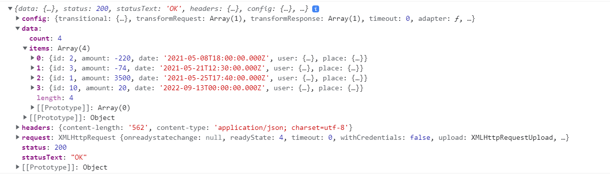

# Data ophalen uit een REST API

> **Startpunt voorbeeldapplicatie**
>
> ```bash
> git clone https://github.com/HOGENT-frontendweb/frontendweb-budget.git
> cd frontendweb-budget
> git checkout -b les4 5a31e56
> pnpm install
> pnpm dev
> ```
>
> Vanaf dit hoofdstuk heb je de bijbehorende backend nodig. Maak een database `budget` aan. Zie instructies in de [cursus Webservices](https://hogent-frontendweb.github.io/webservices-cursus/#/4-datalaag/deel1?id=mysql-databank) :
>
> ```bash
> git clone https://github.com/HOGENT-frontendweb/webservices-budget.git
> cd webservices-budget
> git checkout -b les5 d486627
> pnpm install
> pnpm db:migrate
> pnpm db:seed
> pnpm start:dev
> ```
>
> Vergeet geen `.env` aan te maken! Bekijk de [README](https://github.com/HOGENT-frontendweb/webservices-budget?tab=readme-ov-file#webservices-budget) voor meer informatie.

In dit hoofdstuk vervangen we de mock data door HTTP requests naar de REST API. Op ons lokaal toestel draait deze API op [http://localhost:9000/api/](http://localhost:3000/api/).

Voor de communicatie met de API, m.a.w. het versturen van HTTP requests, kan je gebruik maken van de [Fetch API](https://developer.mozilla.org/en-US/docs/Web/API/Fetch_API/Using_Fetch) of van HTTP client libraries die je kan vinden op bv. <https://www.npmjs.com>.

Wij zullen gebruik maken van [swr](https://www.npmjs.com/package/swr), een _React Hooks library for data fetching_. Het wordt ontwikkeld door Vercel, het bedrijf achter Next.js. In de documentatie lezen we de betekenis van de naam van het package:

> The name “SWR” is derived from `stale-while-revalidate`, a cache invalidation strategy popularized by [HTTP RFC 5861](https://datatracker.ietf.org/doc/html/rfc5861). SWR first returns the data from cache (stale), then sends the request (revalidate), and finally comes with the up-to-date data again.

Naast SWR hebben we ook [axios](https://www.npmjs.com/package/axios) nodig, een HTTP client library die we gebruiken om de HTTP requests uit te voeren. SWR heeft namelijk geen ingebouwde HTTP client, je bent dus vrij om te kiezen welke HTTP client je gebruikt. In tegenstelling tot `swr` kan je `axios` ook gebruiken in een Node.js omgeving, om bv. data op te halen uit een third party API.

Installeer alvast `axios` en `swr`:

```bash
pnpm add axios swr
```

## useEffect

`swr` verbergt namelijk heel wat van de complexiteit omtrent API calls. Daarom tonen we eerst hoe je zonder externe libraries een HTTP request kan uitvoeren. Hiervoor maken we gebruik van de `useEffect` hook.

Effecten worden gebruikt om uit je React-code te stappen en te synchroniseren met een extern systeem. Ze voeren een **side-effect** uit. Neveneffecten zijn acties die buiten het renderproces van React vallen, zoals het ophalen van gegevens, het aanroepen van browser API's, widgets van derden, netwerken... Tegenwoordig wordt afgeraden om `useEffect` te gebruiken aangezien veel developers de hook gebruiken waarvoor die niet gemaakt is (zie <https://www.youtube.com/watch?v=bGzanfKVFeU>).

In deze sectie werken we richting een voorbeeld van data fetching m.b.v. `useEffect`. Het uiteindelijke doel is om `useEffect` te vervangen door een library (hier dus `swr`) die specifiek ontworpen is voor data fetching, net zoals de [React docs aanbevelen](https://react.dev/reference/react/useEffect#fetching-data-with-effects).

`useEffect` is een functie die asynchroon wordt uitgevoerd na de render, en die zichzelf optioneel kan opruimen (= **cleanup**). Het opruimen gebeurt voordat het effect opnieuw wordt uitgevoerd en voor de **unmounting** (= het vernietigen van de component). React onthoudt de functie die je hebt doorgegeven ​​(we noemen dit ons "effect") en roept deze later aan, na het uitvoeren van de DOM-updates.

In onderstaand voorbeeld wordt een boodschap naar de console gelogd nadat de `TransactionList` gerenderd is. Deze instructie zouden we na de return kunnen plaatsen, maar die code wordt niet uitgevoerd. `useEffect` is hier de oplossing.

```jsx
// src/pages/TransactionList.tsx
import { TRANSACTION_DATA } from '../api/mock_data';
import { Input } from '@/components/ui/input';
import { Button } from '@/components/ui/button';
import { useState, useEffect } from 'react'; // 👈 1
import TransactionsTable from '../components/transactions/TransactionsTable'; //

export default function TransactionList() {
  const [text, setText] = useState('');
  const [search, setSearch] = useState('');

  // 👇 2
  useEffect(() => {
    console.log('transactions are rendered');
  });

  // ...
}
```

1. We importeren `useEffect`.
2. Binnen de component roepen we de `useEffect` functie aan. We geven een **callback functie** mee als parameter. De functie die we meegeven wordt het **effect** genoemd. Wanneer React onze component rendert, onthoudt React het effect dat we hebben gedefinieerd en voert het het effect uit na het updaten van de DOM. Dit gebeurt standaard na elke render, ook na de eerste.

Start de app en bekijk de console. Geef een zoekterm in. We zien in de console dat `useEffect` na de initiële render en bij elke rerender wordt uitgevoerd.

> **Merk op:** React StrictMode (zie `main.tsx`) controleert of een component pure is door de component functie tweemaal aan te roepen. Dit gebeurt enkel in development mode, niet in productie. Dit is ook de reden waarom het loggen naar de console tweemaal gebeurt. Zie [Detecting impure calculations with StrictMode](https://react.dev/learn/keeping-components-pure) en [Why does my calculation runs twice](https://react.dev/reference/react/useMemo#my-calculation-runs-twice-on-every-re-render).

### Effect dependencies

Stel dat we de boodschap enkel bij de initiële render wensen te loggen.

Aan de hand van een **dependency array** kan je het uitvoeren van een `useEffect` koppelen aan specifieke datawijzigingen. Zo voorkom je dat `useEffect` bij elke rerender opnieuw wordt uitgevoerd. Enkele voorbeelden:

- **[]**: een lege dependency array. `useEffect` wordt enkel bij de initiële render uitgevoerd

```jsx
useEffect(() => {
  console.log('transactions after the initial render');
}, []);
```

- **[search]**: `useEffect` wordt bij de initiële render en telkens de waarde van de variabele `search` wijzigt uitgevoerd. React zal het effect overslaan als `search` dezelfde waarde heeft als tijdens de laatste render.

```jsx
useEffect(() => {
  console.log('transactions after initial render or transaction added');
}, [search]);
```

- **meerdere dependencies**: React zal het opnieuw uitvoeren van het effect alleen overslaan als alle dependencies die je opgeeft exact dezelfde waarden hebben als tijdens de vorige render.

Stel dat de user via een prop wordt doorgegeven aan de `TransactionList` en ook naar de console gelogd dient te worden.

```jsx
export default function TransactionList({ user = 'Louis' }: { user: string }) {
  // 👆 de prop user

  useEffect(() => {
    console.log(
      `Hi  ${user}, transactions after initial render or search changed`,
    ); // 👆 maakt gebruik van user
  }, [search]); // Warning: React Hook useEffect has a missing dependency

  // ...
}
```

Merk op: We hebben ESLint geconfigureerd zodat die een waarschuwing (`React Hook useEffect has a missing dependency`) zal geven als de dependencies die je hebt opgegeven niet overeenkomen met wat ESLint verwacht op basis van de code in je effect. Dit helpt veel bugs in de code op te sporen. Als je effect een bepaalde waarde gebruikt, maar je het effect niet opnieuw wilt uitvoeren wanneer deze verandert moet je ervoor zorgen dat je effect geen gebruik maakt van deze dependency.

Oplossing:

```jsx
export default function TransactionList({ user = 'Louis' }: { user: string }) {

  useEffect(() => {
    console.log(`Hi ${user}, transactions after initial render or transaction added`);
  }, [search, user]) // 👈 meerdere dependencies

  //  JSX...
```

React vergelijkt de dependency waarden met behulp van [Object.is](https://developer.mozilla.org/en-US/docs/Web/JavaScript/Reference/Global_Objects/Object/is). Voor arrays en objecten wordt hier bijgevolg gekeken naar de referentie, en niet naar de exacte waarde!

### Cleanup, indien nodig

Een side-effect kan een **cleanup functie** retourneren. React roept de cleanup functie elke keer aan voordat het effect opnieuw wordt uitgevoerd en een laatste keer wanneer de component wordt verwijderd (= on unmount).

Verwijder eerst de code m.b.t. de prop user en voeg dan een cleanup functie met een simpele `console.log` toe.

```jsx
useEffect(() => {
  console.log('transactions after initial render or search changed');
  return () => console.log('unmounted...'); // 👈 de cleanup functie
}, [search]);
```

Start de app en bekijk de console. Je kan de cleanup functie triggeren door te zoeken.

### Opmerkingen useEffect

Er zijn een aantal opmerkingen om rekening mee te houden bij het gebruik van `useEffect`:

- Gebruik `useEffect` niet voor het aanbrengen van DOM-wijzigingen die zichtbaar zijn voor de gebruiker. Een `useEffect` wordt pas geactiveerd nadat de browser klaar is met de lay-out en het tekenen. Dit is dus te laat als je een visuele wijziging wilde aanbrengen. Voor die gevallen biedt React de hook `useLayoutEffect` die op dezelfde manier werken als `useEffect`. Ze verschillen enkel in het moment van 'afvuren'.
- Beperk het gebruik van `useEffect`, in de meeste gevallen heb je deze hook niet nodig. Je hebt het enkel nodig als je "uit de React code" wil stappen, bv. synchronisatie met een systeem in de cloud, synchronisatie met een niet-React DOM element... Probeer dus eerst je probleem op te lossen met andere hooks voor je terugvalt op `useEffect`, of gebruik een library die specifiek ontworpen is voor jouw probleem.
  - Voor extra uitleg en voorbeelden: [Synchronizing with Effects](https://react.dev/learn/synchronizing-with-effects)
- `useEffect` laat **niet** toe om het keyword `async` toe te voegen in de callback function. Dit kan opgelost worden door in de effect-code een `async` functie te maken en die vervolgens aan te roepen. Dit is trouwens nog een reden waarom je best een library gebruikt voor het ophalen van data.

## GET /api/transactions (useEffect)

Maak een bestand `transactions.ts` aan in de map `api`. Hierin plaatsen we alle requests naar de API [http://localhost:9000/api/transactions](http://localhost:9000/api/transactions):

```ts
import axios, { type AxiosResponse } from 'axios'; // 👈 1

const baseUrl = 'http://localhost:9000/api/transactions'; // 👈 2

// 👇 3
export const getAll = async (): Promise<AxiosResponse> => {
  const response = await axios.get(baseUrl);
  return response;
};
```

1. Importeer axios.
2. Houd het gemeenschappelijke deel van alle URLs bij in `baseUrl`.
3. De `getAll` functie maakt gebruik van `axios.get`, een asynchrone functie die een Promise retourneert (vandaar `async/await`). We retourneren voorlopig het volledige response. Later passen we dit aan.

Pas de `TransactionList` component aan. Het ophalen van de transacties is een side-effect, we maken hier voorlopig gebruik van de `useEffect` hook.

```jsx
import { useState, useEffect } from 'react'; // 👈 1
// andere imports...
import * as transactionsApi from '../api/transactions'; // 👈 2

// ...
export default function TransactionList() {
  // state

  // 👇 3
  useEffect(() => {
    // 👇 4
    const fetchTransactions = async () => {
      const data = await transactionsApi.getAll();
      console.log(data);
    };

    fetchTransactions();
  }, []); // 👈 3

  //  JSX...
}
```

1. Importeer `useEffect`.
2. Importeer ook alle functies uit de Transaction API met `import * as`. Dit zal een object met alle geëxporteerde functies uit `transactions.ts` maken.
3. Het ophalen van de transacties is een side-effect en dient enkel bij de eerste render te worden uitgevoerd. Daarom hebben we voor een lege dependency array.
4. Een `useEffect` mag geen async functie als argument krijgen.
   - Het probleem is nl. dat het eerste argument van `useEffect` een functie moet zijn die ofwel niets ofwel een functie retourneert (de cleanup functie). Maar een asynchrone functie retourneert een `Promise`, die niet als functie kan worden aangeroepen! Het is gewoon niet wat de `useEffect` hook verwacht als eerste argument.
   - We lossen dit op door een asynchrone functie te definiëren en deze vervolgens aan te roepen.

Start de applicatie en bekijk het response in de console.



Een axios response bevat volgende informatie:

- `data`: de body van het HTTP response. Als dit JSON is, zal Axios dit automatisch parsen in een JavaScript object.
- `status`: de HTTP statuscode, bv. 200, 400, 404.
- `statusText`: het HTTP statusbericht, bv. OK, Bad Request, Not Found.
- `headers`: de HTTP headers uit het HTTP response.
- `config`: de configuratie die je meegaf aan de Axios API.
- `request`: het native request dat gebruikt werd. In Node.js is dit een `ClientRequest` object.

We zijn enkel geïnteresseerd in de `data.items` uit het response.

De transactions API voor `getAll` wordt dus:

```jsx
import axios from 'axios';
import type { Transaction } from '../types'; // 👈 2

const baseUrl = 'http://localhost:9000/api/transactions';

export const getAll = async (): Promise<Transaction[]> => {
  // 👈 2
  const { data } = await axios.get(baseUrl); // 👈 1
  return data.items; // 👈 2
};
```

1. Gebruik destructuring om de data uit het response te halen.
2. Retourneer vervolgens `data.items`, of dus de lijst van transacties.

De `TransactionList` component wordt daardoor:

```jsx
// src/pages/transactions/TransactionList.tsx
// ...

export default function TransactionList() {
  const [transactions, setTransactions] = useState([]); // 👈 1
  const [text, setText] = useState('');
  const [search, setSearch] = useState('');

  // 👇 3
  useEffect(() => {
    // 👇 4
    const fetchTransactions = async (): Promise<void> => {
      const data = await transactionsApi.getAll(); // 👈 2
      setTransactions(data); // 👈 3
    };

    fetchTransactions();
  }, []);

  // ...
}
```

1. We maken niet langer gebruik van mock data, we bewaren onze transacties in state. De initiële state is een lege array. Als de data asynchroon is opgehaald dient de lijst te worden getoond (rerender)
2. Haal de data asynchroon op. Omwille van performantieredenen kan je eventueel het aantal records beperken (server side). Dat laten we hier achterwege.
3. Pas de state aan nadat je de lijst terugkrijgt van de API.
   - Een effect met een `setState` is vaak de trigger van een oneindige lus. Dit is niet het geval hier, omdat de `useEffect` enkel bij de initiële render wordt uitgevoerd. De state wordt enkel aangepast bij de initiële render.
   - `setState` gebruiken in een `useEffect` zou een belletje moeten doen rinkelen om te zoeken naar een betere oplossing!

Start de applicatie en bekijk het resultaat.

## Laadindicator en foutafhandeling

Je merkt misschien dat je heel kort de melding krijgt dat er geen transacties zijn en dat vervolgens de lijst van transacties wordt weergegeven. Dit komt omdat de API call asynchroon is en omdat het effect na de render uitgevoerd wordt. We kunnen dit oplossen door een laadindicator toe te voegen. Daarnaast voegen we ook meteen foutafhandeling toe, want we gaan er niet vanuit dat alles altijd goed gaat!

Omdat we de laadindicator in meerdere componenten nodig hebben, maken we hiervoor een aparte component `Loader` aan in een nieuw bestand `components/Loader.tsx`:

```jsx
// src/components/Loader.tsx
export default function Loader() {
  return (
    <div
      className='flex flex-col items-center justify-center py-8'
      data-testid='loader'
    >
      <div className='h-8 w-8 animate-spin rounded-full border-4 border-muted border-t-primary' />
    </div>
  );
}
```

Deze `Loader` component toont een simpele loading indicator van tailwindcss.

Ook zullen we foutafhandeling in meerdere componenten nodig hebben. Daarom maken we hiervoor een aparte component `Error` aan in een nieuw bestand `components/Error.tsx`:

```jsx
// src/components/Error.tsx
import { isAxiosError } from 'axios';
import { Alert, AlertDescription, AlertTitle } from './ui/alert';

interface ErrorProps {
  error?: unknown;
} // 👈 1

export default function Error({ error }: ErrorProps) {
  // 👆 1 👇 2
  if (isAxiosError(error)) {
    return (
      <Alert variant='destructive' className='mb-4'>
        <AlertTitle>Oops, something went wrong</AlertTitle>
        <AlertDescription>
          {/* 👇 3 */}
          {error?.response?.data?.message || error.message}
          {error?.response?.data?.details &&
            Object.keys(error?.response?.data?.details).length > 0 && (
              <>
                <br />
                {JSON.stringify(error?.response?.data?.details)}
              </>
            )}
        </AlertDescription>
      </Alert>
    );
  }
  // 👇 4
  if (error) {
    const msg =
      error instanceof globalThis.Error ? error.message : JSON.stringify(error);
    return (
      <Alert variant='destructive' className='mb-4'>
        <AlertTitle>An unexpected error occurred</AlertTitle>
        <AlertDescription>{msg}</AlertDescription>
      </Alert>
    );
  }

  return null; // 👈 5
}
```

1. We geven de `error` prop mee aan de component.
2. We controleren of de `error` een `AxiosError` is. Dit is een specifiek type error dat Axios gebruikt. We gebruiken de `isAxiosError` functie om dit te controleren.
3. In dat geval geven we de foutmelding weer. We controleren eerst of er een `message` is in de response data. Zo niet, dan geven we de `message` van de error weer. Als er een `details` object is, dan geven we dit ook weer. Dit `details` object voegen we in het hoofdstuk van validatie toe in de bijbehorende back-end, dus dit zal nu nog niet voorkomen.
4. Als er geen `AxiosError` is, dan geven we de `error` weer. We controleren eerst of er een `message` is. Zo niet, dan geven we de `error` zelf weer in JSON formaat.
5. Als er geen `error` is, dan geven we `null` terug. Zo ziet de gebruiker niets.

Als laatste definiëren we een `AsyncData` component in een nieuw bestand `components/AsyncData.tsx`:

```jsx
// src/components/AsyncData.tsx
import Loader from './Loader'; // 👈 1
import Error from './Error'; // 👈 1

interface AsyncDataProps {
  loading: boolean; // 👈 2
  error?: unknown; // 👈 3
  children: React.ReactNode; // 👈 4
}

export default function AsyncData({
  loading,
  error,
  children,
}: AsyncDataProps) {
  // 👇 2
  if (loading) {
    return <Loader />;
  }

  if (error) {
    return <Error error={error} />;
  } //👈 3

  return <>{children}</>; //👈 4
}
```

1. Importeer de `Loader` en `Error` componenten.
2. We verwachten een `loading` prop. Als `loading` gelijk is aan `true` geven we de `Loader` weer.
3. Daarnaast verwachten we een `error` prop. Die geven we mee aan de `Error` component. Als er een `error` is, dan geven we de `Error` weer.
4. Als laatste verwachten we een `children` prop. Dit is de TSX die we willen weergeven als de data niet aan het laden is en er geen error is.

Pas dan volgende onderdelen van de `TransactionList` verder aan:

```jsx
// src/pages/TransactionList.tsx
import { Input } from '@/components/ui/input';
import { Button } from '@/components/ui/button';
import { useState, useEffect } from 'react';
import TransactionsTable from '../components/transactions/TransactionsTable';
import * as transactionsApi from '../api/transactions';
import type { Transaction } from '@/types';
import AsyncData from '../components/AsyncData'; // 👈 5

export default function TransactionList() {
  const [transactions, setTransactions] = useState<Transaction[]>([]); // 👈 1
  const [text, setText] = useState('');
  const [search, setSearch] = useState('');
  const [loading, setLoading] = useState(true); // 👈 1
  const [error, setError] = useState<unknown>(null); // 👈 1

  useEffect(() => {
    const fetchTransactions = async () => {
      // 👇 2
      try {
        setLoading(true); // 👈 3
        setError(null); // 👈 3
        const data = await transactionsApi.getAll();
        setTransactions(data);
      } catch (error) {
        // 👇 4
        console.error(error);
        setError(error);
      } finally {
        // 👇 5
        setLoading(false);
      }
    };

    fetchTransactions();
  }, []);

  const filteredTransactions = transactions.filter((t) => {
    return t.place.name.toLowerCase().includes(search.toLowerCase());
  });

  return (
    <>
      <h1 className='text-2xl font-semibold mb-6'>Transactions</h1>

      <div className='flex justify-between mb-4 gap-2'>
        <div className='flex gap-2 w-1/2'>
          <Input
            type='search'
            placeholder='Search by place…'
            value={text}
            onChange={(e) => setText(e.target.value)}
          />
          <Button variant='outline' onClick={() => setSearch(text)}>
            Search
          </Button>
        </div>
      </div>
      {/* 👇 6 */}
      <AsyncData loading={loading} error={error}>
        {/* 👇 7 */}
        <TransactionsTable transactions={filteredTransactions} />
      </AsyncData>
    </>
  );
}
```

1. Definieer een `loading` en `error` state variabele om een loading indicator of een eventuele fout van de API weer te kunnen geven.
2. Voor de foutafhandeling maken we gebruik van try-catch.
3. Plaats de `loading` state op `true` en de `error` state op `null` bij een nieuw request.
4. Vang een eventuele fout op en stel de `error` state in.
5. Zet de `loading` state op `false` als het request beëindigd is, ook al was er een error.
6. We gebruiken de `AsyncData` component om de `loading` en `error` verder af te handelen.
7. De transacties worden enkel weergegeven als er zich geen fout heeft voorgedaan.

Bekijk het resultaat in de applicatie.

## GET /api/transactions (swr)

Je merkt dat we heel wat code hebben moeten schrijven om de data op te halen. Daarom maken we gebruik van de `swr` library. Deze library is specifiek ontworpen voor data fetching. De library is gebaseerd op de [stale-while-revalidate](https://datatracker.ietf.org/doc/html/rfc5861) strategie. De data wordt eerst uit de cache gehaald (stale), dan wordt de request uitgevoerd (revalidate) en tenslotte wordt de up-to-date data opnieuw geretourneerd. We geven de hele verantwoordelijkheid voor het ophalen van de data, afhandelen van error states, caching... door aan de library.

We gooien om te beginnen volgende code uit de `TransactionList` component:

- `useEffect` om de transacties op te halen
- `useEffect` import
- `loading`, `error` en `transactions` state variabele

Om data op te halen, moeten we gebruik maken van de `useSWR` hook. Deze hook heeft drie parameters:

- `key`: een unieke key voor de data die je wil ophalen. Meestal wordt hiervoor de URL van het request gebruikt.
  - Het voordeel van de key is dat je van eender waar in de component tree kan aangeven dat bepaalde data ververst moet worden. Als we bv. een transactie toevoegen, kunnen we zeggen dat de lijst van transacties moet ververst worden. We komen hier later op terug.
- `fetcher`: een functie die de data ophaalt. Deze functie wordt asynchroon uitgevoerd en retourneert een Promise. De functie ontvangt de `key` als parameter.
- `options` (optioneel): een object met opties voor swr.

Eerst en vooral maken we een algemene functie voor een GET all request. Hernoem het bestand `transactions.ts` naar `index.ts`. Een GET all request zal in een RESTful API altijd hetzelfde response hebben, aanpassingen kunnen we altijd nog meegeven via de `key` of de `options`.

Pas het bestand aan als volgt:

```jsx
// src/api/index.ts
import axios from 'axios';

const baseUrl = 'http://localhost:9000/api'; // 👈 1

// 👇 2 en 3
export async function getAll<T>(url: string): Promise<T> {
  const { data } = await axios.get(`${baseUrl}/${url}`); // 👈 4

  return data.items;
}
```

1. We houden het gemeenschappelijke deel van alle URLs bij in `baseUrl`.
2. We maken een generieke functie. `T` is het type dat je later kiest. Bvb `getAll<Transaction[]>("transactions")`
3. De parameter `url` zal van `swr` de `key` ontvangen. Zo hebben we meteen een uniek id voor elk request. We geven dus straks het laatste deel van de URL mee als `key`.
4. We voegen de `baseUrl` en de `url` samen om de volledige URL te bekomen.

Vervolgens gebruiken we de `useSWR` hook om onze transacties op te halen:

```jsx
// src/pages/TransactionList.tsx
import { Input } from '@/components/ui/input';
import { Button } from '@/components/ui/button';
import { useState } from 'react';
import TransactionsTable from '../components/transactions/TransactionsTable';
import type { Transaction } from '../types';
import AsyncData from '../components/AsyncData';
import useSWR from 'swr'; // 👈 1
import { getAll } from '../api'; // 👈 2

export default function TransactionList() {
  const [text, setText] = useState('');
  const [search, setSearch] = useState('');
  // const [transactions, setTransactions] = useState([]);// 👈 3
  // const [loading, setLoading] = useState(true);// 👈 3
  // const [error, setError] = useState<unkown>(null);// 👈 3

  const { data, isLoading, error } = useSWR<Transaction[]>(
    'transactions',
    getAll,
  ); // 👈 3

  const filteredTransactions =
    data?.filter((t) =>
      t.place.name.toLowerCase().includes(search.toLowerCase()),
    ) ?? [];
  // 👈 4

  return (
    <>
      <h1 className='text-2xl font-semibold mb-6'>Transactions</h1>

      <div className='flex justify-between mb-4 gap-2'>
        <div className='flex gap-2 w-1/2'>
          <Input
            type='search'
            placeholder='Search by place…'
            value={text}
            onChange={(e) => setText(e.target.value)}
          />
          <Button variant='outline' onClick={() => setSearch(text)}>
            Search
          </Button>
        </div>
      </div>
      {/* 👇 5 */}
      <AsyncData loading={isLoading} error={error}>
        <TransactionsTable transactions={filteredTransactions} />
      </AsyncData>
    </>
  );
}
```

1. Importeer de `useSWR` hook en verwijder de import van `useEffect`
2. Importeer de `getAll` functie uit de `api/index.ts`. Als je de naam van een map opgeeft, zal de `index.ts` in die map geïmporteerd worden.
3. We gebruiken de `useSWR` hook met `transactions` als key en de `getAll` functie als `fetcher`. De `useSWR` hook retourneert een object met volgende properties:
   - `data`: de data die we ophalen. Dit is `undefined` als de data nog niet is opgehaald en van het type `Transaction[]` als de data is opgehaald. Als de data geladen maar er is geen data beschikbaar dan hebben we een lege array
   - `error`: de error die we ontvangen. Dit is `undefined` als er geen error is.
   - `isLoading`: een boolean die aangeeft of de data aan het ophalen is.
     We hoeven niet langer zelf state bij te houden voor de transactions, error en loading. Deze lijnen code mag je schrappen
4. `filteredTransactions` is `undefined` tijdens het laden. Als het resultaat undefined of null is gebruik dan de []. Zo retourneert `filteredTransactions` steeds een array ook tijdens het laden.
5. We gebruiken de `AsyncData` component om de `loading` en `error` verder af te handelen. We geven de `TransactionsTable` mee als `children`. We moeten hier de naam van de variabele in de `loading` prop aanpassen naar `isLoading`.

### Oefening 1 - GET all in je eigen project

Implementeer een GET all van een willekeurige entiteit uit je eigen project:

- Installeer `swr` en `axios`.
- Voeg de componenten `Loader`, `Error` en `AsyncData` toe.
- Maak een functie aan in `api/index.ts` die een GET all request uitvoert.
- Gebruik de `useSWR` hook om de data op te halen.
- Zorg ervoor dat je de data kan weergeven in jouw lijst-component.

## DELETE /api/transactions/:id

De volgende stap van de CRUD operaties is de 'D', een transactie verwijderen. Enerzijds moeten we een API call toevoegen, die het verwijderen effectief uitvoert, en deze beschikbaar maakt. Anderzijds moeten we deze op de juiste plaats gebruiken.

Voeg een `deleteById` functie toe in `index.ts` in de map `api`:

```jsx
// src/api/index.ts
// 👇 1
export const deleteById = async (
  url: string,
  { arg: id }: { arg: number },
): Promise<void> => {
  await axios.delete(`${baseUrl}/${url}/${id}`); // 👈 2
};
```

1. De parameter `url` zal van `swr` de `key` ontvangen. We krijgen ook het `id` mee als argument, we halen dit uit de `arg` optie die we van `swr` krijgen.
2. We bouwen de url (`/api/transactions/:id`) op en voeren de `DELETE` uit. Net zoals `axios.get()` kan je ook `axios.delete()` uitvoeren. Het antwoord is de HTTP status code 204. Bijgevolg is de HTTP response body ook leeg (m.a.w. `{}` in JavaScript). We negeren dat antwoord hier.

De `Transaction` component zelf is het meest geschikt om zijn eigen transactie te verwijderen. Echter is het niet zijn verantwoordelijkheid om de effectieve API call uit te voeren, die is voor de `TransactionList`. We voegen een verwijderknop toe aan deze component:

```jsx
// src/components/transactions/Transaction.tsx
import { Button } from '@/components/ui/button'; // 👈 1
import { Trash2 } from 'lucide-react'; // 👈 1
// ...

interface TransactionProps extends TransactionType {
  onDelete?: (id: number) => void;
} // 👈 3

export default function Transaction({
  id,
  user,
  place,
  amount,
  date,
  onDelete,
}: TransactionProps) {
  // 👈 3
  // 👇 2
  const handleDelete = () => {
    onDelete?.(id);
  };

  return (
    <TableRow>
      <TableCell>
        <LocalizedDate date={date} />
      </TableCell>
      <TableCell>{user.name}</TableCell>
      <TableCell>{place.name}</TableCell>
      <TableCell>{amountFormat.format(amount)}</TableCell>
      <TableCell className='text-right'>
        <div className='flex justify-end gap-1'>
          {onDelete && (
            <Button
              variant='ghost'
              size='icon'
              aria-label='Delete transaction'
              className='text-destructive hover:text-destructive'
              onClick={handleDelete}
            >
              <Trash2 className='h-4 w-4' />
            </Button>
          )}
        </div>
      </TableCell>{' '}
      {/*  👈 1 */}
    </TableRow>
  );
}
```

1. Voeg een knop toe met een event handler `handleDelete`, met een icoon uit de `lucide-react` library.
2. Implementeer de `handleDelete` functie. Deze functie roept de `onDelete` functie aan met het `id` van de transactie.
3. De `Transaction` component ontvangt nu ook een `id` en `onDelete` prop.

We breiden de `TransactionTable` uit met een `onDelete` prop die we meteen doorgeven aan de `Transaction` component:

```jsx
// src/components/transactions/TransactionsTable.tsx
// ...
interface TransactionsTableProps {
  transactions?: TransactionType[];
  onDelete?: (id: number) => void; //👈
}

function TransactionsTable({ transactions, onDelete }: TransactionsTableProps) {
  //👈
  // ...

  return (
    <div className='rounded-md border'>
      <Table>
        <TableHeader>
          <TableRow>
            <TableHead>Date</TableHead>
            <TableHead>User</TableHead>
            <TableHead>Place</TableHead>
            <TableHead>Amount</TableHead>
            {/* 👇 */}
            <TableHead />
          </TableRow>
        </TableHeader>
        <TableBody>
          {transactions.map((transaction) => (
            <Transaction
              key={transaction.id}
              {...transaction}
              onDelete={onDelete}
            />
          ))}
          {/* 👈 */}
        </TableBody>
      </Table>
    </div>
  );
}

export default TransactionsTable;
```

Nu zijn we klaar om de transactie effectief te verwijderen, we passen de `TransactionList` component aan. Het probleem van de `useSWR` hook is dat die meteen het request uitvoert als de component rendert. We willen dit pas doen als de gebruiker op de verwijderknop klikt. Daarom maken we gebruik van de `mutate` functie die we van `swr` krijgen. Deze functie zal de data in de cache aanpassen en de component opnieuw renderen.

```jsx
// src/pages/TransactionList.tsx
// imports...
import useSWRMutation from 'swr/mutation'; // 👈 1
import { getAll, deleteById } from '../api'; // 👈 1
import { toast } from 'sonner'; // 👈 3

export default function TransactionList() {
  const [text, setText] = useState('');
  const [search, setSearch] = useState('');

  const { data, isLoading, error } = useSWR<Transaction[]>(
    'transactions',
    getAll,
  );

  // 👇 2
  const handleDeleteTransaction = async (id: number) => {
    try {
      await deleteTransaction(id);
      toast.success('Transaction removed');
    } catch {
      // deleteError wordt bijgewerkt door useSWRMutation
    }
  };

  const filteredTransactions =
    data?.filter((t) =>
      t.place.name.toLowerCase().includes(search.toLowerCase()),
    ) ?? [];

  // 👇3
  const handleDeleteTransaction = async (id: number) => {
    await deleteTransaction(id);
    toast.success('Transaction removed');
  };

  return (
    <>
      <h1 className='text-2xl font-semibold mb-6'>Transactions</h1>

      <div className='flex justify-between mb-4 gap-2'>
        <div className='flex gap-2 w-1/2'>
          <Input
            type='search'
            placeholder='Search by place…'
            value={text}
            onChange={(e) => setText(e.target.value)}
          />
          <Button variant='outline' onClick={() => setSearch(text)}>
            Search
          </Button>
        </div>
      </div>
      {/* 👇 4 */}
      <AsyncData loading={isLoading} error={error || deleteError}>
        {/* 👇 3 */}
        <TransactionsTable
          transactions={filteredTransactions}
          onDelete={handleDeleteTransaction}
        />
      </AsyncData>
    </>
  );
}
```

1. Importeer de `useSWRMutation` hook en de `deleteById` functie.
2. Gebruik de `useSWRMutation` hook. We geven als key `transactions` mee en als fetcher onze `deleteById` functie. We krijgen o.a. terug:
   - `trigger`: een functie die we kunnen aanroepen om het request effectief uit te voeren en dus de data te verwijderen. Deze functie ontvangt de `id` van de transactie als argument. We hernoemen dit naar `deleteTransaction`.
   - `error`: een eventuele fout die zich voordoet bij het verwijderen van de transactie. We hernoemen deze naar `deleteError`.
3. De `handleDeleteTransaction` functie zal de `deleteTransaction` trigger aanroepen en toont een toast. Als er zich een fout voordoet bij `deleteTransaction` en we vangen deze niet op, dan krijgen we in de console een `uncaught error` te zien.
4. We geven de `handleDeleteTransaction` functie mee als `onDelete` prop aan de `TransactionsTable` component.
5. We voegen de `deleteError` toe aan `error` prop aan de `AsyncData` component. Deze zal dus de fout tonen als er een fout is bij het ophalen van de transacties of bij het verwijderen van een transactie.

Bekijk het resultaat in de applicatie, je zou een transactie moeten kunnen verwijderen. In een meer realistische applicatie zou je een bevestiging moeten vragen aan de gebruiker, dat laten we even achterwege hier.

Open de console en inspecteer het `Network` tabblad. Je zal zien dat er een `DELETE` request wordt uitgevoerd naar de API en dat meteen daarna de lijst van transacties opnieuw wordt opgehaald. Dit is de `stale-while-revalidate` strategie die `swr` gebruikt. De data wordt eerst uit de cache gehaald (stale), dan wordt de request uitgevoerd (revalidate) en tenslotte wordt de up-to-date data opnieuw geretourneerd. `swr` weet dat er iets gewijzigd is aangezien een mutation uitgevoerd is met dezelfde key als de hook die onze data ophaalt. Handig, he?

De tabel wordt vervangen door de loader tijdens het verwijderen van een transactie, wat slechter UX is. We kunnen dit oplossen door een extra property door te geven aan `AsyncData`

```jsx
import Loader from './Loader';
import Error from './Error';

interface AsyncDataProps {
  loading: boolean;
  error?: unknown;
  children: React.ReactNode;
  hasData?: boolean; // 👈
}

export default function AsyncData({
  loading,
  error,
  children,
  hasData, // 👈
}: AsyncDataProps) {
  // 👇
  if (loading && !hasData) {
    return <Loader />;
  }

  if (error) {
    return <Error error={error} />;
  }

  return <>{children}</>;
}
```

We passen de TransactionList aan

```jsx
<AsyncData loading={isLoading} error={error ?? deleteError} hasData={data !== undefined}>...</AsynData>
```

Zo blijft de tabel weergegeven en gebeurt het laden op de achtergrond.

### Oefening 2 - DELETE in je eigen project

Implementeer een willekeurige DELETE uit je eigen project (liefst dezelfde entiteit als hiervoor):

- Maak een functie aan in `api/index.ts` die een DELETE request uitvoert.
- Gebruik de `useSWRMutation` hook om de data te verwijderen.
- Zorg ervoor dat je de data kan verwijderen uit jouw lijst-component.

## Filteren in de backend

Tot nu toe filteren we de transacties in de **frontend**: we halen _alle_ transacties op via de API en filteren daarna met `filter` in de browser. Dat werkt prima met een kleine dataset, maar stel dat er 100 000 transacties zijn — dan laad je die allemaal op, terwijl de gebruiker misschien maar 5 resultaten wil zien. Het is efficiënter om de backend enkel de relevante data te laten teruggeven.

We sturen de zoekterm mee in de URL als een **querystring** — een reeks sleutel-waarde paren achter een `?` in de URL. Bijvoorbeeld:

```http
GET /transactions?search=HoGent
```

De backend leest die parameter uit en filtert de data voordat hij antwoordt.

### Stap 1 — De SWR-sleutel aanpassen

`useSWR` gebruikt de eerste parameter (de _key_) als URL voor de API-call. Tot nu toe was dat gewoon `transactions`. We maken die URL nu dynamisch:

```jsx
const { data, isLoading, error } = useSWR(
  `transactions?${search ? `search=${search}` : ''}`,
  getAll<Transaction[]>,
);
```

- Als `search` leeg is, wordt de URL gewoon `transactions?` (geen filter, alle transacties).
- Als `search` de waarde `"HoGent"` heeft, wordt de URL `transactions?search=HoGent`.

Elke keer dat `search` verandert, verandert de URL-sleutel en doet `useSWR` automatisch een nieuw request. De `filteredTransactions` is nu dus **niet meer nodig** — die mag je verwijderen. Geef de `transactions` data rechtstreeks mee aan `TransactionsTable`.

```jsx
<TransactionsTable transactions={data} onDelete={handleDeleteTransaction} />
```

### Stap 2 — Wanneer wordt er gezocht?

In de vorige versie zocht de gebruiker door op de "Search" knop te klikken. We willen nu ook zoeken wanneer de gebruiker op **Enter** drukt of het zoekveld **leegmaakt**. Daarvoor vervangen we de knop door twee event handlers:

```jsx
// src/pages/TransactionList.tsx
// ...
import type { KeyboardEvent, ChangeEvent } from 'react';

const handleSearchChange = (e: ChangeEvent<HTMLInputElement>) => {
  setText(e.target.value);

  if (e.target.value === '') {
    setSearch('');
  }
};

const handleKeyDown = (e: KeyboardEvent<HTMLInputElement>) => {
  if (e.key === 'Enter') {
    setSearch(text);
  }
};
// ...
<Input
  type='search'
  placeholder='Search by place…'
  value={text}
  onChange={handleSearchChange}
  onKeyDown={handleKeyDown}
/>;
// ...
```

Herinner je dat er twee states zijn:

- `text` — wat de gebruiker op dit moment in het zoekveld heeft staan (wordt bijgehouden bij elke toetsaanslag).
- `search` — de zoekterm die effectief naar de API wordt gestuurd (wordt pas bijgewerkt als de gebruiker bewust zoekt).

Die splitsing is bewust: we willen niet bij _elke_ toetsaanslag een API-request uitsturen.

1. **`handleSearchChange`** wordt aangeroepen bij elke toetsaanslag in het zoekveld. Het werkt `text` bij zodat het inputveld up-to-date blijft. Als de gebruiker het veld volledig leegmaakt, wordt `search` ook op `''` gezet — dit triggert een nieuw request dat alle transacties terughaalt.

2. **`handleKeyDown`** wordt aangeroepen bij elke toetsaanslag, maar kijkt enkel of de ingedrukte toets `Enter` is. Zo ja, wordt de huidige waarde van `text` gekopieerd naar `search`. Die wijziging in `search` zorgt ervoor dat `useSWR` een nieuw API-request uitstuurt met de zoekterm.

### Problemen met delete

De verwijderde transactie is nog steeds zichtbaar in de lijst, omdat SWR de gecachte data blijft tonen totdat er een nieuwe reden is om te herfetchen. De reden is dat SWR data bijhoudt per URL-sleutel. Het ophalen van transacties gebeurt via `transactions?search=...`, terwijl het verwijderen gebeurt via een andere URL, bv. `transactions/5`. SWR heeft dus geen manier om automatisch te weten dat de gecachte lijst van transacties verouderd is na een delete. Door expliciet `mutate()` aan te roepen, geven we SWR de hint dat de cache ongeldig is en dat er een nieuw request moet worden uitgestuurd naar de fetch-URL.

```jsx
const { data, isLoading, error, mutate } = useSWR(
  `transactions?${search ? `search=${search}` : ''}`,
  getAll<Transaction[]>,
); // 👈

const handleDeleteTransaction = async (id: number) => {
  try {
    await deleteTransaction(id);
    await mutate(); // 👈
    toast.success('Transaction removed');
  } catch {
    // ...
  }
};
```

In `handleDeleteTransaction` gebeurt het volgende:

1. De transactie wordt verwijderd via `deleteTransaction(id)`.
2. Daarna roepen we `mutate()` aan — dit triggert een nieuw request naar de API zodat de lijst automatisch ververst wordt zonder dat de gebruiker de pagina moet herladen. De methode `mutate` destructureren we uit de returnwaarde van useSWR.
3. Tot slot toont een toast-melding dat de transactie verwijderd is.

## Pagineren door de transacties

Naast de zoekterm geven we nu ook de `page`en `pageSize` mee in de URL als een **querystring**. Bijvoorbeeld:

```http
GET /transactions?page=1&pageSize=10&search=HoGent
```

### Stap 1: Opvragen van de paginatie info

De API geeft niet langer een gewone array terug, maar een gepagineerd antwoord. We definiëren daarvoor een generische interface `PaginatedResponse<T>`:

```jsx
// src/types.ts
export interface PaginatedResponse<T> {
  items: T[];
  total: number;
  pageSize: number;
  page: number;
}
```

- `items` — de `T[]` op de huidige pagina.
- `total` — het totaal aantal items (over alle pagina's). Dit hebben we nodig om het totaal aantal pagina's te berekenen.
- `pageSize` — hoeveel items er per pagina worden teruggegeven.
- `page` — de huidige pagina.

We voegen ook een nieuwe fetcher-functie `getAllWithPaging` toe die het gepagineerde antwoord van de API teruggeeft.

```jsx
// src/api/index.ts
import type { PaginatedResponse } from '../types';
//..
export async function getAllWithPaging<T>(
  url: string,
): Promise<PaginatedResponse<T>> {
  const { data } = await axios.get(`${baseUrl}/${url}`);
  return data;
}
```

### Stap 2: API call met paginatie info

Pas de `TransactionList` component aan om de `page` en `pageSize` state bij te houden. We schakelen ook over naar de nieuwe fetcher-functie `getAllWithPaging<Transaction>` zodat het gepagineerde antwoord correct wordt geparset.

```jsx
// src/pages/TransactionList.tsx
// ...
import { deleteById, getAllWithPaging } from '../api';

export default function TransactionsList() {

  // ...
  const [page, setPage] = useState(1);
  const [pageSize, setPageSize] = useState(10);

  const { data, isLoading, error, mutate } = useSWR(
    `transactions?page=${page}&pageSize=${pageSize}${search ? `&search=${search}` : ''}`,
    getAllWithPaging<Transaction>,
  );

  // ...
}
```

We voegen twee nieuwe state-variabelen toe: `page` (de huidige pagina, standaard 1) en `pageSize` (het aantal items per pagina, standaard 10). De SWR-sleutel bevat nu ook `page` en `pageSize` als query parameters. Wanneer een van die waarden wijzigt, bouwt SWR automatisch een nieuwe URL en stuurt een nieuw request naar de API. We schakelen ook over van `getAll` naar `getAllWithPaging<Transaction>` als fetcher, zodat het gepagineerde antwoord correct wordt geparset.

En dan dienen we natuurlijk ook de data die we doorgeven aan de `TransactionTable` aan te passen

```jsx
<TransactionsTable
  transactions={data?.items}
  onDelete={handleDeleteTransaction}
/>
```

### Stap 3 : Paginatie knoppen

Voor de paginatie knoppen maken we gebruik van de [Pagination component](https://ui.shadcn.com/docs/components/radix/pagination):

```bash
pnpm dlx shadcn@latest add pagination select field
```

We dienen ook een aantal methodes te schrijven om te navigeren naar volgende/vorige pagina.

```jsx
// src/pages/TransactionList.tsx
import {
  Pagination,
  PaginationContent,
  PaginationItem,
  PaginationNext,
  PaginationPrevious,
} from '@/components/ui/pagination';
import {
  Select,
  SelectContent,
  SelectGroup,
  SelectItem,
  SelectTrigger,
  SelectValue,
} from '@/components/ui/select';
import { Field, FieldLabel } from '@/components/ui/field';
import { cn } from '@/lib/utils';

// ...
const handlePageSizeChange = (newPageSize: number) => {
  setPageSize(newPageSize);
  setPage(1);
};

const hasNextPage = data !== undefined && page * pageSize < data.total;

const handlePreviousPage = () => {
  setPage((prev) => Math.max(1, prev - 1));
};

const handleNextPage = () => {
  if (hasNextPage) {
    setPage((prev) => prev + 1);
  }
};

// ...
<AsyncData loading={isLoading} error={error || deleteError}>
  <TransactionsTable
    transactions={data?.items}
    onDelete={handleDeleteTransaction}
  />
  <div className='flex items-center justify-between gap-4 mt-4'>
    <Field orientation='horizontal' className='w-fit'>
      <FieldLabel htmlFor='select-rows-per-page'>Rows per page</FieldLabel>
      <Select
        value={pageSize}
        onValueChange={(value) => handlePageSizeChange(Number(value))}
      >
        <SelectTrigger className='w-20' id='select-rows-per-page'>
          <SelectValue />
        </SelectTrigger>
        <SelectContent align='start'>
          <SelectGroup>
            <SelectItem value='2'>2</SelectItem>
            <SelectItem value='10'>10</SelectItem>
            <SelectItem value='25'>25</SelectItem>
            <SelectItem value='50'>50</SelectItem>
          </SelectGroup>
        </SelectContent>
      </Select>
    </Field>
    <Pagination className='mx-0 w-auto'>
      <PaginationContent>
        <PaginationItem>
          <PaginationPrevious
            href='#'
            onClick={handlePreviousPage}
            aria-disabled={page === 1}
            className={cn(page === 1 && 'pointer-events-none opacity-50')}
          />
        </PaginationItem>
        <PaginationItem>
          {data?.total
            ? `Page ${page} of ${Math.ceil(data.total / pageSize)}`
            : ''}
        </PaginationItem>
        <PaginationItem>
          <PaginationNext
            href='#'
            onClick={handleNextPage}
            aria-disabled={!hasNextPage}
            className={cn(!hasNextPage && 'pointer-events-none opacity-50')}
          />
        </PaginationItem>
      </PaginationContent>
    </Pagination>
  </div>
</AsyncData>;
```

De navigatieknoppen vereisen een paar hulpvariabelen en handlers:

- **`handlePageSizeChange`**: wanneer de gebruiker het aantal rijen per pagina wijzigt, resetten we `page` naar 1. Anders zou je op een pagina kunnen belanden die niet meer bestaat (bv. pagina 5 terwijl er na de wijziging maar 2 pagina's zijn).
- **`hasNextPage`**: berekent of er een volgende pagina is
- **`handlePreviousPage`** en **`handleNextPage`**: verhogen of verlagen `page`.

Voor de JSX gebruiken we de `Pagination`-component van shadcn en een `Select` voor het kiezen van het aantal rijen per pagina. Let op de combinatie `aria-disabled` + `pointer-events-none opacity-50` op de paginatieknoppen: omdat het `<a>`-elementen zijn (geen `<button>`), ondersteunen ze het `disabled`-attribuut niet. `pointer-events-none` blokkeert de klik, `opacity-50` geeft visuele feedback, en `aria-disabled` zorgt voor toegankelijkheid.

### Stap 4: Pas de search aan

We introduceren een aparte `handleSearch`-functie die zowel `search` instelt als `page` terugzet naar 1. Dit is nodig omdat een nieuwe zoekterm een andere resultatenset oplevert — de gebruiker moet dan automatisch op de eerste pagina beginnen.

```jsx
const handleSearch = (value: string) => {
  setSearch(value);
  setPage(1);
};

const handleSearchChange = (e: ChangeEvent<HTMLInputElement>) => {
  setText(e.target.value);

  if (e.target.value === '') {
    handleSearch('');
  }
};

const handleKeyDown = (e: KeyboardEvent<HTMLInputElement>) => {
  if (e.key === 'Enter') {
    handleSearch(text);
  }
};
//..
<Button variant='outline' onClick={() => handleSearch(text)}>
  Search
</Button>;
```

### Oefening: Refactor de paginatie. Maak een aparte component

De paginatielogica staat nu volledig in `TransactionList`, wat de component groot en moeilijk leesbaar maakt. Een goede refactor is om de paginatiecontrols (de knoppen en de rijen-selector) te verplaatsen naar een aparte `Pagination`-component.

Maar let op: `page` en `pageSize` kunnen niet zomaar naar de child component verhuizen. Die waarden maken deel uit van de SWR-sleutel in `TransactionList` — als ze wijzigen, moet SWR een nieuw request uitsturen. De **state blijft dus in de parent**. De `Pagination`-component krijgt die waarden via props en geeft wijzigingen terug via callback-props (`onPageChange`, `onPageSizeChange`). Dit is het patroon van een **controlled component**: de child toont en reageert op data, maar de parent beslist wat er mee gebeurt.

- Oplossing +

  ```jsx
  //src/components/PaginationControls.tsx
  import {
    Pagination,
    PaginationContent,
    PaginationItem,
    PaginationNext,
    PaginationPrevious,
  } from '@/components/ui/pagination';
  import {
    Select,
    SelectContent,
    SelectItem,
    SelectTrigger,
    SelectValue,
  } from '@/components/ui/select';

  const PAGE_SIZE_OPTIONS = [5, 10, 25, 50];

  interface PaginationProps {
    page: number;
    totalPages: number;
    pageSize: number;
    onPageChange: (page: number) => void;
    onPageSizeChange: (pageSize: number) => void;
  }

  export default function Pagination({
    page,
    totalPages,
    pageSize,
    onPageChange,
    onPageSizeChange,
  }: PaginationProps) {
    return (
      <div className='flex items-center justify-between'>
        <div className='flex items-center gap-2 text-sm'>
          <span>Rows per page</span>
          <Select
            value={pageSize}
            onValueChange={(value) => {
              onPageSizeChange(value as number);
              onPageChange(1);
            }}
          >
            <SelectTrigger className='w-16'>
              <SelectValue />
            </SelectTrigger>
            <SelectContent>
              {PAGE_SIZE_OPTIONS.map((size) => (
                <SelectItem key={size} value={size}>
                  {size}
                </SelectItem>
              ))}
            </SelectContent>
          </Select>
        </div>

        {totalPages > 1 && (
          <Pagination>
            <PaginationContent>
              <PaginationItem>
                <PaginationPrevious
                  onClick={() => onPageChange(page - 1)}
                  aria-disabled={page === 1}
                  className={page === 1 ? 'pointer-events-none opacity-50' : ''}
                />
              </PaginationItem>

              <PaginationItem>
                <span className='text-sm px-2'>
                  {page} / {totalPages}
                </span>
              </PaginationItem>

              <PaginationItem>
                <PaginationNext
                  onClick={() => onPageChange(page + 1)}
                  aria-disabled={page === totalPages}
                  className={
                    page === totalPages ? 'pointer-events-none opacity-50' : ''
                  }
                />
              </PaginationItem>
            </PaginationContent>
          </Pagination>
        )}
      </div>
    );
  }
  ```

  De `PaginationControls`-component bevat geen eigen state. Alle waarden komen van de parent via props, en alle wijzigingen gaan terug via callbacks. Een paar dingen om op te letten:
  - `PAGE_SIZE_OPTIONS` is een constante buiten de component gedefinieerd. Zo wordt de array niet bij elke render opnieuw aangemaakt.
  - De `PaginationProps`-interface maakt het contract expliciet: `page`, `totalPages` en `pageSize` zijn leeswaarden; `onPageChange` en `onPageSizeChange` zijn callbacks waarmee de component de parent op de hoogte stelt van een wijziging.
  - Bij een pageSize-wijziging roept de component zelf al `onPageChange(1)` aan — de reset naar pagina 1 zit dus ingebakken in de child, niet in de parent.
  - `{totalPages > 1 && ...}` — de navigatieknoppen worden alleen getoond als er meer dan één pagina is.

  ```jsx
  // src/pages/transactionList.tsx
  import { Input } from '@/components/ui/input';
  import { Button, buttonVariants } from '@/components/ui/button';
  import { cn } from '@/lib/utils';
  import { useState } from 'react';
  import TransactionsTable from '../components/transactions/TransactionsTable';
  import type { Transaction } from '../types';
  import AsyncData from '../components/AsyncData';
  import useSWR from 'swr';
  import { deleteById, getAllWithPaging } from '../api';
  import useSWRMutation from 'swr/mutation';
  import { toast } from 'sonner';
  import { Link } from 'react-router';
  import type { KeyboardEvent, ChangeEvent } from 'react';
  import PaginationControls from '../components/PaginationControls';

  export default function TransactionList() {
    const [text, setText] = useState('');
    const [search, setSearch] = useState('');
    const [page, setPage] = useState(1);
    const [pageSize, setPageSize] = useState(10);

    const { data, isLoading, error, mutate } = useSWR(
      `transactions?page=${page}&pageSize=${pageSize}${search ? `&search=${search}` : ''}`,
      getAllWithPaging<Transaction>,
    );

    const { trigger: deleteTransaction, error: deleteError } = useSWRMutation(
      'transactions',
      deleteById,
    );

    const handleDeleteTransaction = async (id: number) => {
      await deleteTransaction(id);
      mutate();
      toast.success('Transaction removed');
    };

    const handleSearch = (value: string) => {
      setSearch(value);
      setPage(1);
    };

    const handleSearchChange = (e: ChangeEvent<HTMLInputElement>) => {
      setText(e.target.value);

      if (e.target.value === '') {
        handleSearch('');
      }
    };

    const handleKeyDown = (e: KeyboardEvent<HTMLInputElement>) => {
      if (e.key === 'Enter') {
        handleSearch(text);
      }
    };

    const totalPages = data ? Math.ceil(data.total / pageSize) : 1;

    return (
      <>
        <h1 className='text-2xl font-semibold mb-6'>Transactions</h1>

        <div className='flex justify-between mb-4 gap-2'>
          <div className='flex gap-2 w-1/2'>
            <Input
              type='search'
              placeholder='Search by place…'
              value={text}
              onChange={handleSearchChange}
              onKeyDown={handleKeyDown}
            />
            <Button variant='outline' onClick={() => handleSearch(text)}>
              Search
            </Button>
          </div>

          <Link to='/transactions/add' className={cn(buttonVariants())}>
            Add transaction
          </Link>
        </div>

        <AsyncData loading={isLoading} error={error || deleteError}>
          <TransactionsTable
            transactions={data?.items}
            onDelete={handleDeleteTransaction}
          />
          <div className='mt-4'>
            <PaginationControls
              page={page}
              totalPages={totalPages}
              pageSize={pageSize}
              onPageChange={setPage}
              onPageSizeChange={setPageSize}
            />
          </div>
        </AsyncData>
      </>
    );
  }
  ```

  In de gerefactorde `TransactionList` zijn een aantal zaken gewijzigd:
  - **`totalPages`** wordt berekend in de parent: `Math.ceil(data.total / pageSize)`. Deze waarde wordt doorgegeven aan de `Pagination`-component.
  - **`onPageChange={setPage}`** en **`onPageSizeChange={setPageSize}`** — de state-setters worden rechtstreeks als callback doorgegeven. Wanneer de `Pagination`-component `onPageChange(2)` aanroept, roept die eigenlijk `setPage(2)` aan in de parent.

## Het .env bestand

Je kan omgevingsvariabelen definiëren in het `.env` bestand. De omgevingsvariabelen moeten beginnen met `VITE_`, alle andere variabelen behalve `NODE_ENV` worden genegeerd. Als je omgevingsvariabelen wijzigt, moet je de applicatie _niet_ opnieuw starten. Vite zal de wijzigingen automatisch detecteren en het nodige doen.

De omgevingsvariabelen zijn beschikbaar via het object `import.meta.env`. Een omgevingsvariabele met de naam `VITE_NOT_SECRET_CODE` wordt in de code `import.meta.env.VITE_NOT_SECRET_CODE`.

Er is ook een ingebouwde omgevingsvariabele met de naam `NODE_ENV`. Wanneer je `pnpm dev` uitvoert, is `NODE_ENV` altijd gelijk aan `development`.

De omgevingsvariabelen worden toegevoegd aan de code _at build time_. Aangezien Vite een statische HTML/CSS/JS-bundel produceert, kan het deze onmogelijk tijdens runtime lezen. Daarom staan de waarden letterlijk in de code, plaats hier dus geen API keys en andere geheime sleutels in.

Voeg een `.env` file toe in de root folder met de environment settings. Hierin definiëren we de url naar de API:

```dotenv
VITE_API_URL='http://localhost:9000/api'
```

In de code van `api/index.ts` vervang je `baseUrl` door

```js
const baseUrl = import.meta.env.VITE_API_URL;
```

Over environment variables in React & Vite vind je meer op <https://vitejs.dev/guide/env-and-mode.html>.

## Oefening 3 - README

Pas `README.md` aan zodat de gebruiker weet dat er een `.env` bestand aangemaakt moet worden alvorens de applicatie gestart kan worden. Voeg ook een voorbeeld voor het `.env` bestand toe.

## Oefening 4 - PlacesList via API

Pas nu ook `PlacesList` aan zodat dit werkt met onze REST API voor het ophalen, verwijderen van de places en het aanpassen van de rating. Voorzie in de `src/components/places` folder de component `PlacesCards.tsx` die de lijst van `Places` weergeeft. `PlacesList.tsx` communiceert met de API en geeft de data door via props aan `PlacesCards.tsx`.

Pas ook `PlaceDetail` aan. Geef de transacties van de betreffende plaats weer. Maak hiervoor gebruik van de `TransactionTable` component.

> **Oplossing voorbeeldapplicatie**
>
> ```bash
> git clone https://github.com/HOGENT-frontendweb/frontendweb-budget.git
> cd frontendweb-budget
> git checkout -b les4-opl 6d60fc7
> pnpm install
> pnpm dev
> ```
>
> Vergeet geen `.env` aan te maken! Bekijk de [README](https://github.com/HOGENT-frontendweb/frontendweb-budget?tab=readme-ov-file#budgetapp) voor meer informatie.

## Must reads

- [JavaScript Visualized: Promises & Async/Await](https://medium.com/@lydiahallie/javascript-visualized-promises-async-await-a3f1aad8a943)
- [SOLID principles in React](https://konstantinlebedev.com/solid-in-react/)
- [Good advice on JSX conditionals](https://blog.thoughtspile.tech/2022/01/17/jsx-conditionals/)
- [Component Composition is great btw](https://tkdodo.eu/blog/component-composition-is-great-btw)

## Mogelijke extra's voor de examenopdracht

- [react-query](https://www.npmjs.com/package/react-query)
- [react-error-boundary](https://github.com/bvaughn/react-error-boundary)
- [nuqs](https://nuqs.dev/):type-safe query params state management. Zo worden de query parameters ook aan de url toegevoegd. Pagina vernieuwen behoudt igv TransactionList de zoekopdracht en de terug knop werkt zoals verwacht.
