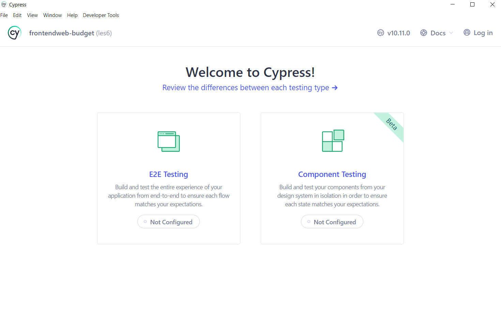
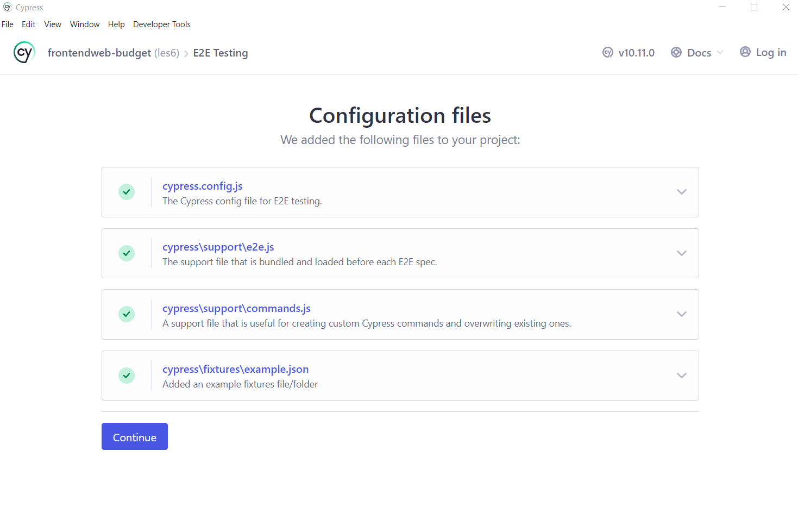
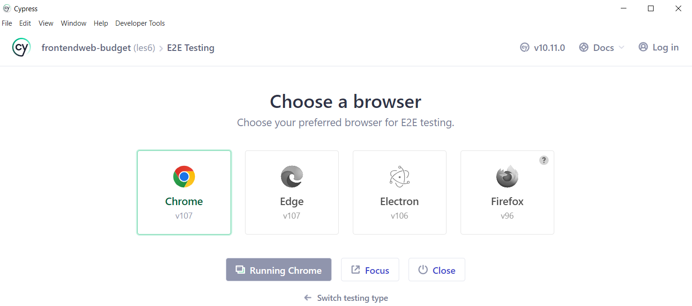
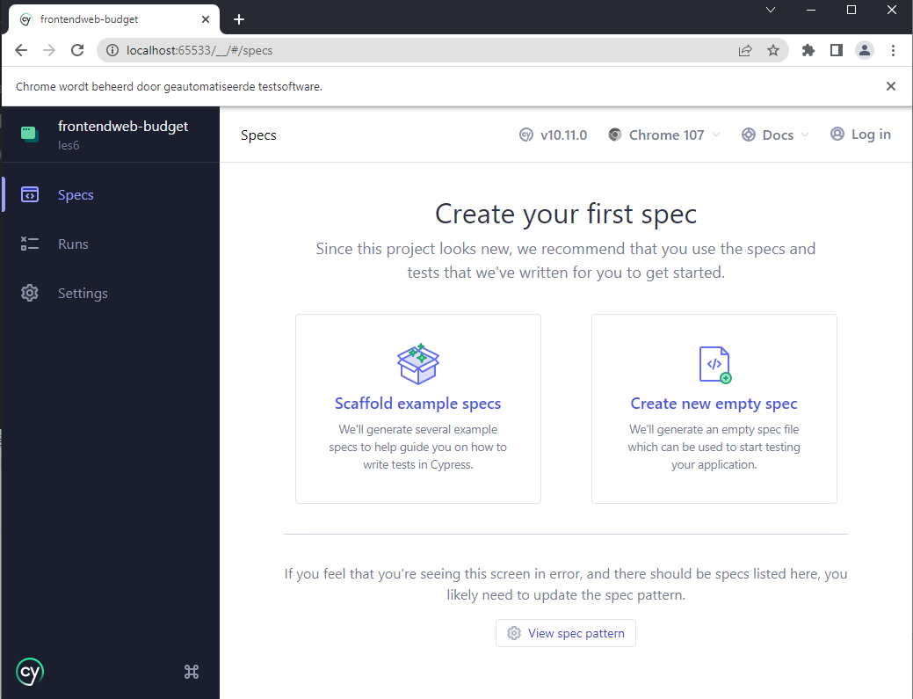

# Testing
## Inleiding
> **Startpunt voorbeeldapplicatie**
>
> ```bash
> git clone https://github.com/HOGENT-Web/frontendweb-budget/
> cd frontendweb-budget
> git checkout -b les6 ef61c46
> yarn install
> yarn start
> 
> ```

De rest api dient ook te runnen.

Standaard komt `create-react-app` met een unit test framework: **Jest**. Op zich niets mis mee, maar enerzijds leren jullie dit ook al in webservices en anderzijds zijn unit testen vaak wat geforceerd in een frontend client (er is meestal weinig business logica). Dus we gaan UI testen introduceren mbv **Cypress**.

## Cypress

Cypress draait in een browser (en niet via een webdriver). Dus het draait (zo goed als) onafhankelijk van onze react code, m.a.w. wat je hier vandaag leert kan je op een identieke manier gebruiken als je een ander framework gebruikt. Het leukste aan Cypress is dat je vrij makkelijk testen schrijft en toevoegt. En iedereen weet dat het moeilijkste van testen is om luie developers testen te laten schrijven.

```bash
yarn add cypress --dev
```
Dit installeert de UI test library. Om Cypress te openen:  

```bash
npx cypress open
```

Wanneer je Cypress voor de eerste keer opent in een project, dien je een wizard te doorlopen om Cypress te configureren. 

In de eerste stap dien je te kiezen voor **E2E Testing** (je runt de applicatie en je bezoekt pagina's om ze te testen) of **Component testing** (je monteert afzonderlijke componenten en test die afzonderlijk). Kies `E2E Testing`.



In de volgende stap maakt Cypress de nodige configuratie folders/bestanden aan en geeft hiervan een overzicht. [Bekijk de documentatie voor de details](https://docs.cypress.io/guides/references/configuration).



Klik op `continue` en kies vervolgens de browser waarin je de testen wenst te draaien uit een lijst van browsers die op je machine staan en klik op `start E2E testing`.




Cypress opent **The Launchpad** in de browser. De Launchpad is het portaal naar Cypress, dat helpt bij onboarding, het kiezen van een testtype en het starten van een browser. 



## De eerste test
Dan is het tijd voor onze eerste test. Kies `Create new empty spec`. Behou de default naam voor de spec en klik op `create spec`. Een dialoogvenster met de gegenereerde spec wordt getoond. De test zal controleren of het surfen naar de [Example app](https://example.cypress.io) werkt.

```jsx
describe('empty spec', () => {
  it('passes', () => {
    cy.visit('https://example.cypress.io')
  })
})
```

Klik bovenaan op 'x' om het venster te sluiten. De test verschijnt onmiddellijk in de [**Spec Explorer**](https://docs.cypress.io/guides/core-concepts/cypress-app#The-Spec-Explorer) en werd gecreëerd in de `cypress/e2e` folder. Cypress controleert de specificatiebestanden op eventuele wijzigingen en geeft automatisch eventuele wijzigingen weer. 

Klik op het bestand `spec.cy.js` om de spec uit te voeren.

De test draait in de [**Test Runner**](https://docs.cypress.io/guides/core-concepts/cypress-app#Project-Runs) in een browser, tegen een website die bezocht wordt door de browser
m.a.w. je kan niet enkel een site die in ontwikkeling is testen, maar ook om 't even welke site die ergens draait, hier dus ['https://example.cypress.io']('https://example.cypress.io'). Indien je kiest voor `Scaffold example specs`, dan draaien de voorbeelden tegen [https://example.cypress.io/todo](https://example.cypress.io/todo). 

We passen de test nu aan. Ga terug naar Visual Studio Code en open de file `cypress/e2e/spec.cy.js`
```js
describe('mijn eerste test', () => {// 👈 1
	it('doet niet veel', () => { // 👈 2
		expect(true).to.equal(true); // 👈 3
	});
});
```
1. [`describe()`](https://mochajs.org/#bdd) bundelt een aantal testen, je geeft het een descriptieve naam en een functie die uitgevoerd wordt. De syntax is overgenomen van het **Mocha** framework.
2. Elke test is dan een `it()` functie, met een beschrijving en een functie die uitgevoerd wordt
3. De test `asserts` zijn **BDD (behavior driven development asserts)**. De syntax is overgenomen van het **Chai** framework. Over wat daarmee allemaal mogelijk is later meer.

Als je de wijzigingen opslaat, voert de 'Test Runner' een reload uit. De test voert met success uit. Verander gerust een true in false om een gefaalde test te zien.

We willen natuurlijk onze applicatie testen, een eerste test: zien dat de app draait.

```js
describe("mijn eerste test", () => {
	it("draait de applicatie", () => {// 👈 1
		cy.visit('http://localhost:3000'); // 👈 2
	});
});
```

1. Geef een betekenisvolle naam aan de test
2. Bezoek de website

Zorg er wel voor dat de budget website runt, anders faalt de test.

In de **Test Runner**:
1. De Command Log toont de VISIT action.De VISIT toont een blue pending state totdat de pagina geladen is.  
2. De budget applicatie wordt geladen in het Preview pane.
3. De test is 'green', alhoewel we geen assertions hebben toegevoegd. Dit komt omdat veel van de Cypress opdrachten zijn gebouwd om te mislukken als ze niet vinden wat ze verwachten te vinden. Dit staat bekend als een [default assertion](https://docs.cypress.io/guides/core-concepts/introduction-to-cypress#Default-Assertions).

Nu controleren we ook of er een h1 element kan gevonden worden
```js
describe("mijn eerste test", () => {
	it("draait de applicatie", () => {
		cy.visit('http://localhost:3000')
		cy.get("h1").should("exist");// 👈
	});
});
```
- [get()](https://docs.cypress.io/api/commands/get) om een element te selecteren, hier op basis van de tagnaam
- [should()](https://docs.cypress.io/api/commands/should) is een assertion. "Assertions describe the desired state of your elements, your objects, and your application." 

Opmerking: als je een eslint melding krijgt voor het cy object, voeg dan een `.eslintrc.json`file toe aan de `cypress`folder met onderstaande inhoud
```json
{
  "extends": [
    "plugin:cypress/recommended"
  ]
}
```

Neem de documentatie [Introduction to Cypress](https://docs.cypress.io/guides/core-concepts/introduction-to-cypress) door.

## Anatomie van een UI test
- onze testen zullen vaak een gelijkaardig stramien hebben, een url bezoeken, interageren met elementen op de pagina (iets typen in een edit field, op een button klikken, ...)
- gevolgd door kijken of het we het gewenste resultaat te zien krijgen
- in beide gevallen moeten we elementen van de DOM kunnen identificeren (gewoon checken dat er 'een' h1 aanwezig is, zoals in de vorige test zal niet volstaan)
als er meerdere inputs, buttons etc. zijn moeten we zeker zijn dat we met de juiste interageren

Stel bvb volgende html pagina
```html
<!-- eenofandere.html--> 
<button
	id="main"
	class="btn btn-large"
	name="submission"
	role="button">Submit</button>
......
```

Stel dat we onze `submit` button willen terugvinden. 

We zouden kunnen opteren om gewoon 'de' button op te vragen. Maar dat werkt enkel als er maar één button is.
```js
cy.get('button').click();
```

Een alternatief is om naar de `classes` te kijken. Maar dat hangt sterk samen met de styling, en verandert dus veel te makkelijk.

```js
cy.get('.btn.btn-large').click();
```

Naar de `id` kijken is al iets beter (is op zijn minst uniek). Maar bij een goede refactor riskeert die ook te wijzigen.

```js
cy.get('#main').click();
```
Je zou ook naar de `inhoud` kunnen kijken. Dit is soms valabel, maar wat met i18n?
```js
cy.contains('Submit').click();
```

De beste optie is om gewoon een extra [`data- attribute`](https://developer.mozilla.org/en-US/docs/Learn/HTML/Howto/Use_data_attributes) toe te voegen. We zijn zeker dat we altijd hetzelfde element gaan terugvinden, en iemand die de code wijzigt weet ook direct dat het element deel uitmaakt van een test.

```html
<button
	id="main"
	class="btn btn-large"
	name="submission"
	role="button"
	data-cy="submit">Submit</button> // 👈
...
```

```js
cy.get('[data-cy=submit]').click()
```

Dus we gaan telkens `data-cy attributes` toevoegen waar nodig.

## Add Transaction test
Als voorbeeld zullen we het toevoegen van een transactie testen.

### data-cy attributen
We moeten eerst overal de juiste `data-cy` attributes toevoegen. Dit hoef je natuurlijk maar éénmaal te doen per component waar je tests voor schrijft.

```jsx
<form onSubmit={handleSubmit(onSubmit)} className="w-50 mb-3">
    <LabelInput
        label="User"
        name="user"
        type="user" 
        data-cy="user_input"/> {/*👈1*/}

    <LabelInput
        label="Date"
        name="date"
        type="date"
        data-cy="date_input" />{/*👈1*/}

    <PlacesSelect data-cy="place_input" />{/*👈1*/}

    <LabelInput
        label="Amount"
        name="amount"
        type="amount"
        data-cy="amount_input" />{/*👈1*/}

    <div className="clearfix">
        <div className="btn-group float-end">
            <button
                type="submit"
                disabled={isSubmitting}
                className="btn btn-primary"
                data-cy="submit_transaction"
            > {id
                ? "Save transaction"
                : "Add transaction"}</button>{/*👈2*/}
        </div>
    </div>
</form>
```
1. Bij elke input zetten we een attribuut. De LabelInput component spread alle attributen {...rest} , dus die komen bij het juiste html element terecht.
2. En natuurlijk ook bij de submit button

Op een gelijkaardige manier passen we Transaction aan, zodat we nadien kunnen checken dat de transactie goed toegevoegd is

```jsx
import { memo, useCallback } from 'react';
...
export default memo(function Transaction({ id, user, amount, place, date, onDelete }) {
  const handleDelete = useCallback((event) => {
    event.preventDefault();
    onDelete(id);
  }, [id, onDelete]);

  return (
    <tr data-cy="transaction">{/*👈*/}
      <td data-cy="transaction_date">{/*👈*/}
        {dateFormat.format(new Date(date))}
      </td>
      <td data-cy="transaction_user">{user.name}</td>{/*👈*/}
      <td data-cy="transaction_place">{place.name}</td>{/*👈*/}
      <td data-cy="transaction_amount">{amountFormat.format(amount)}</td>{/*👈*/}
      <td>
        <div className="btn-group float-end">
          <Link data-cy="transaction_edit_btn" type="button" className="btn btn-light" to={`/transactions/edit/${id}`}>{/*👈*/}
            <IoPencil />
          </Link>
          <button data-cy="transaction_remove_btn" type="button" className="btn btn-danger" onClick={handleDelete}>{/*👈*/}
            <IoTrashOutline />
          </button>
        </div>
      </td>
    </tr>
  );
})
```

### de test
Voeg een nieuwe file `cypress/e2e/addtransaction.cy.js` toe.  
```js
it("add transaction test", () => {
	cy.visit("http://localhost:3000/transactions/add");// 👈1

	cy.get("[data-cy=user_input]").type("Pieter");// 👈2
	cy.get("[data-cy=date_input]").type("2021-11-01");// 👈2
	cy.get("[data-cy=place_input]").select("Irish Pub");// 👈2 
	cy.get("[data-cy=amount_input]").type("200");// 👈2
	cy.get("[data-cy=submit_transaction]").click();// 👈3
	
	cy.get("[data-cy=transaction_user]").eq(9).contains("Pieter");// 👈4
	cy.get("[data-cy=transaction_amount]").each((el, idx) => {// 👈5
		if (idx === 9) {
			expect(el[0].textContent).to.equal("200 €");
		}
	});
	cy.get("[data-cy=transaction]").should("have.length", 10);// 👈6
});
```
1. Om nu de form te testen gaan we eerst naar de juiste pagina
2. Dan vragen we alle input fields op en geven we zinvolle data in. Bij text input fields kan je gewoon de [`.type()`](https://docs.cypress.io/api/commands/type) method gebruiken. Voor option-select inputs de [`.select()`](https://docs.cypress.io/api/commands/select). De waarde kan zowel de value als de content zijn, of zelfs de index.
3. als laatste klikken([`click()`](https://docs.cypress.io/api/commands/click)) we dan op de submit button. Submitten zorgt ervoor dat we terug naar onze overzichtspagina gaan, dat gebeurt ook in de testomgeving.
4.Dan kunnen we daar kijken of de transactie toegevoegd is. We hebben `data-cy` op elk deel van een Transaction, maar er zijn meerdere transacties, dus we kunnen niet gewoon bvb. 'de' transaction_user opvragen (cy.get("[data-cy=transaction_user]")). 

A.d.h.v. `eq()` kan je één specifiek element opvragen a.d.h.v. zijn `index`.
5. Of je kan een functie meegeven die voor elk element aangeroepen wordt, en zo je checks doen. `el` is hier een array waar het 1ste element het echte DOM element bevat. 
6. Vaak is het gewoon al nuttig om te kijken dat er effectief één toegevoegd is, los van de inhoud, dat kan natuurlijk ook.

Merk op: In een e2e test zijn we niet beperkt tot één enkele assertion in een bepaalde test. Veel interacties in een toepassing kunnen zelfs meerdere stappen vereisen en zullen de toepassingsstatus waarschijnlijk op meer dan één manier veranderen.

### Page transitions
De test surft naar 2 pagina's. Cypress detecteert automatisch paginaovergangs-gebeurtenissen en stopt automatisch met het uitvoeren van opdrachten totdat de volgende pagina is geladen. 

Als de volgende pagina de laadfase niet had voltooid, zou Cypress de test hebben beëindigd en een foutmelding hebben gegeven. 

Cypress wacht 4 seconden voordat er een time-out wordt gegenereerd bij het vinden van een DOM-element. In geval van een paginaovergangsgebeurtenis krijg je pas een time-out na 60 seconden. Met andere woorden, op basis van de opdrachten en de gebeurtenissen die plaatsvinden, past Cypress automatisch de verwachte time-outs aan om overeen te komen met het gedrag van de webtoepassing.

Deze verschillende time-outs worden gedefinieerd in het [configuratie document](https://docs.cypress.io/guides/references/configuration#Timeouts)

### Heruitvoerbaar
Als je aan het meetypen was zal je merken dat er nu iets lastig aan de hand is, elke keer je savet wordt het toevoegen van een transactie uitgevoerd, en de lijst groeit en groeit. 

M.a.w. de check om te kijken dat er vier transacties na er één toe te voegen zijn werkt maar éénmaal, en dan faalt hij altijd. Dat is natuurlijk niet werkbaar. 

We moeten zorgen dat onze testen geen blijvende wijzigingen veroorzaken, we kunnen dat op twee manieren bereiken: 
- niet met de echte databank werken, **mocks** gebruiken (straks meer hierover)
- alle bewerkingen ook weer 'omkeren'

```js
it("remove again", () => {
	cy.visit("http://localhost:3000/transactions/"); // 👈1
	cy.get("[data-cy=transaction_remove_btn]").eq(3).click(); // 👈2
	cy.get("[data-cy=transaction]").should("have.length", 3); // 👈3
});
```
Als we onze addtransaction_test telkens opnieuw willen kunnen uitvoeren, moeten we de toegevoegde transactie nadien weer verwijderen(en dan hebben we direct een verwijder test ook).

1. we bezoeken weer de juiste pagina
2. klikken de trashcan van de net toegevoegde transactie (index 9)
3. en controleren dan dat er effectief maar 3 meer overblijven

Nu kunnen we de testen opnieuw en opnieuw draaien zonder dat ze gaan beginnen falen.

## Oefening
We hebben getest dat onze form werkt, er wordt een transactie toegevoegd als alle input fields een geldige waarde krijgen.

Vaak is het echter minstens even interessant (zoniet interessanter) om alle edge cases te gaan testen. Worden de foutboodschappen wel goed getoond als de gebruiker foutieve informatie ingeeft?
(Het heeft erg veel zin om hiervoor testen te schrijven. Als alles goed gaat komen foutieve situaties niet bijzonder vaak voor. Dus je wilt ze opmerken in je testen en niet (te) laat bij de gebruiker)

### stappenplan
1. voeg een data-cy attribute aan de error boodschap tags
2. voeg een nieuwe test toe aan het addtransaction.cy.js bestand
3. ga naar de juiste url, typ één letter bij de user
4. click op het toevoegen van een transactie
5. controleer dat een error boodschap verschijnt
6. extra: test zowel niets invullen / één letter typen en controleer dat in beide gevallen de juiste error boodschap verschijnt

Dit [cheatsheet](https://cheatography.com/aiqbal/cheat-sheets/cypress-io/) kan je misschien helpen, bekijk zeker ook de voorbeeld testen voor inspiratie als je niet verder kan.

## Mocks
- Alles op een echte backend testen heeft zeker zijn nut (om zeker te zijn dat alles wel werkt), maar zo wil je niet alle testen schrijven.
- Het is relatief traag, altijd alles moeten 'terug' zetten kan knap lastig worden, en het beperkt wat je allemaal kan testen. (hoe zou je testen of de frontend alles juist toont als de backend onbereikbaar is bijvoorbeeld?)
- De oplossing heet mocken, we gaan een fake server instellen die vóór onze test uitgevoerd wordt en beschrijven hoe die moet reageren op bepaalde api calls.
- Dan doen we onze tests en kunnen we checken dat onze frontend voor die bepaalde backend alles correct afhandelt.

Neem de documentatie [Network requests](https://docs.cypress.io/guides/guides/network-requests) door tot aan Fixtures.

Laat ons een nieuwe test toevoegen die kijkt of de lijst van transacties wel correct getoond wordt.
```js
describe("transactions test", () => {
	it("show transactions", () => {
		cy.intercept(
			"GET", 
			"http://localhost:9000/api/transactions",
			'{"data":[{"id":"7f28c5f9-d711-4cd6-ac15-d13d71abff87","amount":-97,"date":"2021-11-01","user":{"id":"7f28c5f9-d711-4cd6-ac15-d13d71abff80","name":"Pieter"},"place":{"id":"7f28c5f9-d711-4cd6-ac15-d13d71abff85","name":"Chinese Restaurant"}}],"count":1}'
		);  // 👈1

		cy.visit("http://localhost:3000"); // 👈2
		cy.get("[data-cy=transaction]").should("have.length", 1);
		cy.get("[data-cy=transaction_place]").eq(0).contains("Chinese Restaurant");
		cy.get("[data-cy=transaction_date]").eq(0).should("contain", "01/11/2021");
	});
});
```
1. routes mocken doen we met de [`intercept`](https://docs.cypress.io/api/commands/intercept) methode
  - 1ste argument : de method
  - 2de argument: het path van de route
  - 3de argument: het antwoord
2. Nadien schrijven we de test. Als de pagina geladen wordt zal dit resulteren in de backendcall die wij gemockt hebben en dus zullen de componenten gerenderd worden met onze data

## Fixtures
De data inline plaatsen in een `intercept`is meestal niet zo handig (of leesbaar), je kan dit oplossen door `fixtures` te gebruiken. Neem de documentatie [Fixtures](https://docs.cypress.io/guides/guides/network-requests#Fixtures) door.

Creëer een nieuwe file `transactions.json` in de `fixtures` folder van cypress
```json
{
	"data": [
		{
			"id":"7f28c5f9-d711-4cd6-ac15-d13d71abff87",
			"amount":-97,
			"date":"2021-11-01",
			"user":
			{
				"id":"7f28c5f9-d711-4cd6-ac15-d13d71abff80",
				"name":"Pieter"
			},
			"place":
			{
				"id":"7f28c5f9-d711-4cd6-ac15-d13d71abff85",
				"name":"Chinese Restaurant"
			}
		}
	],
	"count":1
}
```

Pas dan de test aan om deze fixture terug te geven ipv de hardcoded string

```js
describe("transactions test", () => {
	it("show transactions", () => {
		cy.intercept(
			"GET",
			"http://localhost:9000/api/transactions",
			{ fixture: 'transactions.json' } // 👈
		);

		cy.visit("http://localhost:3000");
		cy.get("[data-cy=transaction]").should("have.length", 1);
		cy.get("[data-cy=transaction_place]").eq(0).contains("Chinese Restaurant");
		cy.get("[data-cy=transaction_date]").eq(0).should("contain", "01/11/2021");
	});
});
```
Zo kunnen we makkelijker dit soort data hergebruiken / aanpassen en zo een fixture file is bovendien een pak leesbaarder dan zo een lange string)

## Waiting
Maar je kan veel meer doen dan gewoon antwoorden terug sturen. Neem de documentatie [Waiting](https://docs.cypress.io/guides/guides/network-requests#Waiting)door.

Als voorbeeld gaan we een request eens sterk vertragen, dan kunnen we testen dat onze loading indicator wel ooit getoond wordt.

```js
it("very slow response", () => {
	cy.intercept(
		"http://localhost:9000/api/transactions", // 👈1
		(req) => {
			req.on("response", (res) => {
				res.setDelay(1000);
			});// 👈2
		}
	).as("slowResponse");// 👈5
	cy.visit("http://localhost:3000");// 👈3
	cy.get("[data-cy=loading]").should("be.visible");// 👈4
	cy.wait("@slowResponse");// 👈6
	cy.get("[data-cy=loading]").should("not.exist");// 👈7
});
```
1. We starten weer met onze intercept naar de url die we willen vertragen.
2. In plaats van een statisch antwoord te formuleren gebruiken we een callback, die de response met 1000 ms vertraagt (of 1 seconde dus).
3. Nadien bezoeken we weer de pagina.
4. En kijken we of de loading indicator zichtbaar is. Uiteraard vereist dit dat je een `data-cy attribute` toevoegt aan de `h1` tag met de tekst loading in de TransactionList component
5. Als je nu ook wil checken dat de indicator weer verdwijnt kan dat ook, betrouwbaar. Geef de request een naam
6. En wacht iets later op die request (m.a.w. tot hij afgehandeld is, hoelang de delay ook)
7. Kijk dan dat de loading indicator niet langer voorkomt


## Oefening
We gaan tests schrijven voor de search functie van onze Transactions.
Concreet gaan we de volgende situaties testen

### correcte invoer
Als naar 'Ir' gezocht wordt willen we enkel de transacties van Irish Pub zien. 
- Voeg data-cy toe waar nodig
- Check dat er 2 transacties in de lijst zijn
- Check dat beide transacties 'Ir' bevatten, dit kan je 't makkelijkst bereiken door gebruik te maken van een match met regular expressions (zie https://www.chaijs.com/api/bdd/#method_match )

### input zonder matches
Als er naar 'xyz' gezocht wordt mag er geen enkel element getoond worden.
Check hier ook dat er geen errors getoond worden

### errors in de backend
Als er naar 'Ir' gezocht wordt maar de backend geeft fouten, dan zijn er geen transacties zichtbaar, maar wel een error boodschap. Maak gebruik van status code in de intercept om dit te bereiken. https://docs.cypress.io/api/commands/intercept#StaticResponse-objects

De oplossing kan gevonden worden op github.

## Authenticatie
Authenticatie wijzigt ook hoe tests kunnen runnen. 
Dit deel zal toegevoegd worden na dat het hoofdstuk over authenticatie.