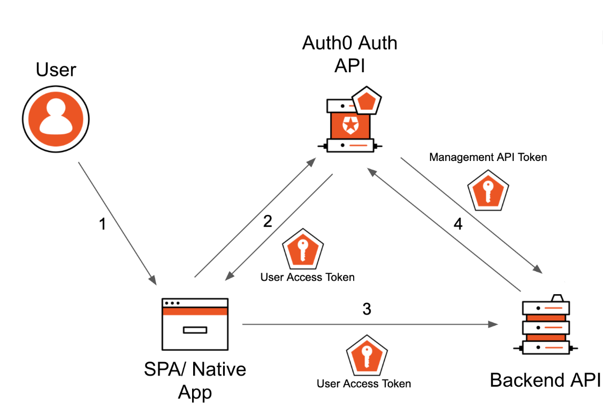
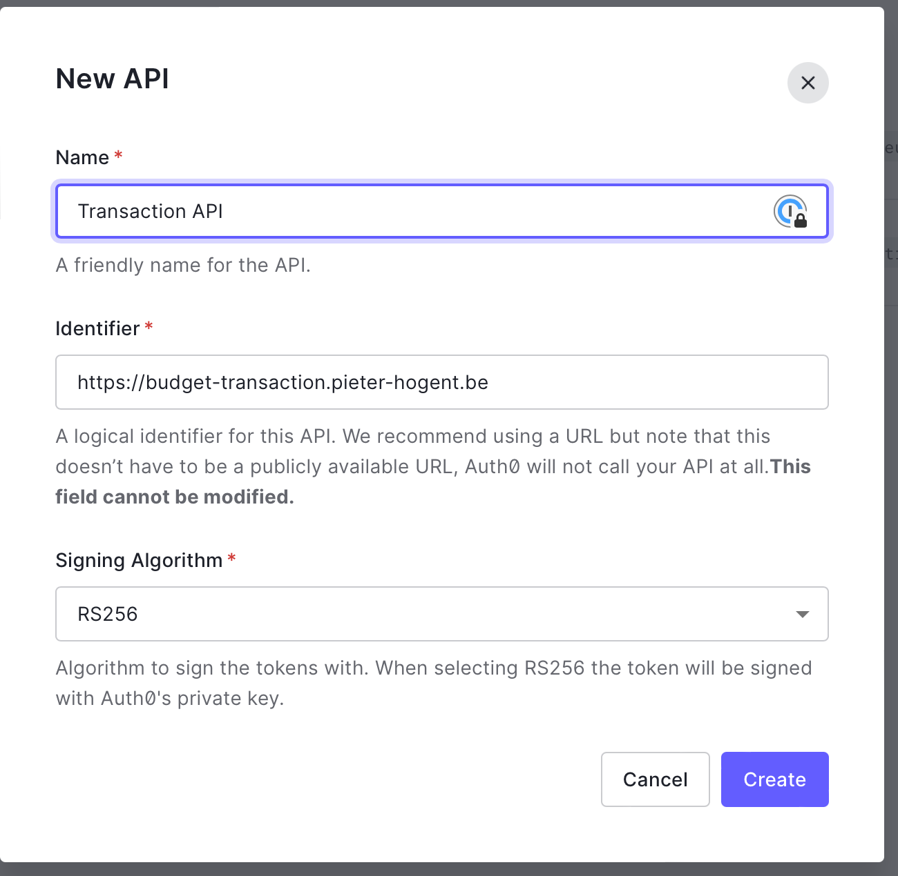
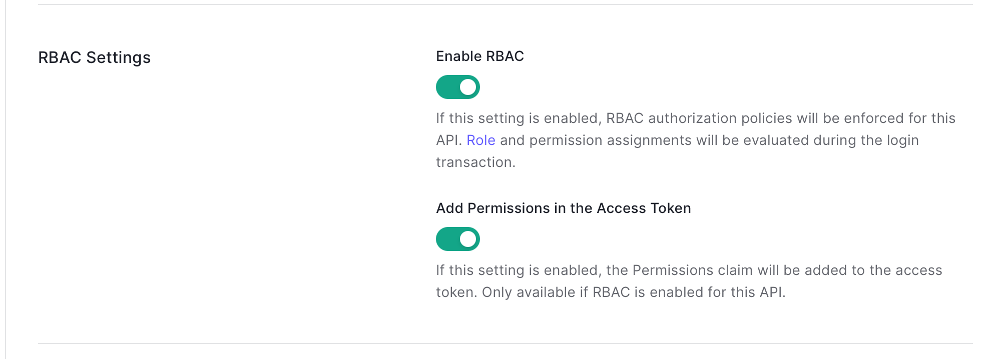
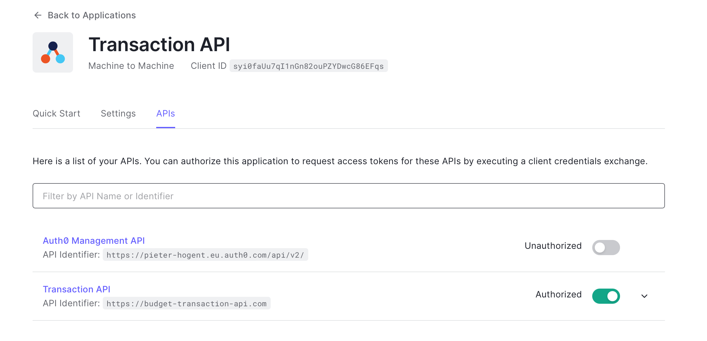

# Authenticatie & Autorisatie

## Inleiding

Authenticatie is bewijzen wie je bent, heel vaak met een gebruikersnaam en wachtwoord, en meer en meer in combinatie met TOTP (time based one time password), SMS en/of security keys als deel van two factor authentication (2FA).

Autorisatie is dan weer kijken of een gebruiker de juiste rechten heeft om toegang tot (een deel van) je webapplicatie te krijgen.

Zelf gebruikersnamen en wachtwoorden opslaan is niet triviaal, je kan niet zomaar een tabel maken waar je een wachtwoord en gebruikersnaam in opslaat, wachtwoorden moeten gehashed worden, met een salt om rainbow table attacks tegen te gaan.
Voor sommige toepassingen verwachten gebruikers dat ze via hun google of facebook account kunnen inloggen; soms vereist een platform zelfs dat je bepaalde inlogsystemen integreert (iOS en Apple login bijvoorbeeld).
Als je dan ook nog eens alles van 2FA wilt integreren besef je dat dit allemaal maken niet alleen niet triviaal is, maar ook best veel werk.

Daarom wordt er meer en meer gegrepen naar een third party service die deze taken op zich neemt, één zo'n service is [Auth0](https://auth0.com/).

## Auth0

De tagline van [Auth0](https://auth0.com/) is "makes authentication and authorization easy". In plaats van alles zelf te beginnen implementeren gaan we een integratie met Auth0 maken.

### Werking
De verschillende stappen:
 
1. De gebruiker wil zich aanmelden in de app
2. De SPA stuurt een verzoek naar de Auth0 Server om de gebruiker te autoriseren en een [access token](https://auth0.com/docs/secure/tokens/access-tokens) (JWT) te krijgen voor de backend-API. De backend-API moet worden ingesteld en geregistreerd bij Auth0 en het autorisatieverzoek moet een parameter audience={YOUR_API_IDENTIFIER} bevatten. Auth0 server retourneert ook een [ID token](https://auth0.com/docs/secure/tokens/id-tokens)
3. De SPA stuurt namens de gebruiker een verzoek naar de backend-API voor het ophalen van de transacties, waarbij het access token in de header wordt verzonden.
4. De Backend API verifieert het token en als de backend API geen bestaand, geldig beheer-API-token heeft, vraagt ​​het om een ​​beheer-API-token. Indien gevalideerd en de gebruiker heeft de juiste rechten retourneert de backend de transacties. Indien niet ok wordt een `403: Forbidden` geretourneerd.

### JWT
Het zou natuurlijk bijzonder onhandig zijn als je voor elke request opnieuw zou moeten inloggen, zeker bij moderne webapplicaties die vele requests gebruiken om één pagina op te bouwen. We moeten dus ergens kunnen 'onthouden' dat iemand ingelogd is, op een veilige manier.

Hiervoor kan je (o.a.) een [JSON Web Token (JWT)](https://auth0.com/docs/secure/tokens/json-web-tokens) gebruiken, dat is in se een (BASE64) string die bij elke request meegestuurd wordt in de Authorization header. Een JWT bestaat uit drie delen (zie een voorbeeld op https://jwt.io)

- een deel met meta informatie over het token (hash algoritme)
- een deel met de echte data, de payload (wie ingelogd is, wat de rechten zijn, wanneer de token vervalt, etc)
- een hash signature waarmee kan gecontroleerd worden dat het een echte token is.
Het concept is als volgt: de server kan een signature (= handtekening) genereren voor een bepaalde payload. Deze signature wordt berekend o.b.v. een secret dat enkel door de server gekend is. Als iemand anders een token probeert te faken, zal de server dit altijd merken. Als een client correct inlogt, krijgt hij zo'n token van de server. Deze token moet bij elk request door de client meegestuurd worden (natuurlijk enkel waar authenticatie/autorisatie nodig is).

Als zo'n request met token binnenkomt, kan de server de signature opnieuw genereren. Als het overeenkomt met het origineel weet hij dat het token van hem afkomstig is en de payload dus geldig is (en dus de gebruiker is wij hij beweert te zijn).

Dat wil dus zeggen dat iedereen die zo'n token heeft effectief een ingelogde gebruiker is (je hoeft dus iemand zijn username en wachtwoord niet te kennen als je zijn token kan bemachtigen). Daarom vervallen tokens na een tijd, en zal de gebruiker opnieuw moeten inloggen.

## Implementatie in React
De integratie met React is zeer volledig. Daarom gaan hier dus gewoon linken naar een paar tutorials van Auth0. Probeer deze te integreren met je eigen applicatie:

1. Aanmelden/afmelden: <https://auth0.com/docs/quickstart/spa/react/01-login>
2. Een API aanspreken: <https://auth0.com/docs/quickstart/spa/react/02-calling-an-api>
   - Hint: je zal eigen hooks moeten definiëren voor de API calls: `useTransactions` en `usePlaces`. Deze hooks retourneren de nodige functies in een object die de API calls uitvoeren.
3. Routes afschermen: <https://github.com/remix-run/react-router/tree/dev/examples/auth>

### Stap 1 : aanmelden/afmelden

#### 1. Bepaal de  [Application keys](https://auth0.com/docs/quickstart/spa/react/01-login#get-your-application-keys) 

Volg de stappen in <https://auth0.com/docs/quickstart/spa/react/01-login#get-your-application-keys>.

Vergeet niet de callback urls en allowed web origins correct in te stellen of inloggen en/of API callen zal niet lukken.

Maak een .env.local file aan met volgende inhoud
```json
REACT_APP_AUTH0_DOMAIN={YOUR_DOMAIN}
REACT_APP_AUTH0_CLIENT_ID={YOUR_CLIENTID}
```

domain en clientId: de waarden van deze eigenschappen komen overeen met de waarden "Domain" en "Client-ID" op het Auth0 dashboard > applications > Applications > Budget


#### 2. Installeer [Auth0 React SDK](https://auth0.com/docs/quickstart/spa/react/01-login#install-the-auth0-react-sdk)

```bash
yarn add @auth0/auth0-react
```


#### 3. Configureer de [Auth0Provider component](https://auth0.com/docs/quickstart/spa/react/01-login#configure-the-auth0provider-component)

In `src/contexts` folder, maak de file `MyAuth0Provider` component aan.
```jsx
import { Auth0Provider } from '@auth0/auth0-react';
function MyAuth0Provider({ children }) {
  const domain = process.env.REACT_APP_AUTH0_DOMAIN;
  const clientId = process.env.REACT_APP_AUTH0_CLIENT_ID;
  return (
    <Auth0Provider
      domain={domain}
      clientId={clientId}
      redirectUri={`${window.location.origin}/transactions`}
    >
      {children}
    </Auth0Provider>
  );
}
export default MyAuth0Provider;
```
De Auth0 React SDK gebruikt de React Context om de authenticatiestatus van de gebruikers te beheren. Een manier om Auth0 te integreren met de React-app, is door de rootcomponent te verpakken met een Auth0Provider uit de SDK. Stel de properties in
- domain en clientId: zie instellingen Budget app in Auth0 Dashboard
- redirectUri: de URL waarnaar de gebruiker navigeert als hij geauthenticeerd is door Auth0, deze URL moet toegevoegd zijn aan de `Allowed Callback URLs` in je Auth0 setup.
  
LET OP: deze redirectUri moet de juiste zijn, i.e. de pagina die geladen zal worden nadat je ingelogd bent, indien deze niet correct kan je 'rare' fouten krijgen. (isAuthenticated zal false rapporteren maar je krijgt toch geen login te zien als je op login klikt, dat soort dingen)


#### 4. Verpak de root component in index.js met MyAuth0Provider.

```jsx
...
import MyAuth0Provider from './contexts/MyAuth0Provider';// 👈
const root = createRoot(document.getElementById('root'));
root.render(
  <React.StrictMode>
    <MyAuth0Provider> {/* 👈*/}
      <ThemeProvider>
        <BrowserRouter>
          <App />
        </BrowserRouter>
      </ThemeProvider>
    </MyAuth0Provider>{/* 👈*/}
  </React.StrictMode>
);
reportWebVitals();
```


#### 5. De [Login component](https://auth0.com/docs/quickstart/spa/react/01-login#add-login-to-your-application)

In de `components/authentication` folder voeg je de `LoginButton` component toe.
```jsx
import { useAuth0 } from '@auth0/auth0-react';
import { useCallback } from 'react';

function LoginButton() {
  const { loginWithRedirect } = useAuth0();

  const handleLogin = useCallback(

    async () => {
      loginWithRedirect();
    },
    [loginWithRedirect],
  );

  return (
    <button
      type="button"
      className="btn btn-primary"
      onClick={handleLogin}
    >
      Log In
    </button>
  );
}

export default LoginButton;
```

Door `loginWithRedirect()` uit te voeren, wordt de gebruiker omgeleid naar de [Auth0 Universal Login Page](https://auth0.com/universal-login), waar Auth0 de gebruiker kan authenticeren. Na succesvolle authenticatie zal Auth0 de gebruiker terugleiden naar de applicatie. Als het aanmelden succesvol is dan keren we terug naar de home page.

Voeg de LoginButton toe aan de NavBar. Bij klik op de knop wordt je omgeleid naar de [Auth0 Universal Login Page] (https://auth0.com/universal-login)


#### 6. De [Logout component](https://auth0.com/docs/quickstart/spa/react/01-login#add-logout-to-your-application) 

In de `components/authentication` folder voeg je de component `LogoutButton` toe.
```jsx
import { useAuth0 } from '@auth0/auth0-react';

function LogoutButton() {
  const { logout } = useAuth0();
  return (
    <button
      type="button"
      className="btn btn-danger"
      onClick={() => logout({
        returnTo: window.location.origin,
      })}
    >
      Log Out
    </button>
  );
}

export default LogoutButton;
```

`logout()` leidt de gebruiker om naar je Auth0-uitlog eindpunt (https://YOUR_DOMAIN/v2/logout) en daarna wordt de gebruiker onmiddellijk omgeleid naar je app

#### 7. Inbouwen van aanmelden/afmelden

We voorzien een derde component in de `components/authentication` folder, nl `AuthenticationButton`
```jsx
import { useAuth0 } from '@auth0/auth0-react';
import LoginButton from './LoginButton';
import LogoutButton from './LogoutButton';

export default function AuthenticationButton() {
  const {
    isAuthenticated,
    user,
  } = useAuth0(); // 👈1

  if (isAuthenticated) { // 👈2
    const { name, picture, givenName } = user;
    return (
      <div className="d-flex flex-row align-items-center">
        <div className="col">
          
        </div>
        <div className="col">
          {name}
        </div>
        <div className="col">
          <LogoutButton />
        </div>
      </div>
    );
  }

  return <LoginButton />;
}
```

1. `isAuthenticated` property geeft aan of Auth0 de gebruiker reeds geauthenticeerd heeft. De `user` property bevat de informatie gerelateerd aan de aangemelde gebruiker. 
2. Als de gebruiker nog niet is aangemeld, toon de Login Button, anders geef de foto en naam van de aangemelde gebruiker weer en de Logout knop.


#### 8. Pas de [NavBar](https://auth0.com/docs/quickstart/spa/react/01-login#show-user-profile-information) aan

```jsx
import AuthenticationButton from './authentication/AuthenticationButton'; // 👈
...
     <div className="d-flex  align-items-center">
            <AuthenticationButton /> {/* 👈*/}
            <button type="button" onClick={toggleTheme}>
              {
                theme === themes.dark ? <IoMoonSharp /> : <IoSunny />
              }
            </button>
          </div>
...
```


#### 9. Run de applicatie. Je moet je nu kunnen aanmelden op Auth0.

### Stap 2 : calling the api
#### 1. Registratie Budget API

In stap 2 dienen we eerst de Budget API te registreren: <https://auth0.com/docs/get-started/auth0-overview/set-up-apis>.

Vul hiervoor onderstaande in


In de settings van deze API gaan we Role-based Access Control (RBAC) aanzetten, zodat we verschillende gebruikers verschillende toegangsrechten kunnen geven.

Als laatste dienen we ook nog de applicatie en de API te linken aan elkaar. Bij de 'settings' van de applicatie (onder APIs) kan je dit onder de 'Machine to Machine Applications' tab aanzetten:

Het uiteindelijke doel is dat de server toegang tot bepaalde REST routes gaat afschermen. M.a.w. de client zal inloggen bij Auth0, een token krijgen, en die dan meesturen met de headers van elke request. Onze server moet vervolgens kijken of deze token echt is, en op basis daarvan requests al dan niet blokkeren.

#### 2. Configureer MyAuth0Provider component

- Pas .env.local aan. Voeg onderstaande variabele toe, dit moet dezelfde waarde bevatten als de `AUTH_AUDIENCE` in onze backend.

```json
REACT_APP_AUTH0_API_AUDIENCE={YOUR_API_AUDIENCE}
```

- Pas MyAuth0Provider verder aan

```jsx
import { Auth0Provider } from '@auth0/auth0-react';

function MyAuth0Provider({ children }) {
  const domain = process.env.REACT_APP_AUTH0_DOMAIN;
  const clientId = process.env.REACT_APP_AUTH0_CLIENT_ID;
  const audience = process.env.REACT_APP_AUTH0_API_AUDIENCE;// 👈 1

  return (
    <Auth0Provider
      domain={domain}
      audience={audience} // 👈 1
      clientId={clientId}
      edirectUri={`${window.location.origin}/transactions`}
      useRefreshTokens // 👈 2
    >
      {children}
    </Auth0Provider>
  );
}
export default MyAuth0Provider;
```

1. Voeg de audience toe. Dit is de unieke identifier van je API. Auth0 gebruikt de waarde om te bepalen tot welke resourceserver (API) de gebruiker uw React-applicatie autoriseert om toegang te krijgen
2. useRefreshTokens: om refresh tokens te kunnen opvragen (zie verder)

#### 3. Pas de transaction APi aan

We moeten het token meesturen met de HTTP header bij elke request naar de server die authenticatie (en authorisatie) vereist. Het token kan worden opgevraagd via de `getAccessTokenSilently()` method uit de `useAuth0()` hook, die een Promise retourneert die wordt omgezet in een access token dat je kan gebruiken om een ​​beveiligde API aan te roepen. 
Deze methode kan het access en ID token renewen gebruik makend van een [refresh token](https://auth0.com/docs/secure/tokens/refresh-tokens). Hiervoor dient `useRefreshTokens` ingesteld zijn in de Auth0Provider

Vervolgens voeg je het toegangstoken toe aan de autorisatieheader van de API-aanroep. De API zorgt voor het valideren van het toegangstoken en het verwerken van de request.

Daar we gebruik dienen te maken van de useAuth0 hook en de `breaking rules of hooks`stelt dat : 
>You can only call Hooks while React is rendering a function component:
>✅ Call them at the top level in the body of a function component.
>✅ Call them at the top level in the body of a custom Hook.

Daarom dienen we de transaction api om te zetten in een hook. Een custom Hook is een JavaScript-functie waarvan de naam begint met "use" en die andere Hooks kan aanroepen. Verder bevat het de code uit de api. De hook retourneert de functies

```jsx
import {
  useAuth0,
} from '@auth0/auth0-react';
import axios from 'axios';
import {
  useCallback,
} from 'react';

const baseUrl = `${process.env.REACT_APP_API_URL}/transactions`;

const useTransactions = () => {// 👈 1
  const {
    getAccessTokenSilently,
  } = useAuth0();// 👈 2

  const getAll = useCallback(async () => {
    const token = await getAccessTokenSilently();// 👈 3
    const {
      data,
    } = await axios.get(baseUrl, {
      headers: {
        Authorization: `Bearer ${token}`,
      },// 👈 4
    });

    return data.items;
  }, [getAccessTokenSilently]);

  const getById = useCallback(async (id) => {
    const token = await getAccessTokenSilently();// 👈 3
    const {
      data,
    } = await axios.get(`${baseUrl}/${id}`, {
      headers: {
        Authorization: `Bearer ${token}`,
      },// 👈 4
    });
    return data;
  }, [getAccessTokenSilently]);

  const save = useCallback(async (transaction) => {
    const token = await getAccessTokenSilently();// 👈 3
    const {
      id,
      ...values
    } = transaction;
    await axios({
      method: id ? 'PUT' : 'POST',
      url: `${baseUrl}/${id ?? ''}`,
      data: values,
      headers: {
        Authorization: `Bearer ${token}`,
      },// 👈 4
    });
  }, [getAccessTokenSilently]);

  const deleteById = useCallback(async (id) => {
    const token = await getAccessTokenSilently();// 👈 3
    await axios.delete(`${baseUrl}/${id}`, {
      headers: {
        Authorization: `Bearer ${token}`,
      },// 👈 4
    });
  }, [getAccessTokenSilently]);

  return {
    getAll,
    getById,
    save,
    deleteById,
  };// 👈 5
};

export default useTransactions;
```

1. Definieer de custom hook
2. extraheer de getAccessTokenSilently method
3. Vraag het token op
4. Voeg het token toe aan de HTTP header. Bearer authentication (wordt ook token authenticatie genoemd) is een HTTP authenticatie schema die gebruik maakt van tokens. Bearer authenticatie betekent 'give access to the bearer of this token'.
5. Retourneer de methodes zodat die kunnen gebruikt worden in de componenten of andere hooks.

#### 4. Gebruik de  useTransactions hook
Bvb in de `TransactionsList` component.
```jsx
import useTransactions from '../../api/transactions';// 👈 1
...
export default function TransactionList() {
  ...
  const transactionApi = useTransactions();// 👈 2

```


#### 5. oefening
- Pas de andere componenten aan zodat ze gebruik maken van de useTransactions hook
- Pas de Places api aan en roep de hook op in de betreffende componenten

### stap 3 : Routes afschermen

#### 1. Een route afschermen
Als laatste moeten we nog routes kunnen afschermen voor ingelogde gebruikers. Hiervoor definiëren we zelf een component, geïnspireerd op de component in de bovenvermelde documentatie

Maak in `components/authentication` folder de component `RequireAuth` aan.
```jsx
import { useAuth0 } from '@auth0/auth0-react';
import { Navigate } from 'react-router';
import Loader from '../Loader';

export default function RequireAuth({ children }) {// 👈 1
  const { isAuthenticated, isLoading } = useAuth0();

  if (isLoading) {// 👈 2
    return <Loader loading />;
  }

  if (isAuthenticated) {// 👈 3
    return children;
  }

  return <Navigate to="/login" />;// 👈 4
}
```
1. De component ontvangt kinderen
2. Zorg ervoor dat het laden van de SDK is voltooid voordat je toegang krijgt tot de property isAuthenticated, door te controleren of isLoading onwaar is.
3. Adhv de property isAuthenticated van useAuth0()hook controleer je of Auth0 de gebruiker geverifieerd heeft voordat de component wordt weergegeven. 
4. Indien niet aangemeld, ga naar de login pagina

#### 2.Landingspagina

Het kan handig zijn om één landingspagina te maken. Deze pagina staat op de callback URL van Auth0, bv. `http://localhost:3000/login`. Het enige doel van deze pagina is om elke mogelijke auth state op te vangen:

- Er ging iets fout: de fout tonen
- Auth state is niet aan het laden en we zijn aangemeld: naar de home (`/`) navigeren
- Auth state is niet aan het laden en we zijn niet aangemeld: melding geven dat je aangemeld moet zijn om naar deze pagina te komen
- Alle andere gevallen: zeggen dat we de gebruiker aan het aanmelden zijn

Dit is ook de pagina waarnaar de `RequireAuth` component navigeert indien de gebruiker niet aangemeld is.

```jsx
import { useAuth0 } from '@auth0/auth0-react';
import { Navigate } from 'react-router-dom';
import Error from '../Error';
import LoginButton from './LoginButton';

export default function AuthLanding() {
  const { error, isAuthenticated, isLoading } = useAuth0();

  if (error) {
    <div className="container">
      <div className="row">
        <div className="col">
          <h1>Login failed</h1>
          <p>
            Sorry, we were unable to sign you in, the error below might be useful.
          </p>
          <Error error={error} />
          <LoginButton />
        </div>
      </div>
    </div>;
  }

  if (!isLoading && isAuthenticated) {
    return <Navigate to="/" />;
  }

  if (!isLoading && !isAuthenticated) {
    return (
      <div className="container">
        <div className="row">
          <div className="col">
            <h1>Login required</h1>
            <p>You need to login to access this page.</p>
            <LoginButton />
          </div>
        </div>
      </div>
    );
  }

  return (
    <div className="container">
      <div className="row">
        <div className="col">
          <h1>Signing in</h1>
          <p>
            Please wait while we sign you in!
          </p>
        </div>
      </div>
    </div>
  );
}
```
Pas in `MyAuthProvider` component ook de redirect pagina aan
```jsx
  <Auth0Provider
      domain={domain}
      audience={audience}
      clientId={clientId}
      redirectUri={`${window.location.origin}/login`}{/*👈*/}
      useRefreshTokens
    >
      {children}
    </Auth0Provider>
```

#### 3. De routes

```jsx
import { Routes, Route, Navigate } from 'react-router-dom';
import TransactionList from './components/transactions/TransactionList';
import TransactionForm from './components/transactions/TransactionForm';
import PlacesList from './components/places/PlacesList';
import {
  useTheme,
} from './contexts/Theme.context';
import Navbar from './components/Navbar';
import RequireAuth from './components/authentication/RequireAuth';
import AuthLanding from './components/authentication/AuthLanding';

function App() {
  const {
    theme,
    oppositeTheme,
  } = useTheme();

  return (
    <div className={`container-xl bg-${theme} text-${oppositeTheme}`}>
      <Navbar />

      <Routes>
        <Route path="/" element={<Navigate replace to="/transactions" />} />
        <Route path="/transactions">
          <Route
            index
            element={(
              <RequireAuth>
                <TransactionList />
              </RequireAuth>
            )}
          />
          <Route
            path="add"
            element={(
              <RequireAuth>
                <TransactionForm />
              </RequireAuth>
            )}
          />
          <Route
            path="edit/:id"
            element={(
              <RequireAuth>
                <TransactionForm />
              </RequireAuth>
            )}
          />
        </Route>

        <Route
          path="/places"
          element={(
            <RequireAuth>
              <PlacesList />
            </RequireAuth>
          )}
        />

        <Route path="/login" element={<AuthLanding />} />

      </Routes>
    </div>
  );
}
export default App;
```


## Oplossing

Een werkend voorbeeld kan, zoals altijd, in de [budget applicatie](https://github.com/HOGENT-Web/frontendweb-budget) gevonden worden. Dit keer staat dit op de branch `feature/auth0`.

